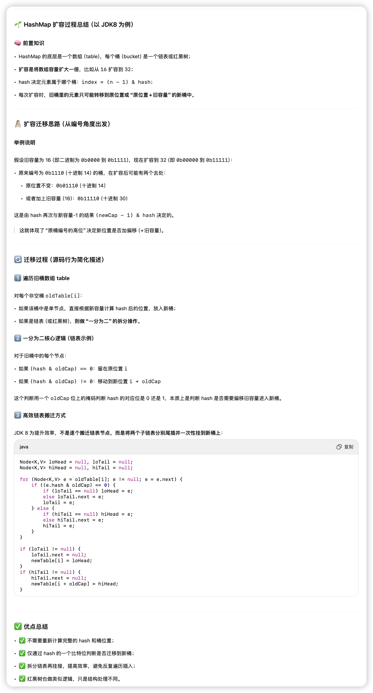

## 哈希算法

### 一、HashMap的哈希算法（Java 8）


1. ### hash()方法源码

```
static final int hash(Object key) {
    int h;
    // 1. 先调用 key 的 hashCode()
    // 2. 再将高16位与低16位异或，降低 hashCode 的碰撞概率
    return (key == null) ? 0 : (h = key.hashCode()) ^ (h >>> 16);
}
```

#### **设计动机：**

- **hashCode() 本身质量参差不齐**：某些类的 hashCode() 实现只返回很小范围内的值，或者只变化高位，造成 hash 分布不均。
- **桶位置的计算只依赖低位**（后面你会看到是 & (table.length - 1)）：如果高位没混入低位，hashCode 高位变化毫无意义。
- **异或混淆高低位** 是一种低开销但有效的改进方法。


### 二、HashMap如何确定桶位置？

```
index = (n - 1) & hash;
```

- n 是 table 的长度（总是 2 的幂）
- n - 1 是掩码（所有低位是 1）
- & 操作意味着只保留 hash 的低位，用于定位桶索引


#### **举例说明**

假设 table 长度为 16（n = 16），n - 1 = 15，即二进制是 0000 1111

假设某个 key 的 hash 结果是：

```
hashCode:          0x12345678
h >>> 16:          0x00001234
h ^ (h >>> 16):    0x1234444C
```

然后取 index：

```
index = 0x1234444C & 0x0F = 0x0C  // 只保留最后4位
```


### 三、为什么 HashMap的长度必须是 2 的幂？


这个设计直接关系到效率和分布均匀性：

- (n - 1) & hash 相当于取模运算 hash % n，但比 % 快得多（位运算）
- 如果 n 不是 2 的幂，取模后可能无法充分利用所有 hash 位，导致某些桶永远用不到
- 2^k 的话 (n - 1) 的二进制是全 1，可以让低位充分参与计算，分布更均匀


### 四、HashMap其他核心点简略提纲（后面可以详细展开）：


| **操作**      | **核心流程简述**                                             |
| ------------- | ------------------------------------------------------------ |
| **put(k,v)**  | 计算 hash → 定位桶 → 桶为空直接插入；否则遍历链表/红黑树 → key 已存在则覆盖 → 否则尾插 |
| **get(k)**    | 计算 hash → 定位桶 → 遍历链表或红黑树                        |
| **remove(k)** | 定位桶 → 遍历并删除节点，链表或红黑树中删除                  |
| **扩容**      | 当 size > threshold（默认负载因子0.75）时 → 新数组长度 ×2 → 原链表/红黑树节点重新 hash 迁移（**不再重新算 hash，只判断 hash & oldCap 为0还是1 来决定是否原位置或偏移一个位置**） |


### **五、小结关键点**


| **细节**                    | **说明**                               |
| --------------------------- | -------------------------------------- |
| h ^ (h >>> 16)              | 高低位混合，降低碰撞概率               |
| & (n - 1)                   | 快速 mod，需 n 是 2 的幂               |
| table 长度为什么是 2 的幂   | 与 hash 异或优化匹配，提高分布均匀性   |
| 重哈希为什么不重新计算 hash | 利用位运算的性质决定搬迁位置，节省计算 |

## Node结构

```java
static class Node<K,V> implements Map.Entry<K,V> {
    final int hash;
    final K key;
    V value;
    Node<K,V> next;
    ...
}
```

1.只持有下一个Node的引用，如果是链表的话就只能单向遍历

2.Node里面存储了hash值，不需要每次都重新计算hash值


## put

```java
//入口
public V put(K key, V value) {
    return putVal(hash(key), key, value, false, true);
}

final V putVal(int hash, K key, V value, boolean onlyIfAbsent, boolean evict) {
    Node<K,V>[] tab; 
    Node<K,V> p; 
    int n, i;
    if ((tab = table) == null || (n = tab.length) == 0) {
        n = (tab = resize()).length;
    }
    //当hash到的位置，该位置为null的时候，存放一个新node放入 
    // 这里p赋值成了table该位置的node值
    if ((p = tab[i = (n - 1) & hash]) == null) {
        tab[i] = newNode(hash, key, value, null);
    } else {
        Node<K,V> e; K k;
        //该位置第一个就是查找到的值，将p赋给e
        if (p.hash == hash && ((k = p.key) == key || (key != null && key.equals(k)))) {
            e = p;
        } else if (p instanceof TreeNode) {
            //如果是红黑树，调用红黑树的putTreeVal方法  
            e = ((TreeNode<K,V>)p).putTreeVal(this, tab, hash, key, value);
        } else {
        	//是链表，遍历，注意e = p.next这个一直将下一节点赋值给e，直到尾部，注意开头是++binCount
            for (int binCount = 0; ; ++binCount) {
                if ((e = p.next) == null) {
                    p.next = newNode(hash, key, value, null);
                    //当链表长度大于等于7，插入第8位，树化
                    if (binCount >= TREEIFY_THRESHOLD - 1) {
                        // -1 for 1st
                        treeifyBin(tab, hash);
                    }
                    break;
                }
                if (e.hash == hash && ((k = e.key) == key || (key != null && key.equals(k)))) {
                    break;
                }
                p = e;
            }
        }
        if (e != null) { // existing mapping for key
            V oldValue = e.value;
            if (!onlyIfAbsent || oldValue == null) {
                e.value = value;
            }
            afterNodeAccess(e);
            return oldValue;
        }
    }
    ++modCount;
    if (++size > threshold) {
        resize();
    }
    afterNodeInsertion(evict);
    return null;
}
```

## get

```java
//入口
public V get(Object key) {
    Node<K,V> e;
    return (e = getNode(hash(key), key)) == null ? null : e.value;
}

//这里的hash(key)就是上面哈希算法讲解的那个
static final int hash(Object key) {
    int h;
    return (key == null) ? 0 : (h = key.hashCode()) ^ (h >>> 16);
}

//确定同位置，同put方法
int index = (n - 1) & hash;


final Node<K,V> getNode(int hash, Object key) {
    Node<K,V>[] tab;
    Node<K,V> first, e; 
    int n; 
    K k;

    if ((tab = table) != null && (n = tab.length) > 0 &&
        (first = tab[(n - 1) & hash]) != null) {
        
        if (first.hash == hash && ((k = first.key) == key || (key != null && key.equals(k))))
            return first;

        if ((e = first.next) != null) {
            //如果该桶内已经树化，则用红黑树的get方法
            if (first instanceof TreeNode)
                return ((TreeNode<K,V>)first).getTreeNode(hash, key);

            //不是树，就直接开始遍历，直到找到目标
            do {
                if (e.hash == hash && ((k = e.key) == key || (key != null && key.equals(k))))
                    return e;
            } while ((e = e.next) != null);
        }
    }
    return null;
}
```

步骤分解：

1. 先确认 table 不为空。
2. 通过 hash & (n - 1) 定位到桶位置，取出第一个节点 first。
3. **如果 first 就匹配上了 hash 和 key，直接返回。**
4. **否则继续看 next 链表或红黑树**：
   - 如果是红黑树（TreeNode），使用 getTreeNode。
   - 否则是链表，遍历 next 查找，直到找到匹配的 key 或查到底。

```
get(key)
 └── hash(key) → hash值h
     └── (n-1)&h → 桶下标 index
         └── table[index] 是不是 null？
             └── 是：返回 null
             └── 否：看第一个节点是否匹配
                 └── 匹配：返回该节点.value
                 └── 不匹配：
                      └── 是 TreeNode：红黑树方式查找
                      └── 是链表：遍历链表查找
```

## resize（扩容）

resize的触发时机是在put方法里，如果HashMap一开始是空的，第一次put的时候会调用扩容。如果不是空的会在put大逻辑结束的最末尾判断当前容量是否达到标准（由负载因子决定），如果达标也会进行扩容

```java
if ((tab = table) == null || (n = tab.length) == 0) {
  n = (tab = resize()).length;
}

if (++size > threshold)
    resize();
```

```java
//默认初始化大小
static final int DEFAULT_INITIAL_CAPACITY = 1 << 4;
//默认负载因子
static final int DEFAULT_LOAD_FACTOR = 0.75f;

final Node<K,V>[] resize() {
    Node<K,V>[] oldTab = table;
    int oldCap = (oldTab == null) ? 0 : oldTab.length;
    int oldThr = threshold;
    int newCap, newThr = 0;

    // 1. 计算新的容量和阈值
    if (oldCap > 0) {
        if (oldCap >= MAXIMUM_CAPACITY) {
            threshold = Integer.MAX_VALUE;
            return oldTab;
        } else {
            newCap = oldCap << 1;
            newThr = oldThr << 1; // 2倍扩容
        }
    } else if (oldThr > 0) {
        newCap = oldThr;
    } else {
        newCap = DEFAULT_INITIAL_CAPACITY;
        newThr = (int)(DEFAULT_LOAD_FACTOR * DEFAULT_INITIAL_CAPACITY);
    }

    if (newThr == 0) {
        float ft = (float)newCap * loadFactor;
        newThr = (newCap < MAXIMUM_CAPACITY && ft < (float)MAXIMUM_CAPACITY ? 
                  (int)ft : Integer.MAX_VALUE);
    }
    threshold = newThr;

    @SuppressWarnings({"rawtypes","unchecked"})
    Node<K,V>[] newTab = (Node<K,V>[])new Node[newCap];
    table = newTab;

    // 2. 将旧数据迁移到新表中
    if (oldTab != null) {
        for (int j = 0; j < oldCap; ++j) {
            Node<K,V> e;
            if ((e = oldTab[j]) != null) {
                oldTab[j] = null;

                // 单个节点，直接放到新表
                if (e.next == null) {
                    newTab[e.hash & (newCap - 1)] = e;
                }

                // 红黑树节点，调用 TreeNode 的 split 方法
                else if (e instanceof TreeNode) {
                    ((TreeNode<K,V>)e).split(this, newTab, j, oldCap);
                }

                // 链表节点：分成两个链表，分别放到 newTab[j] 和 newTab[j + oldCap]
                else {
                    Node<K,V> loHead = null, loTail = null;
                    Node<K,V> hiHead = null, hiTail = null;
                    Node<K,V> next;

                    do {
                        next = e.next;
                        if ((e.hash & oldCap) == 0) {
                            if (loTail == null) loHead = e;
                            else loTail.next = e;
                            loTail = e;
                        } else {
                            if (hiTail == null) hiHead = e;
                            else hiTail.next = e;
                            hiTail = e;
                        }
                    } while ((e = next) != null;

                    if (loTail != null) {
                        loTail.next = null;
                        newTab[j] = loHead;
                    }
                    if (hiTail != null) {
                        hiTail.next = null;
                        newTab[j + oldCap] = hiHead;
                    }
                }
            }
        }
    }
    return newTab;
}
                             
                             
//红黑树迁移
final void split(HashMap<K,V> map, Node<K,V>[] newTab, int index, int bit) {
    TreeNode<K,V> loHead = null, loTail = null;
    TreeNode<K,V> hiHead = null, hiTail = null;
    int lc = 0, hc = 0;
    for (TreeNode<K,V> e = this, next; e != null; e = next) {
        next = (TreeNode<K,V>)e.next;
        e.next = null;
        if ((e.hash & bit) == 0) {
            if ((loTail = loTail == null ? loHead = e : (loTail.next = e)) == e)
                lc++;
        } else {
            if ((hiTail = hiTail == null ? hiHead = e : (hiTail.next = e)) == e)
                hc++;
        }
    }
    if (loHead != null) {
        if (lc <= UNTREEIFY_THRESHOLD)
            newTab[index] = loHead.untreeify(map);
        else {
            newTab[index] = loHead;
            if (hiHead != null)
                loHead.treeify(newTab);
        }
    }
    if (hiHead != null) {
        if (hc <= UNTREEIFY_THRESHOLD)
            newTab[index + bit] = hiHead.untreeify(map);
        else {
            newTab[index + bit] = hiHead;
            if (loHead != null)
                hiHead.treeify(newTab);
        }
    }
}
```

旧数组长度为 oldCap，我们对每个节点的 hash & oldCap 进行判断：

- 若结果是 0，放入 **低位索引（lo）**，即位置不变；
- 若结果是 1，放入 **高位索引（hi）**，即 j + oldCap。

📌 这是利用扩容后二进制位新增的那一位做“是否偏移”的判断，**避免重新计算 hash**！

```
put() -> 判断 size 是否超过 threshold
              ↓
         触发 resize()
              ↓
      旧数组遍历每个桶：
      ┌──────────────────────────────┐
      │   对于每个桶中的链表 / 红黑树    │
      │   ┌─────────────┐            │
      │   ↓ 拆成两段链表 lo 和 hi       │
      │   ↓ 根据 (hash & oldCap)      │
      │   ↓ lo -> 放新数组[j]          │
      │   ↓ hi -> 放新数组[j + oldCap] │
      └───────────────────────────────┘
              ↓
       更新 threshold，完成扩容
```


putAll方法触发扩容，不是一次扩容到位，而是while一直扩容，直到满足要求

```java
while (s > threshold && table.length < MAXIMUM_CAPACITY)
  resize();
```

**为什么 resize 不会“主动”树化**

resize() 不会主动对链表转树，**它只是迁移数据**。树化是在插入时 putVal() 中完成的，且需要符合以下条件：

- 桶中链表长度 ≥ 8（TREEIFY_THRESHOLD）
- 整个数组容量 ≥ 64（MIN_TREEIFY_CAPACITY）



## remove

```java
public V remove(Object key) {
    Node<K,V> e; // 最终要删除的那个节点
    // 调用核心方法 removeNode，参数解释如下：
    // hash: 通过 hash(key) 计算出来的哈希值
    // key: 要删除的键
    // value: 传 null，表示不做 value 匹配（如果你用的是 remove(key, value)，则会匹配）
    // matchValue: 是否启用 value 匹配，这里是 false
    // movable: 是否可以在结构上调整节点位置，true 表示可以
    return (e = removeNode(hash(key), key, null, false, true)) == null ? null : e.value;
}

/**
 * 核心删除逻辑
 * @param hash          key 的哈希值
 * @param key           要删除的 key
 * @param value         如果是 remove(key)，则为 null；如果是 remove(key, value)，则为具体值
 * @param matchValue    是否匹配 value（即是否为 remove(key, value) 操作）
 * @param movable       是否允许结构调整（true）
 * @return              被删除的节点，如果没有找到则返回 null
 */
final Node<K,V> removeNode(int hash, Object key, Object value, boolean matchValue, boolean movable) {
    Node<K,V>[] tab; Node<K,V> p; int n, index;
    // 如果 table 不为空且下标位置有链表/树头节点
    if ((tab = table) != null && (n = tab.length) > 0 &&
        (p = tab[index = (n - 1) & hash]) != null) {

        Node<K,V> node = null, e; K k; V v;

        // 如果是桶上的第一个节点就匹配上了
        if (p.hash == hash &&
            ((k = p.key) == key || (key != null && key.equals(k)))) {
            node = p;
        } else if ((e = p.next) != null) { // 有后续节点，说明是链表或红黑树
            if (p instanceof TreeNode) {
                // 红黑树节点，走红黑树的查找逻辑
                node = ((TreeNode<K,V>)p).getTreeNode(hash, key);
            } else {
                // 普通链表，顺序遍历查找
                do {
                    if (e.hash == hash &&
                        ((k = e.key) == key || (key != null && key.equals(k)))) {
                        node = e;
                        break;
                    }
                    p = e;
                } while ((e = e.next) != null);
            }
        }

        // 如果找到对应节点
        if (node != null && (!matchValue || (v = node.value) == value || (value != null && value.equals(v)))) {
            if (node instanceof TreeNode)
                // 如果是红黑树节点，则使用树的删除逻辑
                ((TreeNode<K,V>)node).removeTreeNode(this, tab, movable);
            else if (node == p)
                // 如果是第一个节点，并且不是树节点，直接断开链表头
                tab[index] = node.next;
            else
                // 不是第一个节点，跳过当前 node 节点（p 是前一个节点）
                p.next = node.next;
            --size; // 数量减一
            ++modCount; // fail-fast 修改计数
            afterNodeRemoval(node); // 回调钩子方法，LinkedHashMap 用得上
            return node;
        }
    }
    return null;
}
```

总结：

- remove(Object key) 实际是调用了 removeNode(...)。
- 删除时通过 hash(key) 定位桶，再在桶中查找是否存在该 key 的节点。
- 若节点是红黑树，则走 getTreeNode() 查找逻辑。
- 找到节点后：
  - 若是树节点：调用 removeTreeNode(...) 执行红黑树删除，并可能触发退化成链表。
  - 若是链表节点：直接修改指针断开节点。
- 最后更新 size 和 modCount，用于维护结构和 fail-fast 行为。


## treeifyBin（树化）

**触发条件**

在 HashMap 中，某个桶位上的链表长度 **达到阈值 TREEIFY_THRESHOLD（默认是 8）** && 当前 table 的容量（桶总数） **大于等于 MIN_TREEIFY_CAPACITY（默认是 64）** 时，链表会被转成红黑树。

```java
final void treeifyBin(Node<K,V>[] tab, int index) {
    Node<K,V> b; 
    if (tab == null || (b = tab[index]) == null || tab.length < MIN_TREEIFY_CAPACITY)
        resize(); // 桶太小了，先扩容
    else {
        TreeNode<K,V> hd = null, tl = null;
        for (Node<K,V> e = b; e != null; e = e.next) {
            TreeNode<K,V> p = new TreeNode<>(e.hash, e.key, e.value, null);
            if (tl == null)
                hd = p;
            else {
                p.prev = tl;
                tl.next = p;
            }
            tl = p;
        }
        tab[index] = hd;
        hd.treeify(tab);  // 核心：真正将双向链表转为红黑树
    }
}
```


## untreeify（退化）

**触发时机**

当红黑树的节点数量 **下降到 6 以下**，会触发“退化”成链表。对应常量是 UNTREEIFY_THRESHOLD = 6。


**发生位置**

主要在 **remove()** 删除节点后、或者 **resize()** 扩容时 TreeNode.split(...) 方法内判断是否需要退化：

```java
if (loHead != null) {
    if (lc <= UNTREEIFY_THRESHOLD)
        newTab[j] = loHead.untreeify(map);
    else {
        loTail.next = null;
        newTab[j] = loHead;
        if (hiHead != null) // both tree nodes
            loHead.treeify(newTab);
    }
}
```


**为什么 HashMap 红黑化时需要容量 ≥ 64？**

HashMap 的设计者做了一个平衡的选择：

- 链表查询复杂度是 O(n)，红黑树是 O(log n)，但前者常数小，且链表节点少时性能反而更好。
- 红黑树需要更多内存（多指针字段），对 GC 不友好。
- 所以，容量不够大时，即使链表很长，也不会红黑化，而是先扩容。

## fail-fast机制

```java
final class HashIterator {
    Node<K,V> next;        // 下一节点
    int expectedModCount;  // 快照
    int index;
    Node<K,V> current;

    HashIterator() {
        expectedModCount = modCount;  // 快照
        if (size > 0) {
            Node<K,V>[] t = table;
            while (index < t.length && (next = t[index++]) == null);
        }
    }

    public final boolean hasNext() {
        return next != null;
    }

    public final K next() {
        if (modCount != expectedModCount)
            throw new ConcurrentModificationException();  // 检查快照
        Node<K,V> e = next;
        if (e == null)
            throw new NoSuchElementException();

        if ((next = e.next) == null) {
            Node<K,V>[] t = table;
            while (index < t.length && (next = t[index++]) == null);
        }

        current = e;
        return e.key;
    }

    public final void remove() {
        if (current == null)
            throw new IllegalStateException();
        if (modCount != expectedModCount)
            throw new ConcurrentModificationException();  // 再次检查
        K k = current.key;
        current = null;
        HashMap.this.removeNode(hash(k), k, null, false, false);
        expectedModCount = modCount;  // 更新快照
    }
}
```

**机制总结**

- **迭代器初始化时记录一个 modCount 快照（expectedModCount）**
- **每次调用 next() 或 remove() 时检查当前 modCount 是否和快照一致**
  - 如果不一致，说明有并发结构修改，抛出 ConcurrentModificationException
- 只有通过 Iterator.remove() 正确修改，modCount 才会被同步，避免抛异常
