# 数据结构（Java）

## 集合框架

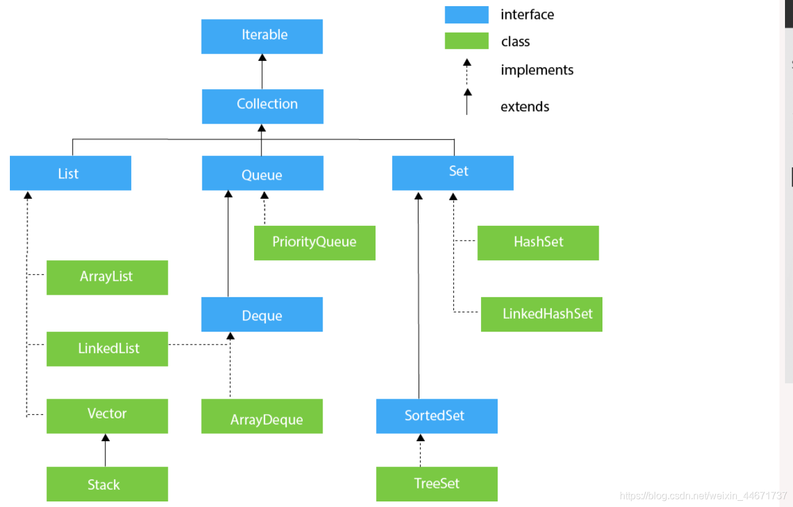

 Java整个单列集合框架如上图所示（这儿不包括Map，因为map是双列集合），可见所有集合实现类的最顶层接口为Iterable和Collection单列接口，再向下Collection分为了三种不同的形式，分别是List，Queue和Set接口，然后就是对应的不同的实现方式。

## 顶层接口Iterable

```java
package java.lang;

import java.util.Iterator;
import java.util.Objects;
import java.util.Spliterator;
import java.util.Spliterators;
//支持lambda函数接口
import java.util.function.Consumer;

public interface Iterable<T> {
    
	//iterator()方法
    Iterator<T> iterator();
    default void forEach(Consumer<? super T> action) {
        Objects.requireNonNull(action);
        for (T t : this) {
            action.accept(t);
        }
    }
    
    default Spliterator<T> spliterator() {
        return Spliterators.spliteratorUnknownSize(iterator(), 0);
    }
    
}
```

Iterable接口中只有iterator()一个接口方法，Iterator也是一个接口，其主要有如下两个方法hasNext()和next()方法。

```java
boolean hasNext();
E next();
```

## Collection接口

```java
package java.util;

import java.util.function.Predicate;
import java.util.stream.Stream;
import java.util.stream.StreamSupport;

public interface Collection<E> extends Iterable<E> {
    
    int size();
    boolean isEmpty();
    boolean contains(Object o);
    Iterator<E> iterator();
    Object[] toArray();
    boolean add(E e);
    boolean remove(Object o);
    boolean containsAll(Collection<?> c);
    boolean removeAll(Collection<?> c);
    
    default boolean removeIf(Predicate<? super E> filter) {
        Objects.requireNonNull(filter);
        boolean removed = false;
        final Iterator<E> each = iterator();
        while (each.hasNext()) {
            if (filter.test(each.next())) {
                each.remove();
                removed = true;
            }
        }
        return removed;
    }
    
    boolean retainAll(Collection<?> c);
    void clear();
    int hashCode();
    
    @Override
    default Spliterator<E> spliterator() {
        return Spliterators.spliterator(this, 0);
    }
    
    default Stream<E> stream() {
        return StreamSupport.stream(spliterator(), false);
    }
    
    default Stream<E> parallelStream() {
        return StreamSupport.stream(spliterator(), true);
    }
    
}
```

可见Collection的主要接口方法有：

|                 接口                 |             作用              |
| :----------------------------------: | :---------------------------: |
|             int size();              |           集合大小            |
|          boolean isEmpty()           |         集合是否为空          |
|      boolean contains(Object o)      |        是否包含某元素         |
|         Iterator iterator()          |             迭代              |
|          Object[] toArray()          |            转数组             |
|           boolean add(E e)           |           添加元素            |
|       boolean remove(Object o)       |          移除某元素           |
| boolean containsAll(Collection<?> c) |      是否包含另一个集合       |
|  boolean removeAll(Collection<?> c)  | 移除集合中所有在集合c中的元素 |
| boolean retainAll(Collection<?> c))  |  判断集合中不在集合c中的元素  |
|             void clear()             |         清空所有元素          |

## List

 List表示一串有序的集合，和Collection接口含义不同的是List突出有序的含义。

### List接口

```java
package java.util;

import java.util.function.UnaryOperator;

public interface List<E> extends Collection<E> {
    <T> T[] toArray(T[] a);
    boolean addAll(Collection<? extends E> c);
    boolean addAll(int index, Collection<? extends E> c);
    
    default void replaceAll(UnaryOperator<E> operator) {
        Objects.requireNonNull(operator);
        final ListIterator<E> li = this.listIterator();
        while (li.hasNext()) {
            li.set(operator.apply(li.next()));
        }
    }
    
    default void sort(Comparator<? super E> c) {
        Object[] a = this.toArray();
        Arrays.sort(a, (Comparator) c);
        ListIterator<E> i = this.listIterator();
        for (Object e : a) {
            i.next();
            i.set((E) e);
        }
    }
    
    boolean equals(Object o);
    E get(int index);
    E set(int index, E element);
    void add(int index, E element);
    int indexOf(Object o);
    int lastIndexOf(Object o);
    ListIterator<E> listIterator();
    List<E> subList(int fromIndex, int toIndex);
    
    @Override
    default Spliterator<E> spliterator() {
        return Spliterators.spliterator(this, Spliterator.ORDERED);
    }
    
}
```

 可见List其实比Collection多了添加方法add和addAll、查找方法**get,indexOf,set**等方法，**并且支持index下标操作**。

Collection与List的区别？

> 1. 从上边可以看出Collection和List最大的区别就是Collection是无序的，不支持索引操作，而List是有序的。Collection没有顺序的概念。
>
> 2. List中Iterator为ListIterator。
>
> 3. 由1推导List可以进行排序，所以List接口支持使用sort方法。
>
> 4. 二者的Spliterator操作方式不一样。

为什么子类接口里重复申明父类接口呢?

>    官方解释: **在子接口中重复声明父接口是为了方便看文档。**比如在java doc文档里，在List接口里也能看到Collecion声明的相关接口。

### ArrayList

ArrayList是List接口最常用的一个实现类，支持List接口的一系列操作。

#### ArrayList继承关系

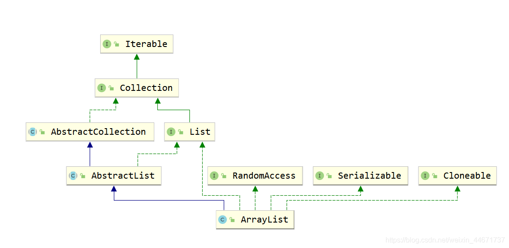

#### ArrayList组成

```java
private static final Object[] EMPTY_ELEMENTDATA = {};
private static final Object[] DEFAULTCAPACITY_EMPTY_ELEMENTDATA = {}
//真正存放元素的数组
transient Object[] elementData; // non-private to simplify nested class access
private int size;
```

一定要记住ArrayList中的transient Object[] elementData，该elementData是真正存放元素的容器，可见ArrayList是基于数组实现的。

#### ArrayList构造函数

```java
public ArrayList(int initialCapacity) {
    if (initialCapacity > 0) {
        this.elementData = new Object[initialCapacity];
    } else if (initialCapacity == 0) {
        this.elementData = EMPTY_ELEMENTDATA;
    } else {
        throw new IllegalArgumentException("Illegal Capacity: " + initialCapacity);
    }
}

public ArrayList() {
    this.elementData = DEFAULTCAPACITY_EMPTY_ELEMENTDATA;
}
```

1. Object[] elementData 是ArrayList真正存放数据的数组。
2. ArrayList支持默认大小构造，和空构造，当空构造的时候存放数据的Object[] elementData是一个空数组{}。

#### ArrayList中添加元素

```java
public boolean add(E e) {
    ensureCapacityInternal(size + 1);  // Increments modCount!!
    elementData[size++] = e;
    return true;
}
```

注意ArrayList中有一个modCount的属性，表示该实例修改的次数。（所有集合中都有modCount这样一个记录修改次数的属性），每次增删改都会增加一次该ArrayList修改次数，而上边的add(E e)方法是将新元素添加到list尾部。

#### ArrayList扩容

```java
private static int calculateCapacity(Object[] elementData, int minCapacity) {
    if (elementData == DEFAULTCAPACITY_EMPTY_ELEMENTDATA) {
   		 //DEFAULT_CAPACITY是10
        return Math.max(DEFAULT_CAPACITY, minCapacity);
    }
    return minCapacity;
}
```

可见当初始化的list是一个空ArrayList的时候，会直接扩容到DEFAULT_CAPACITY，该值大小是一个默认值10。而当添加进ArrayList中的元素超过了数组能存放的最大值就会进行扩容。

注意到这一行代码

```java
int newCapacity = oldCapacity + (oldCapacity >> 1);
```

采用右移运算，就是原来的一半，所以是扩容1.5倍。
**比如10的二进制是1010，右移后变成101就是5。15的二进制是1111，右移后变成111就是7（右移后结果不一定是原来的一半）**

```java
private void grow(int minCapacity) {
    // overflow-conscious code
    int oldCapacity = elementData.length;
    int newCapacity = oldCapacity + (oldCapacity >> 1);
    if (newCapacity - minCapacity < 0) {
        //扩容后容量仍未达到预期最小容量
        newCapacity = minCapacity;
    }
    if (newCapacity - MAX_ARRAY_SIZE > 0) {
        newCapacity = hugeCapacity(minCapacity);
    }
    // minCapacity is usually close to size, so this is a win:
    elementData = Arrays.copyOf(elementData, newCapacity);
}

//因为数组理论上长度就是 Integer.MAX_VALUE 个别JVM 设计上的问题 咱们可以尽量照顾下 
//但并不是说一定因为个别JVM 就一定不让扩容到 整数最大值长度。
//如果再满了 那么对不起 直接到将数组长度设置为整数最大值， 爱咋咋地！
//因此，数组最大容量是 Integer.MAX_VALUE （提问的说法有问题） 
private static int hugeCapacity(int minCapacity) { 
    if (minCapacity < 0) {
    	// overflow 
        throw new OutOfMemoryError(); 
    }
    //MAX_ARRAY_SIZE = Integer.MAX_VALUE - 8
   	//Integer.MAX_VALUE = 2,147,483,647（2的31次方 - 1）
    return (minCapacity > MAX_ARRAY_SIZE) ? Integer.MAX_VALUE : MAX_ARRAY_SIZE; 
} 
```

#### 数组copy

 java是无法自己分配空间的，是底层C和C++的实现。
以C为例，我们知道C中数组是一个指向首部的指针，比如我们C语言对数组进行分配内存。Java就是通过arraycopy这个native方法实现的数组的复制。

```java
public static native void arraycopy(Object src,  int  srcPos, Object dest, int destPos, int length);
```

```java
p = (int *)malloc(len*sizeof(int)); 
```

**这样的好处何在呢？**
    Java里内存是由jvm管理的，而数组是分配的连续内存，而arrayList不一定是连续内存，当然jvm会帮我们做这样的事，jvm会有内部的优化，会在后续的例子中结合问题来说明。

#### 为什么elementData用transient修饰？

1. transient的作用是该属性不参与序列化。
2. ArrayList继承了标示序列化的Serializable接口。
3. 对arrayList序列化的过程中进行了读写安全控制。

**是如何实现序列化安全的呢?**

```java
private void writeObject(java.io.ObjectOutputStream s) throws java.io.IOException{
    // Write out element count, and any hidden stuff
    int expectedModCount = modCount;
    s.defaultWriteObject();

    // Write out size as capacity for behavioural compatibility with clone()
    s.writeInt(size);

    // Write out all elements in the proper order.
    for (int i=0; i<size; i++) {
        s.writeObject(elementData[i]);
    }

    if (modCount != expectedModCount) {
        //并发修改异常
        throw new ConcurrentModificationException();
    }
}

/**
 * Reconstitute the <tt>ArrayList</tt> instance from a stream (that is,
 * deserialize it).
 */
private void readObject(java.io.ObjectInputStream s) throws java.io.IOException, ClassNotFoundException {
    elementData = EMPTY_ELEMENTDATA;

    // Read in size, and any hidden stuff
    s.defaultReadObject();

    // Read in capacity
    s.readInt(); // ignored

    if (size > 0) {
        // be like clone(), allocate array based upon size not capacity
        int capacity = calculateCapacity(elementData, size);
        SharedSecrets.getJavaOISAccess().checkArray(s, Object[].class, capacity);
        ensureCapacityInternal(size);

        Object[] a = elementData;
        // Read in all elements in the proper order.
        for (int i=0; i<size; i++) {
            a[i] = s.readObject();
        }
    }
}
```

 在序列化方法writeObject()方法中可以看到，先用默认写方法，然后将size写出，最后遍历写出elementData，因为该变量是transient修饰的，所有进行手动写出，这样它也会被序列化了。那是不是多此一举呢？

```java
protected transient int modCount = 0;
```

当然不是，其中有一个关键的modCount, 该变量是记录list修改的次数的，当写入完之后如果发现修改次数和开始序列化前不一致就会抛出异常，序列化失败。这样就保证了序列化过程中是未经修改的数据,保证了序列化安全。（java集合中都是这样实现）

### LinkedList

#### LinkedList继承关系

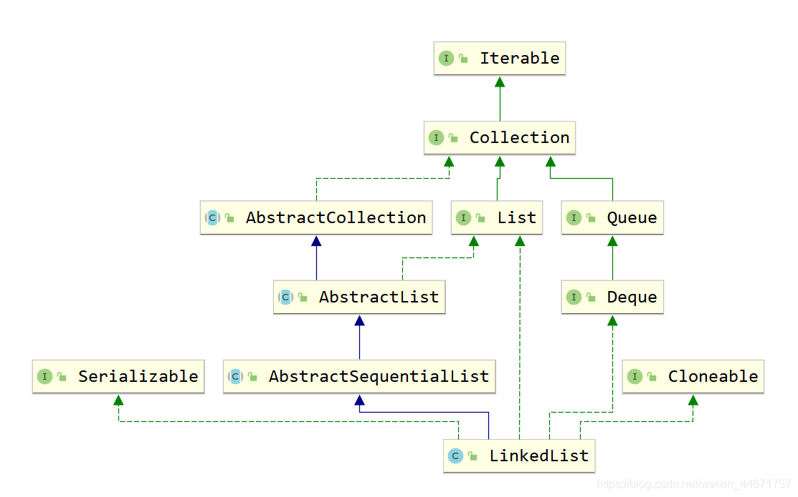

可见LinkedList既是List接口的实现也是Queue的实现（Deque），故其和ArrayList相比LinkedList支持的功能更多，其可视作队列来使用，当然下文中不强调其队列的实现。

#### LinkedList的结构

```java
transient int size = 0;

transient Node<E> first;

/**
 * Pointer to last node.
 * Invariant: (first == null && last == null) ||
 *            (last.next == null && last.item != null)
 */
transient Node<E> last;
```

LinkedList由一个头节点和一个尾节点组成，分别指向链表的头部和尾部。还有一个默认为0的size

LinkedList中Node源码如下，由当前值item，和指向上一个节点prev和指向下个节点next的指针组成。并且只含有一个构造方法，按照(prev, item, next)这样的参数顺序构造。

```java
private static class Node<E> {
    
    E item;
    Node<E> next;
    Node<E> prev;

    Node(Node<E> prev, E element, Node<E> next) {
        this.item = element;
        this.next = next;
        this.prev = prev;
    }
}
```

数据结构中链表的头插法linkFirst和尾插法linkLast

```java
/**
 * Links e as first element. 头插法
 */
private void linkFirst(E e) {
    final Node<E> f = first;
    final Node<E> newNode = new Node<>(null, e, f);
    first = newNode;
    if (f == null) {
        last = newNode;
    } else {
        f.prev = newNode;
    }
    size++;
    modCount++;
}

/**
 * Links e as last element. 尾插法
 */
void linkLast(E e) {
    final Node<E> l = last;
    final Node<E> newNode = new Node<>(l, e, null);
    last = newNode;
    if (l == null) {
        first = newNode;
    } else {
        l.next = newNode;
    }
    size++;
    modCount++;
}
```

#### LinkedList查询方法

**按照下标获取某一个节点**：get方法，获取第index个节点。

```java
public E get(int index) {
    checkElementIndex(index);
    return node(index).item;
}
```

**node(index)方法是怎么实现的呢？**
判断index是更靠近头部还是尾部，靠近哪段从哪段遍历获取值。

```java
Node<E> node(int index) {
    // assert isElementIndex(index);
    //判断index更靠近头部还是尾部
    if (index < (size >> 1)) {
        //更靠近头
        Node<E> x = first;
        for (int i = 0; i < index; i++) {
            x = x.next;
        }
        return x;
    } else {
        //更靠近尾
        Node<E> x = last;
        for (int i = size - 1; i > index; i--) {
            x = x.prev;
        }
        return x;
    }
}
```

查询索引修改方法，先找到对应节点，将新的值替换掉老的值。

```java
public E set(int index, E element) {
    checkElementIndex(index);
    Node<E> x = node(index);
    E oldVal = x.item;
    x.item = element;
    return oldVal;
}
```

**这个也是为什么ArrayList随机访问比LinkedList快的原因**，LinkedList要遍历找到该位置才能进行修改，而ArrayList是内部数组操作会更快。

#### LinkedList修改方法

新增一个节点，可以看到是采用尾插法将新节点放入尾部。

```java
public boolean add(E e) {
    linkLast(e);
    return true;
}
```

### Vector

和ArrayList一样，Vector也是List接口的一个实现类。其中List接口主要实现类有ArrayLIst，LinkedList，Vector，Stack，其中后两者用的特别少。

#### vector组成

和ArrayList基本一样。

```java
//存放元素的数组
protected Object[] elementData;
//有效元素数量，小于等于数组长度
protected int elementCount;
//容量增加量，和扩容相关
protected int capacityIncrement;
```

#### vector线程安全性

vector是线程安全的，synchronized修饰的操作方法。

#### vector扩容

```java
private void grow(int minCapacity) {
    // overflow-conscious code
    int oldCapacity = elementData.length;
    //扩容大小
    int newCapacity = oldCapacity + ((capacityIncrement > 0) ? capacityIncrement : oldCapacity);
    if (newCapacity - minCapacity < 0) {
        newCapacity = minCapacity;
    }
    if (newCapacity - MAX_ARRAY_SIZE > 0) {
        newCapacity = hugeCapacity(minCapacity);
    }
    elementData = Arrays.copyOf(elementData, newCapacity);
}
```

看源码可知，扩容当构造没有capacityIncrement时，一次扩容数组变成原来两倍，否则每次增加capacityIncrement。

#### vector方法经典示例

移除某一元素

```java
public synchronized E remove(int index) {
    modCount++;
    if (index >= elementCount) {
        throw new ArrayIndexOutOfBoundsException(index);
    }
    E oldValue = elementData(index);
    int numMoved = elementCount - index - 1;
    if (numMoved > 0) {
    	//复制数组，假设数组移除了中间某元素，后边有效值前移1位
        System.arraycopy(elementData, index+1, elementData, index, numMoved);
        //引用null ，gc会处理
    }
    elementData[--elementCount] = null; // Let gc do its work
    return oldValue;
}
```

这儿主要有一个两行代码需要注意，笔者在代码中有注释。
数组移除某一元素并且移动后，一定要将原来末尾设为null，且有效长度减1。
总体上vector实现是比较简单粗暴的，也很少用到，随便看看即可。

### Stack

Stack也是List接口的实现类之一，和Vector一样，因为性能原因，更主要在开发过程中很少用到栈这种数据结构，不过栈在计算机底层是一种非常重要的数据结构，下边将探讨下Java中Stack。

#### Stack的继承关系

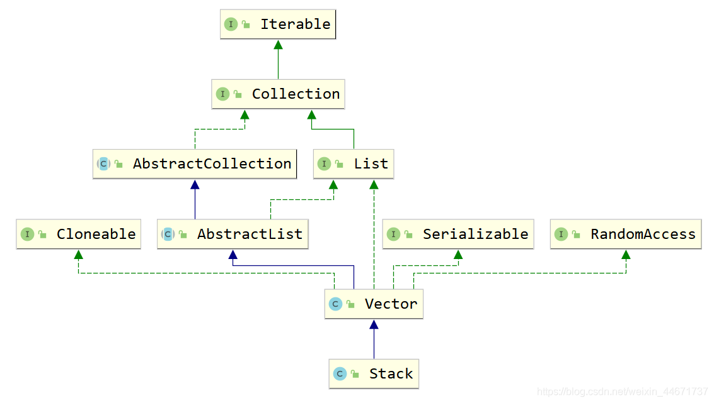

Stack继承于Vector，其也是List接口的实现类。之前提到过Vector是线程安全的，因为其方法都是synchronized修饰的，故此处Stack从父类Vector继承而来的操作也是线程安全的。

#### Stack的使用

 正如Stack是栈的实现，故其主要操作为push入栈和pop出栈，而栈最大的特点就是LIFO（Last In First Out）。

```java
Stack<String> strings = new Stack<>();
strings.push("aaa");
strings.push("bbb");
strings.push("ccc");
System.err.println(strings.pop());
```

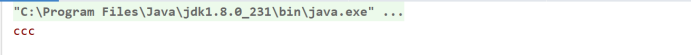

上边代码可以看到，最后push入栈的字符串"ccc"也最先出栈。

#### Stack源码

```java
/**
 * Stack源码（Jdk8）
 */
public
class Stack<E> extends Vector<E> {
    
    public Stack() {
        
    }
    
	//入栈，使用的是Vector的addElement方法。    
	public E push(E item) {
        addElement(item);
        return item;
    }
    
    //出栈，找到数组最后一个元素，移除并返回。
    public synchronized E pop() {
        E obj;
        int len = size();
        obj = peek();
        removeElementAt(len - 1);
        return obj;
    }
    
    public synchronized E peek() {
        int len = size();
        if (len == 0) {
            throw new EmptyStackException();
        }
        return elementAt(len - 1);
    }
    
    public boolean empty() {
        return size() == 0;
    }
    
    public synchronized int search(Object o) {
        int i = lastIndexOf(o);
        if (i >= 0) {
            return size() - i;
        }
        return -1;
    }
    
    private static final long serialVersionUID = 1224463164541339165L;
}
```

从Stack的源码中可见，其用的push方法用的是Vector的addElement（E e）方法，该方法是将元素放在集合的尾部，而其pop方法使用的是Vector的removeElementAt(Index x)方法，移除并获取集合的尾部元素，可见Stack的操作就是基于线性表的尾部进行操作的。

## Queue

正如数据结构中描述，queue是一种先进先出的数据结构，也就是first in first out。可以将queue看作一个只可以从某一段放元素进去的一个容器，取元素只能从另一端取，整个机制如下图所示，不过需要注意的是，队列并没有规定是从哪一端插入，从哪一段取出。

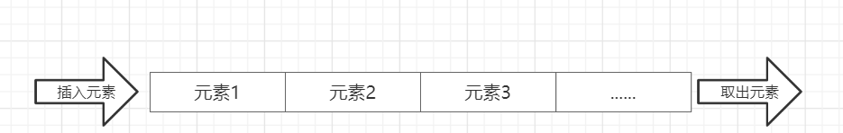

### 什么是Deque

Deque英文全称是Double ended queue，也就是俗称的双端队列。就是说对于这个队列容器，既可以从头部插入也可以从尾部插入，既可以从头部获取，也可以从尾部获取，其机制如下图所示。

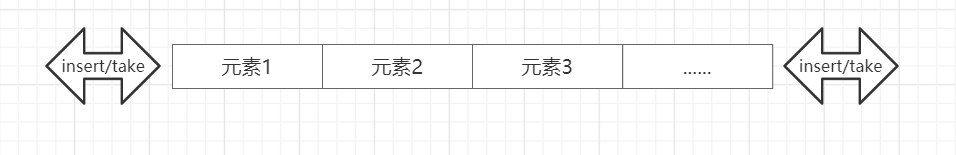

#### Queue接口

此处需要注意，**Java中的队列明确有从尾部插入，头部取出**，所以Java中queue的实现都是从头部取出。

```java
package java.util;
public interface Queue<E> extends Collection<E> {
   	//集合中插入元素
    boolean add(E e);
    //队列中插入元素
    boolean offer(E e);
    //移除元素，当集合为空，抛出异常
    E remove();
    //移除队列头部元素并返回，如果为空，返回null
    E poll();
    //查询集合第一个元素，如果为空，抛出异常
    E element();
    //查询队列中第一个元素，如果为空，返回null
    E peek();
}
```

|   Queue接口方法    |             作用             |
| :----------------: | :--------------------------: |
| boolean offer(E e) |       往队列中插入元素       |
|      E poll()      | 队列中移除元素，并返回该元素 |
|      E peek()      | 获取队列头部元素，但不做修改 |

Java queue常常使用的方法如表格所示，对于表格中接口和表格中没有的接口方法区别为：**队列的操作不会因为队列为空抛出异常，而集合的操作是队列为空抛出异常。**

#### Deque接口

```java
package java.util;

public interface Deque<E> extends Queue<E> {
	//deque的操作方法
    void addFirst(E e);
    void addLast(E e);
    boolean offerFirst(E e);
    boolean offerLast(E e);
    E removeFirst();
    E removeLast();
    E pollFirst();
    E pollLast();
    E getFirst();
    E getLast();
    E peekFirst();
    E peekLast();

    boolean removeFirstOccurrence(Object o);
    boolean removeLastOccurrence(Object o);
    // *** Queue methods ***
    boolean add(E e);
    boolean offer(E e);
    E remove();
    E poll();
    E element();
    E peek();
    // 省略一堆stack接口方法和collection接口方法
}
```

 和Queue中的方法一样，方法名多了First或者Last，First结尾的方法即从头部进行操作，Last即从尾部进行操作。

#### Queue，Deque的实现类

Java中关于Queue的实现主要用的是双端队列，毕竟操作更加方便自由，Queue的实现有PriorityQueue，Deque在java.util中主要有ArrayDeque和LinkedList两个实现类，两者一个是基于数组的实现，一个是基于链表的实现。在之前LinkedList文章中也提到过其是一个双向链表，在此基础之上实现了Deque接口。

### PriorityQueue

PriorityQueue是Java中唯一一个Queue接口的直接实现，如其名字所示，优先队列，其内部支持按照一定的规则对内部元素进行排序。

#### PriorityQueue继承关系

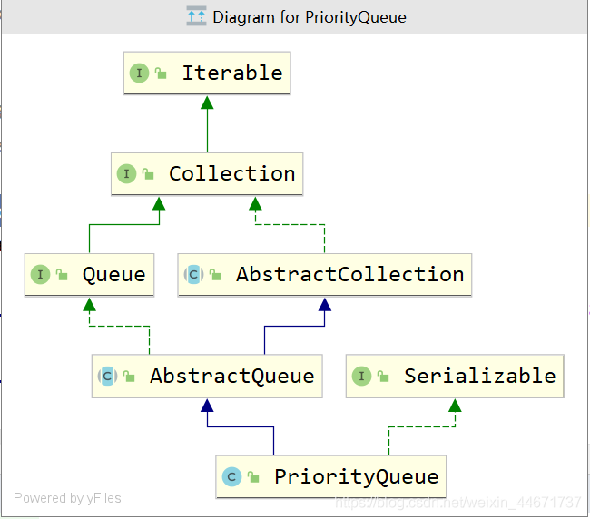

先看下PriorityQueue的继承实现关系，可知其是Queue的实现类，主要使用方式是队列的基本操作，而之前讲到过Queue的基本原理，其核心是FIFO（First In First Out）原理。
Java中的PriorityQueue的实现也是符合队列的方式，不过又略有不同，区别就在于PriorityQueue的priority上，其是一个支持优先级的队列，当使用了其priority的特性的时候，则并非FIFO。

#### PriorityQueue的使用

**案列1：**

```java
PriorityQueue<Integer> queue = new PriorityQueue<>();
queue.add(20);queue.add(14);queue.add(21);queue.add(8);queue.add(9);
queue.add(11);queue.add(13);queue.add(10);queue.add(12);queue.add(15);
while (queue.size()>0){
    Integer poll = queue.poll();
    System.err.print(poll+"->");
}
```

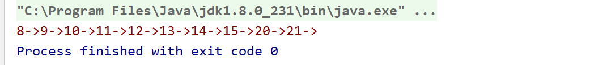

上述代码做的事为往队列中放入10个int值，然后使用Queue的poll()方法依次取出，最后结果为每次取出来都是队列中最小的值，说明
了PriorityQueue内部确实是有一定顺序规则的。

**案例2：**

```java
// 必须实现Comparable方法，想String,数值本身即可比较
private static class Test implements Comparable<Test>{
    
    private int a;
    public Test(int a) {
        this.a = a;
    }
    public int getA() {
        return a;
    }
    public void setA(int a) {
        this.a = a;
    }
    @Override
    public String toString() {
        return "Test{" +
                "a=" + a +
                '}';
    }

    //compareTo方法传的参是another
    @Override
    public int compareTo(Test o) {
        return 0;//-1：自身值小于外来比较值，0比较结果相等，1：自身值大于外来比较值
    }
}

public static void main(String[] args) {
    PriorityQueue<Test> queue = new PriorityQueue<>();
    queue.add(new Test(20));queue.add(new Test(14));queue.add(new Test(21));
    queue.add(new  Test(8));queue.add(new Test(9));
    queue.add(new Test(11));queue.add(new Test(13));queue.add(new Test(10));
    queue.add(new Test(12));queue.add(new Test(15));
    while (queue.size()>0) {
        Test poll = queue.poll();
        System.err.print(poll + "->");
    }
}
```

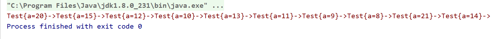

上述代码重写了compareTo方法都返回0，即不做优先级排序。发现我们返回的顺序为Test{a=20}->Test{a=15}->Test{a=12}->Test{a=10}->Test{a=13}->Test{a=11}->Test{a=9}->Test{a=8}->Test{a=21}->Test{a=14}，和放入的顺序还是不同，所以这儿需要注意在实现Comparable接口的时候一定要按照一定的规则进行优先级排序，关于为什么取出来的顺序和放入的顺序不一致后边将从源码来分析。

#### PriorityQueue组成

```java
/**
 * 默认容量大小，数组大小
 */
private static final int DEFAULT_INITIAL_CAPACITY = 11;

/**
 * 存放元素的数组
 */
transient Object[] queue; // non-private to simplify nested class access

/**
 * 队列中存放了多少元素
 */
private int size = 0;

/**
 * 自定义的比较规则，有该规则时优先使用，否则使用元素实现的Comparable接口方法。
 */
private final Comparator<? super E> comparator;

/**
 * 队列修改次数，每次存取都算一次修改
 */
transient int modCount = 0; // non-private to simplify nested class access
```

可以看到PriorityQueue的组成很简单，主要记住一个**存放元素的数组**，和一个**Comparator比较器**即可。

#### PriorityQueue操作方法

##### offer方法

```java
public boolean offer(E e) {
    if (e == null) {
        throw new NullPointerException();
    }
    modCount++;
    int i = size;
    if (i >= queue.length) {
        grow(i + 1);
    }
    size = i + 1;
    //i=size，当queue为空的时候
    if (i == 0) {
        queue[0] = e;
    } else {
        siftUp(i, e);
    }
    return true;
}
```

首先可以看到当Queue中为空的时候，第一次放入的元素直接放在了数组的第一位，那么上边案例二中第一个放入的20就在数组的第一位。而当queue中不为空时，又使用siftUp(i, e)方法，传入的参数是队列中已有元素数量和即将要放入的新元素，现在就来看下究竟siftUp(i, e)做了什么事。

```java
private void siftUp(int k, E x) {
    if (comparator != null) {
        siftUpUsingComparator(k, x);
    } else {
        siftUpComparable(k, x);
    }
}
```

还记得上边提到PriorityQueue的组成，是一个存放元素的数组，和一个Comparator比较器。这儿是指当没有Comparator是使用元素类实现compareTo方法进行比较。其含义为优先使用自定义的比较规则Comparator，否则使用元素所在类实现的Comparable接口方法。

```java
private void siftUpComparable(int k, E x) {
    Comparable<? super E> key = (Comparable<? super E>) x;
    while (k > 0) {
    	//为什么-1， 思考数组位置0，1，2。 0是1和2的父节点
        int parent = (k - 1) >>> 1;
        //父节点
        Object e = queue[parent];
        //当传入的新节点大于父节点则不做处理，否则二者交换
        if (key.compareTo((E) e) >= 0) {
            break;
        }
        queue[k] = e;
        k = parent;
    }
    queue[k] = key;
}
```

 可以看到，当PriorityQueue不为空时插入一个新元素，会对其新元素进行堆排序处理（**对于堆排序此处不做描述**），这样每次进来都会对该元素进行堆排序运算，这样也就保证了Queue中第一个元素永远是最小的（**默认规则排序**）。

##### poll方法

```java
public E poll() {
    if (size == 0) {
        return null;
    }
    int s = --size;
    modCount++;
    E result = (E) queue[0];
    //s = --size,即原来数组的最后一个元素
    E x = (E) queue[s];
    queue[s] = null;
    if (s != 0) {
        siftDown(0, x);
    }
    return result;
}
```

此处可知，当取出一个值进行了siftDown操作，**传入的参数为索引0和队列中的最后一个元素**。

```java
private void siftDownComparable(int k, E x) {
    Comparable<? super E> key = (Comparable<? super E>)x;
    int half = size >>> 1;        // loop while a non-leaf
    while (k < half) {
        int child = (k << 1) + 1; // assume left child is least
        Object c = queue[child];
        int right = child + 1;
        if (right < size &&
        	//c和right是parent的两个子节点，找出小的那个成为新的c。
            ((Comparable<? super E>) c).compareTo((E) queue[right]) > 0)
            c = queue[child = right];
        if (key.compareTo((E) c) <= 0)
            break;
        //小的变成了新的父节点    
        queue[k] = c;
        k = child;
    }
    queue[k] = key;
}
```

当没有Comparator比较器是采用的siftDown方法如上，因为**索引0位置取出**了，找**索引0的子节点比它小的作为新的父节点并在循环内递归**。PriorityQueue是不是很简单呢，其他细节就不再详解，待诸君深入。

### ArrayDeque

ArrayDeque是Java中基于数组实现的双端队列，在Java中Deque的实现有LinkedList和ArrayDeque，正如它两的名字就标志了它们的不同，LinkedList是基于双向链表实现的，而ArrayDeque是基于数组实现的。

#### ArrayDeque的继承关系

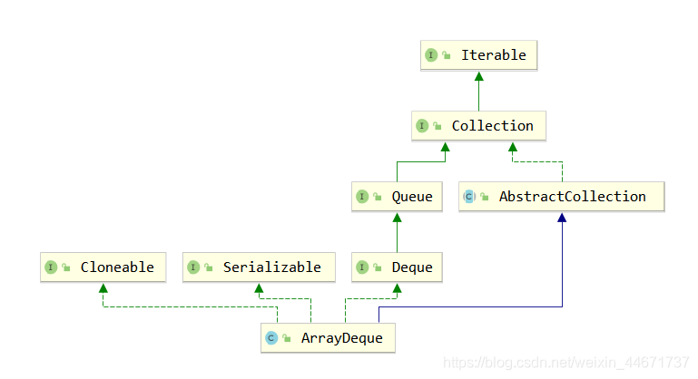

 可见ArrayDeque是Deque接口的实现，和LinkedList不同的是，LinkedList既是List接口也是Deque接口的实现。

#### ArrayDeque使用

**案列一：**

```java
ArrayDeque<String> deque = new ArrayDeque<>();
deque.offer("aaa");
deque.offer("bbb");
deque.offer("ccc");
deque.offer("ddd");
//peek方法只获取不移除
System.err.println(deque.peekFirst());
System.err.println(deque.peekLast());
```

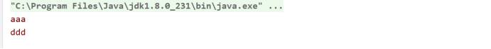

**案例二：**

```java
ArrayDeque<String> deque = new ArrayDeque<>();
deque.offerFirst("aaa");
deque.offerLast("bbb");
deque.offerFirst("ccc");
deque.offerLast("ddd");
String a;
while((a = deque.pollLast())!=null){
    System.err.print(a+"->");
}
```

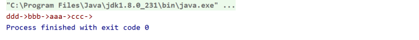

上述程序最后得到队列中排列结果为ccc,aaa,bbb,ddd所以循环使用**pollLast()**,结果ddd,bbb,aaa,ccc，图示案列二的插入逻辑如下：

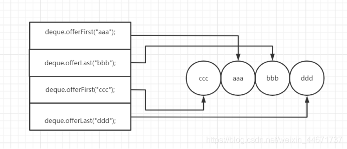

#### ArrayDeque内部组成

```java
//具体存放元素的数组，数组大小一定是2的幂次方
transient Object[] elements; // non-private to 
//队列头索引
transient int head;
//队列尾索引
transient int tail;
//默认的最小初始化容量，即传入的容量小于8容量为8，而默认容量是16
private static final int MIN_INITIAL_CAPACITY = 8;
```

#### 数组elements长度

此处elements数组的长度永远是2的幂次方，此处的实现方法和hashMap中基本一样，即保证长度的二进制全部由1组成，然后再加1，则变成了100…，故一定是2的幂次方。

```
private static int calculateSize(int numElements) {
    int initialCapacity = MIN_INITIAL_CAPACITY;
    // Find the best power of two to hold elements.
    // Tests "<=" because arrays aren't kept full.
    if (numElements >= initialCapacity) {
        initialCapacity = numElements;
        initialCapacity |= (initialCapacity >>>  1);
        initialCapacity |= (initialCapacity >>>  2);
        initialCapacity |= (initialCapacity >>>  4);
        initialCapacity |= (initialCapacity >>>  8);
        initialCapacity |= (initialCapacity >>> 16);
        initialCapacity++;

        if (initialCapacity < 0)   // Too many elements, must back off
            initialCapacity >>>= 1;// Good luck allocating 2 ^ 30 elements
    }
    return initialCapacity;
}
```

#### ArrayDeque实现机制

如下图所示：

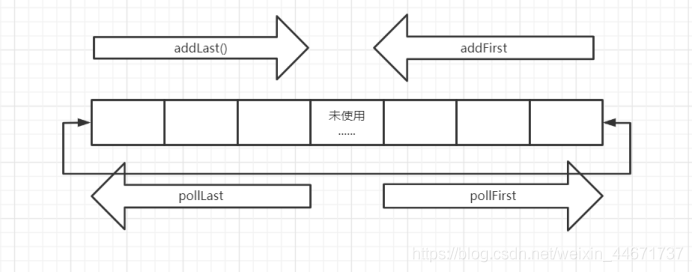

此处应将数组视作首尾相连的，最初头部和尾部索引都是0，addLast方向往右，addFirst方向往左，所以数组中间可能是空的，当头指针和尾指针相遇的时候对数组进行扩容，并对元素位置进行调整。
**源码：**

```
public void addFirst(E e) {
    if (e == null)
        throw new NullPointerException();
    elements[head = (head - 1) & (elements.length - 1)] = e;
    if (head == tail)
        doubleCapacity();
}
```

注意下边这行代码，表示当head-1大于等于0时，head=head-1，否则head=elements.length - 1。

```java
head = (head - 1) & (elements.length - 1)
```

换一种写法就是下边这样，是不是就是上边addFirst的指针移动方向？

```java
head = head-1>=0?head-1:elements.length-1
```

这个就是位运算的神奇操作了，因为任何数与大于它的一个全是二进制1做&运算时等于它自身，如1010&1111 = 1010，此处不赘述。

**再看addLast方法：**

```java
public void addLast(E e) {
    if (e == null)
        throw new NullPointerException();
    elements[tail] = e;
    if ( (tail = (tail + 1) & (elements.length - 1)) == head)
        doubleCapacity();
}
```

同样的注意有一串神奇代码。

```java
(tail = (tail + 1) & (elements.length - 1))
```

该表达式等于`tail = tail+1>element-1?0:tail+1`,是不是很神奇的写法，其原理是一个二进制数全部由1组成和一个大于它的数做&运算结果为0，如`10000&1111 = 0`。poll方法和add方法逻辑是相反的，此处就不再赘述，诸君共求之！

## Set

如果说List对集合加了有序性（插入有序），那么Set就是对集合加上了唯一性。

### Set接口

java中的Set接口和Colletion是完全一样的定义。

```java
package java.util;

public interface Set<E> extends Collection<E> {
    // Query Operations
    int size();
    boolean isEmpty();
    Object[] toArray();
    <T> T[] toArray(T[] a);
    // Modification Operations
    boolean add(E e);
    boolean remove(Object o);
    boolean containsAll(Collection<?> c);
    boolean addAll(Collection<? extends E> c);
    boolean retainAll(Collection<?> c);
    boolean removeAll(Collection<?> c);
    void clear();
    boolean equals(Object o);
    int hashCode();
    
	//此处和Collection接口由区别
 	Spliterator<E> spliterator() {
        return Spliterators.spliterator(this, Spliterator.DISTINCT);
    }
}
```

### HashSet

Java中的HashSet如其名字所示，其是一种Hash实现的集合，使用的底层结构是HashMap。

#### HashSet继承关系

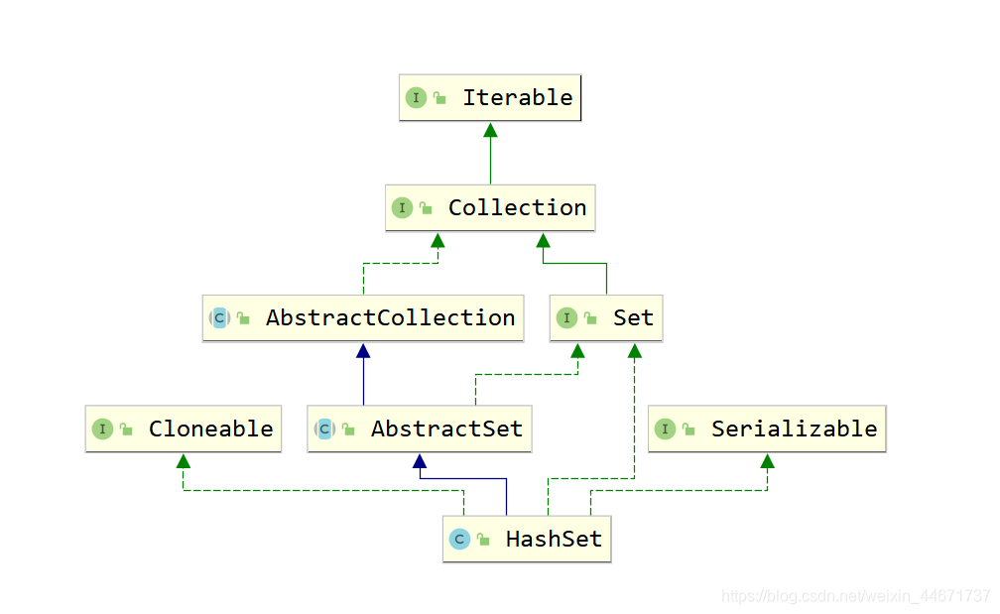

#### HashSet源码

```java
public class HashSet<E> extends AbstractSet<E> implements Set<E>, Cloneable, java.io.Serializable {
    
    static final long serialVersionUID = -5024744406713321676L;
    
    private transient HashMap<E,Object> map;
    private static final Object PRESENT = new Object();
    
    public HashSet() {
        map = new HashMap<>();
    }
    public HashSet(Collection<? extends E> c) {
        map = new HashMap<>(Math.max((int) (c.size()/.75f) + 1, 16));
        addAll(c);
    }
    public HashSet(int initialCapacity, float loadFactor) {
        map = new HashMap<>(initialCapacity, loadFactor);
    }
    public HashSet(int initialCapacity) {
        map = new HashMap<>(initialCapacity);
    }
    HashSet(int initialCapacity, float loadFactor, boolean dummy) {
        map = new LinkedHashMap<>(initialCapacity, loadFactor);
    }
    public Iterator<E> iterator() {
        return map.keySet().iterator();
    }
    public int size() {
        return map.size();
    }
    public boolean isEmpty() {
        return map.isEmpty();
    }
    public boolean contains(Object o) {
        return map.containsKey(o);
    }
    public boolean add(E e) {
        return map.put(e, PRESENT)==null;
    }
    public boolean remove(Object o) {
        return map.remove(o)==PRESENT;
    }

    public void clear() {
        map.clear();
    }
}
```

可以看到HashSet内部其实是一个HashMap。

#### HashSet是如何保证不重复的呢？

可见HashSet的add方法，插入的值会作为HashMap的key，所以是HashMap保证了不重复。map的put方法新增一个原来不存在的值会返回null，如果原来存在的话会返回原来存在的值。

关于HashMap是如何实现的，见后续！

### LinkedHashSet

LinkedHashSet用的也比较少，其也是基于Set的实现。

#### LinkedHashSet继承关系

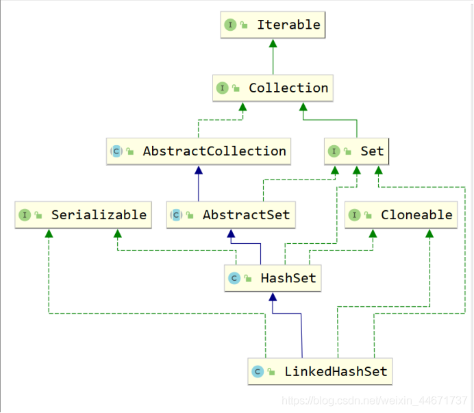

 和HashSet一样，其也是Set接口的实现类，并且是HashSet的子类。

#### LinkedHashSet源码

```java
package java.util;

public class LinkedHashSet<E> extends HashSet<E> implements Set<E>, Cloneable, java.io.Serializable {

    private static final long serialVersionUID = -2851667679971038690L;

    public LinkedHashSet(int initialCapacity, float loadFactor) {
    	//调用HashSet的构造方法
        super(initialCapacity, loadFactor, true);
    }
    public LinkedHashSet(int initialCapacity) {
        super(initialCapacity, .75f, true);
    }
    public LinkedHashSet() {
        super(16, .75f, true);
    }
    public LinkedHashSet(Collection<? extends E> c) {
        super(Math.max(2*c.size(), 11), .75f, true);
        addAll(c);
    }
    @Override
    public Spliterator<E> spliterator() {
        return Spliterators.spliterator(this, Spliterator.DISTINCT | Spliterator.ORDERED);
    }
}
```

 其操作方法和HashSet完全一样，那么二者区别是什么呢？
1.首先LinkedHashSet是HashSet的子类。
2.LinkedHashSet中用于存储值的实现LinkedHashMap，而HashSet使用的是HashMap。LinkedHashSet中调用的父类构造器，可以看到其实列是一个LinkedHashMap。

```java
HashSet(int initialCapacity, float loadFactor, boolean dummy) {
    map = new LinkedHashMap<>(initialCapacity, loadFactor);
}
```

LinkedHashSet的实现很简单，更深入的了解需要去看LinkedHashMap的实现，对LinkedHashMap的解析将单独提出。

## Map

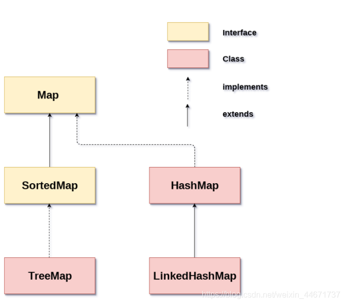

Map是一种键值对的结构，就是常说的Key-Value结构，一个Map就是很多这样K-V键值对组成的，一个K-V结构我们将其称作Entry，在Java里，Map是用的非常多的一种数据结构。上图展示了Map家族最基础的一个结构（只是指java.util中）。

### Map接口

```java
package java.util;

import java.util.function.BiConsumer;
import java.util.function.BiFunction;
import java.util.function.Function;
import java.io.Serializable;

public interface Map<K,V> {
    // Query Operations
    int size();
    boolean isEmpty();
    boolean containsKey(Object key);
    boolean containsValue(Object value);
    V get(Object key);
    // Modification Operations
    V put(K key, V value);
    V remove(Object key);
    // Bulk Operations
    void putAll(Map<? extends K, ? extends V> m);
    void clear();
    Set<K> keySet();
    Collection<V> values();
    Set<Map.Entry<K, V>> entrySet();
    
    interface Entry<K,V> {
        K getKey();
        V getValue();
        V setValue(V value);
        boolean equals(Object o);
        int hashCode();
        
        public static <K extends Comparable<? super K>, V> Comparator<Map.Entry<K,V>> comparingByKey() {
            return (Comparator<Map.Entry<K, V>> & Serializable)
                (c1, c2) -> c1.getKey().compareTo(c2.getKey());
        }
        
        public static <K, V extends Comparable<? super V>> Comparator<Map.Entry<K,V>> comparingByValue() {
            return (Comparator<Map.Entry<K, V>> & Serializable)
                (c1, c2) -> c1.getValue().compareTo(c2.getValue());
        }
        
        public static <K, V> Comparator<Map.Entry<K, V>> comparingByKey(Comparator<? super K> cmp) {
            Objects.requireNonNull(cmp);
            return (Comparator<Map.Entry<K, V>> & Serializable)
                (c1, c2) -> cmp.compare(c1.getKey(), c2.getKey());
        }
        
        public static <K, V> Comparator<Map.Entry<K, V>> comparingByValue(Comparator<? super V> cmp) {
            Objects.requireNonNull(cmp);
            return (Comparator<Map.Entry<K, V>> & Serializable)
                (c1, c2) -> cmp.compare(c1.getValue(), c2.getValue());
        }
    }

    // Comparison and hashing
    boolean equals(Object o);
    int hashCode();
    
    default V getOrDefault(Object key, V defaultValue) {
        V v;
        return (((v = get(key)) != null) || containsKey(key)) ? v : defaultValue;
    }
    
    default void forEach(BiConsumer<? super K, ? super V> action) {
        Objects.requireNonNull(action);
        for (Map.Entry<K, V> entry : entrySet()) {
            K k;
            V v;
            try {
                k = entry.getKey();
                v = entry.getValue();
            } catch(IllegalStateException ise) {
                // this usually means the entry is no longer in the map.
                throw new ConcurrentModificationException(ise);
            }
            action.accept(k, v);
        }
    }
    
    default void replaceAll(BiFunction<? super K, ? super V, ? extends V> function) {
        Objects.requireNonNull(function);
        for (Map.Entry<K, V> entry : entrySet()) {
            K k;
            V v;
            try {
                k = entry.getKey();
                v = entry.getValue();
            } catch(IllegalStateException ise) {
                // this usually means the entry is no longer in the map.
                throw new ConcurrentModificationException(ise);
            }

            // ise thrown from function is not a cme.
            v = function.apply(k, v);

            try {
                entry.setValue(v);
            } catch(IllegalStateException ise) {
                // this usually means the entry is no longer in the map.
                throw new ConcurrentModificationException(ise);
            }
        }
    }
    
    default V putIfAbsent(K key, V value) {
        V v = get(key);
        if (v == null) {
            v = put(key, value);
        }

        return v;
    }
    
    default boolean remove(Object key, Object value) {
        Object curValue = get(key);
        if (!Objects.equals(curValue, value) ||
            (curValue == null && !containsKey(key))) {
            return false;
        }
        remove(key);
        return true;
    }

    default boolean replace(K key, V oldValue, V newValue) {
        Object curValue = get(key);
        if (!Objects.equals(curValue, oldValue) ||
            (curValue == null && !containsKey(key))) {
            return false;
        }
        put(key, newValue);
        return true;
    }

    default V replace(K key, V value) {
        V curValue;
        if (((curValue = get(key)) != null) || containsKey(key)) {
            curValue = put(key, value);
        }
        return curValue;
    }
    
    default V computeIfAbsent(K key,
            Function<? super K, ? extends V> mappingFunction) {
        Objects.requireNonNull(mappingFunction);
        V v;
        if ((v = get(key)) == null) {
            V newValue;
            if ((newValue = mappingFunction.apply(key)) != null) {
                put(key, newValue);
                return newValue;
            }
        }

        return v;
    }

    default V computeIfPresent(K key,
            BiFunction<? super K, ? super V, ? extends V> remappingFunction) {
        Objects.requireNonNull(remappingFunction);
        V oldValue;
        if ((oldValue = get(key)) != null) {
            V newValue = remappingFunction.apply(key, oldValue);
            if (newValue != null) {
                put(key, newValue);
                return newValue;
            } else {
                remove(key);
                return null;
            }
        } else {
            return null;
        }
    }

    default V compute(K key, BiFunction<? super K, ? super V, ? extends V> remappingFunction) {
        Objects.requireNonNull(remappingFunction);
        V oldValue = get(key);
        V newValue = remappingFunction.apply(key, oldValue);
        if (newValue == null) {
            // delete mapping
            if (oldValue != null || containsKey(key)) {
                // something to remove
                remove(key);
                return null;
            } else {
                // nothing to do. Leave things as they were.
                return null;
            }
        } else {
            // add or replace old mapping
            put(key, newValue);
            return newValue;
        }
    }
    
    default V merge(K key, V value, BiFunction<? super V, ? super V, ? extends V> remappingFunction) {
        Objects.requireNonNull(remappingFunction);
        Objects.requireNonNull(value);
        V oldValue = get(key);
        V newValue = (oldValue == null) ? value : remappingFunction.apply(oldValue, value);
        if(newValue == null) {
            remove(key);
        } else {
            put(key, newValue);
        }
        return newValue;
    }
}
```

Map接口本身就是一个顶层接口，由一堆Map自身接口方法和一个Entry接口组成，Entry接口定义了主要是关于Key-Value自身的一些操作，Map接口定义的是一些属性和关于属性查找修改的一些接口方法。

### HashMap

HashMap是Java中最常用K-V容器，采用了哈希的方式进行实现，HashMap中存储的是一个又一个Key-Value的键值对，我们将其称作Entry，HashMap对Entry进行了扩展（称作Node），使其成为链表或者树的结构使其存储在HashMap的容器里（是一个数组）。

#### HashMap继承关系

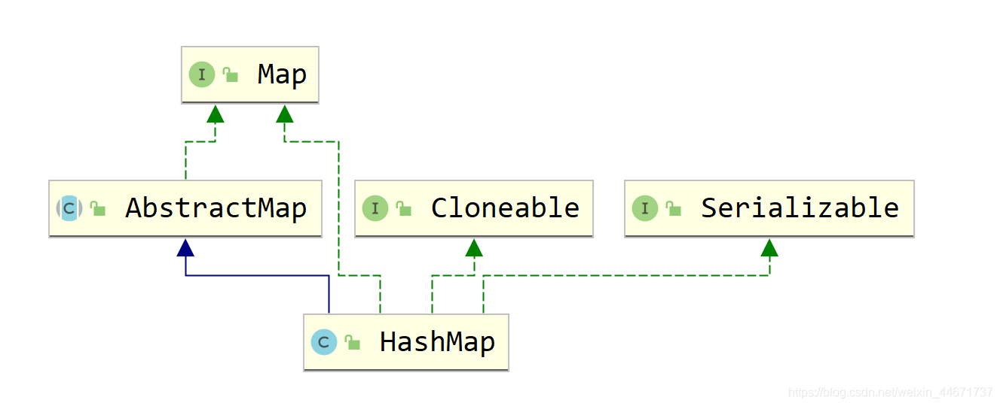

#### HashMap存储的数据

Map接口中有一个Entry接口，在HashMap中对其进行了实现，**Entry的实现是HashMap存放的数据的类型。**其中Entry在HashMap的实现是Node，Node是一个单链表的结构，TreeNode是其子类，是一个红黑树的类型，其继承结构图如下：

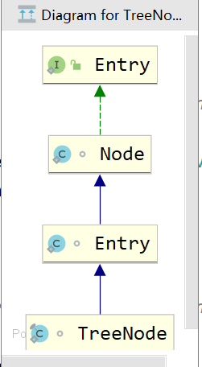

HashMap存放数据的数据是什么呢？
代码中存放数据的容器如下：

```java
transient Node<K,V>[] table;
```

说明了该容器中是一个又一个node组成，而node有三种实现，所以hashMap中存放的node的形式既可以是Node也可以是TreeNode。

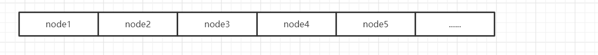

#### HashMap的组成

有了上边的概念之后来看一下HashMap里有哪些组成吧！

```java
//是hashMap的最小容量16，容量就是数组的大小也就是变量，transient 		Node<K,V>[] table。
static final int DEFAULT_INITIAL_CAPACITY = 1 << 4; // aka 16

//最大数量，该数组最大值为2^31次方。
static final int MAXIMUM_CAPACITY = 1 << 30;

//默认的加载因子，如果构造的时候不传则为0.75
static final float DEFAULT_LOAD_FACTOR = 0.75f;

//一个位置里存放的节点转化成树的阈值，也就是8，比如数组里有一个node，这个node链表的长度达到该值才会转化为红黑树。
static final int TREEIFY_THRESHOLD = 8;

//当一个反树化的阈值，当这个node长度减少到该值就会从树转化成链表
static final int UNTREEIFY_THRESHOLD = 6;

//满足节点变成树的另一个条件，就是存放node的数组长度要达到64
static final int MIN_TREEIFY_CAPACITY = 64;

//具体存放数据的数组
transient Node<K,V>[] table;

//entrySet，一个存放k-v缓冲区
transient Set<Map.Entry<K,V>> entrySet;

//size是指hashMap中存放了多少个键值对
transient int size;

//对map的修改次数
transient int modCount;

//加载因子
final float loadFactor;
```

 这儿要说两个概念，**table是指的存放数据的数组，bin是指的table中某一个位置的node，一个node可以理解成一批/一盒数据。**

#### HashMap中的构造函数

```java
//只有容量，initialCapacity
public HashMap(int initialCapacity) {
    this(initialCapacity, DEFAULT_LOAD_FACTOR);
}

public HashMap() {
    this.loadFactor = DEFAULT_LOAD_FACTOR; // all other fields defaulted
}

public HashMap(Map<? extends K, ? extends V> m) {
    this.loadFactor = DEFAULT_LOAD_FACTOR;
    putMapEntries(m, false);
}

final void putMapEntries(Map<? extends K, ? extends V> m, boolean evict) {
    int s = m.size();
    if (s > 0) {
        if (table == null) { // pre-size
            float ft = ((float)s / loadFactor) + 1.0F;
            int t = ((ft < (float)MAXIMUM_CAPACITY) ? (int)ft : MAXIMUM_CAPACITY);
            if (t > threshold) {
                threshold = tableSizeFor(t);
            }
        } else if (s > threshold) {
            resize();
        }
        for (Map.Entry<? extends K, ? extends V> e : m.entrySet()) {
            K key = e.getKey();
            V value = e.getValue();
            putVal(hash(key), key, value, false, evict);
        }
    }
}

public HashMap(int initialCapacity, float loadFactor) {
    if (initialCapacity < 0) {
        // 容量不能为负数
        throw new IllegalArgumentException("Illegal initial capacity: " + initialCapacity);
    }
    //当容量大于2^31就取最大值1<<31;                                        
    if (initialCapacity > MAXIMUM_CAPACITY) {
        initialCapacity = MAXIMUM_CAPACITY;
    }
    if (loadFactor <= 0 || Float.isNaN(loadFactor)) {
        throw new IllegalArgumentException("Illegal load factor: " + loadFactor);
    }
    this.loadFactor = loadFactor;
    //当前数组table的大小，一定是是2的幂次方
    //tableSizeFor保证了数组一定是是2的幂次方，是大于initialCapacity最结进的值。
    this.threshold = tableSizeFor(initialCapacity);
}
```

**tableSizeFor()方法保证了数组大小一定是是2的幂次方,是如何实现的呢？**

```java
static final int tableSizeFor(int cap) {
    int n = cap - 1;
    n |= n >>> 1;
    n |= n >>> 2;
    n |= n >>> 4;
    n |= n >>> 8;
    n |= n >>> 16;
    return (n < 0) ? 1 : (n >= MAXIMUM_CAPACITY) ? MAXIMUM_CAPACITY : n + 1;
}
```

该方法将一个二进制数第一位1后边的数字全部变成1，然后再加1，这样这个二进制数就一定是100…这样的形式。此处实现在ArrayDeque的实现中也用到了类似的方法来保证数组长度一定是2的幂次方。

#### put方法

开发人员使用的put方法：

```java
public V put(K key, V value) {
    return putVal(hash(key), key, value, false, true);
}
```

真正HashMap内部使用的put值的方法：

```java
final V putVal(int hash, K key, V value, boolean onlyIfAbsent, boolean evict) {
    Node<K,V>[] tab; 
    Node<K,V> p; 
    int n, i;
    if ((tab = table) == null || (n = tab.length) == 0) {
        n = (tab = resize()).length;
    }
    //当hash到的位置，该位置为null的时候，存放一个新node放入 
    // 这里p赋值成了table该位置的node值
    if ((p = tab[i = (n - 1) & hash]) == null) {
        tab[i] = newNode(hash, key, value, null);
    } else {
        Node<K,V> e; K k;
        //该位置第一个就是查找到的值，将p赋给e
        if (p.hash == hash && ((k = p.key) == key || (key != null && key.equals(k)))) {
            e = p;
        } else if (p instanceof TreeNode) {
            //如果是红黑树，调用红黑树的putTreeVal方法  
            e = ((TreeNode<K,V>)p).putTreeVal(this, tab, hash, key, value);
        } else {
        	//是链表，遍历，注意e = p.next这个一直将下一节点赋值给e，直到尾部，注意开头是++binCount
            for (int binCount = 0; ; ++binCount) {
                if ((e = p.next) == null) {
                    p.next = newNode(hash, key, value, null);
                    //当链表长度大于等于7，插入第8位，树化
                    if (binCount >= TREEIFY_THRESHOLD - 1) {
                        // -1 for 1st
                        treeifyBin(tab, hash);
                    }
                    break;
                }
                if (e.hash == hash && ((k = e.key) == key || (key != null && key.equals(k)))) {
                    break;
                }
                p = e;
            }
        }
        if (e != null) { // existing mapping for key
            V oldValue = e.value;
            if (!onlyIfAbsent || oldValue == null) {
                e.value = value;
            }
            afterNodeAccess(e);
            return oldValue;
        }
    }
    ++modCount;
    if (++size > threshold) {
        resize();
    }
    afterNodeInsertion(evict);
    return null;
}
```

#### Hash算法

```java
static final int hash(Object key) {
    int h;
    //key如果是null 新hashcode是0 否则 计算新的hashcode
    return (key == null) ? 0 : (h = key.hashCode()) ^ (h >>> 16);
}
```

**为什么要无符号右移16位后做异或运算?**

根据上面的说明我们做一个简单演练

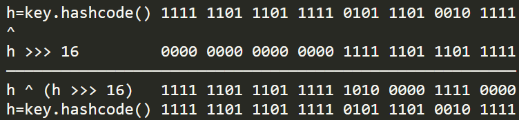

将h无符号右移16为相当于将高区16位移动到了低区的16位，再与原hashcode做异或运算，可以将高低位二进制特征混合起来

从上文可知高区的16位与原hashcode相比没有发生变化，低区的16位发生了变化

我们可知通过上面(h = key.hashCode()) ^ (h >>> 16)进行运算可以把高区与低区的二进制特征混合到低区，那么为什么要这么做呢？

我们都知道重新计算出的新哈希值在后面将会参与hashmap中数组槽位的计算，计算公式：(n - 1) & hash，假如这时数组槽位有16个，则槽位计算如下：
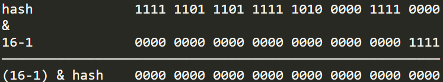

仔细观察上文不难发现，高区的16位很有可能会被数组槽位数的二进制码锁屏蔽，如果我们不做刚才移位异或运算，那么在计算槽位时将丢失高区特征

也许你可能会说，即使丢失了高区特征不同hashcode也可以计算出不同的槽位来，但是细想当两个哈希码很接近时，那么这高区的一点点差异就可能避免一次哈希碰撞，所以这也是将性能做到极致的一种体现
**使用异或运算的原因**
 异或运算能更好的保留各部分的特征，如果采用&运算计算出来的值会向0靠拢，采用|运算计算出来的值会向1靠拢

**为什么槽位数必须使用2^n (重点)?**
1、为了让哈希后的结果更加均匀

这个原因我们继续用上面的例子来说明

假如槽位数不是16，而是17，则槽位计算公式变成：(17 - 1) & hash
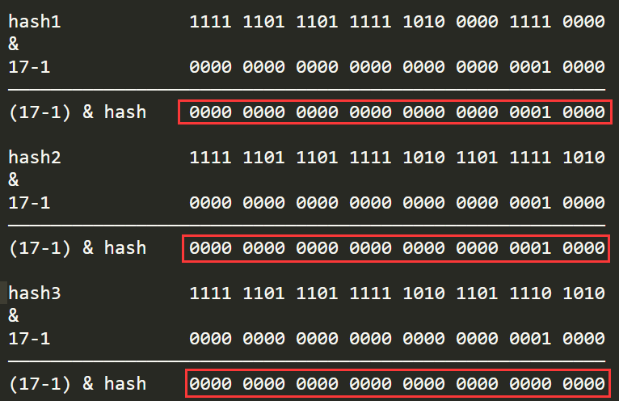

从上文可以看出，计算结果将会大大趋同，hashcode参加&运算后被更多位的0屏蔽，计算结果只剩下两种0和16，这对于hashmap来说是一种灾难

上面提到的所有问题，最终目的还是为了让哈希后的结果更均匀的分部，减少哈希碰撞，提升hashmap的运行效率

#### 扩容

当hashmap中的元素个数超过数组大小loadFactor时，就会进行数组扩容，loadFactor的默认值为0.75，也就是说，默认情况下，数组大小为16，那么当hashmap中元素个数超过16 × 0.75=12的时候，就把数组的大小扩展为2 × 16 = 32，即扩大一倍，然后重新计算每个元素在数组中的位置，而这是一个非常消耗性能的操作，所以如果我们已经预知hashmap中元素的个数，那么预设元素的个数能够有效的提高hashmap的性能。

#### 查找方法

```java
final Node<K,V> getNode(int hash, Object key) {
    Node<K,V>[] tab; Node<K,V> first, e; int n; K k;
    //先判断表不为空
    if ((tab = table) != null && (n = tab.length) > 0 &&
        //这一行是找到要查询的Key在table中的位置，table是存放HashMap中每一个Node的数组。
        (first = tab[(n - 1) & hash]) != null) {
        //Node可能是一个链表或者树，先判断根节点是否是要查询的key，就是根节点，方便后续遍历Node写法并且
        //对于只有根节点的Node直接判断
        if (first.hash == hash && // always check first node
            ((k = first.key) == key || (key != null && key.equals(k)))) {
            return first;
        }
        //有子节点
        if ((e = first.next) != null) {
            //红黑树查找
            if (first instanceof TreeNode) {
                return ((TreeNode<K,V>)first).getTreeNode(hash, key);
            }
            do {
                //链表查找
                if (e.hash == hash && ((k = e.key) == key || (key != null && key.equals(k)))) {
                    return e;
                }
            }
            //遍历链表，当链表后续为null则推出循环
            while ((e = e.next) != null) {
                
            }
        }
    }
    return null;
}
```

#### HashMap下红黑树的存储结构

```java

/**
 * 当存在hash碰撞的时候，且元素数量大于8个时候，就会以红黑树的方式将这些元素组织起来
 * map 当前节点所在的HashMap对象
 * tab 当前HashMap对象的元素数组
 * h   指定key的hash值
 * k   指定key
 * v   指定key上要写入的值
 * 返回：指定key所匹配到的节点对象，针对这个对象去修改V（返回空说明创建了一个新节点）
 */
final TreeNode<K,V> putTreeVal(HashMap<K,V> map, Node<K,V>[] tab,
                                int h, K k, V v) {
    Class<?> kc = null; // 定义k的Class对象
    boolean searched = false; // 标识是否已经遍历过一次树，未必是从根节点遍历的，但是遍历路径上一定已经包含了后续需要比对的所有节点。
    TreeNode<K,V> root = (parent != null) ? root() : this; // 父节点不为空那么查找根节点，为空那么自身就是根节点
    for (TreeNode<K,V> p = root;;) { // 从根节点开始遍历，没有终止条件，只能从内部退出
        int dir, ph; K pk; // 声明方向、当前节点hash值、当前节点的键对象
        if ((ph = p.hash) > h) {
            // 如果当前节点hash 大于 指定key的hash值
            // 要添加的元素应该放置在当前节点的左侧
            dir = -1; 
        } else if (ph < h) {
            // 如果当前节点hash 小于 指定key的hash值
            // 要添加的元素应该放置在当前节点的右侧
            dir = 1; 
        } else if ((pk = p.key) == k || (k != null && k.equals(pk))) {
            // 如果当前节点的键对象 和 指定key对象相同
            return p; // 那么就返回当前节点对象，在外层方法会对v进行写入
        }
        // 走到这一步说明 当前节点的hash值  和 指定key的hash值  是相等的，但是equals不等
        else if ((kc == null && (kc = comparableClassFor(k)) == null) || 
                 (dir = compareComparables(kc, k, pk)) == 0) {
            // 走到这里说明：指定key没有实现comparable接口   
            //或者   实现了comparable接口并且和当前节点的键对象比较之后相等（仅限第一次循环） 
            
            /*
             * searched 标识是否已经对比过当前节点的左右子节点了
             * 如果还没有遍历过，那么就递归遍历对比，看是否能够得到那个键对象equals相等的的节点
             * 如果得到了键的equals相等的的节点就返回
             * 如果还是没有键的equals相等的节点，那说明应该创建一个新节点了
             */
            if (!searched) { // 如果还没有比较过当前节点的所有子节点
                TreeNode<K,V> q, ch; // 定义要返回的节点、和子节点
                searched = true; // 标识已经遍历过一次了
                /*
                 * 红黑树也是二叉树，所以只要沿着左右两侧遍历寻找就可以了
                 * 这是个短路运算，如果先从左侧就已经找到了，右侧就不需要遍历了
                 * find 方法内部还会有递归调用。参见：find方法解析
                 */
                if (((ch = p.left) != null && (q = ch.find(h, k, kc)) != null) || ((ch = p.right) != null 
                        && (q = ch.find(h, k, kc)) != null)) {
                    return q; // 找到了指定key键对应的
                }
            }
            // 走到这里就说明，遍历了所有子节点也没有找到和当前键equals相等的节点
            dir = tieBreakOrder(k, pk); // 再比较一下当前节点键和指定key键的大小
        }
        TreeNode<K,V> xp = p; // 定义xp指向当前节点
        /*
        * 如果dir小于等于0，那么看当前节点的左节点是否为空，如果为空，就可以把要添加的元素作为当前节点的左节点，如果不为空，还需要下一轮继续比较
        * 如果dir大于等于0，那么看当前节点的右节点是否为空，如果为空，就可以把要添加的元素作为当前节点的右节点，如果不为空，还需要下一轮继续比较
        * 如果以上两条当中有一个子节点不为空，这个if中还做了一件事，那就是把p已经指向了对应的不为空的子节点，开始下一轮的比较
        */
        if ((p = (dir <= 0) ? p.left : p.right) == null) {  
            // 如果恰好要添加的方向上的子节点为空，此时节点p已经指向了这个空的子节点
            Node<K,V> xpn = xp.next; // 获取当前节点的next节点
            TreeNode<K,V> x = map.newTreeNode(h, k, v, xpn); // 创建一个新的树节点
            if (dir <= 0)
                xp.left = x;  // 左孩子指向到这个新的树节点
            else
                xp.right = x; // 右孩子指向到这个新的树节点
            xp.next = x; // 链表中的next节点指向到这个新的树节点
            x.parent = x.prev = xp; // 这个新的树节点的父节点、前节点均设置为 当前的树节点
            if (xpn != null) // 如果原来的next节点不为空
                ((TreeNode<K,V>)xpn).prev = x; // 那么原来的next节点的前节点指向到新的树节点
            moveRootToFront(tab, balanceInsertion(root, x));// 重新平衡，以及新的根节点置顶
            return null; // 返回空，意味着产生了一个新节点
        }
    }
}
```


### HashTable

和HashMap不同，HashTable的实现方式完全不同，这点从二者的类继承关系就可以看出端倪来，HashTable和HashMap虽然都实现了Map接口，但是HashTable继承了DIctionary抽象类，而HashMap继承了AbstractMap抽象类。

#### HashTable的类继承关系图

HashTable

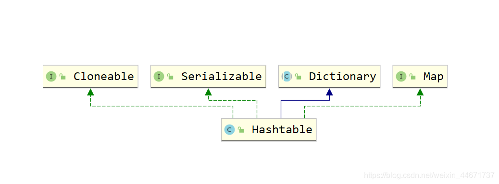

 HashMap

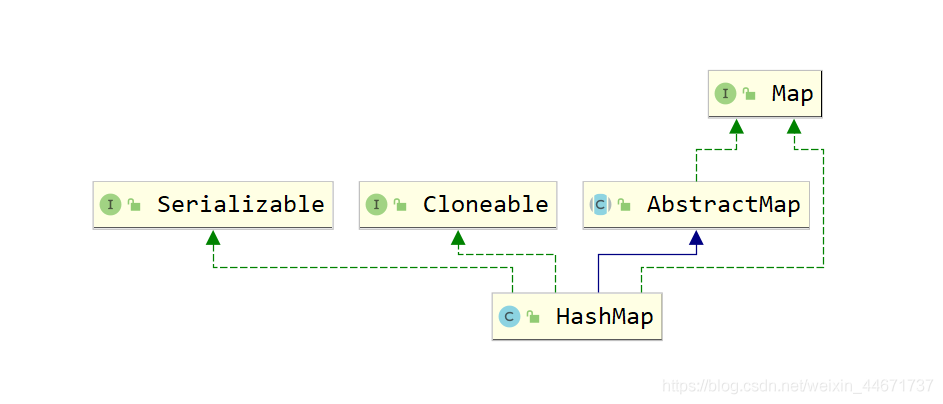

#### Dictionary接口

```java
public abstract class Dictionary<K,V> {
    
    public Dictionary() {
        
    }
    
    public abstract int size();
    public abstract boolean isEmpty();
    public abstract Enumeration<K> keys();
    public abstract Enumeration<V> elements();
    public abstract V get(Object key);
    public abstract V put(K key, V value);
    public abstract V remove(Object key);
    
}
```

Dictionary类中有这样一行注释，当key为null时会抛出空指针NullPointerException,这也说明了HashTabel是不允许Key为null的。

```java
//throws    NullPointerException if the {@code key} is {@code null}.
```

#### HashTable组成

```java
/**
 * The hash table data.
 * 真正存放数据的数组
 */
private transient Entry<?,?>[] table;

/**
 * The total number of entries in the hash table.
 */
private transient int count;

/**
 * The table is rehashed when its size exceeds this threshold.  (The
 * value of this field is (int)(capacity * loadFactor).)
 * 重新hash的阈值
 * @serial
 */
private int threshold;

/**
 * The load factor for the hashtable.
 * @serial
 */
private float loadFactor;
```

HashTable中的元素存在Entry<?,?>[] table中，是一个Entry数组，Entry是存放的节点，每一个Entry是一个链表。

#### HashTable中的Entry

```java
final int hash;
final K key;
V value;
Entry<K,V> next;
```

知道Entry是一个单链表即可，和HashMap中的Node结构相同，**但是HashMap中还有Node的子类TreeNode**。

#### put方法

```java
public synchronized V put(K key, V value) {
    // Make sure the value is not null
    if (value == null) {
        throw new NullPointerException();
    }
    // Makes sure the key is not already in the hashtable.
    Entry<?,?> tab[] = table;
    int hash = key.hashCode();
    //在数组中的位置 0x7fffffff 是31位二进制1 
    int index = (hash & 0x7FFFFFFF) % tab.length;
    
    @SuppressWarnings("unchecked")
    Entry<K,V> entry = (Entry<K,V>)tab[index];
    for(; entry != null ; entry = entry.next) {
    	//如果遍历链表找到了则替换旧值并返回
        if ((entry.hash == hash) && entry.key.equals(key)) {
            V old = entry.value;
            entry.value = value;
            return old;
        }
    }

    addEntry(hash, key, value, index);
    return null;
}
```

本质上就是先hash求索引，遍历该索引Entry链表，如果找到hash值和key都和put的key一样的时候就替换旧值，否则使用addEntry方法添加新值进入table，因为添加新元素就涉及到修改元素大小，还可能需要扩容等，具体看下边的addEntry方法可知。

```java
private void addEntry(int hash, K key, V value, int index) {
    Entry<?,?> tab[] = table;
    //如果扩容需要重新计算hash，所以index和table都会被修改
    if (count >= threshold) {
        // Rehash the table if the threshold is exceeded
        rehash();
        tab = table;
        hash = key.hashCode();
        index = (hash & 0x7FFFFFFF) % tab.length;
    }
    
    // Creates the new entry.
    @SuppressWarnings("unchecked")
    Entry<K,V> e = (Entry<K,V>) tab[index];
    //插入新元素
    tab[index] = new Entry<>(hash, key, value, e);
    count++;
    modCount++;
}
```

```java
tab[index] = new Entry<>(hash, key, value, e);
```

 这行代码是真正插入新元素的方法，**采用头插法，单链表一般都用头插法（快）。**

#### get方法

```java
@SuppressWarnings("unchecked")
public synchronized V get(Object key) {
    Entry<?,?> tab[] = table;
    int hash = key.hashCode();
    int index = (hash & 0x7FFFFFFF) % tab.length;
    for (Entry<?,?> e = tab[index] ; e != null ; e = e.next) {
        if ((e.hash == hash) && e.key.equals(key)) {
            return (V)e.value;
        }
    }
    return null;
}
```

get方法就简单很多就是hash，找到索引，遍历链表找到对应的value，没有则返回null。相比诸君都已经看到，HashTable中方法是用synchronized修饰的，所以其操作是线程安全的，但是效率会受影响。

## String

```java
 public static void main(String[] args) {
 
     String str1 = "java";
     String str2 = "java";
     String str3 =  new String("java");
     System.out.println("str1和str2的内容相同吗"+str1.equals(str2));
     System.out.println("str1和str3的内容相同吗"+str1.equals(str3));
     System.out.println("str1和str2的地址相同吗"+str1==str2);
     System.out.println("str1和str3的地址相同吗"+str1==str3);

}
//结果
//str1和str2的内容相同吗true
//str1和str3的内容相同吗true
//str1和str2的地址相同吗true
//str1和str3的地址相同吗false
```

在栈存放str1和str2引用,常量池存放字符串，堆存放new的对象
String str1 = “java”;
栈中的str1会指向常量池中的java
String str2 = “java”;
常量池已经存在了java，str2的引用会直接指向已经存在的java,所以str1和str2的地址相同。
String str3 = new String(“java”);
栈中会生成str3，new String(“java”)会放到堆中
String str4 = new String(“java”);
栈中会生成str4，并指向堆中新的new String(“java”)

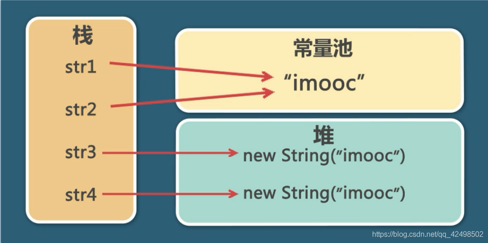

### 关于==和equals方法

Java中判断变量相等一般使用==运算符和equals方法。

其中，关于“= = ” ，当我们使用= =来比较基本数据类型时，比较的是其值，只要他们的值相同，= =就可以返回true。当用==比较引用类型时，比较的是的地址，二者是否引用同一个堆内存空间，如果是，则返回true。即便二引用变量引用的堆内存中的内容完全相同，只要是不同的两个堆内存，也只会返回false。

而equals是Object中的方法，用来比较留个对象是否相等，程序员可以通过覆写该方法，定义自己的对象比较规则。String类已经覆写了该方法，用于比较字符串序列内容是否相等。

如果我们自定义了某个类，且此类需要进行对像是否相同的比较，那我们需要覆写equals方法，定义自己的比较规则，而不能直接调用Object的equals方法。

### StringBuilder

StringBuilder str = new StringBuilder(“你好”);

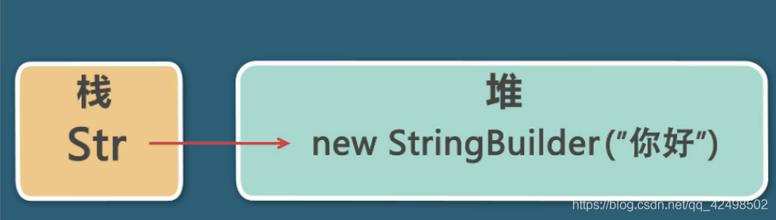

str.append(",");

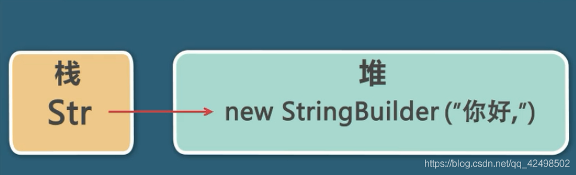

## 各种树

### 二叉树

二叉树：二叉树是每个节点最多有2个子树的一种数据结构。

如下图，就是一个二叉树。

（1）其中25是根节点。
（2）25是15和44的父节点，15和44是25的子节点，15和44是兄弟节点。
（3）红框内的结点是叶子结点（没有子节点的结点叫做叶子结点）。

另外一个需要我们知道的概念是树的深度（高度）。
下面这个二叉树的高度是3。结点27的高度是2，结点25的高度是0。

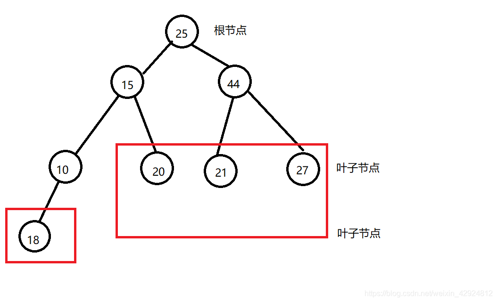

二叉树也有不同的分类。

#### 满二叉树

除最后一层无任何子节点外，每一层上的所有节点都有两个子节点，最后一层都是叶子节点。

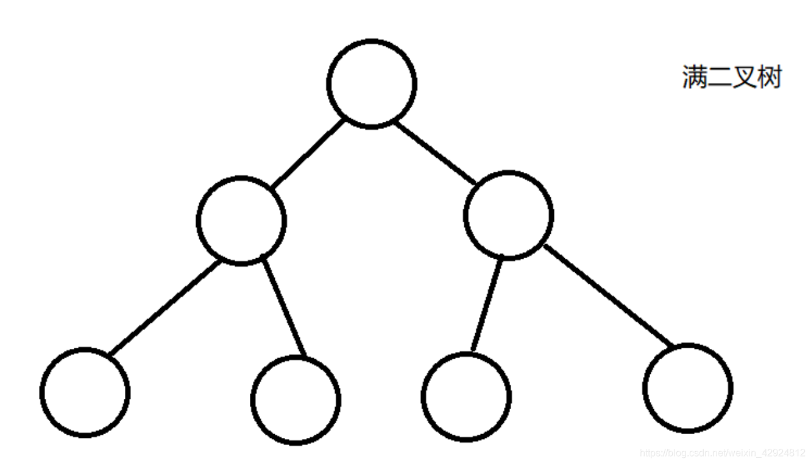

#### 完全二叉树

若设二叉树的深度为h，除第 h 层外，其它各层 (1～h-1) 的结点数都达到最大个数，第 h 层所有的结点都连续集中在最左边，这就是完全二叉树。

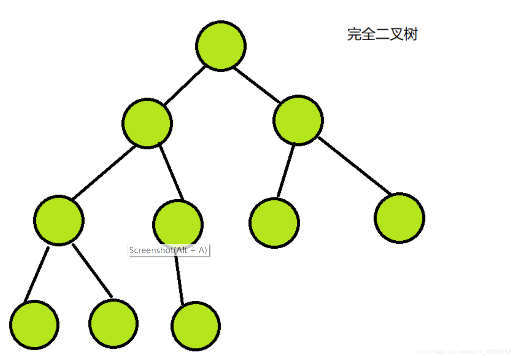

（1）完全二叉树只允许最后一层有空缺结点且空缺在右边，即叶子节点只能在层次最大的两层上出现；
（2）而且对任意一个节点，如果其右子树的深度为j，则其左子树的深度必为j或j+1。 即度为1的点只有1个或0个；
（3）有n个节点的完全二叉树，其深度为：log2的n+1次方；
（4）满二叉树一定是完全二叉树，完全二叉树不一定是满二叉树。

#### 二叉查找树

左子树的键值均小于根的键值，右子树的键值均大于根的键值。

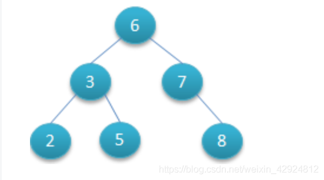

对该二叉树的节点进行查找发现深度为1的节点的查找次数为1，深度为2的查找次数为2，深度为n的节点的查找次数为n，因此其平均查找次数为 (1+2+2+3+3+3) / 6 = 2.3次

二叉查找树可以任意地构造，同样是2,3,5,6,7,8这六个数字，也可以按照下图的方式来构造：

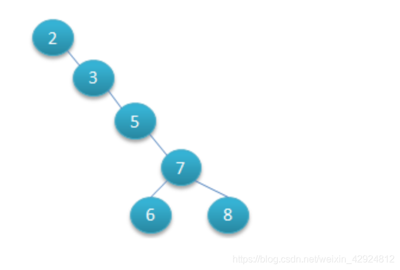

但是这棵二叉树的查询效率就低了。因此若想二叉树的查询效率尽可能高，需要这棵二叉树是平衡的，从而引出新的定义——平衡二叉树，或称AVL树。

#### 平衡二叉树（AVL树）

平衡二叉树（AVL树）在符合二叉查找树的条件下，还满足任何节点的两个子树的高度最大差为1。

下面的两张图片，左边是AVL树，它的任何节点的两个子树的高度差<=1；右边的不是AVL树，其根节点的左子树高度为3，而右子树高度为1；

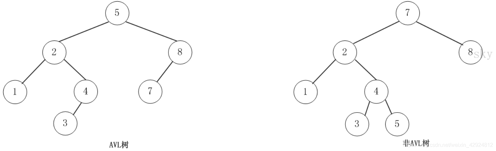

如果在AVL树中进行插入或删除节点，可能导致AVL树失去平衡，这种失去平衡的二叉树可以概括为四种姿态：LL（左左）、RR（右右）、LR（左右）、RL（右左）。它们的示意图如下：

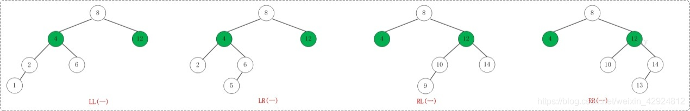

这四种失去平衡的姿态都有各自的定义：

LL：LeftLeft，也称“左左”。插入或删除一个节点后，根节点的左孩子（Left Child）的左孩子（Left Child）还有非空节点，导致根节点的左子树高度比右子树高度高2，AVL树失去平衡。

RR：RightRight，也称“右右”。插入或删除一个节点后，根节点的右孩子（Right Child）的右孩子（Right Child）还有非空节点，导致根节点的右子树高度比左子树高度高2，AVL树失去平衡。

LR：LeftRight，也称“左右”。插入或删除一个节点后，根节点的左孩子（Left Child）的右孩子（Right Child）还有非空节点，导致根节点的左子树高度比右子树高度高2，AVL树失去平衡。

RL：RightLeft，也称“右左”。插入或删除一个节点后，根节点的右孩子（Right Child）的左孩子（Left Child）还有非空节点，导致根节点的右子树高度比左子树高度高2，AVL树失去平衡。

AVL树失去平衡之后，可以通过旋转使其恢复平衡。下面分别介绍四种失去平衡的情况下对应的旋转方法。

**（1）LL的旋转**
LL失去平衡的情况下，可以通过一次旋转让AVL树恢复平衡。步骤如下：

（1）将根节点的左孩子作为新根节点。
（2）将新根节点的右孩子作为原根节点的左孩子。
（3）将原根节点作为新根节点的右孩子。

LL旋转示意图如下：

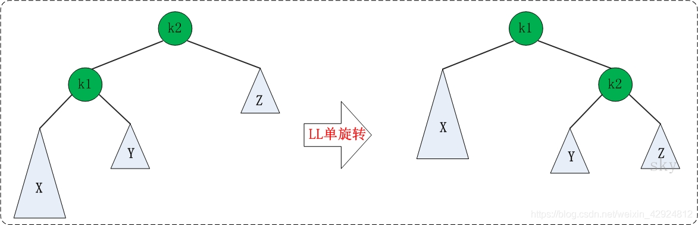

**（2）RR的旋转**
RR失去平衡的情况下，旋转方法与LL旋转对称，步骤如下：

（1）将根节点的右孩子作为新根节点。
（2）将新根节点的左孩子作为原根节点的右孩子。
（3）将原根节点作为新根节点的左孩子。

RR旋转示意图如下：

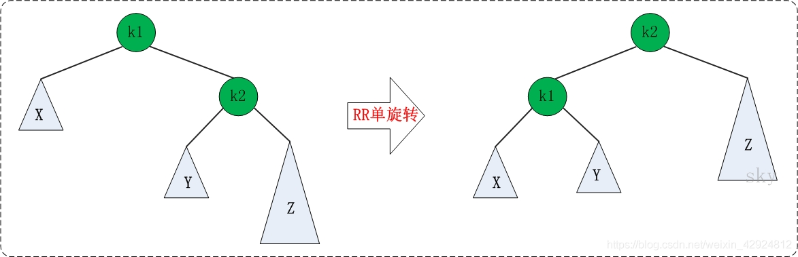

**（3）LR的旋转**
LR失去平衡的情况下，需要进行两次旋转，步骤如下：

（1）围绕根节点的左孩子进行RR旋转。
（2）围绕根节点进行LL旋转。

LR的旋转示意图如下：

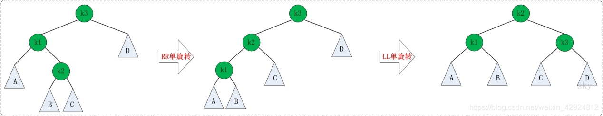

**（4）RL的旋转**
RL失去平衡的情况下也需要进行两次旋转，旋转方法与LR旋转对称，步骤如下：

（1）围绕根节点的右孩子进行LL旋转。
（2）围绕根节点进行RR旋转。

RL的旋转示意图如下：

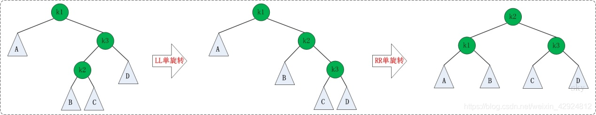

### 红黑树

红黑树就是每个节点都带有颜色属性，颜色或者是红色或者是黑色的平衡二叉查找树。

红黑树的特性：

（1）节点是红色或黑色

（2）根节点一定是黑色

（3）每个叶节点都是黑色的空节点(NIL节点)

（4）每个红节点的两个子节点都是黑色的(从每个叶子到跟的所有路径上不能有两个连续的红节点)(即对于层来说除了NIL节点，红黑节点是交替的，第一层是黑节点那么其下一层肯定都是红节点，反之一样)

（5）从任一节点到其每个叶子节点的所有路径都包含相同数目的黑色节点。

红黑树的例子：
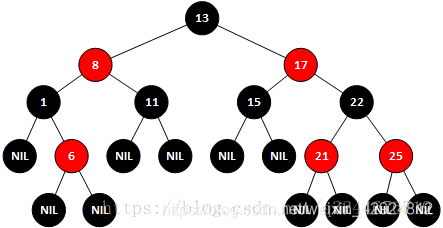

向红黑树中插入节点14(一般默认插入节点是红色的)。

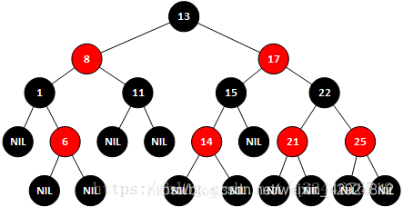

向红黑树中插入节点20(一般默认插入节点是红色的)

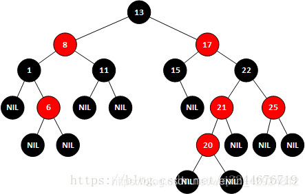

可以看到，插入以后树已经不是一个平衡的二叉树，而且并不满足红黑树的要求，因为20和21均为红色，这种情况下就需要对红黑树进行变色，21需要变为黑色，22就会变成红色，如果22变成红色，则需要17和25都变成黑色。

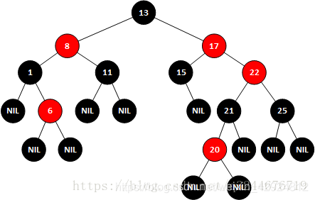

而17变成黑色显然是不成立的，因为如果17变为黑色，那么13就会变为红色，不满足二叉树的规则，因此此处需要进行另一个操作---------左旋操作。

**左旋：**
下图就是一个左旋的例子，一般情况下，如果左子树深度过深，那么便需要进行左旋操作以保证左右子树深度差变小

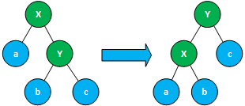

对于上图由于右子树中17变为黑色以后需要把13变成红色，因此进行一次左旋，将17放在根节点，这样既可保证13为红色，左旋后结果：

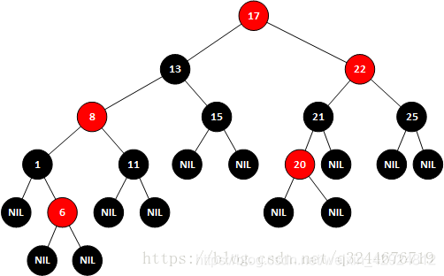

而后根据红黑树的要求进行颜色的修改。

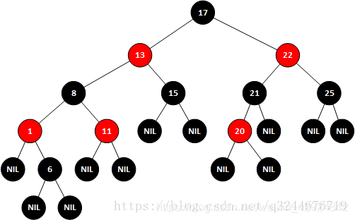

进行左旋后，发现从根节点17，到1左子树的叶子节点经过了两个黑节点，而到6的左叶子节点或者右叶子节点要经历3个黑节点，很显然也不满足红黑树，因此还需要进行下一步操作，需要进行右旋操作。

**右旋：**
与左旋正好相反。

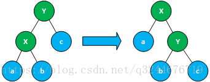

由于是从13节点出现的不平衡，因此对13节点进行右旋，得到结果。

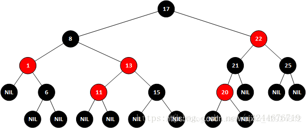

而后再对其节点进行变色，得到结果。

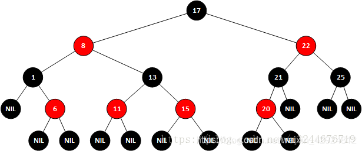

这便是红黑树的一个变换，它主要用途有很多，例如java中的TreeMap以及JDK1.8以后的HashMap在当个节点中链表长度大于8时都会用到。

总结：

（1） 当出现新的节点时默认为红色插入，如果其父节点为红色，则对其递归向上换色，如果根节点由此变为红色，则对根节点进行左旋（右侧过深）或右旋（左侧过深），之后从根节点向下修改颜色.

（2）从根节点检查红色节点是否符合路径上的黑色节点数量一致，如果不一致，对该节点进行左旋（右侧黑色节点数量更多）或右旋（左侧黑色节点数量更多），并变换颜色，重复2操作直到符合红黑树规则。

### B-Tree（平衡多路查找树）

B-Tree是为磁盘等外存储设备设计的一种平衡查找树。因此在讲B-Tree之前先了解下磁盘的相关知识。

系统从磁盘读取数据到内存时是以磁盘块（block）为基本单位的，位于同一个磁盘块中的数据会被一次性读取出来，而不是需要什么取什么。

InnoDB存储引擎中有页（Page）的概念，页是其磁盘管理的最小单位。InnoDB存储引擎中默认每个页的大小为16KB，可通过参数innodb_page_size将页的大小设置为4K、8K、16K，在MySQL中可通过如下命令查看页的大小：

```mysql
mysql> show variables like 'innodb_page_size';
```

而系统一个磁盘块的存储空间往往没有这么大，因此InnoDB每次申请磁盘空间时都会是若干地址连续磁盘块来达到页的大小16KB。InnoDB在把磁盘数据读入到磁盘时会以页为基本单位，在查询数据时如果一个页中的每条数据都能有助于定位数据记录的位置，这将会减少磁盘I/O次数，提高查询效率。

B-Tree结构的数据可以让系统高效的找到数据所在的磁盘块。为了描述B-Tree，首先定义一条记录为一个二元组[key, data] ，key为记录的键值，对应表中的主键值，data为一行记录中除主键外的数据。对于不同的记录，key值互不相同。
**一棵m阶的B-Tree有如下特性：**

1. 每个节点最多有m个孩子。
2. 除了根节点和叶子节点外，其它每个节点至少有Ceil(m/2)个孩子。
3. 若根节点不是叶子节点，则至少有2个孩子
4. 所有叶子节点都在同一层，且不包含其它关键字信息
5. 每个非终端节点包含n个关键字信息（P0,P1,…Pn, k1,…kn）
6. 关键字的个数n满足：ceil(m/2)-1 <= n <= m-1
7. ki(i=1,…n)为关键字，且关键字升序排序。
8. Pi(i=1,…n)为指向子树根节点的指针。P(i-1)指向的子树的所有节点关键字均小于ki，但都大于k(i-1）

B-Tree中的每个节点根据实际情况可以包含大量的关键字信息和分支，如下图所示为一个3阶的B-Tree：

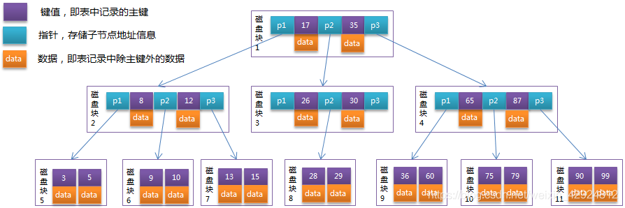

**模拟查找关键字29的过程：**

（1）根据根节点找到磁盘块1，读入内存。【磁盘I/O操作第1次】
（2）比较关键字29在区间（17,35），找到磁盘块1的指针P2。
（3）根据P2指针找到磁盘块3，读入内存。【磁盘I/O操作第2次】
（4）比较关键字29在区间（26,30），找到磁盘块3的指针P2。
（5）根据P2指针找到磁盘块8，读入内存。【磁盘I/O操作第3次】
（6）在磁盘块8中的关键字列表中找到关键字29。

分析上面过程，发现需要3次磁盘I/O操作，和3次内存查找操作。由于内存中的关键字是一个有序表结构，可以利用二分法查找提高效率。而3次磁盘I/O操作是影响整个B-Tree查找效率的决定因素。B-Tree相对于平衡二叉树缩减了节点个数，使每次磁盘I/O取到内存的数据都发挥了作用，从而提高了查询效率。

### B+Tree

B+Tree是在B-Tree基础上的一种优化，使其更适合实现外存储索引结构，InnoDB存储引擎就是用B+Tree实现其索引结构。

从上一节中的B-Tree结构图中可以看到每个节点中不仅包含数据的key值，还有data值。而每一个页的存储空间是有限的，如果data数据较大时将会导致每个节点（即一个页）能存储的key的数量很小，当存储的数据量很大时同样会导致B-Tree的深度较大，增大查询时的磁盘I/O次数，进而影响查询效率。在B+Tree中，所有数据记录节点都是按照键值大小顺序存放在同一层的叶子节点上，而非叶子节点上只存储key值信息，这样可以大大加大每个节点存储的key值数量，降低B+Tree的高度。
**B+Tree相对于B-Tree有几点不同：**

（1）非叶子节点只存储键值信息。
（2）所有叶子节点之间都有一个链指针。
（3）数据记录都存放在叶子节点中。

将上一节中的B-Tree优化，由于B+Tree的非叶子节点只存储键值信息，假设每个磁盘块能存储4个键值及指针信息，则变成B+Tree后其结构如下图所示：

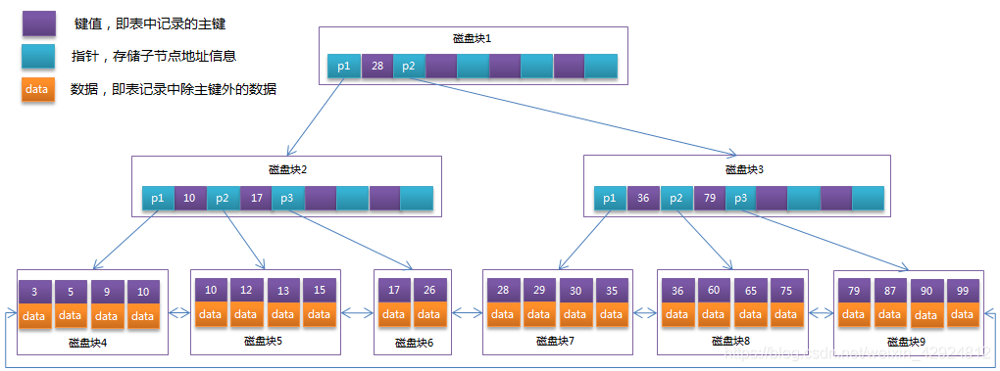

通常在B+Tree上有两个头指针，一个指向根节点，另一个指向关键字最小的叶子节点，而且所有叶子节点（即数据节点）之间是一种链式环结构。因此可以对B+Tree进行两种查找运算：一种是对于主键的范围查找和分页查找，另一种是从根节点开始，进行随机查找。

可能上面例子中只有22条数据记录，看不出B+Tree的优点，下面做一个推算：

InnoDB存储引擎中页的大小为16KB，一般表的主键类型为INT（占用4个字节）或BIGINT（占用8个字节），指针类型也一般为4或8个字节，也就是说一个页（B+Tree中的一个节点）中大概存储16KB/(8B+8B)=1K个键值（因为是估值，为方便计算，这里的K取值为〖10〗^ 3）。也就是说一个深度为3的B+Tree索引可以维护10^3 * 10^3 * 10^3 = 10亿 条记录。

实际情况中每个节点可能不能填充满，因此在数据库中，B+Tree的高度一般都在2~ 4层。MySQL的InnoDB存储引擎在设计时是将根节点常驻内存的，也就是说查找某一键值的行记录时最多只需要1~3次磁盘I/O操作。

数据库中的B+Tree索引可以分为聚集索引（clustered index）和辅助索引（secondary index）。上面的B+Tree示例图在数据库中的实现即为聚集索引，聚集索引的B+Tree中的叶子节点存放的是整张表的行记录数据。辅助索引与聚集索引的区别在于辅助索引的叶子节点并不包含行记录的全部数据，而是存储相应行数据的聚集索引键，即主键。当通过辅助索引来查询数据时，InnoDB存储引擎会遍历辅助索引找到主键，然后再通过主键在聚集索引中找到完整的行记录数据。

**本文参考链接：**

[MySQL索引原理](https://blog.csdn.net/u013235478/article/details/50625677?utm_medium=distribute.pc_relevant.none-task-blog-BlogCommendFromMachineLearnPai2-19&depth_1-utm_source=distribute.pc_relevant.none-task-blog-BlogCommendFromMachineLearnPai2-19)

[JAVA中的树(二叉树AND红黑树)](https://blog.csdn.net/yinlidong77/article/details/90346120)

[MySQL索引底层实现原理](https://www.cnblogs.com/boothsun/p/8970952.html)

[红黑树](https://blog.csdn.net/q3244676719/article/details/81540830)

### 为什么会有B+-树这种东西存在

红黑树等数据结构也可以用来实现索引，但是文件系统以及数据库系统普遍采用B树或者B+树，这一节将结合计算机组成原理相关知识讨论B-/+Tree作为索引的理论基础。

一般来说，索引本身也很大，不可能全部存储在内存中，因此索引往往以索引文件的形式存储在磁盘上。这样的话，索引查找过程中就要产生磁盘I/O消耗，相对于内存存取，I/O存取的消耗要高几个数量级，所以评价一个数据结构作为索引的优劣最重要的指标就是在查找过程中磁盘I/O操作次数的渐进复杂度。换句话说，索引的结构组织要尽量减少查找过程中磁盘I/O的存取次数。下面先介绍内存和磁盘存取原理，然后再结合这些原理分析B-/+Tree作为索引的效率。

#### 主存存取原理

目前计算机使用的主存基本都是随机读写存储器（RAM），现代RAM的结构和存取原理比较复杂，这里本文抛却具体差别，抽象出一个十分简单的存取模型来说明RAM的工作原理。

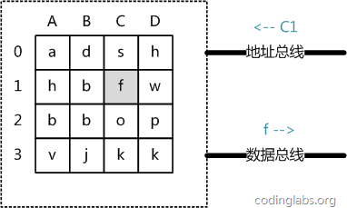

从抽象角度看，主存是一系列的存储单元组成的矩阵，每个存储单元存储固定大小的数据。每个存储单元有唯一的地址，现代主存的编址规则比较复杂，这里将其简化成一个二维地址：通过一个行地址和一个列地址可以唯一定位到一个存储单元。上图展示了一个4 x 4的主存模型。

**主存的存取过程如下：**

当系统需要读取主存时，则将地址信号放到地址总线上传给主存，主存读到地址信号后，解析信号并定位到指定存储单元，然后将此存储单元数据放到数据总线上，供其它部件读取。

写主存的过程类似，系统将要写入单元地址和数据分别放在地址总线和数据总线上，主存读取两个总线的内容，做相应的写操作。

这里可以看出，主存存取的时间仅与存取次数呈线性关系，因为不存在机械操作，两次存取的数据的“距离”不会对时间有任何影响，例如，先取A0再取A1和先取A0再取D3的时间消耗是一样的。

#### 磁盘存取原理

上文说过，索引一般以文件形式存储在磁盘上，索引检索需要磁盘I/O操作。与主存不同，磁盘I/O存在机械运动耗费，因此磁盘I/O的时间消耗是巨大的。

下图是磁盘的整体结构示意图：

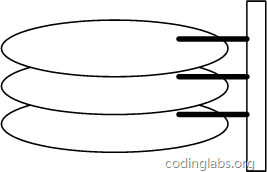

一个磁盘由大小相同且同轴的圆形盘片组成，磁盘可以转动（各个磁盘必须同步转动）。在磁盘的一侧有磁头支架，磁头支架固定了一组磁头，每个磁头负责存取一个磁盘的内容。磁头不能转动，但是可以沿磁盘半径方向运动（实际是斜切向运动），每个磁头同一时刻也必须是同轴的，即从正上方向下看，所有磁头任何时候都是重叠的（不过目前已经有多磁头独立技术，可不受此限制）。

下图是磁盘结构的示意图：

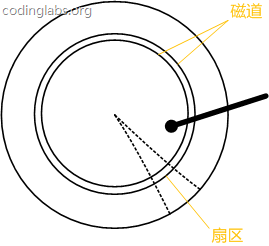

盘片被划分成一系列同心环，圆心是盘片中心，每个同心环叫做一个磁道，所有半径相同的磁道组成一个柱面。磁道被沿半径线划分成一个个小的段，每个段叫做一个扇区，每个扇区是磁盘的最小存储单元。为了简单起见，我们下面假设磁盘只有一个盘片和一个磁头。

当需要从磁盘读取数据时，系统会将数据逻辑地址传给磁盘，磁盘的控制电路按照寻址逻辑将逻辑地址翻译成物理地址，即确定要读的数据在哪个磁道，哪个扇区。为了读取这个扇区的数据，需要将磁头放到这个扇区上方，为了实现这一点，磁头需要移动对准相应磁道，这个过程叫做寻道，所耗费时间叫做寻道时间，然后磁盘旋转将目标扇区旋转到磁头下，这个过程耗费的时间叫做旋转时间。


#### 局部性原理与磁盘预读

由于存储介质的特性，磁盘本身存取就比主存慢很多，再加上机械运动耗费，磁盘的存取速度往往是主存的几百分分之一，因此为了提高效率，要尽量减少磁盘I/O。为了达到这个目的，磁盘往往不是严格按需读取，而是每次都会预读，即使只需要一个字节，磁盘也会从这个位置开始，顺序向后读取一定长度的数据放入内存。这样做的理论依据是计算机科学中著名的局部性原理：

**当一个数据被用到时，其附近的数据也通常会马上被使用。**

所以，程序运行期间所需要的数据通常应当比较集中。

由于磁盘顺序读取的效率很高（不需要寻道时间，只需很少的旋转时间），因此对于具有局部性的程序来说，预读可以提高I/O效率。

预读的长度一般为页（page）的整倍数。页是计算机管理存储器的逻辑块，硬件及操作系统往往将主存和磁盘存储区分割为连续的大小相等的块，每个存储块称为一页（在许多操作系统中，页得大小通常为4k），主存和磁盘以页为单位交换数据。当程序要读取的数据不在主存中时，会触发一个缺页异常，此时系统会向磁盘发出读盘信号，磁盘会找到数据的起始位置并向后连续读取一页或几页载入内存中，然后异常返回，程序继续运行。

#### B-/+Tree索引的性能分析

到这里终于可以分析B-/+Tree索引的性能了。

上文说过一般使用磁盘I/O次数评价索引结构的优劣。先从B-Tree分析，根据B-Tree的定义，可知检索一次最多需要访问h个节点。数据库系统的设计者巧妙利用了磁盘预读原理，将一个节点的大小设为等于一个页，这样每个节点只需要一次I/O就可以完全载入。为了达到这个目的，在实际实现B-Tree还需要使用如下技巧：

每次新建节点时，直接申请一个页的空间，这样就保证一个节点物理上也存储在一个页里，加之计算机存储分配都是按页对齐的，就实现了一个node只需一次I/O。

B-Tree中一次检索最多需要h-1次I/O（根节点常驻内存），渐进复杂度为O(h)=O(logdN)O(h)=O(logdN)。一般实际应用中，出度d是非常大的数字，通常超过100，因此h非常小（通常不超过3）。（h表示树的高度 & 出度d表示的是树的度，即树中各个节点的度的最大值）

综上所述，用B-Tree作为索引结构效率是非常高的。

而红黑树这种结构，h明显要深的多。由于逻辑上很近的节点（父子）物理上可能很远，无法利用局部性，所以红黑树的I/O渐进复杂度也为O(h)，效率明显比B-Tree差很多。

上文还说过，B+Tree更适合外存索引，原因和内节点出度d有关。从上面分析可以看到，d越大索引的性能越好，而出度的上限取决于节点内key和data的大小：
$$
dmax=floor(pagesize/(keysize+datasize+pointsize))dmax=floor(pagesize/(keysize+datasize+pointsize))
$$
floor表示向下取整。由于B+Tree内节点去掉了data域，因此可以拥有更大的出度，拥有更好的性能。

