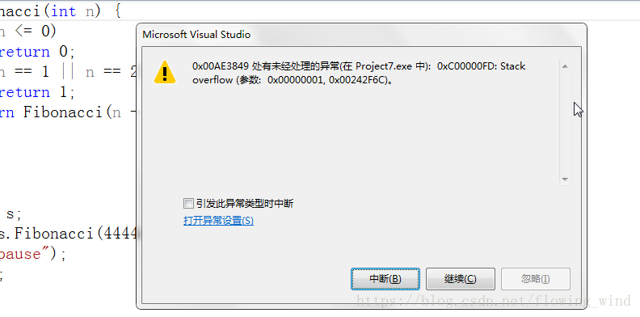
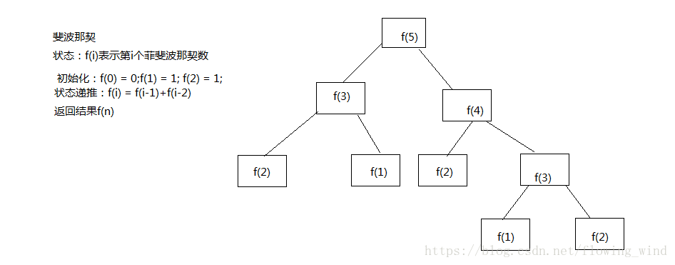
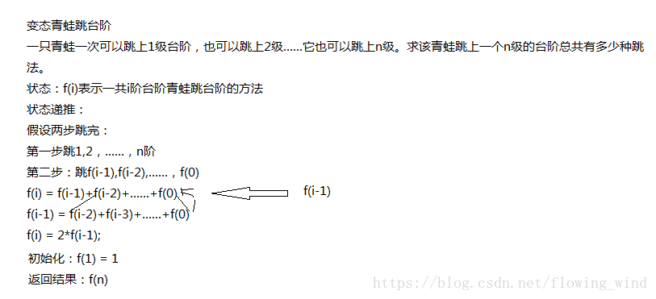
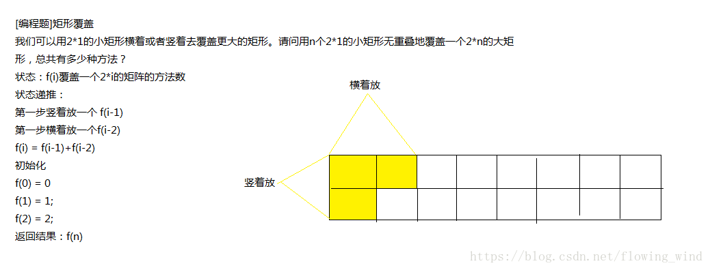
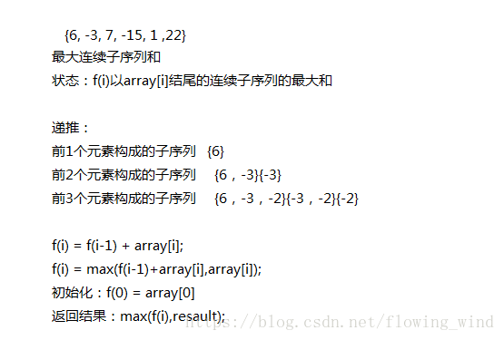
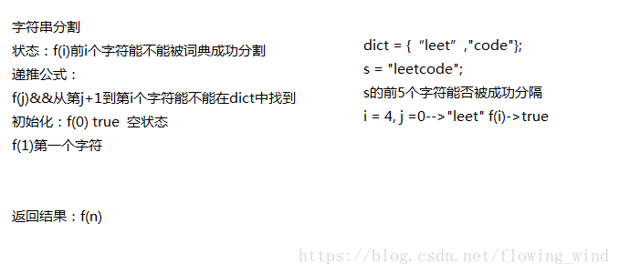
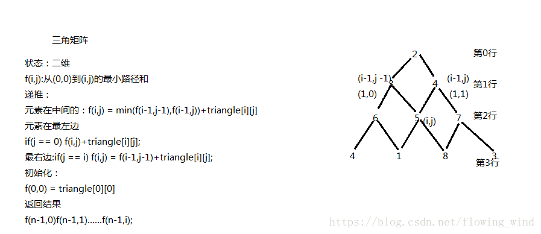

# 动态规划

首先学习动态规划，我们的先知道什么是动态规划？
算法导论这本书是这样介绍这个算法的，动态规划与分治方法类似，都是通过组合子问题的解来来求解原问题的。再来了解一下什么是分治方法，以及这两者之间的差别，分治方法将问题划分为互不相交的子问题，递归的求解子问题，再将它们的解组合起来，求出原问题的解。而动态规划与之相反，动态规划应用与子问题重叠的情况，即不同的子问题具有公共的子子问题（子问题的求解是递归进行的，将其划分为更小的子子问题）。在这种情况下，分治方法会做许多不必要的工作，他会反复求解那些公共子子问题。而动态规划对于每一个子子问题只求解一次，将其解保存在一个表格里面，从而无需每次求解一个子子问题时都重新计算，避免了不必要的计算工作。
  动态规划的应用场景：
动态规划方法一般用来求解最优化问题。这类问题可以有很多可行解，每个解都有一个值，我们希望找到具有最优值的解，我们称这样的解为问题的一个最优解，而不是最优解，因为可能有多个解都达到最优值。
   我们解决动态规划问题一般分为四步：
1、定义一个状态，这是一个最优解的结构特征
2、进行状态递推，得到递推公式
3、进行初始化
4、返回结果
下面我们通过几个例子来演示一下这个过程：

[编程题]斐波那契数列
热度指数：374145时间限制：1秒空间限制：32768K
算法知识视频讲解
大家都知道斐波那契数列，现在要求输入一个整数n，请你输出斐波那契数列的第n项（从0开始，第0项为0）。
n<=39
这个题目相信大家都很熟悉：
在我们学习递归的时候应该都见过：我们先写一个递归版本的。
代码如下：

```python
class Solution {
public:
    int Fibonacci(int n) {
        if(n<=0)
            return 0;
        if(n == 1 || n == 2)
            return 1;
        return Fibonacci(n-1)+Fibonacci(n-2);
    }
};
```

这个代码的时间复杂度是2^n，也就是指数递增，我们经过测试当求一个很大数字的时候，运行就会出错，我们来看一下：


没错就是栈溢出：
下来我们用动态规划来求解一下这个问题：
先看按照动态规划步骤的简单分析：



代码如下：

```python
class Solution {
public:
	int Fibonacci(int n) {
		 //先申请一个空间来保存解
		vector<int> f(n + 1, 0);
		//初始化
		f[0] = 0;
		
		if (n <= 0)
			return f[0];
		f[1] = 1;
		if (n == 1)
			return f[1];
		f[2] = 1;
		//状态递推
		for (int i = 3; i <= n; i++)
		{
			f[i] = f[i - 1] + f[i - 2];
		}
		//返回结果
		return f[n];
	}
};
```

可以对这个代码进行优化，将空间复杂度变为O（1）
代码如下：

```python
class Solution {
public:
	
	int Fibonacci(int n) {
		if (n <= 0)
			return 0;
        if(n == 1 || n == 2)
            return 1;
		//初始化
		int fn1 = 0;
		int fn2 = 1;
		int result = 0;
		for (int i = 2; i <= n; i++)
		{
		//递推公式
			result = fn1 + fn2;
			fn1 = fn2;
			fn2 = result;
		}
		//返回结果
		return result;
	}
};
```

[编程题]变态跳台阶
热度指数：221924时间限制：1秒空间限制：32768K
算法知识视频讲解
一只青蛙一次可以跳上1级台阶，也可以跳上2级……它也可以跳上n级。求该青蛙跳上一个n级的台阶总共有多少种跳法。
先来看简单分析：


代码如下：

```python
class Solution {
public:
	int jumpFloorII(int number) {
		if (number <= 0)
			return 0;
		//初始化
		int total = 1;
		for (int i = 1; i < number; i++)
		{
			//递推
			total = 2 * total;
		}
		//返回结果
		return total;
	}
};
```

[编程题]矩形覆盖
热度指数：197771时间限制：1秒空间限制：32768K
算法知识视频讲解
我们可以用2*1的小矩形横着或者竖着去覆盖更大的矩形。请问用n个2*1的小矩形无重叠地覆盖一个2*n的大矩形，总共有多少种方法？
首先来看分析：

代码如下：

```python
class Solution {
public:
	int rectCover(int number) {
		if (number <= 0)
			return 0;
		if (number == 1)
			return 1;
		if (number == 2)
			return 2;
		vector<int> f(number + 1, 0);
        //初始化
		f[0] = 0;
		f[1] = 1;
		f[2] = 2;
		for (int i = 3; i <= number; i++)
		{
            //状态递推
			f[i] = f[i - 1] + f[i - 2];
		}
        //返回结果
		return f[number];
	}
};
```

[编程题]最大连续数列和
热度指数：5518时间限制：3秒空间限制：32768K
算法知识视频讲解
对于一个有正有负的整数数组，请找出总和最大的连续数列。

给定一个int数组A和数组大小n，请返回最大的连续数列的和。保证n的大小小于等于3000。

测试样例：
[1,2,3,-6,1]
返回：6
分析：


代码如下：

```python
class MaxSum {
public:
	int getMaxSum(vector<int> A, int n) {
		// write code here
		if (A.empty())
			return 0;
		vector<int> f(A.size(), 0);
		//初始化
		f[0] = A[0];
		for (int i = 1; i < A.size(); i++)
		{
			//状态递推
			f[i] = max(f[i - 1] + A[i], A[i]);
		}
		//输出结果
		int result = A[0];
		for (int i = 0; i < A.size(); i++)
		{
			result = max(f[i], result);
		}
		return result;
	}
};
```

[编程题]word-break
热度指数：26243时间限制：1秒空间限制：32768K
算法知识视频讲解

Given a string s and a dictionary of words dict, determine if s can be segmented into a space-separated sequence of one or more dictionary words.

For example, given
s =“leetcode”,
dict =[“leet”, “code”].

Return true because"leetcode"can be segmented as"leet code".
来自leetcode,中文题目：
给定字符串s和单词词典.，确定s是否可以分割为一个或多个字典单词的空分序列。
例如，给定
s =“leetcode”,
dict =[“leet”, “code”].
返回true，因为“leetcode”可以被分割为“leet code”。
分析：

代码如下：

```python
class Solution {
public:
	bool wordBreak(string s, unordered_set<string> &dict) {
		if (s.empty() || dict.empty())
			return false;
		int n = s.size();
		vector<bool> can_break(n + 1, false);
		//初始化
		can_break[0] = true;
		//递推
		for (int i = 1; i <= n; i++)
		for (int j = 0; j < i; j++)
		{
			if (can_break[j] && dict.find(s.substr(j,i-j)) != dict.end())
			{
				can_break[i] = true;
				break;
			}
		}
		return can_break[n];
	}
};
```

[编程题]triangle
热度指数：11822时间限制：1秒空间限制：32768K
算法知识视频讲解

Given a triangle, find the minimum path sum from top to bottom. Each step you may move to adjacent numbers on the row below.

For example, given the following triangle

[
[2],
[3,4],
[6,5,7],
[4,1,8,3]
]

The minimum path sum from top to bottom is11(i.e., 2 + 3 + 5 + 1 = 11).

Note:
Bonus point if you are able to do this using only O(n) extra space, where n is the total number of rows in the triangle.

中文题目：
给定一个三角形，从上到下求最小路径和。每一步你可以移动到下面行的相邻数字。
例如，给定以下三角形
[
〔2〕；
[3,4]，
[6]，[5]，[7]
[41,1,3]
]
从上到下的最小路径和是11（即2＋3＋5＋1＝11）。
注：
如果你只能使用O（n）额外的空间来做这一点，其中n是三角形中的总行数。
分析：


代码如下：

```python
class Solution {
public:
	int minimumTotal(vector<vector<int> > &triangle) {
		if (triangle.empty())
			return 0;
		vector<vector<int>>  min_sum(triangle);
		//初始化
		min_sum[0][0] = triangle[0][0];
		//递推
		for (int i = 1; i < triangle.size(); i++)
		{
			for (int j = 0; j <= i; j++)
			{
				//左边界
				if (j == 0)
				{
					min_sum[i][j] = min_sum[i - 1][j] + triangle[i][j];
				}
				//右边界
				else if (j == i)
				{
					min_sum[i][j] = min_sum[i - 1][j - 1] + triangle[i][j];
				}
				//中间
				else
				{
					min_sum[i][j] = min(min_sum[i - 1][j - 1], min_sum[i - 1][j]);
					min_sum[i][j] = min_sum[i][j] + triangle[i][j];
				}
			}
		}
		int line = triangle.size();
		int result = min_sum[line - 1][0];
		for (int i = 1; i < line; i++)
		{
			result = min(result, min_sum[line - 1][i]);
		}
		//返回结果
		return result;
	}
};
```

