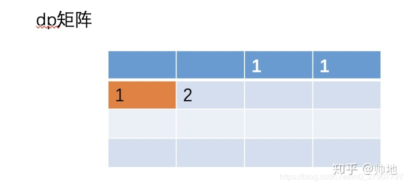

# 动态规划原理

## 0. 

　　很有意思的问题。以往见过许多教材，对动态规划（DP）的引入属于“奉天承运，皇帝诏曰”式：不给出一点引入，见面即拿出一大堆公式吓人；学生则死啃书本，然后突然顿悟。针对入门者的教材不应该是这样的。恰好我给入门者讲过四次DP入门，迭代出了一套比较靠谱的教学方法，所以今天跑过来献丑。

　　现在，我们试着自己来一步步“重新发明”DP。

## 1. 从一个生活问题谈起

　　先来看看生活中经常遇到的事吧——假设您是个土豪，身上带了足够的1、5、10、20、50、100元面值的钞票。现在您的目标是凑出某个金额w，**需要用到尽量少的钞票。**

　　依据生活经验，我们显然可以采取这样的策略：能用100的就尽量用100的，否则尽量用50的……依次类推。在这种策略下，666=6×100+1×50+1×10+1×5+1×1，共使用了10张钞票。

　　这种策略称为“**贪心**”：假设我们面对的局面是“需要凑出w”，**贪心策略会尽快让w变得更小**。能让w少100就尽量让它少100，这样我们接下来面对的局面就是凑出w-100。长期的生活经验表明，贪心策略是正确的。

　　但是，如果我们换一组钞票的面值，贪心策略就也许不成立了。如果一个奇葩国家的钞票面额分别是1、5、11，那么我们在凑出15的时候，贪心策略会出错：
　　15=1×11+4×1 （贪心策略使用了5张钞票）
　　15=3×5 （正确的策略，只用3张钞票）
　　为什么会这样呢？贪心策略错在了哪里？

　　**鼠目寸光。**
　　刚刚已经说过，贪心策略的纲领是：“尽量使接下来面对的w更小”。这样，贪心策略在w=15的局面时，会优先使用11来把w降到4；但是在这个问题中，凑出4的代价是很高的，必须使用4×1。如果使用了5，w会降为10，虽然没有4那么小，但是凑出10只需要两张5元。
　　在这里我们发现，贪心是一种**只考虑眼前情况**的策略。

　　那么，现在我们怎样才能避免鼠目寸光呢？

　　如果直接暴力枚举凑出w的方案，明显复杂度过高。太多种方法可以凑出w了，枚举它们的时间是不可承受的。我们现在来尝试找一下性质。


　　重新分析刚刚的例子。w=15时，我们如果取11，接下来就面对w=4的情况；如果取5，则接下来面对w=10的情况。我们发现这些问题都有相同的形式：“给定w，凑出w所用的最少钞票是多少张？”接下来，我们用f(n)来表示“凑出n所需的最少钞票数量”。

　　那么，如果我们取了11，最后的代价（用掉的钞票总数）是多少呢？
　　明显 ，它的意义是：利用11来凑出15，付出的代价等于f(4)加上自己这一张钞票。现在我们暂时不管f(4)怎么求出来。
　　依次类推，马上可以知道：如果我们用5来凑出15，cost就是 。

　　那么，现在w=15的时候，我们该取那种钞票呢？**当然是各种方案中，cost值最低的那一个**！

　　- 取11：
　　- 取5： 
　　- 取1： 

　　显而易见，cost值最低的是取5的方案。**我们通过上面三个式子，做出了正确的决策**！

　　这给了我们一个**至关重要**的启示—— ![[公式]](https://www.zhihu.com/equation?tex=f%28n%29) 只与  相关；更确切地说：


　　这个式子是非常激动人心的。我们要求出f(n)，只需要求出几个更小的[f值](https://www.zhihu.com/search?q=f值&search_source=Entity&hybrid_search_source=Entity&hybrid_search_extra={"sourceType"%3A"answer"%2C"sourceId"%3A613096905})；既然如此，我们从小到大把所有的f(i)求出来不就好了？注意一下边界情况即可。代码如下：


　　我们以 ![[公式]](https://www.zhihu.com/equation?tex=O%28n%29) 的复杂度解决了这个问题。现在回过头来，我们看看它的原理：

　　- ![[公式]](https://www.zhihu.com/equation?tex=f%28n%29) 只与的**值**相关。
　　- 我们只关心  的**值**，不关心是怎么凑出w的。

　　这两个事实，保证了我们做法的正确性。它比起贪心策略，会分别算出取1、5、11的代价，从而做出一个正确决策，这样就避免掉了“鼠目寸光”！

　　它与暴力的区别在哪里？我们的暴力枚举了“使用的硬币”，然而这属于冗余信息。我们要的是答案，根本不关心这个答案是怎么凑出来的。譬如，要求出f(15)，只需要知道f(14),f(10),f(4)的值。**其他信息并不需要。**我们舍弃了冗余信息。我们只记录了对解决问题有帮助的信息——f(n).

　　我们能这样干，取决于问题的性质：求出f(n)，只需要知道几个更小的f(c)。**我们将求解f(c)称作求解f(n)的“子问题”。**


　　**这就是DP**（动态规划，dynamic programming）.

　　**将一个问题拆成几个子问题，分别求解这些子问题，即可推断出大问题的解**。

> 思考题：请稍微修改代码，输出我们凑出w的**方案**。

## 2. 几个简单的概念

【[无后效性](https://www.zhihu.com/search?q=无后效性&search_source=Entity&hybrid_search_source=Entity&hybrid_search_extra={"sourceType"%3A"answer"%2C"sourceId"%3A613096905})】

　　一旦f(n)确定，“我们如何凑出f(n)”就再也用不着了。

　　要求出f(15)，只需要知道f(14),f(10),f(4)的值，而f(14),f(10),f(4)是如何算出来的，对之后的问题没有影响。

　　**“未来与过去无关”，**这就是**无后效性**。

　　（严格定义：如果给定某一阶段的状态，则在这一阶段以后过程的发展不受这阶段以前各段状态的影响。）


【最优子结构】

　　回顾我们对f(n)的定义：我们记“凑出n所需的**最少**钞票数量”为f(n).

　　f(n)的定义就已经蕴含了“最优”。利用w=14,10,4的**最优**解，我们即可算出w=15的**最优**解。

　　大问题的**最优解**可以由小问题的**最优解**推出，这个性质叫做“最优子结构性质”。


　　引入这两个概念之后，我们如何判断一个问题能否使用DP解决呢？


　　**能将大问题拆成几个小问题，且满足无后效性、最优子结构性质。**

## **3. DP的典型应用：DAG[最短路](https://www.zhihu.com/search?q=最短路&search_source=Entity&hybrid_search_source=Entity&hybrid_search_extra={"sourceType"%3A"answer"%2C"sourceId"%3A613096905})**

　　问题很简单：给定一个城市的地图，所有的道路都是单行道，而且不会构成环。每条道路都有过路费，问您从S点到T点花费的最少费用。

一张地图。边上的数字表示过路费。

　　这个问题能用DP解决吗？我们先试着记从S到P的最少费用为f(P).
　　想要到T，要么经过C，要么经过D。从而.

　　好像看起来可以DP。现在我们检验刚刚那两个性质：
　　- 无后效性：对于点P，一旦f(P)确定，以后就只关心f(P)的值，不关心怎么去的。
　　- 最优子结构：对于P，我们当然只关心到P的最小费用，即f(P)。如果我们从S走到T是 ，那肯定S走到Q的最优路径是  。对一条最优的路径而言，从S走到**沿途上所有的点（子问题)**的最优路径，都是这条大路的一部分。这个问题的最优子结构性质是显然的。

　　既然这两个性质都满足，那么本题可以DP。式子明显为：


　　其中R为有路通到P的所有的点，  为R到P的过路费。

　　代码实现也很简单，拓扑排序即可。

## 4. 对DP原理的一点讨论

【DP的核心思想】

　　DP为什么会快？
　　无论是DP还是暴力，我们的算法都是在**可能解空间**内，寻找**最优解**。

　　来看钞票问题。暴力做法是枚举所有的可能解，这是最大的可能解空间。
　　DP是枚举**有希望成为答案的解**。这个空间比暴力的小得多。

　　也就是说：DP自带剪枝。

　　DP舍弃了一大堆不可能成为最优解的答案。譬如：
　　15 = 5+5+5 被考虑了。
　　15 = 5+5+1+1+1+1+1 从来没有考虑过，因为这不可能成为最优解。

　　从而我们可以得到DP的核心思想：**尽量缩小可能解空间。**

　　在暴力算法中，可能解空间往往是指数级的大小；如果我们采用DP，那么有可能把解空间的大小降到多项式级。

　　一般来说，解空间越小，寻找解就越快。这样就完成了优化。


【DP的操作过程】

　　一言以蔽之：**大事化小，小事化了。**

　　将一个大问题转化成几个小问题；
　　求解小问题；
　　推出大问题的解。

【如何设计DP算法】

　　下面介绍比较通用的设计DP算法的步骤。

　　首先，把我们面对的**局面**表示为x。这一步称为**设计状态**。
　　对于状态x，记我们要求出的答案(e.g. 最小费用)为f(x).我们的目标是求出f(T).
**找出f(x)与哪些局面有关（记为p）**，写出一个式子（称为**状态转移方程**），通过f(p)来推出f(x).

【DP三连】

　　设计DP算法，往往可以遵循DP三连：

　　我是谁？ ——设计状态，表示局面
　　我从哪里来？
　　我要到哪里去？ ——设计转移

　　设计状态是DP的基础。接下来的设计转移，有两种方式：一种是考虑我从哪里来（本文之前提到的两个例子，都是在考虑“我从哪里来”）；另一种是考虑我到哪里去，这常见于求出f(x)之后，**更新能从x走到的一些解**。这种DP也是不少的，我们以后会遇到。

　　总而言之，“我从哪里来”和“我要到哪里去”只需要考虑清楚其中一个，就能设计出状态转移方程，从而写代码求解问题。前者又称pull型的转移，后者又称push型的转移。（这两个词是 

[@阮止雨](http://www.zhihu.com/people/31585b1079521ef37391925a95a5d4ba)

妹妹告诉我的，不知道源出处在哪）


> 思考题：如何把钞票问题的代码改写成“我到哪里去”的形式？
> 提示：求出f(x)之后，更新f(x+1),f(x+5),f(x+11).

## 5. 例题：最长上升子序列

　　扯了这么多形而上的内容，还是做一道例题吧。

　　最长上升子序列（LIS）问题：给定长度为n的序列a，从a中抽取出一个子序列，这个子序列需要单调递增。问最长的上升子序列（LIS）的长度。
　　e.g. 1,5,3,4,6,9,7,8的LIS为1,3,4,6,7,8，长度为6。


　　如何设计状态（我是谁）？

　　我们记 ![[公式]](https://www.zhihu.com/equation?tex=f%28x%29) 为以 ![[公式]](https://www.zhihu.com/equation?tex=a_x) 结尾的LIS长度，那么答案就是  .


　　状态x从哪里推过来（我从哪里来）？

　　考虑比x小的每一个p：如果  ，那么f(x)可以取f(p)+1.
　　解释：我们把 ![[公式]](https://www.zhihu.com/equation?tex=a_x) 接在 ![[公式]](https://www.zhihu.com/equation?tex=a_p) 的后面，肯定能构造一个以 ![[公式]](https://www.zhihu.com/equation?tex=a_x) 结尾的上升子序列，长度比以 ![[公式]](https://www.zhihu.com/equation?tex=a_p) 结尾的LIS大1.那么，我们可以写出状态转移方程了：


　　至此解决问题。两层for循环，复杂度 ![[公式]](https://www.zhihu.com/equation?tex=O%28n%5E2%29) .


　　从这三个例题中可以看出，DP是一种思想，一种“大事化小，小事化了”的思想。带着这种思想，DP将会成为我们解决问题的利器。

　　最后，我们一起念一遍DP三连吧——我是谁？我从哪里来？我要到哪里去？

### 二、案例详解

### 案例一、简单的一维 DP

> 问题描述：一只青蛙一次可以跳上1级台阶，也可以跳上2级。求该青蛙跳上一个n级的台阶总共有多少种跳法。

### (1)、定义数组元素的含义

按我上面的步骤说的，首先我们来定义 dp[i] 的含义，我们的问题是要求青蛙跳上 n 级的台阶总共由多少种跳法，那我们就定义 dp[i] 的含义为：**跳上一个 i 级的台阶总共有 dp[i] 种跳法**。这样，如果我们能够算出 dp[n]，不就是我们要求的答案吗？所以第一步定义完成。

### （2）、找出数组元素间的关系式

我们的目的是要求 dp[n]，动态规划的题，如你们经常听说的那样，就是把一个**规模**比较大的问题分成几个**规模**比较小的问题，然后由小的问题推导出大的问题。也就是说，dp[n] 的规模为 n，比它规模小的是 n-1, n-2, n-3.... 也就是说，dp[n] 一定会和 dp[n-1], dp[n-2]....存在某种关系的。我们要找出他们的关系。

**那么问题来了，怎么找？**

这个怎么找，**是最核心最难的一个**，我们必须回到问题本身来了，来寻找他们的关系式，dp[n] 究竟会等于什么呢？

对于这道题，由于情况可以选择跳一级，也可以选择跳两级，所以青蛙到达第 n 级的台阶有两种方式

一种是从第 n-1 级跳上来

一种是从第 n-2 级跳上来

由于我们是要算**所有可能的跳法的**，所以有 dp[n] = dp[n-1] + dp[n-2]。

### （3）、找出初始条件

当 n = 1 时，dp[1] = dp[0] + dp[-1]，而我们是数组是不允许下标为负数的，所以对于 dp[1]，我们必须要**直接给出它的数值**，相当于初始值，显然，dp[1] = 1。一样，dp[0] = 0（0 个台阶，有人说是0种跳法，有人说是1种，我们暂时当作0种处理吧，不过无论哪种，都不影响问题都思路哈）。于是得出初始值：

dp[0] = 0. dp[1] = 1. 即 n <= 1时，dp[n] = n

三个步骤都做出来了，那么我们就来写代码吧，代码会详细注释滴。

```java
int f( int n ){
    if(n <= 1)
    return n;
    // 先创建一个数组来保存历史数据
    int[] dp = new int[n+1];
    // 给出初始值
    dp[0] = 0;
    dp[1] = 1;
    // 通过关系式来计算出 dp[n]
    for(int i = 2; i <= n; i++){
        dp[i] = dp[i-1] + dp[i-2];
    }
    // 把最终结果返回
    return dp[n];
}
```

### （4）、再说初始化

大家先想以下，你觉得，上面的代码有没有问题？

答是有问题的，还是错的，错在**对初始值的寻找不够严谨**，这也是我故意这样弄的，意在告诉你们，关于**初始值的严谨性**。例如对于上面的题，当 n = 2 时，dp[2] = dp[1] + dp[0] = 1。这显然是错误的，你可以模拟一下，应该是 dp[2] = 2。

也就是说，在寻找初始值的时候，一定要注意不要找漏了，dp[2] 也算是一个初始值，不能通过公式计算得出。有人可能会说，我想不到怎么办？这个很好办，多做几道题就可以了。

> 下面我再列举三道不同的例题，并且，再在未来的文章中，我也会持续按照这个步骤，给大家找几道有难度且类型不同的题。下面这几道例题，不会讲的特性详细哈。实际上 ，上面的一维数组是可以把空间优化成更小的，不过我们现在先不讲优化的事，下面的题也是，不讲优化版本。

### 案例二：二维数组的 DP

我做了几十道 DP 的算法题，可以说，80% 的题，都是要用二维数组的，所以下面的题主要以二维数组为主，当然有人可能会说，要用一维还是二维，我怎么知道？这个问题不大，接着往下看。

### 问题描述

一个机器人位于一个 m x n 网格的左上角 （起始点在下图中标记为“Start” ）。

机器人每次只能向下或者向右移动一步。机器人试图达到网格的右下角（在下图中标记为“Finish”）。

问总共有多少条不同的路径？


> 这是 leetcode 的 62 号题：[https://leetcode-cn.com/problems/unique-paths/](https://link.zhihu.com/?target=https%3A//leetcode-cn.com/problems/unique-paths/)

还是老样子，三个步骤来解决。

### 步骤一、定义数组元素的含义

由于我们的目的是从左上角到右下角一共有多少种路径，那我们就定义 dp[i] [j]的含义为：**当机器人从左上角走到(i, j) 这个位置时，一共有 dp[i] [j] 种路径**。那么，dp[m-1] [n-1] 就是我们要的答案了。

> 注意，这个网格相当于一个二维数组，数组是从下标为 0 开始算起的，所以 右下角的位置是 (m-1, n - 1)，所以 dp[m-1] [n-1] 就是我们要找的答案。

### 步骤二：找出关系数组元素间的关系式

想象以下，机器人要怎么样才能到达 (i, j) 这个位置？由于机器人可以向下走或者向右走，所以有两种方式到达

一种是从 (i-1, j) 这个位置走一步到达

一种是从(i, j - 1) 这个位置走一步到达

因为是计算所有可能的步骤，所以是把所有可能走的路径都加起来，所以关系式是 dp[i] [j] = dp[i-1] [j] + dp[i] [j-1]。

### 步骤三、找出初始值

显然，当 dp[i] [j] 中，如果 i 或者 j 有一个为 0，那么还能使用关系式吗？答是不能的，因为这个时候把 i - 1 或者 j - 1，就变成负数了，数组就会出问题了，所以我们的初始值是计算出所有的 dp[0] [0….n-1] 和所有的 dp[0….m-1] [0]。这个还是非常容易计算的，相当于计算机图中的最上面一行和左边一列。因此初始值如下：

dp[0] [0….n-1] = 1; // 相当于最上面一行，机器人只能一直往左走

dp[0…m-1] [0] = 1; // 相当于最左面一列，机器人只能一直往下走

### 撸代码

三个步骤都写出来了，直接看代码

```java
public static int uniquePaths(int m, int n) {
    if (m <= 0 || n <= 0) {
        return 0;
    }

    int[][] dp = new int[m][n]; // 
    // 初始化
    for(int i = 0; i < m; i++){
      dp[i][0] = 1;
    }
    for(int i = 0; i < n; i++){
      dp[0][i] = 1;
    }
        // 推导出 dp[m-1][n-1]
    for (int i = 1; i < m; i++) {
        for (int j = 1; j < n; j++) {
            dp[i][j] = dp[i-1][j] + dp[i][j-1];
        }
    }
    return dp[m-1][n-1];
}
```

> O(n*m) 的空间复杂度可以优化成 O(min(n, m)) 的空间复杂度的，不过这里先不讲

### 案例三、二维数组 DP

写到这里，有点累了，，但还是得写下去，所以看的小伙伴，你们可得继续看呀。下面这道题也不难，比上面的难一丢丢，不过也是非常类似

### 问题描述

给定一个包含非负整数的 *m* x *n* 网格，请找出一条从左上角到右下角的路径，使得路径上的数字总和为最小。

**说明：**每次只能向下或者向右移动一步。

```java
举例：
输入:
arr = [
  [1,3,1],
  [1,5,1],
  [4,2,1]
]
输出: 7
解释: 因为路径 1→3→1→1→1 的总和最小。
```

和上面的差不多，不过是算最优路径和，这是 leetcode 的第64题：[https://leetcode-cn.com/problems/minimum-path-sum/](https://link.zhihu.com/?target=https%3A//leetcode-cn.com/problems/minimum-path-sum/)

> 还是老样子，可能有些人都看烦了，哈哈，但我还是要按照步骤来写，让那些不大懂的加深理解。有人可能觉得，这些题太简单了吧，别慌，小白先入门，这些属于 [medium](https://www.zhihu.com/search?q=medium&search_source=Entity&hybrid_search_source=Entity&hybrid_search_extra={"sourceType"%3A"answer"%2C"sourceId"%3A1094101149}) 级别的，后面在给几道 hard 级别的。

### 步骤一、定义数组元素的含义

由于我们的目的是从左上角到右下角，最小路径和是多少，那我们就定义 dp[i] [j]的含义为：**当机器人从左上角走到(i, j) 这个位置时，最下的路径和是 dp[i] [j]**。那么，dp[m-1] [n-1] 就是我们要的答案了。

> 注意，这个网格相当于一个二维数组，数组是从下标为 0 开始算起的，所以 由下角的位置是 (m-1, n - 1)，所以 dp[m-1] [n-1] 就是我们要走的答案。

### 步骤二：找出关系数组元素间的关系式

想象以下，机器人要怎么样才能到达 (i, j) 这个位置？由于机器人可以向下走或者向右走，所以有两种方式到达

一种是从 (i-1, j) 这个位置走一步到达

一种是从(i, j - 1) 这个位置走一步到达

不过这次不是计算所有可能路径，而是**计算哪一个路径和是最小的**，那么我们要从这两种方式中，选择一种，使得dp[i] [j] 的值是最小的，显然有 

```java
dp[i] [j] = min(dp[i-1][j]，dp[i][j-1]) + arr[i][j];// arr[i][j] 表示网格种的值
```

### 步骤三、找出初始值

显然，当 dp[i] [j] 中，如果 i 或者 j 有一个为 0，那么还能使用关系式吗？答是不能的，因为这个时候把 i - 1 或者 j - 1，就变成负数了，数组就会出问题了，所以我们的初始值是计算出所有的 dp[0] [0….n-1] 和所有的 dp[0….m-1] [0]。这个还是非常容易计算的，相当于计算机图中的最上面一行和左边一列。因此初始值如下：

dp[0] [j] = arr[0] [j] + dp[0] [j-1]; // 相当于最上面一行，机器人只能一直往左走

dp[i] [0] = arr[i] [0] + dp[i] [0]; // 相当于最左面一列，机器人只能一直往下走

### 代码如下

```java
public static int uniquePaths(int[][] arr) {
    int m = arr.length;
    int n = arr[0].length;
    if (m <= 0 || n <= 0) {
        return 0;
    }

    int[][] dp = new int[m][n]; // 
    // 初始化
    dp[0][0] = arr[0][0];
    // 初始化最左边的列
    for(int i = 1; i < m; i++){
      dp[i][0] = dp[i-1][0] + arr[i][0];
    }
    // 初始化最上边的行
    for(int i = 1; i < n; i++){
      dp[0][i] = dp[0][i-1] + arr[0][i];
    }
        // 推导出 dp[m-1][n-1]
    for (int i = 1; i < m; i++) {
        for (int j = 1; j < n; j++) {
            dp[i][j] = Math.min(dp[i-1][j], dp[i][j-1]) + arr[i][j];
        }
    }
    return dp[m-1][n-1];
}
```

> O(n*m) 的空间复杂度可以优化成 O(min(n, m)) 的空间复杂度的，不过这里先不讲

### 案例 4：编辑距离

这次给的这道题比上面的难一些，在 [leetcdoe](https://www.zhihu.com/search?q=leetcdoe&search_source=Entity&hybrid_search_source=Entity&hybrid_search_extra={"sourceType"%3A"answer"%2C"sourceId"%3A1094101149}) 的定位是 hard 级别。好像是 leetcode 的第 72 号题。

**问题描述**

给定两个单词 word1 和 word2，计算出将 word1 转换成 word2 所使用的最少操作数 。

你可以对一个单词进行如下三种操作：

插入一个字符 删除一个字符 替换一个字符

```java
示例：
输入: word1 = "horse", word2 = "ros"
输出: 3
解释: 
horse -> rorse (将 'h' 替换为 'r')
rorse -> rose (删除 'r')
rose -> ros (删除 'e')
```

**解答**

还是老样子，按照上面三个步骤来，并且我这里可以告诉你，90% 的字符串问题都可以用动态规划解决，并且90%是采用二维数组。

### 步骤一、定义数组元素的含义

由于我们的目的求将 word1 转换成 word2 所使用的最少操作数 。那我们就定义 dp[i] [j]的含义为：**当字符串 word1 的长度为 i，字符串 word2 的长度为 j 时，将 word1 转化为 word2 所使用的最少操作次数为 dp[i] [j]**。

> 有时候，数组的含义并不容易找，所以还是那句话，我给你们一个套路，剩下的还得看你们去领悟。

### 步骤二：找出关系数组元素间的关系式

接下来我们就要找 dp[i] [j] 元素之间的关系了，比起其他题，这道题相对比较难找一点，但是，不管多难找，大部分情况下，dp[i] [j] 和 dp[i-1] [j]、dp[i] [j-1]、dp[i-1] [j-1] 肯定存在某种关系。因为我们的目标就是，**从规模小的，通过一些操作，推导出规模大的。对于这道题，我们可以对 word1 进行三种操作

插入一个字符 删除一个字符 替换一个字符

由于我们是要让操作的次数最小，所以我们要寻找最佳操作。那么有如下关系式：

一、如果我们 word1[i] 与 word2 [j] 相等，这个时候不需要进行任何操作，显然有 dp[i] [j] = dp[i-1] [j-1]。（别忘了 dp[i] [j] 的含义哈）。

二、如果我们 word1[i] 与 word2 [j] 不相等，这个时候我们就必须进行调整，而调整的操作有 3 种，我们要选择一种。三种操作对应的关系试如下（注意字符串与字符的区别）：

（1）、如果把字符 word1[i] 替换成与 word2[j] 相等，则有 dp[i] [j] = dp[i-1] [j-1] + 1;

（2）、如果在字符串 word1末尾插入一个与 word2[j] 相等的字符，则有 dp[i] [j] = dp[i] [j-1] + 1;

（3）、如果把字符 word1[i] 删除，则有 dp[i] [j] = dp[i-1] [j] + 1;

那么我们应该选择一种操作，使得 dp[i] [j] 的值最小，显然有 

**dp[i] [j] = min(dp[i-1] [j-1]，dp[i] [j-1]，dp[[i-1] [j]]) + 1;**

于是，我们的关系式就推出来了，

### 步骤三、找出初始值

显然，当 dp[i] [j] 中，如果 i 或者 j 有一个为 0，那么还能使用关系式吗？答是不能的，因为这个时候把 i - 1 或者 j - 1，就变成负数了，数组就会出问题了，所以我们的初始值是计算出所有的 dp[0] [0….n] 和所有的 dp[0….m] [0]。这个还是非常容易计算的，因为当有一个字符串的长度为 0 时，转化为另外一个字符串，那就只能一直进行插入或者删除操作了。

### 代码如下

```java
public int minDistance(String word1, String word2) {
    int n1 = word1.length();
    int n2 = word2.length();
    int[][] dp = new int[n1 + 1][n2 + 1];
    // dp[0][0...n2]的初始值
    for (int j = 1; j <= n2; j++) 
        dp[0][j] = dp[0][j - 1] + 1;
    // dp[0...n1][0] 的初始值
    for (int i = 1; i <= n1; i++) dp[i][0] = dp[i - 1][0] + 1;
        // 通过公式推出 dp[n1][n2]
    for (int i = 1; i <= n1; i++) {
        for (int j = 1; j <= n2; j++) {
            // 如果 word1[i] 与 word2[j] 相等。第 i 个字符对应下标是 i-1
            if (word1.charAt(i - 1) == word2.charAt(j - 1)){
                p[i][j] = dp[i - 1][j - 1];
            }else {
               dp[i][j] = Math.min(Math.min(dp[i - 1][j - 1], dp[i][j - 1]), dp[i - 1][j]) + 1;
            }         
        }
    }
    return dp[n1][n2];  
}
```

最后说下，如果你要练习，可以去 leetcode，选择动态规划专题，然后连续刷几十道，保证你以后再也不怕动态规划了。当然，遇到很难的，咱还是得挂。

Leetcode 动态规划直达：[https://leetcode-cn.com/tag/dynamic-programming/](https://link.zhihu.com/?target=https%3A//leetcode-cn.com/tag/dynamic-programming/)

### 三、如何优化？

前两天写一篇长达 8000 子的关于**动态规划**的文章[告别动态规划，连刷40道动规算法题，我总结了动规的套路](https://link.zhihu.com/?target=https%3A//mp.weixin.qq.com/s/pg-IJ8rA1duIzt5hW1Cycw)

这篇文章更多讲解我平时做题的套路，不过由于篇幅过长，举了 4 个案例之后，没有讲解优化，今天这篇文章就来讲解下，对动态规划的优化如何下手，并且以前几天那篇文章的题作为例子直接讲优化，如果没看过的建议看一下（不看也行，我会直接给出题目以及没有优化前的代码）：[告别动态规划，连刷40道动规算法题，我总结了动规的套路](https://link.zhihu.com/?target=https%3A//mp.weixin.qq.com/s/pg-IJ8rA1duIzt5hW1Cycw)

### 四、优化核心：画图！画图！画图

没错，80% 的动态规划题都可以画图，其中 80% 的题都可以通过画图一下子知道怎么优化，当然，DP 也有一些很难的题，想优化可没那么容易，不过，今天我要讲的，是属于不怎么难，且最常见，面试笔试最经常考的难度的题。

下面我们直接通过三道题目来讲解优化，你会发现，这些题，优化过后，代码只有细微的改变，你只要会一两道，可以说是会了 80% 的题。

### O(n*m) 空间复杂度优化成 O(n)

上次那个青蛙跳台阶的 dp 题是可以把空间复杂度 O( n) 优化成 O(1)，本来打算从这道题讲起的，但想了下，想要学习 dp 优化的感觉至少都是 **小小大佬**了，所以就不讲了，就从二维数组的 dp 讲起。

### 案例1：最多路径数

### 问题描述

一个机器人位于一个 m x n 网格的左上角 （起始点在下图中标记为“Start” ）。

机器人每次只能向下或者向右移动一步。机器人试图达到网格的右下角（在下图中标记为“Finish”）。

问总共有多少条不同的路径？


> 这是 leetcode 的 62 号题：[https://leetcode-cn.com/problems/unique-paths/](https://link.zhihu.com/?target=https%3A//leetcode-cn.com/problems/unique-paths/)

这道题的 dp 转移公式是 dp[i] [j] = dp[i-1] [j] + dp[i] [j-1]，代码如下

> 不懂的看我之前文章：[告别动态规划，连刷40道动规算法题，我总结了动规的套路](https://link.zhihu.com/?target=https%3A//mp.weixin.qq.com/s/pg-IJ8rA1duIzt5hW1Cycw)

```java
public static int uniquePaths(int m, int n) {
    if (m <= 0 || n <= 0) {
        return 0;
    }

    int[][] dp = new int[m][n]; // 
    // 初始化
    for(int i = 0; i < m; i++){
      dp[i][0] = 1;
    }
    for(int i = 0; i < n; i++){
      dp[0][i] = 1;
    }
        // 推导出 dp[m-1][n-1]
    for (int i = 1; i < m; i++) {
        for (int j = 1; j < n; j++) {
            dp[i][j] = dp[i-1][j] + dp[i][j-1];
        }
    }
    return dp[m-1][n-1];
}
```

这种做法的空间复杂度是 O(n * m)，下面我们来讲解如何优化成 O(n)。

dp[i] [j] 是一个二维矩阵，我们来画个二维矩阵的图，对矩阵进行初始化


然后根据公式 dp[i][j] = dp[i-1][j] + dp[i][j-1] 来填充矩阵的其他值。下面我们先填充第二行的值。 


大家想一个问题，**当我们要填充第三行的值的时候，我们需要用到第一行的值吗？**答是不需要的，不行你试试，当你要填充第三，第四....第 n 行的时候，第一行的值永远不会用到，只要填充第二行的值时会用到。

根据公式 dp[i][j] = dp[i-1][j] + dp[i][j-1]，我们可以知道，当我们要计算第 i 行的值时，**除了会用到第 i - 1 行外，其他第 1 至 第 i-2 行的值我们都是不需要用到的**，也就是说，对于那部分用不到的值我们还有必要保存他们吗？

答是没必要，我们只需要用一个一维的 dp[] 来保存**一行**的历史记录就可以了。然后在计算机的过程中，不断着更新 dp[] 的值。单说估计你可能不好理解，下面我就手把手来演示下这个过程。

1、刚开始初始化第一行，此时 dp[0..n-1] 的值就是第一行的值。 


2、接着我们来一边填充第二行的值一边更新 dp[i] 的值，一边把第一行的值抛弃掉。

> 为了方便描述，下面我们用arr (i，j）表示矩阵中第 i 行 第 j 列的值。从 0 开始哈，就是说有第 0 行。

（1）、显然，矩阵(1, 0) 的值相当于以往的初始化值，为 1。然后这个时候矩阵 (0，0）的值不在需要保存了，因为再也用不到了。 


这个时候，我们也要跟着更新 dp[0] 的值了，刚开始 dp[0] = (0, 0)，现在更新为 dp[0] = (1, 0)。

（2）、接着继续更新 (1, 1) 的值，根据之前的公式 （i, j) = (i-1, j) + (i, j- 1)。即 （1，1）=（0，1）+（1，0）=2。 


大家看图，以往的二维的时候， dp[i][j] = dp[i-1] [j]+ dp[i][j-1]。现在转化成一维，不就是 **dp[i] = dp[i] + dp[i-1]**吗？

即 dp[1] = dp[1] + dp[0]，而且还动态帮我们更新了 dp[1] 的值。因为刚开始 dp[i] 的保存第一行的值的，现在更新为保存第二行的值。 



(3)、同样的道理，按照这样的模式一直来计算第二行的值，顺便把第一行的值抛弃掉，结果如下 


此时，dp[i] 将完全保存着第二行的值，并且我们可以推导出公式

dp[i] = dp[i-1] + dp[i]

> dp[i-1] 相当于之前的 dp[i-1][j]，dp[i] 相当于之前的 dp[i][j-1]。

于是按照这个公式不停着填充到最后一行，结果如下： 


最后 dp[n-1] 就是我们要求的结果了。所以优化之后，代码如下：

```java
public static int uniquePaths(int m, int n) {
    if (m <= 0 || n <= 0) {
        return 0;
    }

    int[] dp = new int[n]; // 
    // 初始化
    for(int i = 0; i < n; i++){
      dp[i] = 1;
    }

        // 公式：dp[i] = dp[i-1] + dp[i]
    for (int i = 1; i < m; i++) {
        // 第 i 行第 0 列的初始值
        dp[0] = 1;
        for (int j = 1; j < n; j++) {
            dp[j] = dp[j-1] + dp[j];
        }
    }
    return dp[n-1];
}
```

### 案例2：编辑距离

接着我们来看昨天的另外一道题，就是**编辑矩阵**，这道题的优化和这一道有一点点的不同，上面这道 dp[i][j] 依赖于 dp[i-1][j] 和 dp[i][j-1]。而还有一种情况就是 dp[i][j] 依赖于 dp[i-1][j]，dp[i-1][j-1] 和 dp[i][j-1]。

**问题描述**

给定两个单词 word1 和 word2，计算出将 word1 转换成 word2 所使用的最少操作数 。

你可以对一个单词进行如下三种操作：

插入一个字符 删除一个字符 替换一个字符

```java
示例：
输入: word1 = "horse", word2 = "ros"
输出: 3
解释: 
horse -> rorse (将 'h' 替换为 'r')
rorse -> rose (删除 'r')
rose -> ros (删除 'e')
```

**解答**

昨天的代码如下所示，不懂的记得看之前的文章哈：[告别动态规划，连刷40道动规算法题，我总结了动规的套路](https://link.zhihu.com/?target=https%3A//mp.weixin.qq.com/s/pg-IJ8rA1duIzt5hW1Cycw)

```java
public int minDistance(String word1, String word2) {
    int n1 = word1.length();
    int n2 = word2.length();
    int[][] dp = new int[n1 + 1][n2 + 1];
    // dp[0][0...n2]的初始值
    for (int j = 1; j <= n2; j++) 
        dp[0][j] = dp[0][j - 1] + 1;
    // dp[0...n1][0] 的初始值
    for (int i = 1; i <= n1; i++) dp[i][0] = dp[i - 1][0] + 1;
        // 通过公式推出 dp[n1][n2]
    for (int i = 1; i <= n1; i++) {
        for (int j = 1; j <= n2; j++) {
            // 如果 word1[i] 与 word2[j] 相等。第 i 个字符对应下标是 i-1
            if (word1.charAt(i - 1) == word2.charAt(j - 1)){
                p[i][j] = dp[i - 1][j - 1];
            }else {
               dp[i][j] = Math.min(Math.min(dp[i - 1][j - 1], dp[i][j - 1]), dp[i - 1][j]) + 1;
            }         
        }
    }
    return dp[n1][n2];  
}
```

> 没有优化之间的空间复杂度为 O(n*m)

大家可以自己动手做下，按照上面的那个模式，你会优化吗？ 


对于这道题其实也是一样的，如果要计算 第 i 行的值，我们最多只依赖第 i-1 行的值，不需要用到第 i-2 行及其以前的值，所以一样可以采用一维 dp 来处理的。

不过这个时候要注意，在上面的例子中，我们每次更新完 (i, j) 的值之后，就会把 (i, j-1) 的值抛弃，也就是说之前是一边更新 dp[i] 的值，一边把 dp[i] 的旧值抛弃的，不过在这道题中则不可以，因为我们还需要用到它。

哎呀，直接举例子看图吧，文字绕来绕去估计会绕晕你们。当我们要计算图中 (i,j) 的值的时候，在案例1 中，我们值需要用到 (i-1, j) 和 (i, j-1)。（看图中方格的颜色） 


不过这道题中，我们还需要用到 （i-1, j-1) 这个值（但是这个值在以往的案例1 中，它会被抛弃掉） 


**所以呢，对于这道题，我们还需要一个额外的变量 pre 来时刻保存 (i-1,j-1) 的值**。推导公式就可以从二维的

```text
dp[i][j] = min(dp[i-1][j] , dp[i-1][j-1] , dp[i][j-1]) + 1
```

转化为一维的

```text
dp[i] = min(dp[i-1], pre, dp[i]) + 1。
```

所以呢，案例2 其实和案例1 差别不大，就是多了个变量来临时保存。最终代码如下（但是初学者话，代码也没那么好写）

### 代码如下

```java
public int minDistance(String word1, String word2) {
    int n1 = word1.length();
    int n2 = word2.length();
    int[] dp = new int[n2 + 1];
    // dp[0...n2]的初始值
    for (int j = 0; j <= n2; j++) 
        dp[j] = j;
    // dp[j] = min(dp[j-1], pre, dp[j]) + 1
    for (int i = 1; i <= n1; i++) {
        int temp = dp[0];
        // 相当于初始化
        dp[0] = i;
        for (int j = 1; j <= n2; j++) {
            // pre 相当于之前的 dp[i-1][j-1]
            int pre = temp;
            temp = dp[j];
            // 如果 word1[i] 与 word2[j] 相等。第 i 个字符对应下标是 i-1
            if (word1.charAt(i - 1) == word2.charAt(j - 1)){
                dp[j] = pre;
            }else {
               dp[j] = Math.min(Math.min(dp[j - 1], pre), dp[j]) + 1;
            } 
            // 保存要被抛弃的值       
        }
    }
    return dp[n2]; 
}
```

### 总结

上面的这些题，基本都是不怎么难的入门题，除了最后一道相对难一点。并且基本 80% 的二维矩阵 dp 都可以像上面的方法一样优化成 一维矩阵的 dp，核心就是要画图，看他们的**值依赖**，当然，还有很多其他比较难的优化，但是，我遇到的题中，大部分都是我上面这种类型的优化。后面如何遇到其他的，我会作为案例来讲，今天就先讲**最普遍最通用的优化方案**。记住，画二维 dp 的矩阵图，然后看元素之间的值依赖，然后就可以很清晰着知道该如何优化了。

在之后的文章中，我也会按照这个步骤，在给大家讲四五道动态规划 **hard** 级别的题，会放在每天推文的第二条给大家学习。如果觉得有收获，不放**三连**走起来（点赞、感谢、分享），嘻嘻。