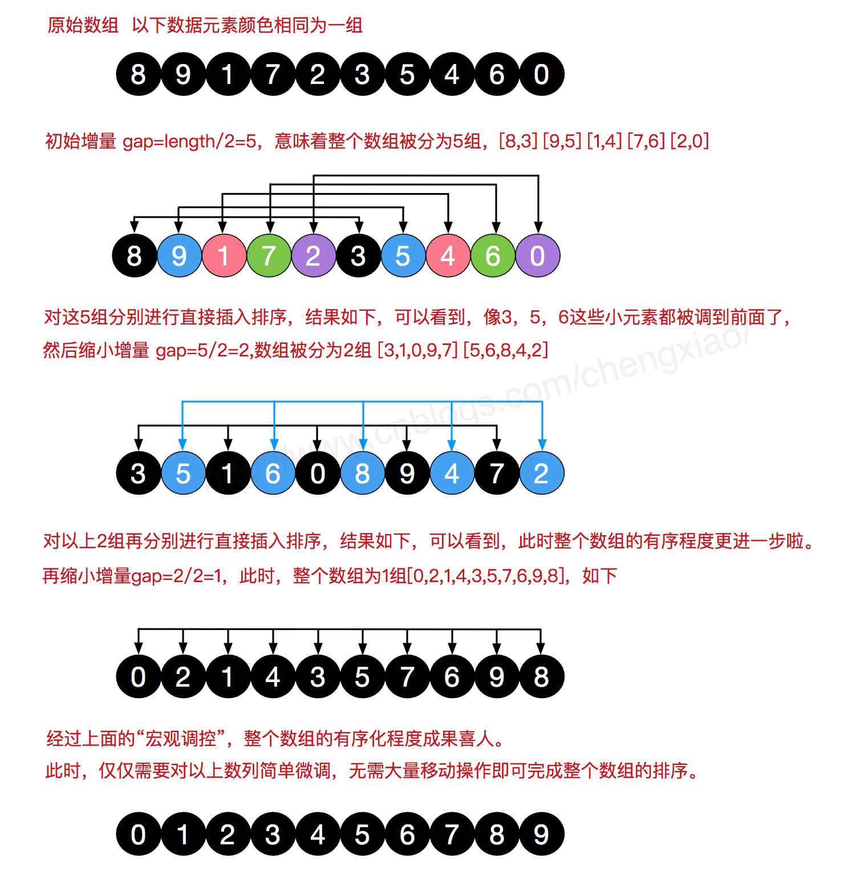
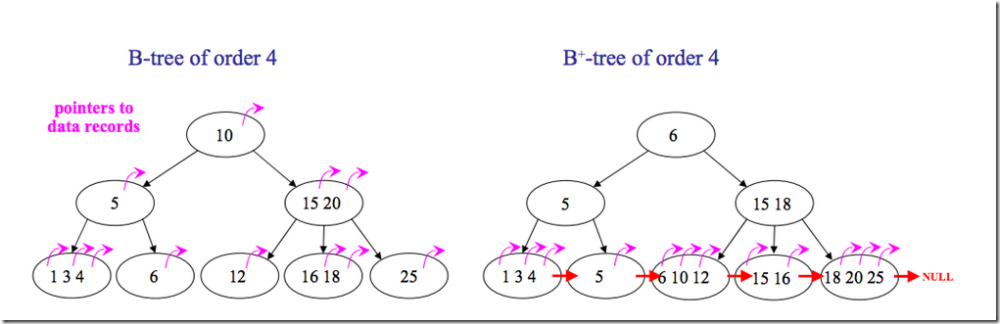

# 算法（java）

## 排序


**术语说明**

- **稳定**：如果a原本在b前面，而a=b，排序之后a仍然在b的前面；
- **不稳定**：如果a原本在b的前面，而a=b，排序之后a可能会出现在b的后面；
- **内排序**：所有排序操作都在内存中完成；
- **外排序**：由于数据太大，因此把数据放在磁盘中，而排序通过磁盘和内存的数据传输才能进行；
- **时间复杂度：** 一个算法执行所耗费的时间。
- **空间复杂度**：运行完一个程序所需内存的大小


**图片名词解释：**

- n: 数据规模
- k: “桶”的个数
- In-place: 占用常数内存，不占用额外内存
- Out-place: 占用额外内存

**比较和非比较的区别**

常见的**快速排序、归并排序、堆排序、冒泡排序**等属于**比较排序**。**在排序的最终结果里，元素之间的次序依赖于它们之间的比较。每个数都必须和其他数进行比较，才能确定自己的位置。**
在**冒泡排序**之类的排序中，问题规模为n，又因为需要比较n次，所以平均时间复杂度为O(n²)。在**归并排序、快速排序**之类的排序中，问题规模通过**分治法**消减为logN次，所以时间复杂度平均**O(nlogn)**。
比较排序的优势是，适用于各种规模的数据，也不在乎数据的分布，都能进行排序。可以说，**比较排序适用于一切需要排序的情况。**

**计数排序、基数排序、桶排序**则属于**非比较排序**。非比较排序是通过确定每个元素之前，应该有多少个元素来排序。针对数组arr，计算arr[i]之前有多少个元素，则唯一确定了arr[i]在排序后数组中的位置。
非比较排序只要确定每个元素之前的已有的元素个数即可，所有一次遍历即可解决。算法时间复杂度**O(n)**。
**非比较排序时间复杂度底，但由于非比较排序需要占用空间来确定唯一位置。所以对数据规模和数据分布有一定的要求。**

### 冒泡排序（Bubble Sort）

冒泡排序是一种简单的排序算法。它重复地走访过要排序的数列，一次比较两个元素，如果它们的顺序错误就把它们交换过来。走访数列的工作是重复地进行直到没有再需要交换，也就是说该数列已经排序完成。这个算法的名字由来是因为越小的元素会经由交换慢慢“浮”到数列的顶端。 

**算法描述**

- 比较相邻的元素。如果第一个比第二个大，就交换它们两个；
- 对每一对相邻元素作同样的工作，从开始第一对到结尾的最后一对，这样在最后的元素应该会是最大的数；
- 针对所有的元素重复以上的步骤，除了最后一个；
- 重复步骤1~3，直到排序完成。

**动图演示**


**代码实现**

```java
/**
* 冒泡排序
*
* @param array
* @return
*/
public static int[] bubbleSort(int[] array) {
	if (array.length == 0){
		return array;
	}
	for (int i = 0; i < array.length; i++) {
		for (int j = 0; j < array.length - 1 - i; j++) {
			if (array[j + 1] < array[j]) {
				int temp = array[j + 1];
				array[j + 1] = array[j];
				array[j] = temp;
			}
		}
	}
	return array;
}
```

**算法分析**

**最佳情况：T(n) = O(n)  最差情况：T(n) = O(n2)  平均情况：T(n) = O(n2)**

### 选择排序（Selection Sort）

表现**最稳定的排序算法之一**，因为**无论什么数据进去都是O(n2)的时间复杂度**，所以用到它的时候，数据规模越小越好。唯一的好处可能就是不占用额外的内存空间了吧。理论上讲，选择排序可能也是平时排序一般人想到的最多的排序方法了吧。

选择排序(Selection-sort)是一种简单直观的排序算法。它的工作原理：首先在未排序序列中找到最小（大）元素，存放到排序序列的起始位置，然后，再从剩余未排序元素中继续寻找最小（大）元素，然后放到已排序序列的末尾。以此类推，直到所有元素均排序完毕。 

**算法描述**

n个记录的直接选择排序可经过n-1趟直接选择排序得到有序结果。具体算法描述如下：

- 初始状态：无序区为R[1..n]，有序区为空；
- 第i趟排序(i=1,2,3…n-1)开始时，当前有序区和无序区分别为R[1..i-1]和R(i..n）。该趟排序从当前无序区中-选出关键字最小的记录 R[k]，将它与无序区的第1个记录R交换，使R[1..i]和R[i+1..n)分别变为记录个数增加1个的新有序区和记录个数减少1个的新无序区；
- n-1趟结束，数组有序化了。

**动图演示**


**代码实现**

```java
/**
* 选择排序
* @param array
* @return
*/
public static int[] selectionSort(int[] array) {
	if (array.length == 0)
		return array;
	for (int i = 0; i < array.length; i++) {
		int minIndex = i;
		for (int j = i; j < array.length; j++) {
			if (array[j] < array[minIndex]) //找到最小的数
			minIndex = j; //将最小数的索引保存
		}
		int temp = array[minIndex];
		array[minIndex] = array[i];
		array[i] = temp;
	}
	return array;
}
```

**算法分析**

**最佳情况：T(n) = O(n2)  最差情况：T(n) = O(n2)  平均情况：T(n) = O(n2)**

### 插入排序（Insertion Sort）

插入排序（Insertion-Sort）的算法描述是一种简单直观的排序算法。它的工作原理是通过构建有序序列，对于未排序数据，在已排序序列中从后向前扫描，找到相应位置并插入。插入排序在实现上，通常采用in-place排序（即只需用到O(1)的额外空间的排序），因而在从后向前扫描过程中，需要反复把已排序元素逐步向后挪位，为最新元素提供插入空间。

**算法描述**

一般来说，插入排序都采用in-place在数组上实现。具体算法描述如下：

- 从第一个元素开始，该元素可以认为已经被排序；
- 取出下一个元素，在已经排序的元素序列中从后向前扫描；
- 如果该元素（已排序）大于新元素，将该元素移到下一位置；
- 重复步骤3，直到找到已排序的元素小于或者等于新元素的位置；
- 将新元素插入到该位置后；
- 重复步骤2~5。

**动图演示**


**代码实现**

```java
/**
* 插入排序
* @param array
* @return
*/
public static int[] insertionSort(int[] array) {
    if (array.length == 0)
        return array;
    int current;
    for (int i = 0; i < array.length - 1; i++) {
        current = array[i + 1];
        int preIndex = i;
        while (preIndex >= 0 && current < array[preIndex]) {
            array[preIndex + 1] = array[preIndex];
            preIndex--;
        }
        array[preIndex + 1] = current;
    }
    return array;
}
```

**算法分析**

**最佳情况：T(n) = O(n)  最坏情况：T(n) = O(n2)  平均情况：T(n) = O(n2)**

### 希尔排序（Shell Sort）

希尔排序是希尔（Donald Shell）于1959年提出的一种排序算法。希尔排序也是一种插入排序，它是简单插入排序经过改进之后的一个更高效的版本，也称为缩小增量排序，同时该算法是冲破O(n2）的第一批算法之一。它与插入排序的不同之处在于，它会优先比较距离较远的元素。希尔排序又叫缩小增量排序。

**希尔排序是把记录按下表的一定增量分组，对每组使用直接插入排序算法排序；随着增量逐渐减少，每组包含的关键词越来越多，当增量减至1时，整个文件恰被分成一组，算法便终止。**

**算法描述**

我们来看下希尔排序的基本步骤，在此我们选择增量gap=length/2，缩小增量继续以gap = gap/2的方式，这种增量选择我们可以用一个序列来表示，**{n/2,(n/2)/2...1}**，称为**增量序列**。希尔排序的增量序列的选择与证明是个数学难题，我们选择的这个增量序列是比较常用的，也是希尔建议的增量，称为希尔增量，但其实这个增量序列不是最优的。此处我们做示例使用希尔增量。

先将整个待排序的记录序列分割成为若干子序列分别进行直接插入排序，具体算法描述：

- 选择一个增量序列t1，t2，…，tk，其中ti>tj，tk=1；
- 按增量序列个数k，对序列进行k 趟排序；
- 每趟排序，根据对应的增量ti，将待排序列分割成若干长度为m 的子序列，分别对各子表进行直接插入排序。仅增量因子为1 时，整个序列作为一个表来处理，表长度即为整个序列的长度。

**过程演示**



**代码实现**

```java
/**
* 希尔排序
*
* @param array
* @return
*/
public static int[] ShellSort(int[] array) {
    int len = array.length;
    int temp, gap = len / 2;
    while (gap > 0) {
        for (int i = gap; i < len; i++) {
            temp = array[i];
            int preIndex = i - gap;
            while (preIndex >= 0 && array[preIndex] > temp) {
                array[preIndex + gap] = array[preIndex];
                preIndex -= gap;
            }
            array[preIndex + gap] = temp;
        }
        gap /= 2;
    }
    return array;
}
```

**算法分析**

**最佳情况：T(n) = O(nlog2 n)  最坏情况：T(n) = O(nlog2 n)  平均情况：T(n) =O(nlog2n)**　

### 归并排序（Merge Sort）

和选择排序一样，归并排序的性能不受输入数据的影响，但表现比选择排序好的多，因为始终都是O(n log n）的时间复杂度。代价是需要额外的内存空间。

归并排序是建立在归并操作上的一种有效的排序算法。该算法是采用分治法（Divide and Conquer）的一个非常典型的应用。归并排序是一种稳定的排序方法。将已有序的子序列合并，得到完全有序的序列；即先使每个子序列有序，再使子序列段间有序。若将两个有序表合并成一个有序表，称为2-路归并。 

**算法描述**

- 把长度为n的输入序列分成两个长度为n/2的子序列；
- 对这两个子序列分别采用归并排序；
- 将两个排序好的子序列合并成一个最终的排序序列。

**动图演示**


**代码实现**

```java
/**
* 归并排序
*
* @param array
* @return
*/
public static int[] MergeSort(int[] array) {
    if (array.length < 2) return array;
    int mid = array.length / 2;
    int[] left = Arrays.copyOfRange(array, 0, mid);
    int[] right = Arrays.copyOfRange(array, mid, array.length);
    return merge(MergeSort(left), MergeSort(right));
}

/**
* 归并排序——将两段排序好的数组结合成一个排序数组
*
* @param left
* @param right
* @return
*/
public static int[] merge(int[] left, int[] right) {
    int[] result = new int[left.length + right.length];
    for (int index = 0, i = 0, j = 0; index < result.length; index++) {
        if (i >= left.length)
            result[index] = right[j++];
        else if (j >= right.length)
            result[index] = left[i++];
        else if (left[i] > right[j])
            result[index] = right[j++];
        else
            result[index] = left[i++];
    }
    return result;
}
```

**算法分析**

**最佳情况：T(n) = O(n)  最差情况：T(n) = O(nlogn)  平均情况：T(n) = O(nlogn)**

### 快速排序（Quick Sort）

快速排序的基本思想：通过一趟排序将待排记录分隔成独立的两部分，其中一部分记录的关键字均比另一部分的关键字小，则可分别对这两部分记录继续进行排序，以达到整个序列有序。

**算法描述**

快速排序使用分治法来把一个串（list）分为两个子串（sub-lists）。具体算法描述如下：

- 从数列中挑出一个元素，称为 “基准”（**pivot**）；
- 重新排序数列，所有元素比基准值小的摆放在基准前面，所有元素比基准值大的摆在基准的后面（相同的数可以到任一边）。在这个分区退出之后，该基准就处于数列的中间位置。这个称为分区（partition）操作；
- 递归地（recursive）把小于基准值元素的子数列和大于基准值元素的子数列排序。

**动图演示**


**代码实现**

```java
/**
* 快速排序方法
* @param array
* @param start
* @param end
* @return
*/
public static int[] QuickSort(int[] array, int start, int end) {
    if (array.length < 1 || start < 0 || end >= array.length || start > end) return null;
    int smallIndex = partition(array, start, end);
    if (smallIndex > start)
        QuickSort(array, start, smallIndex - 1);
    if (smallIndex < end)
        QuickSort(array, smallIndex + 1, end);
    return array;
}

/**
* 快速排序算法——partition
* @param array
* @param start
* @param end
* @return
*/
public static int partition(int[] array, int start, int end) {
    int pivot = (int) (start + Math.random() * (end - start + 1));
    int smallIndex = start - 1;
    swap(array, pivot, end);
    for (int i = start; i <= end; i++)
        if (array[i] <= array[end]) {
            smallIndex++;
            if (i > smallIndex)
                swap(array, i, smallIndex);
        }
    return smallIndex;
}

/**
* 交换数组内两个元素
* @param array
* @param i
* @param j
*/
public static void swap(int[] array, int i, int j) {
    int temp = array[i];
    array[i] = array[j];
    array[j] = temp;
}
```

**算法分析**

**最佳情况：T(n) = O(nlogn)  最差情况：T(n) = O(n2)  平均情况：T(n) = O(nlogn)**　

### 堆排序（Heap Sort）

堆排序（Heapsort）是指利用堆这种数据结构所设计的一种排序算法。堆积是一个近似完全二叉树的结构，并同时满足堆积的性质：即子结点的键值或索引总是小于（或者大于）它的父节点。

**算法描述**

- 将初始待排序关键字序列(R1,R2….Rn)构建成大顶堆，此堆为初始的无序区；
- 将堆顶元素R[1]与最后一个元素R[n]交换，此时得到新的无序区(R1,R2,……Rn-1)和新的有序区(Rn),且满足R[1,2…n-1]<=R[n]；
- 由于交换后新的堆顶R[1]可能违反堆的性质，因此需要对当前无序区(R1,R2,……Rn-1)调整为新堆，然后再次将R[1]与无序区最后一个元素交换，得到新的无序区(R1,R2….Rn-2)和新的有序区(Rn-1,Rn)。不断重复此过程直到有序区的元素个数为n-1，则整个排序过程完成。

**动图演示**


**代码实现**

注意：这里用到了完全二叉树的部分性质：详情见[《数据结构二叉树知识点总结》](http://www.cnblogs.com/guoyaohua/p/8595289.html)

```java
//声明全局变量，用于记录数组array的长度；
static int len;

/**
* 堆排序算法
*
* @param array
* @return
*/
public static int[] HeapSort(int[] array) {
    len = array.length;
    if (len < 1) return array;
    //1.构建一个最大堆
    buildMaxHeap(array);
    //2.循环将堆首位（最大值）与末位交换，然后在重新调整最大堆
    while (len > 0) {
        swap(array, 0, len - 1);
        len--;
        adjustHeap(array, 0);
    }
    return array;
}

/**
* 建立最大堆
*
* @param array
*/
public static void buildMaxHeap(int[] array) {
    //从最后一个非叶子节点开始向上构造最大堆
    for (int i = (len/2 - 1); i >= 0; i--) { //感谢 @让我发会呆 网友的提醒，此处应该为 i = (len/2 - 1) 
        adjustHeap(array, i);
    }
}
    
/**
* 调整使之成为最大堆
*
* @param array
* @param i
*/
public static void adjustHeap(int[] array, int i) {
    int maxIndex = i;
    //如果有左子树，且左子树大于父节点，则将最大指针指向左子树
    if (i * 2 < len && array[i * 2] > array[maxIndex])
        maxIndex = i * 2;
    //如果有右子树，且右子树大于父节点，则将最大指针指向右子树
    if (i * 2 + 1 < len && array[i * 2 + 1] > array[maxIndex])
        maxIndex = i * 2 + 1;
    //如果父节点不是最大值，则将父节点与最大值交换，并且递归调整与父节点交换的位置。
    if (maxIndex != i) {
        swap(array, maxIndex, i);
        adjustHeap(array, maxIndex);
    }
}
```

**算法分析**

**最佳情况：T(n) = O(nlogn) 最差情况：T(n) = O(nlogn) 平均情况：T(n) = O(nlogn)**

### 计数排序（Counting Sort）

计数排序的核心在于将输入的数据值转化为键存储在额外开辟的数组空间中。 作为一种线性时间复杂度的排序，计数排序要求输入的数据必须是有确定范围的整数。

计数排序(Counting sort)是一种稳定的排序算法。计数排序使用一个额外的数组C，其中第i个元素是待排序数组A中值等于i的元素的个数。然后根据数组C来将A中的元素排到正确的位置。它只能对整数进行排序。

**算法描述**

- 找出待排序的数组中最大和最小的元素；
- 统计数组中每个值为i的元素出现的次数，存入数组C的第i项；
- 对所有的计数累加（从C中的第一个元素开始，每一项和前一项相加）；
- 反向填充目标数组：将每个元素i放在新数组的第C(i)项，每放一个元素就将C(i)减去1。

**动图演示**


**代码实现**

```java
/**
* 计数排序
*
* @param array
* @return
*/
public static int[] CountingSort(int[] array) {
    if (array.length == 0) return array;
    int bias, min = array[0], max = array[0];
    for (int i = 1; i < array.length; i++) {
        if (array[i] > max)
            max = array[i];
        if (array[i] < min)
            min = array[i];
    }
    bias = 0 - min;
    int[] bucket = new int[max - min + 1];
    Arrays.fill(bucket, 0);
    for (int i = 0; i < array.length; i++) {
        bucket[array[i] + bias]++;
    }
    int index = 0, i = 0;
    while (index < array.length) {
        if (bucket[i] != 0) {
            array[index] = i - bias;
            bucket[i]--;
            index++;
        } else
            i++;
    }
    return array;
}
```

**算法分析**

当输入的元素是n 个0到k之间的整数时，它的运行时间是 O(n + k)。计数排序不是比较排序，排序的速度快于任何比较排序算法。由于用来计数的数组C的长度取决于待排序数组中数据的范围（等于待排序数组的最大值与最小值的差加上1），这使得计数排序对于数据范围很大的数组，需要大量时间和内存。

**最佳情况：T(n) = O(n+k)  最差情况：T(n) = O(n+k)  平均情况：T(n) = O(n+k)**

### 桶排序（Bucket Sort）

桶排序是计数排序的升级版。它利用了函数的映射关系，高效与否的关键就在于这个映射函数的确定。

桶排序 (Bucket sort)的工作的原理：假设输入数据服从均匀分布，将数据分到有限数量的桶里，每个桶再分别排序（有可能再使用别的排序算法或是以递归方式继续使用桶排序进行排

**算法描述**

- 人为设置一个BucketSize，作为每个桶所能放置多少个不同数值（例如当BucketSize==5时，该桶可以存放｛1,2,3,4,5｝这几种数字，但是容量不限，即可以存放100个3）；
- 遍历输入数据，并且把数据一个一个放到对应的桶里去；
- 对每个不是空的桶进行排序，可以使用其它排序方法，也可以递归使用桶排序；
- 从不是空的桶里把排好序的数据拼接起来。 

**注意，如果递归使用桶排序为各个桶排序，则当桶数量为1时要手动减小BucketSize增加下一循环桶的数量，否则会陷入死循环，导致内存溢出。**

**图片演示**


**代码实现**

```java
/**
* 桶排序
* 
* @param array
* @param bucketSize
* @return
*/
public static ArrayList<Integer> BucketSort(ArrayList<Integer> array, int bucketSize) {
    if (array == null || array.size() < 2)
        return array;
    int max = array.get(0), min = array.get(0);
    // 找到最大值最小值
    for (int i = 0; i < array.size(); i++) {
        if (array.get(i) > max)
            max = array.get(i);
        if (array.get(i) < min)
            min = array.get(i);
    }
    int bucketCount = (max - min) / bucketSize + 1;
    ArrayList<ArrayList<Integer>> bucketArr = new ArrayList<>(bucketCount);
    ArrayList<Integer> resultArr = new ArrayList<>();
    for (int i = 0; i < bucketCount; i++) {
        bucketArr.add(new ArrayList<Integer>());
    }
    for (int i = 0; i < array.size(); i++) {
        bucketArr.get((array.get(i) - min) / bucketSize).add(array.get(i));
    }
    for (int i = 0; i < bucketCount; i++) {
        if (bucketSize == 1) { // 如果带排序数组中有重复数字时  感谢 @见风任然是风 朋友指出错误
            for (int j = 0; j < bucketArr.get(i).size(); j++)
                resultArr.add(bucketArr.get(i).get(j));
        } else {
            if (bucketCount == 1)
                bucketSize--;
            ArrayList<Integer> temp = BucketSort(bucketArr.get(i), bucketSize);
            for (int j = 0; j < temp.size(); j++)
                resultArr.add(temp.get(j));
        }
    }
    return resultArr;
}
```

**算法分析**

桶排序最好情况下使用线性时间O(n)，桶排序的时间复杂度，取决与对各个桶之间数据进行排序的时间复杂度，因为其它部分的时间复杂度都为O(n)。很显然，桶划分的越小，各个桶之间的数据越少，排序所用的时间也会越少。但相应的空间消耗就会增大。 

**最佳情况：T(n) = O(n+k)  最差情况：T(n) = O(n+k)  平均情况：T(n) = O(n2)**　　

### 基数排序（Radix Sort）

基数排序也是非比较的排序算法，对每一位进行排序，从最低位开始排序，复杂度为O(kn),为数组长度，k为数组中的数的最大的位数；

基数排序是按照低位先排序，然后收集；再按照高位排序，然后再收集；依次类推，直到最高位。有时候有些属性是有优先级顺序的，先按低优先级排序，再按高优先级排序。最后的次序就是高优先级高的在前，高优先级相同的低优先级高的在前。基数排序基于分别排序，分别收集，所以是稳定的。

**算法描述**

- 取得数组中的最大数，并取得位数；
- arr为原始数组，从最低位开始取每个位组成radix数组；
- 对radix进行计数排序（利用计数排序适用于小范围数的特点）；

**动图演示**


**代码实现**

```java
/**
* 基数排序
* @param array
* @return
*/
public static int[] RadixSort(int[] array) {
    if (array == null || array.length < 2)
        return array;
    // 1.先算出最大数的位数；
    int max = array[0];
    for (int i = 1; i < array.length; i++) {
        max = Math.max(max, array[i]);
    }
    int maxDigit = 0;
    while (max != 0) {
        max /= 10;
        maxDigit++;
    }
    int mod = 10, div = 1;
    ArrayList<ArrayList<Integer>> bucketList = new ArrayList<ArrayList<Integer>>();
    for (int i = 0; i < 10; i++)
        bucketList.add(new ArrayList<Integer>());
    for (int i = 0; i < maxDigit; i++, mod *= 10, div *= 10) {
        for (int j = 0; j < array.length; j++) {
            int num = (array[j] % mod) / div;
            bucketList.get(num).add(array[j]);
        }
        int index = 0;
        for (int j = 0; j < bucketList.size(); j++) {
            for (int k = 0; k < bucketList.get(j).size(); k++)
                array[index++] = bucketList.get(j).get(k);
            bucketList.get(j).clear();
        }
    }
    return array;
}
```

**算法分析**

**最佳情况：T(n) = O(n \* k)  最差情况：T(n) = O(n \* k)  平均情况：T(n) = O(n \* k)**

基数排序有两种方法：

MSD 从高位开始进行排序 LSD 从低位开始进行排序 

 

**基数排序 vs 计数排序 vs 桶排序**

这三种排序算法都利用了桶的概念，但对桶的使用方法上有明显差异：

- 基数排序：根据键值的每位数字来分配桶
- 计数排序：每个桶只存储单一键值
- 桶排序：每个桶存储一定范围的数值

## 查找

### 定义

**查找定义**

查找定义：根据给定的某个值，在查找表中确定一个其关键字等于给定值的数据元素（或记录）。

**查找算法分类**

1）静态查找和动态查找；

注：静态或者动态都是针对查找表而言的。

静态的就是先给一堆值，然后在一堆值中查找元素。

动态指查找的过程中，有删除和插入操作。

2）无序查找和有序查找。

无序查找：被查找数列有序无序均可；

有序查找：被查找数列必须为有序数列。

**平均查找长度（Average Search Length，ASL）**

****

其中n为查找表中元素个数，Pi为查找第i个元素的概率，通常假设每个元素查找概率相同，Pi=1/n，Ci是找到第i个元素的比较次数。

当然，有查找成功，就有查找不成功，即要查找元素不在查找表中。针对不同查找方式的查找成功与不成功，我接下来会说，这也是一我一开始有点乱的地方。

一个算法的ASL越大，说明时间性能差，反之，时间性能好，这也是显而易见的。

### 顺序查找

**顺序查找的基本思想**

顺序查找也称为线形查找，属于无序查找算法。从数据结构线形表的一端开始，顺序扫描，依次将扫描到的结点关键字与给定值k相比较，若相等则表示查找成功；若扫描结束仍没有找到关键字等于k的结点，表示查找失败。

顺序查找适合于存储结构为顺序存储或链接存储的线性表。

**顺序查找的实现**

直接遍历一遍数组即可

```java
package algorithm.search.sequencesearch;
 
public class SequenceSearch {
	
	/** 根据顺序查找的算法，返回在nums数组中key的index
	 * 直接在数组中遍历即可
	 * @param nums
	 * @param key
	 * @return 如果没有找到，返回-1
	 */
	public static int sequenceSearch(int[] nums,int key){
		for(int i=0;i<nums.length;i++){
			int now=nums[i];
			if(now==key){
				return i;
			}
		}	
		return -1;
	}
 
}
```

下面是测试的方法，下面的都按照这个为模板来测试

```java
package algorithm.search.sequencesearch;
 
import algorithm.sort.quickSort.QuickSort;
 
public class Main {
	
	public static void main(String[] args) {
 
		int[][] testTable={createRandomIntArray(-100,100,50),
				createRandomIntArray(-100,100,400),createRandomIntArray(-1000,1000,500)};
		
		int[] testKey=createRandomIntArray(-100,100,10);
		for (int[] ito : testTable) {
			for(int key:testKey){
				test(ito,key);
			}		
		}
	}
		 
	private static void test(int[] ito,int key) {
		int rtn;
		
		for (int i = 0; i < ito.length; i++) {
		    System.out.print(ito[i]+" ");		    
		}
		System.out.println();
		System.out.println("length="+ito.length);
		//开始时打印数组
		long begin = System.currentTimeMillis();
		rtn=SequenceSearch.sequenceSearch(ito,key);//执行程序
		long end = System.currentTimeMillis();	
		
		QuickSort.quickSort(ito, 0, ito.length-1);
		for (int i = 0; i < ito.length; i++) {
		    System.out.print(ito[i]+" ");		    
		}
		System.out.println();
		
		System.out.println("查找："+key+" ,结果为："+rtn);
		
		System.out.println();
		System.out.println("耗时：" + (end - begin) + "ms");
		System.out.println("-------------------");
		System.out.println("-------------------");
	}
	public static int[] createRandomIntArray(int min,int max,int length){
		int[] result=new int[length];
		for(int i=0;i<length;i++){
			double rand=Math.random();
			result[i]=(int)(min+(max-min)*rand);
		}
		
		return result;
	}
 
}
```

**顺序查找的复杂度**

查找成功时的平均查找长度为：（假设每个数据元素的概率相等） ASL = 1/n(1+2+3+…+n) = (n+1)/2 ;
当查找不成功时，需要n+1次比较，时间复杂度为O(n);

所以，顺序查找的时间复杂度为O(n)。

### 二分查找

**二分查找的基本思想**
基本思想：也称为是折半查找，属于有序查找算法。用给定值k先与中间结点的关键字比较，中间结点把线形表分成两个子表，若相等则查找成功；若不相等，再根据k与该中间结点关键字的比较结果确定下一步查找哪个子表，这样递归进行，直到查找到或查找结束发现表中没有这样的结点。

元素必须是有序的，如果是无序的则要先进行排序操作。

注：折半查找的前提条件是需要有序表顺序存储，对于静态查找表，一次排序后不再变化，折半查找能得到不错的效率。但对于需要频繁执行插入或删除操作的数据集来说，维护有序的排序会带来不小的工作量，那就不建议使用。

**二分查找的代码**
先用快排对数组进行排序，然后设定begin=0,end=length-1

mid=(begin+end)/2,查找mid的值与key的大小

如果相同，返回index

如果mid<key,那么begin=mid+1，如果mid>key,那么end=mid-1

然后循环，直到end<begin,返回-1

```java
package algorithm.search.binarysearch;
 
import algorithm.sort.quickSort.QuickSort;
 
public class BinarySearch {
	
	/** 用二分查找在nums数组中查找key的index
	 *  先用快排对数组进行排序，然后设定begin=0,end=length-1
	 * 	mid=(begin+end)/2,查找mid的值与key的大小
	 * 	如果相同，返回index
	 * 	如果mid<key,那么begin=mid+1，如果mid>key,那么end=mid-1
	 * 	然后循环，直到end<begin,返回-1
	 * @param nums
	 * @param key
	 * @return 如果数组中没有这个key，返回-1
	 */
	public static int binarySearch(int[] nums,int key){
		int length=nums.length;
		QuickSort.quickSort(nums, 0, length-1);
		//begin=0,end=length-1
		int begin=0;
		int end=length-1;
		//循环，直到end<begin,返回-1
		while(begin<=end){
			int mid=(begin+end)/2;
			int now=nums[mid];
			if(now==key){
				//如果相同，返回index
				return mid;
			}
			if(now<key){
				//如果mid<key,那么begin=mid+1
				begin=mid+1;
			}
			if(now>key){
				//如果mid>key,那么end=mid-1
				end=mid-1;
			}			
		}				
		return -1;
	}
 
}
```

**二分查找的复杂度**

最坏情况下，关键词比较次数为log2 (n+1)，且期望时间复杂度为O(log2 n)

ASL=log2 (n+1) -1

注意：在数组中排序后，再插入新值，要将新值后面的所有位后移一位，要O(n)时间

### 插值查找

**插值查找的基本思想**
在介绍插值查找之前，首先考虑一个新问题，为什么上述算法一定要是折半，而不是折四分之一或者折更多呢？

　　打个比方，在英文字典里面查“apple”，你下意识翻开字典是翻前面的书页还是后面的书页呢？如果再让你查“zoo”，你又怎么查？很显然，这里你绝对不会是从中间开始查起，而是有一定目的的往前或往后翻。

　　同样的，比如要在取值范围1 ~ 10000 之间 100 个元素从小到大均匀分布的数组中查找5， 我们自然会考虑从数组下标较小的开始查找。

　　经过以上分析，折半查找这种查找方式，不是自适应的（也就是说是傻瓜式的）。二分查找中查找点计算如下：

　　mid=(low+high)/2, 即mid=low+1/2*(high-low);

　　通过类比，我们可以将查找的点改进为如下：

　　mid=low+(key-a[low])/(a[high]-a[low])*(high-low)，

　　也就是将上述的比例参数1/2改进为自适应的，根据关键字在整个有序表中所处的位置，让mid值的变化更靠近关键字key，这样也就间接地减少了比较次数。

　　基本思想：基于二分查找算法，将查找点的选择改进为自适应选择，可以提高查找效率。当然，差值查找也属于有序查找。

　　注：对于表长较大，而关键字分布又比较均匀的查找表来说，插值查找算法的平均性能比折半查找要好的多。反之，数组中如果分布非常不均匀，那么插值查找未必是很合适的选择。

**插值查找的代码**
与二分查找基本一样，就mid的计算方式不一样
$$
mid=begin+(key-a[begin])/(a[end]-a[begin])*(end-begin)
$$

```java
package algorithm.search.insertionsearch;
 
import algorithm.sort.quickSort.QuickSort;
 
public class InsertionSearch {
	
	/** 用插值查找查找在nums数组中查找key的index
	 *  先用快排对数组进行排序，然后设定begin=0,end=length-1
	 * 	mid=begin+(key-nums[begin])/(nums[end]-nums[begin])*(end-begin),查找mid的值与key的大小
	 * 	如果相同，返回index
	 * 	如果mid<key,那么begin=mid+1，如果mid>key,那么end=mid-1
	 * 	然后循环，直到end<begin,返回-1
	 * @param nums
	 * @param key
	 * @return 如果数组中没有这个key，返回-1
	 */
	public static int insertionSearch(int[] nums,int key){
		int length=nums.length;
		QuickSort.quickSort(nums, 0, length-1);
		//begin=0,end=length-1
		int begin=0;
		int end=length-1;
		//循环，直到end<begin,返回-1
		while(begin<=end){
			int mid=begin+(key-nums[begin])/(nums[end]-nums[begin])*(end-begin);
			int now=nums[mid];
			if(now==key){
				//如果相同，返回index
				return mid;
			}
			if(now<key){
				//如果mid<key,那么begin=mid+1
				begin=mid+1;
			}
			if(now>key){
				//如果mid>key,那么end=mid-1
				end=mid-1;
			}			
		}				
		return -1;
	}
 
}
```

**插值查找的复杂度**

查找成功或者失败的时间复杂度均为O(log2 (log2 n))。

 

### 斐波那契查找

**斐波那契查找的基本思想**
在介绍斐波那契查找算法之前，我们先介绍一下很它紧密相连并且大家都熟知的一个概念——黄金分割。

黄金比例又称黄金分割，是指事物各部分间一定的数学比例关系，即将整体一分为二，较大部分与较小部分之比等于整体与较大部分之比，其比值约为1:0.618或1.618:1。

0.618被公认为最具有审美意义的比例数字，这个数值的作用不仅仅体现在诸如绘画、雕塑、音乐、建筑等艺术领域，而且在管理、工程设计等方面也有着不可忽视的作用。因此被称为黄金分割。

大家记不记得斐波那契数列：1, 1, 2, 3, 5, 8, 13, 21, 34, 55, 89…….（从第三个数开始，后边每一个数都是前两个数的和）。然后我们会发现，随着斐波那契数列的递增，前后两个数的比值会越来越接近0.618，利用这个特性，我们就可以将黄金比例运用到查找技术中。


基本思想：也是二分查找的一种提升算法，通过运用黄金比例的概念在数列中选择查找点进行查找，提高查找效率。同样地，斐波那契查找也属于一种有序查找算法。

斐波那契查找与折半查找很相似，他是根据斐波那契序列的特点对有序表进行分割的。他要求开始表中记录的个数为某个斐波那契数小1，及n=F(k)-1;

 开始将k值与第F(k-1)位置的记录进行比较(及mid=low+F(k-1)-1),比较结果也分为三种

1）相等，mid位置的元素即为所求

2）>，low=mid+1,k-=2;

说明：low=mid+1说明待查找的元素在[mid+1,high]范围内，k-=2 说明范围[mid+1,high]内的元素个数为n-(F(k-1))= Fk-1-F(k-1)=Fk-F(k-1)-1=F(k-2)-1个，所以可以递归的应用斐波那契查找。

3）<，high=mid-1,k-=1。

说明：low=mid+1说明待查找的元素在[low,mid-1]范围内，k-=1 说明范围[low,mid-1]内的元素个数为F(k-1)-1个，所以可以递归 的应用斐波那契查找。

为什么n=F(k)-1， 表中记录的个数为某个斐波那契数小1。

是为了格式上的统一，以方便递归或者循环程序的编写。表中的数据是F(k)-1个，使用mid值进行分割又用掉一个，那么剩下F(k)-2个。正好分给两个子序列，每个子序列的个数分别是F(k-1)-1与F(k-2)-1个，格式上与之前是统一的。不然的话，每个子序列的元素个数有可能是F(k-1)，F(k-1)-1，F(k-2)，F(k-2)-1个，写程序会非常麻烦。

注意：斐波那契数列 F(k)=F(k-1)+F(k-2)

F(k)-1-1=F(k-1)-1+F(k-2)-1

**斐波那契查找的代码**

```java
package algorithm.search.fibonaccisearch;
 
import java.util.ArrayList;
import java.util.Arrays;
import java.util.List;
 
import algorithm.sort.quickSort.QuickSort;
 
public class FibonacciSearch {
	
	/** 用斐波那契查找在nums数组中查找key的index
	 *  先用快排对数组进行排序，原先数组长度为orginalLength
	 *  然后建立斐波那契数列，用list不断加入，直到>orginalLength,
	 *  斐波那契数列的最后一位F(k),newLength=F(k)-1>=orginalLength
	 *  将原来排序后的数组加入长度为newLength的数组中， 多出来空位的用最后一位填满
	 *  然后设定begin=0,end=newLength-1,k=上面对应的k
	 * 	mid=begin+F(k-1)-1,查找mid的值与key的大小
	 * 	如果相同，返回index,如果index>=orginalLength,返回orginalLength-1
	 * 	如果mid<key,那么begin=mid+1，k=k-2如果mid>key,那么end=mid-1,k=k-1
	 * 	然后循环，直到end<begin,返回-1
	 * @param nums
	 * @param key
	 * @return 如果数组中没有这个key，返回-1
	 */
	public static int fibonacciSearch(int[] nums,int key){
		int orginalLength=nums.length;
		QuickSort.quickSort(nums, 0, orginalLength-1);
		//然后建立斐波那契数列，用list不断加入，直到>orginalLength
		List<Integer> fiboList=new ArrayList<>();
		fiboList.add(0);
		fiboList.add(1);
		int i=2;
		while(true){
			Integer now=fiboList.get(i-2)+fiboList.get(i-1);
			fiboList.add(now);
			i++;
			if(now>orginalLength){
				break;
			}
		}
		//斐波那契数列的最后一位F(k),newLength=F(k)-1>=orginalLength
		int k=fiboList.size()-1;
		int newLength=fiboList.get(k)-1;
		//将原来排序后的数组加入长度为newLength的数组中， 多出来空位的用最后一位填满
		int[] newNums=new int[newLength];
		for(i=0;i<newLength;i++){
			if(i<orginalLength){
				newNums[i]=nums[i];
			}
			else{
				newNums[i]=nums[orginalLength-1];
			}
		}
						
		//begin=0,end=newLength-1,k=上面对应的k
		int begin=0;
		int end=newLength-1;
		//循环，直到end<begin,返回-1
		while(begin<=end){
			int mid=begin+fiboList.get(k-1)-1;
			int now=nums[mid];
			if(now==key){
				//如果相同，返回index,如果index>=orginalLength,返回orginalLength-1
				if(mid>=orginalLength){
					return orginalLength-1;
				}
				return mid;
			}
			if(now<key){
				//如果mid<key,那么begin=mid+1，k=k-2
				begin=mid+1;
				k=k-2;
			}
			if(now>key){
				//如果mid>key,那么end=mid-1,k=k-1
				end=mid-1;
				k=k-1;
			}			
		}				
		return -1;
	}
 
}
```

**斐波那契查找的复杂度**

复杂度分析：最坏情况下，时间复杂度为O(log2 n)，且其期望复杂度也为O(log2 n)。

### 二叉树查找

**二叉树查找的基本思想**
二叉查找树是先对待查找的数据进行生成树，确保树的左分支的值小于右分支的值，然后在就行和每个节点的父节点比较大小，查找最适合的范围。 这个算法的查找效率很高，但是如果使用这种查找方法要首先创建树。 

二叉查找树（BinarySearch Tree，也叫二叉搜索树，或称二叉排序树Binary Sort Tree）或者是一棵空树，或者是具有下列性质的二叉树：

1）若任意节点的左子树不空，则左子树上所有结点的值均小于它的根结点的值；

2）若任意节点的右子树不空，则右子树上所有结点的值均大于它的根结点的值；

3）任意节点的左、右子树也分别为二叉查找树。

二叉查找树性质：对二叉查找树进行中序遍历，即可得到有序的数列。

根据二叉查找树的性质，可以从根，根据大小比较到左右孩子，搜索到对应的节点

**二叉树查找的代码**

```java
package datastructure.tree.binarytree;

import java.util.ArrayList;
import java.util.LinkedList;
import java.util.List;
import java.util.Queue;
import java.util.Stack;

public class BinaryTree {

	public TreeNode root;
	public List<TreeNode> nodes=new ArrayList<TreeNode>();
	
	public BinaryTree(int x){
		root=new TreeNode(x);
		nodes.add(root);
	}
	//object内要么是int，要么是null，为了构建完全二叉树
	//构建二叉树，先将obect化为treeNode塞入list，然后根据索引确定每个元素的left，right
	public BinaryTree(Object[] x){		
		for(int i=0;i<x.length;i++){			
			if(x[i]!=null){
				nodes.add(new TreeNode((int)x[i]));
			}
			else{
				nodes.add(null);
			}
		}
		root=nodes.get(0);
		for(int i=0;i<x.length/2;i++){
			TreeNode now=nodes.get(i);
			if(now!=null){
				now.left=nodes.get(2*i+1);
				now.right=nodes.get(2*i+2);
			}
		}
		
	}
	//递归
	public static void preOrder(TreeNode root){
		if(root==null){
			return;
		}
		System.out.print(root.val+" ");
		preOrder(root.left);
		preOrder(root.right);
	}
	
	public static void inOrder(TreeNode root){
		if(root==null){
			return;
		}
		inOrder(root.left);
		System.out.print(root.val+" ");
		inOrder(root.right);
	}
	
	public static void postOrder(TreeNode root){
		if(root==null){
			return;
		}
		postOrder(root.left);
		postOrder(root.right);
		System.out.print(root.val+" ");
	}
	//通过队列 当前下层节点个数 打印每层的节点和null
	public static void printTree(TreeNode root){
        if(root == null)
            return;
        Queue<TreeNode> queue = new LinkedList<TreeNode>();
        
        int current;//当前层 还未打印的结点个数
        int next;//下一层结点个数
        
        queue.offer(root);
        current = 1;
        next = 0;
        while(!queue.isEmpty()){
            TreeNode currentNode = queue.poll();
            if (currentNode!=null) {
            	System.out.print(currentNode.val+" ");
                current--;
               
			}
            else{
            	System.out.print("null ");
            	 current--;
            	 queue.offer(null);
                 next++;
                 queue.offer(null);
                 next++;                
                 if(current ==0){
                     System.out.println();
                     current = next;
                     next = 0;
                     int temp=0;
                     for (TreeNode treeNode : queue) {
						if(treeNode==null){
							temp++;
						}
					}
                     if(temp==current){
                    	 System.out.println("end");
                         break;
                     }
                     
                 }
                continue;
            }
            
            if(currentNode.left != null){
                queue.offer(currentNode.left);
                next++;
            }
            else{
            	queue.offer(null);
                next++;
            }
            if(currentNode.right != null){
                queue.offer(currentNode.right);
                next++;
            }
            else{
            	queue.offer(null);
                next++;
            }
            if(current ==0){
                System.out.println();
                current = next;
                next = 0;
                int temp=0;
                for (TreeNode treeNode : queue) {
					if(treeNode==null){
						temp++;
					}
				}
                if(temp==current){
               	 System.out.println("end");
                    break;
                }
                
            }
            
        }
    }
	
	//宽度优先遍历 是简化的按层遍历，没有了current和next和打印null
	public static void breadthFirstSearch(TreeNode root){
		Queue<TreeNode> queue = new LinkedList<TreeNode>();
		if(root==null){
			return;
		}
		queue.offer(root);
		while(!queue.isEmpty()){
			TreeNode now=queue.poll();
			System.out.print(now.val+" ");
			if(now.left!=null){
				queue.offer(now.left);
			}
			if(now.right!=null){
				queue.offer(now.right);
			}
		}
		System.out.println();
	}

	//深度优先遍历
	//用栈 弹出自身 先加入右节点 再加入左节点，这样先弹出左节点，左节点的左右子节点又塞进去，在原右节点上面
	public static void depthFirstSearch(TreeNode root){
		Stack<TreeNode> stack=new Stack<TreeNode>();
		if(root==null){
			return;
		}
		stack.push(root);
		while(!stack.isEmpty()){
			TreeNode now=stack.pop();
			System.out.print(now.val+" ");
			if(now.right!=null){
				stack.push(now.right);
			}
			if(now.left!=null){
				stack.push(now.left);
			}
			
		}
		System.out.println();
	}	
}
```

**二叉树查找的复杂度**
它和二分查找一样，插入和查找的时间复杂度均为O(log2 n)，但是在最坏的情况下仍然会有O(n)的时间复杂度。原因在于插入和删除元素的时候，树没有保持平衡。我们追求的是在最坏的情况下仍然有较好的时间复杂度，这就是平衡查找树设计的初衷。

### 平衡查找树之2-3查找树（2-3 Tree）

**2-3树的基本思想**
可以参考  https://blog.csdn.net/xushiyu1996818/article/details/90691966

2-3查找树定义：和二叉树不一样，2-3树运行每个节点保存1个或者两个的值。对于普通的2节点(2-node)，他保存1个key和左右两个自己点。对应3节点(3-node)，保存两个Key，2-3查找树的定义如下：

1）要么为空，要么：

2）对于2节点，该节点保存一个key及对应value，以及两个指向左右节点的节点，左节点也是一个2-3节点，所有的值都比key要小，右节点也是一个2-3节点，所有的值比key要大。

3）对于3节点，该节点保存两个key及对应value，以及三个指向左中右的节点。左节点也是一个2-3节点，所有的值均比两个key中的最小的key还要小；中间节点也是一个2-3节点，中间节点的key值在两个跟节点key值之间；右节点也是一个2-3节点，节点的所有key值比两个key中的最大的key还要大。


**2-3查找树的性质：**

1）如果中序遍历2-3查找树，就可以得到排好序的序列；

2）在一个完全平衡的2-3查找树中，根节点到每一个为空节点的距离都相同。（这也是平衡树中“平衡”一词的概念，根节点到叶节点的最长距离对应于查找算法的最坏情况，而平衡树中根节点到叶节点的距离都一样，最坏情况也具有对数复杂度。）


**2-3树的复杂度**
2-3树的查找效率与树的高度是息息相关的。

在最坏的情况下，也就是所有的节点都是2-node节点，查找效率为lgN

在最好的情况下，所有的节点都是3-node节点，查找效率为log3N约等于0.631lgN

距离来说，对于1百万个节点的2-3树，树的高度为12-20之间，对于10亿个节点的2-3树，树的高度为18-30之间。

对于插入来说，只需要常数次操作即可完成，因为他只需要修改与该节点关联的节点即可，不需要检查其他节点，所以效率和查找类似。下面是2-3查找树的效率：


### 平衡查找树之红黑树（Red-Black Tree）

**红黑树的基本思想**
2-3查找树能保证在插入元素之后能保持树的平衡状态，最坏情况下即所有的子节点都是2-node，树的高度为lgn，从而保证了最坏情况下的时间复杂度。但是2-3树实现起来比较复杂，于是就有了一种简单实现2-3树的数据结构，即红黑树（Red-Black Tree）。

基本思想：红黑树的思想就是对2-3查找树进行编码，尤其是对2-3查找树中的3-nodes节点添加额外的信息。红黑树中将节点之间的链接分为两种不同类型，红色链接，他用来链接两个2-nodes节点来表示一个3-nodes节点。黑色链接用来链接普通的2-3节点。特别的，使用红色链接的两个2-nodes来表示一个3-nodes节点，并且向左倾斜，即一个2-node是另一个2-node的左子节点。这种做法的好处是查找的时候不用做任何修改，和普通的二叉查找树相同。


**红黑树的定义**：

红黑树是一种具有红色和黑色链接的平衡查找树，同时满足：

红色节点向左倾斜

一个节点不可能有两个红色链接

整个树完全黑色平衡，即从根节点到所以叶子结点的路径上，黑色链接的个数都相同。

下图可以看到红黑树其实是2-3树的另外一种表现形式：如果我们将红色的连线水平绘制，那么他链接的两个2-node节点就是2-3树中的一个3-node节点了。

[](https://images0.cnblogs.com/blog/94031/201403/270024386864059.png)

红黑树的性质：整个树完全黑色平衡，即从根节点到所以叶子结点的路径上，黑色链接的个数都相同（2-3树的第2）性质，从根节点到叶子节点的距离都相等）。

　　复杂度分析：最坏的情况就是，红黑树中除了最左侧路径全部是由3-node节点组成，即红黑相间的路径长度是全黑路径长度的2倍。

　　下图是一个典型的红黑树，从中可以看到最长的路径(红黑相间的路径)是最短路径的2倍：

[](https://images0.cnblogs.com/blog/94031/201403/270027354528654.png)

**红黑树的复杂度**

下图是红黑树在各种情况下的时间复杂度，可以看出红黑树是2-3查找树的一种实现，它能保证最坏情况下仍然具有对数的时间复杂度。


### B树和B+树（B Tree/B+ Tree）

**B树和B+树的基本思想**
可以参考  https://blog.csdn.net/xushiyu1996818/article/details/89558471

平衡查找树中的2-3树以及其实现红黑树。2-3树种，一个节点最多有2个key，而红黑树则使用染色的方式来标识这两个key。

维基百科对B树的定义为“在计算机科学中，B树（B-tree）是一种树状数据结构，它能够存储数据、对其进行排序并允许以O(log n)的时间复杂度运行进行查找、顺序读取、插入和删除的数据结构。B树，概括来说是一个节点可以拥有多于2个子节点的二叉查找树。与自平衡二叉查找树不同，B树为系统最优化大块数据的读和写操作。B-tree算法减少定位记录时所经历的中间过程，从而加快存取速度。普遍运用在数据库和文件系统。

B树定义：

B树可以看作是对2-3查找树的一种扩展，即他允许每个节点有M-1个子节点。

根节点至少有两个子节点

每个节点有M-1个key，并且以升序排列

位于M-1和M key的子节点的值位于M-1 和M key对应的Value之间

其它节点至少有M/2个子节点

　　下图是一个M=4 阶的B树:


可以看到B树是2-3树的一种扩展，他允许一个节点有多于2个的元素。B树的插入及平衡化操作和2-3树很相似，这里就不介绍了。下面是往B树中依次插入

6 10 4 14 5 11 15 3 2 12 1 7 8 8 6 3 6 21 5 15 15 6 32 23 45 65 7 8 6 5 4

的演示动画：


**B+树定义：**

　　**B+**树是对B树的一种变形树，它与B树的差异在于：

- 有k个子结点的结点必然有k个关键码；
- 非叶结点仅具有索引作用，跟记录有关的信息均存放在叶结点中。
- 树的所有叶结点构成一个有序链表，可以按照关键码排序的次序遍历全部记录。

　　如下图，是一个B+树:


 

下图是B+树的插入动画：

 

B和B+树的区别在于，B+树的非叶子结点只包含导航信息，不包含实际的值，所有的叶子结点和相连的节点使用链表相连，便于区间查找和遍历。

B+ 树的优点在于：

由于B+树在内部节点上不好含数据信息，因此在内存页中能够存放更多的key。 数据存放的更加紧密，具有更好的空间局部性。因此访问叶子几点上关联的数据也具有更好的缓存命中率。

B+树的叶子结点都是相链的，因此对整棵树的便利只需要一次线性遍历叶子结点即可。而且由于数据顺序排列并且相连，所以便于区间查找和搜索。而B树则需要进行每一层的递归遍历。相邻的元素可能在内存中不相邻，所以缓存命中性没有B+树好。

　　但是B树也有优点，其优点在于，由于B树的每一个节点都包含key和value，因此经常访问的元素可能离根节点更近，因此访问也更迅速。

　　下面是B 树和B+树的区别图：



B/B+树常用于文件系统和数据库系统中，它通过对每个节点存储个数的扩展，使得对连续的数据能够进行较快的定位和访问，能够有效减少查找时间，提高存储的空间局部性从而减少IO操作。它广泛用于文件系统及数据库中，如：

Windows：HPFS文件系统；

Mac：HFS，HFS+文件系统；

Linux：ResiserFS，XFS，Ext3FS，JFS文件系统；

数据库：ORACLE，MYSQL，SQLSERVER等中。

 

**B树和B+树的复杂度**
在n个关键字的m阶B树和B+查找，从根节点到关键字所在的节点所涉及的节点数不超过：

​      

可以认为时间复杂度就是这个，因为B树和B+树一般都是在文件系统中用，io的速度比在内存中计算的速度慢很多

总时间=查询节点次数*io单次时间+查询节点次数*log2 阶数*内存中比较时间

可以认为总时间约等于查询节点次数*io单次时间

可以认为B树和B+树，时间复杂度为O(log m/2  n/2)

### 分块查找

**分块查找的基本思想**
对于需要经常增加或减少数据的数据元素列表，我们每次增加或减少数据之后排序，或者每次查找前排序都不是很好的选择，这样无疑会增加查找的复杂度，在这种情况下可以采用分块查找。
分块查找是结合二分查找和顺序查找的一种改进方法。在分块查找里有索引表和分块的概念。索引表就是帮助分块查找的一个分块依据，其实就是一个数组，用来存储每块的最大存储值，也就是范围上限；分块就是通过索引表把数据分为几块。
在每需要增加一个元素的时候，我们就需要首先根据索引表，知道这个数据应该在哪一块，然后直接把这个数据加到相应的块里面，而块内的元素之间本身不需要有序。因为块内无须有序，所以分块查找特别适合元素经常动态变化的情况。
分块查找只需要索引表有序，当索引表比较大的时候，可以对索引表进行二分查找，锁定块的位置，然后对块内的元素使用顺序查找。这样的总体性能虽然不会比二分查找好，却比顺序查找好很多，最重要的是不需要数列完全有序。

分块查找又称索引顺序查找，它是顺序查找的一种改进方法。
算法思想：将n个数据元素"按块有序"划分为m块（m ≤ n）。每一块中的结点不必有序，但块与块之间必须"按块有序"；即第1块中任一元素的关键字都必须小于第2块中任一元素的关键字；而第2块中任一元素又都必须小于第3块中的任一元素，……
**算法流程**
step1 先选取各块中的最大关键字构成一个索引表；
step2 查找分两个部分：先对索引表进行二分查找或顺序查找，以确定待查记录在哪一块中；然后，在已确定的块中用顺序法进行查找。


分块查找要求把一个数据分为若干块，每一块里面的元素可以是无序的，但是块与块之间的元素需要是有序的。对于一个非递减的数列来说，第i块中的每个元素一定比第i-1块中的任意元素大。同时，分块查找需要一个索引表，用来限定每一块的范围。在增加、删除、查找元素时都需要用到。

所示是一个已经分好块的数据，同时有个索引表，现在我们要在数据中插入一个元素，该怎么做呢？

 


首先，我们看到索引表是 10、20、30，对于元素 15 来说，应该将其放在分块 2 中。于是，分块 2 的数据变为 12、18、15、12、15，直接把 15 插入分块 2 的最后就好了。

接下来是查找操作。如果要查找图 1 中的 27 这个数，则首先该怎么做呢？通过二分查找索引表，我们发现 27 在分块 3 里，然后在分块 3 中顺序查找，得到 27 存在于数列中。 

**分块查找的代码**

```java
package algorithm.search.blocksearch;
 
import java.util.ArrayList;
import java.util.List;
 
 
public class BlockSearch {
	
	/** 用区块查找在nums数组中查找key 存不存在，如果存在，返回true
	 *  先计算nums长度，length，然后区块数量blockNum=length的开方
	 *  遍历nums数组，得到min和max
	 *  根据blockNum分块,建立index数组，代表每个区块的min数字
	 *  interval=(max-min)/blockNum
	 *	分为min，min+interal*1,...min+interal*(blockNum-1)
	 *  建立list数组，每个区块设定为一个arrayList，在对应arrayList中直接加入即可
	 *  
	 * @param nums
	 * @param key
	 * @return 如果数组中没有这个key，返回false
	 */
	public static boolean blockSearch(int[] nums,int key){
		int length=nums.length;
		int max=nums[0];
		int min=nums[0];
		//遍历nums数组，得到min和max
		for(int i=0;i<length;i++){
			int now=nums[i];
			if(now>max){
				max=now;
			}
			if(now<min){
				min=now;
			}
		}
		//区块数量blockNum=length的开方
		int blockNum=(int)Math.sqrt(length);
		//根据blockNum分块,建立index数组，代表每个区块的min数字
		//interval=(max-min)/blockNum
		//分为min，min+interal*1,...min+interal*(blockNum-1)
		int[] index=new int[blockNum];
		double interval=(max-min)/(double)blockNum;
		for(int i=0;i<blockNum;i++){
			index[i]=(int)(min+interval*i);
		}
		
		
		//初始化list数组及其中的arraylist
		List<ArrayList<Integer>> list=new ArrayList<>();
		for(int i=0;i<blockNum;i++){
			list.add(new ArrayList<>());
		}
		
		for(int i=0;i<length;i++){
			int now=nums[i];
			//每个数对应的区块的index用二分法在index数组中查询
			int indexNow=getIndex(index, now);
			//在对应区块中加入数字
			list.get(indexNow).add(now);			
		}
		
		//数对应的区块的index用二分法在index数组中查询
		int indexNow=getIndex(index, key);
		//在区块中顺序查找
		for(Integer now:list.get(indexNow)){
			if(now==key){
				return true;
			}
		}
		
				
		return false;
	}
	
	/** 得到key对应index里的位置<br>
	 * index[i+1]>key>=index[i]
	 * @param index
	 * @param key
	 * @return 如果找不到，返回0
	 */
	public static int getIndex(int[] index,int key){
		int begin=0;
		int end=index.length-1;
		//循环，直到end<begin,返回-1
		while(begin<=end){
			int mid=(begin+end)/2;
			int now=index[mid];
			if(mid==index.length-1&&key>=now){
				//如果是最后一个，返回index
				return mid;
			}
			if(key>=now&&key<index[mid+1]){
				//index[i+1]>key>=index[i]
				return mid;
			}			
			if(now<key){
				//如果mid<key,那么begin=mid+1
				begin=mid+1;
			}
			if(now>key){
				//如果mid>key,那么end=mid-1
				end=mid-1;
			}			
		}				
		return 0;
		
	}
 
}
```

**分块查找的复杂度**
分块查找由于只需要索引表有序，所以特别适合用于在动态变化的数据元素序列中查找。但是如何分块比较复杂。如果分块过于稀疏，则可能导致每一块的内容过多，在顺序查找时效率很低；如果分块过密，则又会导致块数很多，无论是插入还是删除数据，都会频繁地进行二分查找；如果块数特别多，则基本上和直接二分查找的动态插入数据类似，这样分块查找就没有意义了。

所以对于分块查找来说，可以根据数据量的大小及数据的区间来进行对分块的选择。

分块查找的平均查找长度为索引查找和块内查找的平均长度之和，设索引查找和块内查找 的平均查找长度分别为L1，Ls，则分块查找的平均查找长度为：

ASL=L1+Ls

设将长度为n的查找表均匀的分为b块，每块有s个记录，在等概率的情况下，若在块内和索引表中均采用顺序查找，则平均查找长度为

 此时，若s=√n,则平均查找长度去最小值：√n+1;若对索引表采用折半查找时，则平均查找长度为：

ASL=L1+Ls=log2(b+1)+(s+1)/2
时间复杂度：假设有b块

查询哪个块：log2 b

在块中查询：n/b

总共O(log2 b +n/b)

### 哈希查找

**哈希查找的基本思想**
算法思想：哈希的思路很简单，如果所有的键都是整数，那么就可以使用一个简单的无序数组来实现：将键作为索引，值即为其对应的值，这样就可以快速访问任意键的值。这是对于简单的键的情况，我们将其扩展到可以处理更加复杂的类型的键。

**算法流程**

1）用给定的哈希函数构造哈希表；

2）根据选择的冲突处理方法解决地址冲突；

3）在哈希表的基础上执行哈希查找。

哈希表是一个在时间和空间上做出权衡的经典例子。如果没有内存限制，那么可以直接将键作为数组的索引。那么所有的查找时间复杂度为O(1)；如果没有时间限制，那么我们可以使用无序数组并进行顺序查找，这样只需要很少的内存。哈希表使用了适度的时间和空间来在这两个极端之间找到了平衡。只需要调整哈希函数算法即可在时间和空间上做出取舍。

**哈希查找的代码**

```java
package algorithm.search.hashsearch;
 
import java.util.HashMap;
 
 
public class HashSearch {
	
	/** 用哈希查找在nums数组中查找key的index
	 * 先将nums数组的元素，放入hashmap中，key为值，value为index
	 * 然后根据key查找有没有这个值
	 * 但是这种方法，如果nums数组有重复的元素，只会返回最后的那个index，因为前面的被覆盖了
	 * @param nums
	 * @param key
	 * @return 如果数组中没有这个key，返回-1
	 */
	public static int hashSearch(int[] nums,int key){
		int length=nums.length;
		HashMap<Integer, Integer> map=new HashMap<>();
		for(int i=0;i<length;i++){
			map.put(nums[i], i);
		}
		Integer index=map.get(key);
		if(index==null){
			index=-1;
		}				
		return index;
	}
 
}
```

**哈希查找的复杂度**
单纯论查找复杂度：对于无冲突的Hash表而言，查找复杂度为O(1)（注意，在查找之前我们需要构建相应的Hash表）。

Hash是一种典型以空间换时间的算法，比如原来一个长度为100的数组，对其查找，只需要遍历且匹配相应记录即可，从空间复杂度上来看，假如数组存储的是byte类型数据，那么该数组占用100byte空间。现在我们采用Hash算法，我们前面说的Hash必须有一个规则，约束键与存储位置的关系，那么就需要一个固定长度的hash表，此时，仍然是100byte的数组，假设我们需要的100byte用来记录键与位置的关系，那么总的空间为200byte,而且用于记录规则的表大小会根据规则，大小可能是不定的。

 


### 查找总结

查找分这样几类：

统统找一遍：顺序查找

二分法：二分查找，插值查找，斐波那契查找

树表：二叉搜索树，2-3树，红黑树，B树，B+树等等

二分+顺序：区块查找

空间换时间（类似区块）：哈希查找

它们的复杂度为：

|                              |  平均时间复杂度  |   最差查找时间   |     查找前提      | 前提时间复杂度 | 插入新值时间 |
| :--------------------------: | :--------------: | :--------------: | :---------------: | :------------: | :----------: |
|           顺序查找           |       O(n)       |       O(n)       |        无         |       无       |     O(1)     |
|           二分查找           |    O(log2 n)     |    O(log2 n)     |       排序        |   O(nlog2 n)   |     O(n)     |
|           插值查找           | O(log2 (log2 n)) | O(log2 (log2 n)) |       排序        |   O(nlog2 n)   |     O(n)     |
|         斐波那契查找         |    O(log2 n)     |    O(log2 n)     | 排序+斐波那契数列 |   O(nlog2 n)   |     O(n)     |
|          二叉树查找          |    O(log2 n)     |       O(n)       |    创建二叉树     |   O(nlog2 n)   |  O(nlog2 n)  |
|      2-3树(k在2-3之间）      |    O(logk n)     |    O(logk n)     |     创建2-3树     |   O(nlogk n)   |  O(logk n)   |
|            红黑树            |    O(log2 n)     |    O(2log2 n)    |    创建红黑树     |   O(nlog2 n)   |  O(log2 n)   |
|          B树和B+树           |  O(log m/2 n/2)  |  O(log m/2 n/2)  |   创建B树和B+树   |  O(nlog m n)   |  O(log m n)  |
|      区块查找(b为块数）      |  O(log2 b +n/b)  |  O(log2 b +n/b)  |     创建区块      |   O(nlog2 b)   |  O(log2 b)   |
| 哈希查找(k为一格的链表长度） |       O(1)       |       O(k)       |    创建哈希表     |      O(n)      |     O(1)     |

