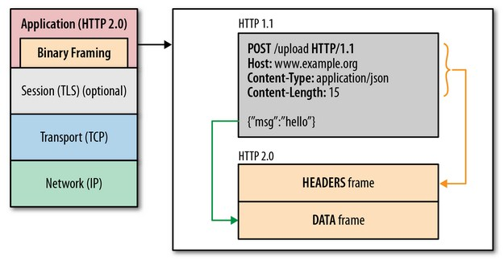
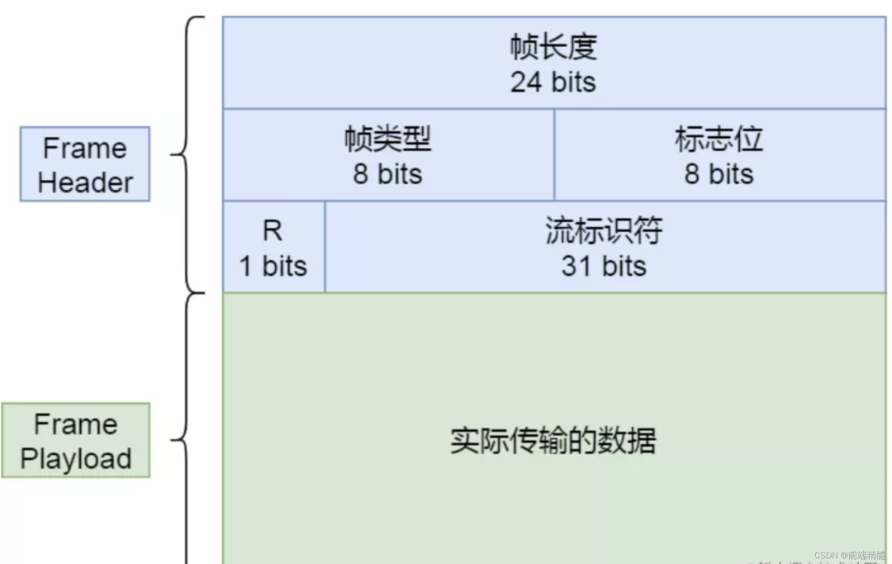
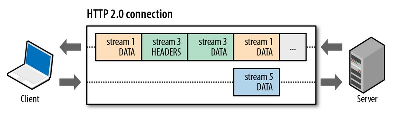

# HTTP2.0二进制分帧层

## HTTP2.0性能增强的核心：二进制分帧

HTTP 2.0最大的特点： 不会改动HTTP 的语义，HTTP 方法、状态码、URI 及首部字段，等等这些核心概念上一如往常，却能致力于突破上一代标准的性能限制，改进传输性能，实现低延迟和高吞吐量。而之所以叫2.0，是在于新增的二进制分帧层。

既然又要保证HTTP的各种动词，方法，首部都不受影响，那就需要在应用层(HTTP2.0)和传输层(TCP or UDP)之间增加一个二进制分帧层。

在二进制分帧层上，HTTP 2.0 会将所有传输的信息分割为更小的消息和帧,并对它们采用二进制格式的编码 ，其中HTTP1.x的首部信息会被封装到Headers帧，而我们的request body则封装到Data帧里面。



然后，HTTP 2.0 通信都在一个连接上完成，这个连接可以承载任意数量的双向数据流。相应地，每个数据流以消息的形式发送，而消息由一或多个帧组成，这些帧可以乱序发送，然后再根据每个帧首部的流标识符重新组装。

在二进制分帧的结构中，头部有8个字节(64Bit)，其中有一个字节(8Bit)来标志帧的类型：

HTTP2.0规定了如下帧类型：

```makefile
DATA: 用于传输HTTP消息体
HEADERS：用户传输关于流的额外的首部字段
PRIORITY:用户指定或者重新指定引用资源的优先级
RST_STRING:用于通知流的非正常终止
SETTINGS：用于通知两端通信方式的数据配置
PUSH_PROMISE:用于发出创建流和服务器引用资源的要约
PING:用于计算往返时间，执行“活性”检查
GOAWAY:用于通知对端停止在当前连接的创建流
WINDOW_UPDATE:用于针对个别流或个别连接实现流量控制
CONTINUATION:用于继续一系列首部块片段
```



## HTTP2.0 首部压缩

HTTP 2.0 在客户端和服务器端使用“首部表”来跟踪和存储之前发送的键-值对，对于相同的数据，不再通过每次请求和响应发送;通信期间几乎不会改变的通用键-值对(用户代理、可接受的媒体类型,等等)只 需发送一次。事实上,如果请求中不包含首部(例如对同一资源的轮询请求),那么 首部开销就是零字节。此时所有首部都自动使用之前请求发送的首部。

如果首部发生变化了，那么只需要发送变化了数据在Headers帧里面，新增或修改的首部帧会被追加到“首部表”。首部表在 HTTP 2.0 的连接存续期内始终存在,由客户端和服务器共同渐进地更新 。

首部压缩的原理

HTTP2使用HPACK算法压缩请求和响应标头的元数据，这种格式支持通过静态霍夫曼编码对传输的头部字段进行编码，从而减小了传输的大小，同时这种压缩算法要求客户端和服务器同时维护和更新一个首部表，这个首部表能够跟踪和存储之前发送过的键值对，对于相同的数据不再通过每次请求和响应进行发送，假如第一个请求发送了所有的头部字段，第二个请求则只需发送有差异的字段，这样可以减少冗余的数据，降低开销。

HPACK主要包含两个压缩模块，索引表和静态霍夫曼编码，其中索引表又包含静态表和动态表。静态表包含61个预定义Header的Key value，传输的时候使用对应的索引Index替换。动态表是一个先进先出的队列，初始的时候是空的，解压header的时候按需添加，每次添加的时候放在队首，移除的时候从队尾开始，动态表的大小不是无限制的。

## 有的HTTP2.0的请求都在一个TCP链接上

HTTP2.0所有通信都是在一个TCP连接上完成。HTTP 2.0 把 HTTP 协议通信的基本单位缩小为一个一个的帧，这些帧对应 着逻辑流中的消息。并行地在同一个 TCP 连接上双向交换消息。就好比，我请求一个页面[http://www.qq.com](http://www.qq.com/)。页面上所有的资源请求都是客户端与服务器上的一条TCP上请求和响应的！

**有关注TCP性能的同学就会知道，HTTP性能的关键在于低延迟而不是高带宽！**大多数HTTP 连接的时间都很短，而且是突发性的，但TCP 只在长时间连接传输大块数据时效率才最高。HTTP 2.0 通过让所有数据流共用同一个连接，可以更有效地使用TCP 连接，让高带宽也能真正的服务于HTTP的性能提升。

同时，单链接多资源的方式，使到至上而下的层面都得到了好处：

1.可以减少服务链接压力,内存占用少了,连接吞吐量大了

2.由于 TCP 连接减少而使网络拥塞状况得以改观;

3.慢启动时间减少,拥塞和丢包恢复速度更快。

**也就是说，“资源合并减少请求”的优化手段对于HTTP2.0来说是没有效果的，只会增大无用的工作量而已。**

## 并行双向字节流的请求和响应

在HTTP2.0上，客户端和服务器可以把HTTP 消息分解为互不依赖的帧，然后乱序发送，最后再在另一端把它们重新组合起来。注意，同一链接上有多个不同方向的数据流在传输。客户端可以一边乱序发送stream，也可以一边接收者服务器的响应，而服务器那端同理。



把 HTTP 消息分解为独立的帧,交错发送,然后在另一端重新组装是 HTTP 2.0 最 重要的一项增强。事实上,这个机制会在整个 Web 技术栈中引发一系列连锁反应, 从而带来巨大的性能提升,因为:

可以并行交错地发送请求,请求之间互不影响;

可以并行交错地发送响应,响应之间互不干扰;

只使用一个连接即可并行发送多个请求和响应;

消除不必要的延迟,从而减少页面加载的时间;

**那么也就是说“域名分区”这种优化手段对于HTTP2.0是无用的，因为资源都是并行交错发送，且没有限制，不需要额外的多域名并行下载。**

## HTTP2.0的请求优先级

每个HTTP2.0流里面有个优先值，这个优先值确定着客户端和服务器处理不同的流采取不同的优先级策略，高优先级的流都应该优先发送，但又不会绝对的。绝对地准守，可能又会引入首队阻塞的问题：高优先级的请求慢导致阻塞其他资源交付。分配处理资源和客户端与服务器间的带宽，不同优先级的混合也是必须的。

## HTTP2.0的服务器推送

HTTP 2.0 新增的一个强大的新功能，就是服务器可以对一个客户端请求发送多个响应。换句话说，除了对最初请求的响应外，服务器还可以额外向客户端推送资源，而无需客户端明确地请求。

有了HTTP2.0的服务器推送，HTTP1.x时代的内嵌资源的优化手段也变得没有意义了。而且使用服务器推送的资源的方式更加高效，因为客户端还可以缓存起来，甚至可以由不同的页面共享（依旧遵循同源策略）。