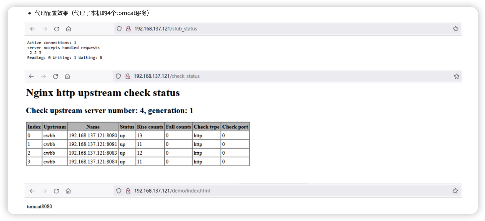

# Nginx配置参数详解


```shell
[root@localhost nginx-1.20.1]# /usr/local/nginx1.20/sbin/nginx
```

- 停止

```shell
[root@localhost nginx-1.20.1]# /usr/local/nginx1.20/sbin/nginx -s stop
```

- 重启

```shell
[root@localhost nginx-1.20.1]# /usr/local/nginx1.20/sbin/nginx -s reload
```

- 查看

```shell
[root@localhost nginx-1.20.1]# ps -ef | grep nginx
```


8 参考配置

```
#user  nobody;
# CPU核心数-1
worker_processes  3;
# nginx错误日志的目录
#error_log  logs/error.log;
error_log  logs/error.log  notice;
#error_log  logs/error.log  info;
# nginx进程id记录文件路径
pid        logs/nginx.pid;
# 单个进程可打开的最大文件数量
worker_rlimit_nofile 1024;
events {
	# epoll 模型对事件处理进行优化
	use epoll;
	# 客户端最大连接数，建议与单个进程可打开的最大文件数量保持一致
    worker_connections  1024;
}
http {
	#  隐藏nginx版本信息
	server_tokens off;
    include       mime.types;
    default_type  application/octet-stream;
	# 日志格式
	log_format  main  '[time:$request_time s] $remote_addr - $remote_user [$time_local] "$request" '  
			  '$status $body_bytes_sent "$http_referer" '
			  '"$http_user_agent" "$http_x_forwarded_for"'
			  '$upstream_addr $upstream_response_time $request_time $upstream_status '
					  '"$http_range" "$sent_http_content_range"'
					  '"$gzip_ratio"'
					  '"$query_string"' 
	'"-http_refer:$http_referer"';	
	# nginx日志缓存，降低日志IO。
	open_log_file_cache max=10240 inactive=60s valid=1m min_uses=2;
	# 文件上传大小
	client_max_body_size 100m;
	client_header_buffer_size 64k;
	large_client_header_buffers 4 4k;
	# 压缩配置
	gzip on;
	gzip_min_length 2k;
	gzip_buffers 4 16k;
	gzip_comp_level 3;
	gzip_vary on;
	gzip_types text/plain application/x-javascript application/javascript application/css  text/css application/xml application/json;
	#	缓存配置
	proxy_connect_timeout 3600s;# Nginx与代理的服务连接超时时间(Nginx请求代理服务)
	proxy_read_timeout 3600s;   # Nginx从代理服务读取文件超时时间
	proxy_send_timeout 3600s;	# Nginx向代理服务写入文件超时时间
	proxy_buffer_size 512k;		# 客户端请求头header大小
	proxy_buffers 64 512k;		# 缓冲区的大小和数量
	proxy_busy_buffers_size 512k;	#
	proxy_temp_file_write_size 512k;	#
	## 当上游服务器的响应过大不能存储到配置的缓冲区域时，Nginx存储临时文件硬盘路径 ，设置为服务器上存在的目录
	proxy_temp_path /usr/local/nginx1.20/cache_temp_path;
	# 注意【cache_one】，后续的location会用到
	proxy_cache_path /usr/local/nginx1.20/cache_path levels=1:2 keys_zone=cache_one:500m inactive=1d max_size=10g use_temp_path=off;
	# proxy_cache_key $host$request_uri;
	client_body_buffer_size 10240k;
	output_buffers 8 64k;
	postpone_output 1460;
	client_header_timeout 120s;
	client_body_timeout 120s;
    sendfile        on;
    keepalive_timeout  65;
	upstream cwbb {
	# 会话保持,必须安装sticky模块
	sticky name="hellosticky";
	server 192.168.137.121:8080 max_fails=5  fail_timeout=600s weight=10;
	server 192.168.137.121:8081 max_fails=5  fail_timeout=600s weight=10;
	server 192.168.137.121:8083 max_fails=5  fail_timeout=600s weight=10;
	server 192.168.137.121:8084 max_fails=5  fail_timeout=600s weight=10;
	check interval=3000 rise=2 fall=5 timeout=1000 type=http;
	}
    server {
        listen       80;
        server_name  localhost;
		
		# 如果没有配置https证书，则listen 443 ssl; ssl_certificate; ssl_certificate_key; ssl_session_cache; ssl_session_timeout;都可以用#注释
		#listen       443 ssl;
		#ssl_certificate      /usr/local/nginx1.20/cert/xxx.crt;
		#ssl_certificate_key  /usr/local/nginx1.20/cert/xxx.key;
		#ssl_session_cache    shared:SSL:10m;
		#ssl_session_timeout  5m;
		#ssl_ciphers  HIGH:!aNULL:!MD5;
		#ssl_prefer_server_ciphers  on;

		location ~* ^.+\.(jpg|jpeg|gif|png|js|ttf|css|json|)$ {
			proxy_pass http://cwbb;
			proxy_ignore_headers X-Accel-Expires Expires Cache-Control Set-Cookie;
			proxy_cache off;
			proxy_redirect off;
			proxy_set_header X-Real-IP $remote_addr;
			proxy_set_header X-Forwarded-For $proxy_add_x_forwarded_for;
			proxy_connect_timeout 180;
			proxy_send_timeout 180;
			proxy_read_timeout 180;
			proxy_buffer_size 128k;
			proxy_buffers 4 128k;
			proxy_busy_buffers_size 128k;
			proxy_temp_file_write_size 128k;
			proxy_cache_valid 200 304 302 24h;
			proxy_cache_key   $server_addr$uri$is_args$args;
			add_header Cache-Control no-cache;
		}
		# check模块配置
        location /check_status {
                   check_status;
                   access_log off;
            }
        # stub模块配置
        location /stub_status {
                   stub_status;
                   access_log off;
            }
        error_page   500 502 503 504  /50x.html;
        location = /50x.html {
            root   html;
        }
		## 根目录访问 ，如果有其他需要代理的路径，则依次增加location即可
		location / {
			## 如果信息中心强制禁止不安全的请求类型，增加如下配置,GET|POST|HEAD是允许的请求类型
			if ($request_method !~ ^(GET|POST|HEAD)$) {
			      return 403 '{"timestamp":"2019-05-30T12:39:03.593","success":false,"errorCode":"403","errorMessage":"不安全的请求类型:$request_method","errorDetail":"不安全的URL：$request_uri","data":null}';
			}
			proxy_pass http://cwbb;
			limit_rate 400k;
			limit_rate_after 5m;
			proxy_connect_timeout 1200;
			proxy_send_timeout 1200s;
			proxy_read_timeout 1200s;
			proxy_redirect off;
			proxy_set_header Host $host;
			proxy_set_header X-Real-IP $remote_addr;
			proxy_set_header X-Forwarded-For $proxy_add_x_forwarded_for;
			add_header Cache-Control no-cache;
		}
    }
}
```



## Nginx配置文件结构

如果你下载好啦，你的安装文件，不妨打开conf文件夹的nginx.conf文件，Nginx服务器的基础配置，默认的配置也存放在此。

在 nginx.conf 的注释符号为： **#**

默认的 nginx 配置文件 nginx.conf 内容如下：

```conf
#user  nobody;
worker_processes  1;

#error_log  logs/error.log;
#error_log  logs/error.log  notice;
#error_log  logs/error.log  info;

#pid        logs/nginx.pid;


events {
    worker_connections  1024;
}


http {
    include       mime.types;
    default_type  application/octet-stream;

    #log_format  main  '$remote_addr - $remote_user [$time_local] "$request" '
    #                  '$status $body_bytes_sent "$http_referer" '
    #                  '"$http_user_agent" "$http_x_forwarded_for"';

    #access_log  logs/access.log  main;

    sendfile        on;
    #tcp_nopush     on;

    #keepalive_timeout  0;
    keepalive_timeout  65;

    #gzip  on;

    server {
        listen       80;
        server_name  localhost;

        #charset koi8-r;

        #access_log  logs/host.access.log  main;

        location / {
            root   html;
            index  index.html index.htm;
        }

        #error_page  404              /404.html;

        # redirect server error pages to the static page /50x.html
        #
        error_page   500 502 503 504  /50x.html;
        location = /50x.html {
            root   html;
        }

        # proxy the PHP scripts to Apache listening on 127.0.0.1:80
        #
        #location ~ \.php$ {
        #    proxy_pass   http://127.0.0.1;
        #}

        # pass the PHP scripts to FastCGI server listening on 127.0.0.1:9000
        #
        #location ~ \.php$ {
        #    root           html;
        #    fastcgi_pass   127.0.0.1:9000;
        #    fastcgi_index  index.php;
        #    fastcgi_param  SCRIPT_FILENAME  /scripts$fastcgi_script_name;
        #    include        fastcgi_params;
        #}

        # deny access to .htaccess files, if Apache's document root
        # concurs with nginx's one
        #
        #location ~ /\.ht {
        #    deny  all;
        #}
    }


    # another virtual host using mix of IP-, name-, and port-based configuration
    #
    #server {
    #    listen       8000;
    #    listen       somename:8080;
    #    server_name  somename  alias  another.alias;

    #    location / {
    #        root   html;
    #        index  index.html index.htm;
    #    }
    #}


    # HTTPS server
    #
    #server {
    #    listen       443 ssl;
    #    server_name  localhost;

    #    ssl_certificate      cert.pem;
    #    ssl_certificate_key  cert.key;

    #    ssl_session_cache    shared:SSL:1m;
    #    ssl_session_timeout  5m;

    #    ssl_ciphers  HIGH:!aNULL:!MD5;
    #    ssl_prefer_server_ciphers  on;

    #    location / {
    #        root   html;
    #        index  index.html index.htm;
    #    }
    #}
}
```

**nginx 文件结构**

```conf
...              #全局块

events {         #events块
   ...
}

http      #http块
{
    ...   #http全局块
    server        #server块
    { 
        ...       #server全局块
        location [PATTERN]   #location块
        {
            ...
        }
        location [PATTERN] 
        {
            ...
        }
    }
    server
    {
      ...
    }
    ...     #http全局块
}
```

- 1、**全局块**：配置影响nginx全局的指令。一般有运行nginx服务器的用户组，nginx进程pid存放路径，日志存放路径，配置文件引入，允许生成worker process数等。
- 2、**events块**：配置影响nginx服务器或与用户的网络连接。有每个进程的最大连接数，选取哪种事件驱动模型处理连接请求，是否允许同时接受多个网路连接，开启多个网络连接序列化等。
- 3、**http块**：可以嵌套多个server，配置代理，缓存，日志定义等绝大多数功能和第三方模块的配置。如文件引入，mime-type定义，日志自定义，是否使用sendfile传输文件，连接超时时间，单连接请求数等。
- 4、**server块**：配置虚拟主机的相关参数，一个http中可以有多个server。
- 5、**location块**：配置请求的路由，以及各种页面的处理情况。

下面给大家上一个配置文件，作为理解。 

```
########### 每个指令必须有分号结束。#################
#user administrator administrators;  #配置用户或者组，默认为nobody nobody。
#worker_processes 2;  #允许生成的进程数，默认为1
#pid /nginx/pid/nginx.pid;   #指定nginx进程运行文件存放地址
error_log log/error.log debug;  #制定日志路径，级别。这个设置可以放入全局块，http块，server块，级别以此为：debug|info|notice|warn|error|crit|alert|emerg
events {
    accept_mutex on;   #设置网路连接序列化，防止惊群现象发生，默认为on
    multi_accept on;  #设置一个进程是否同时接受多个网络连接，默认为off
    #use epoll;      #事件驱动模型，select|poll|kqueue|epoll|resig|/dev/poll|eventport
    worker_connections  1024;    #最大连接数，默认为512
}
http {
    include       mime.types;   #文件扩展名与文件类型映射表
    default_type  application/octet-stream; #默认文件类型，默认为text/plain
    #access_log off; #取消服务日志    
    log_format myFormat '$remote_addr–$remote_user [$time_local] $request $status $body_bytes_sent $http_referer $http_user_agent $http_x_forwarded_for'; #自定义格式
    access_log log/access.log myFormat;  #combined为日志格式的默认值
    sendfile on;   #允许sendfile方式传输文件，默认为off，可以在http块，server块，location块。
    sendfile_max_chunk 100k;  #每个进程每次调用传输数量不能大于设定的值，默认为0，即不设上限。
    keepalive_timeout 65;  #连接超时时间，默认为75s，可以在http，server，location块。

    upstream mysvr {   
      server 127.0.0.1:7878;
      server 192.168.10.121:3333 backup;  #热备
    }
    error_page 404 https://www.baidu.com; #错误页
    server {
        keepalive_requests 120; #单连接请求上限次数。
        listen       4545;   #监听端口
        server_name  127.0.0.1;   #监听地址       
        location  ~*^.+$ {       #请求的url过滤，正则匹配，~为区分大小写，~*为不区分大小写。
           #root path;  #根目录
           #index vv.txt;  #设置默认页
           proxy_pass  http://mysvr;  #请求转向mysvr 定义的服务器列表
           deny 127.0.0.1;  #拒绝的ip
           allow 172.18.5.54; #允许的ip           
        } 
    }
}
```

上面是nginx的基本配置，需要注意的有以下几点：

1、几个常见配置项：

- 1.$remote_addr 与 $http_x_forwarded_for 用以记录客户端的ip地址； 
- 2.$remote_user ：用来记录客户端用户名称； 
- 3.$time_local ： 用来记录访问时间与时区；
- 4.$request ： 用来记录请求的url与http协议；
- 5.$status ： 用来记录请求状态；成功是200；
- 6.$body_bytes_s ent ：记录发送给客户端文件主体内容大小；
- 7.$http_referer ：用来记录从那个页面链接访问过来的；
- 8.$http_user_agent ：记录客户端浏览器的相关信息；

2、惊群现象：一个网路连接到来，多个睡眠的进程被同时叫醒，但只有一个进程能获得链接，这样会影响系统性能。

3、每个指令必须有分号结束。
