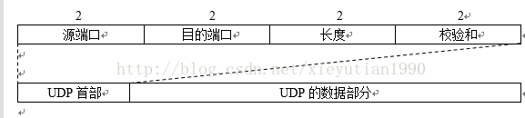

# 计算机网络

## 基础知识

### 概述

#### OSI分层（7层）

- 物理层、数据链路层、网络层、运输层、会话层、表示层、应用层

#### TCP/IP分层（4层）

- 网络接口层、网络层、运输层、应用层

#### 五层协议（5层）

- 物理层、数据链路层、网络层、运输层、应用层

#### 五层结构的概述

1. 应用层：通过应用进程间的交互来完成特定网络应用
   	数据：报文
   	协议：HTTP, SMTP(邮件), FTP(文件传送)
2. 运输层：向两个主机进程之间的通信提供通用的数据传输服务。
   	数据：TCP:报文段，UDP:用户数据报
   	协议：TCP, UDP
3. 网络层：为分组交换网上的不同主机提供通信服务
   	数据：包或IP数据报
   	协议：IP
4. 数据链路层：
   	数据：帧
5. 物理层：
   	数据：比特

ARP地址解析协议:用来获取目标IP地址所对应的MAC地址的

| 功能                 | 常见                                                         | 协议                            |                                              |
| -------------------- | ------------------------------------------------------------ | ------------------------------- | -------------------------------------------- |
| 物理层(比特Bit)      | 设备间接收或发送比特流；说明电压、线速和线缆等。             | 中继器、网线、集线器、HUB等     | RJ45、CLOCK、IEEE802.3等                     |
| 数据链路层(帧Frame)  | 将比特组合成字节，进而组合成帧；用MAC地址访问介质；错误可以被发现但不能被纠正。 | 网卡、网桥、二层交换机等        | PPP、FR、HDLC、VLAN、MAC等                   |
| 网络层(数据包Packet) | 负责数据包从源到宿的传递和网际互连                           | 路由器、多层交换机、防火墙等    | IP、ICMP、ARP、PARP、OSPF、IPX、RIP、IGRP等  |
| 运输层               | 可靠或不可靠数据传输；数据重传前的错误纠正。                 | 进程、端口（socket）            | TCP、UDP、SPX                                |
| 会话层               | 保证不同应用程序的数据独立；建立、管理和终止会话。           | 服务器验证用户登录、断点续传    | NFS、SQL、NetBIOS、RPC                       |
| 表示层               | 数据表示；加密与解密、数据的压缩与解压缩、图像编码与解码等特殊处理过程 | URL加密、口令加密、图片编解码等 | JPEG、MPEG、ASCII                            |
| 应用层               | 用户接口                                                     | --                              | FTP、DNS、Telnet、SNMP、SMTP、HTTP、WWW、NFS |

### 应用层

#### 域名系统DNS

例：某用户通过主机A浏览西安交大的主页 www.xjtu.edu.cn

1. A向本地域名服务器DNS查询
2. 如果DNS上有www.xjtu.edu.cn的记录，就立即返回IP地址给主机A
3. 如果DNS上没有该域名记录，则DNS向根域名服务器发出查询请求
4. 根域名服务器把负责cn域的顶级域名服务器B的IP地址告诉DNS
5. DNS向B查询获得二级域名服务器C的IP地址，最终迭代查询到www.xjtu.edu.cn的ip直接返回DNS

#### HTTP

##### 请求报文


- 常用的 HTTP 请求方法有GET、POST、HEAD、PUT、DELETE、OPTIONS、TRACE、CONNECT;

- GET：当客户端要从服务器中读取某个资源时，使用GET 方法。GET 方法要求服务器将URL 定位的资源放在响应报文的部分，回送给客户端，即向服务器请求某个资源。使用GET 方法时，请求参数和对应的值附加在 URL 后面，利用一个问号(“?”)代表URL 的结尾与请求参数的开始，传递参数长度受限制。例如，/index.jsp?id=100&op=bind。

- POST：当客户端给服务器提供信息较多时可以使用POST 方法，POST 方法向服务器提交数据，比如完成表单数据的提交，将数据提交给服务器处理。GET 一般用于获取/查询资源信息，POST 会附带用户数据，一般用于更新资源信息。POST 方法将请求参数封装在HTTP 请求数据中，以名称/值的形式出现，可以传输大量数据;

- 请求头部：请求头部由关键字/值对组成，每行一对，关键字和值用英文冒号“:”分隔。请求头部通知服务器有关于客户端请求的信息，典型的请求头有：


1. User-Agent：产生请求的浏览器类型;
2. Accept：客户端可识别的响应内容类型列表;星号 “ * ” 用于按范围将类型分组，用 “ / ” 指示可接受全部类型，用“ type/* ”指示可接受 type 类型的所有子类型;
3. Accept-Language：客户端可接受的自然语言;
4. Accept-Encoding：客户端可接受的编码压缩格式;
5. Accept-Charset：可接受的应答的字符集;
6. Host：请求的主机名，允许多个域名同处一个IP 地址，即虚拟主机;
7. connection：连接方式(close 或 keepalive);
8. Cookie：存储于客户端扩展字段，向同一域名的服务端发送属于该域的cookie;

```http
GET /search?hl=zh-CN&source=hp&q=domety&aq=f&oq= HTTP/1.1  
Accept: image/gif, image/x-xbitmap, image/jpeg, image/pjpeg, application/vnd.ms-excel, application/vnd.ms-powerpoint, 
application/msword, application/x-silverlight, application/x-shockwave-flash, */*  
Referer: <a href="http://www.google.cn/">http://www.google.cn/</a>  
Accept-Language: zh-cn  
Accept-Encoding: gzip, deflate  
User-Agent: Mozilla/4.0 (compatible; MSIE 6.0; Windows NT 5.1; SV1; .NET CLR 2.0.50727; TheWorld)  
Host: <a href="http://www.google.cn">www.google.cn</a>  
Connection: Keep-Alive  
Cookie: PREF=ID=80a06da87be9ae3c:U=f7167333e2c3b714:NW=1:TM=1261551909:LM=1261551917:S=ybYcq2wpfefs4V9g; 
NID=31=ojj8d-IygaEtSxLgaJmqSjVhCspkviJrB6omjamNrSm8lZhKy_yMfO2M4QMRKcH1g0iQv9u-2hfBW7bUFwVh7pGaRUb0RnHcJU37y-
FxlRugatx63JLv7CWMD6UB_O_r  
```

##### 响应报文


状态码由三位数字组成，第一位数字表示响应的类型，常用的状态码有五大类如下所示：

1xx：表示服务器已接收了客户端请求，客户端可继续发送请求;
2xx：表示服务器已成功接收到请求并进行处理;
3xx：表示服务器要求客户端重定向;
4xx：表示客户端的请求有非法内容;
5xx：表示服务器未能正常处理客户端的请求而出现意外错误;
200 OK：表示客户端请求成功;

400 Bad Request：表示客户端请求有语法错误，不能被服务器所理解;

401 Unauthonzed：表示请求未经授权，该状态代码必须与 WWW-Authenticate 报头域一起使用;

403 Forbidden：表示服务器收到请求，但是拒绝提供服务，通常会在响应正文中给出不提供服务的原因;

404 Not Found：请求的资源不存在，例如，输入了错误的URL;

500 Internal Server
Error：表示服务器发生不可预期的错误，导致无法完成客户端的请求;

503 Service Unavailable：表示服务器当前不能够处理客户端的请求，在一段时间之后，服务器可能会恢复正常;

响应头部：响应头可能包括：
- Location：Location响应报头域用于重定向接受者到一个新的位置。例如：客户端所请求的页面已不存在原先的位置，为了让客户端重定向到这个页面新的位置，服务器端可以发回Location响应报头后使用重定向语句，让客户端去访问新的域名所对应的服务器上的资源;
- Server：Server 响应报头域包含了服务器用来处理请求的软件信息及其版本。它和 User-Agent 请求报头域是相对应的，前者发送服务器端软件的信息，后者发送客户端软件(浏览器)和操作系统的信息。
- Vary：指示不可缓存的请求头列表;
- Connection：连接方式;

对于请求来说：close(告诉WEB 服务器或者代理服务器，在完成本次请求的响应后，断开连接，不等待本次连接的后续请求了)。keepalive(告诉WEB服务器或者代理服务器，在完成本次请求的响应后，保持连接，等待本次连接的后续请求);

对于响应来说：close(连接已经关闭); keepalive(连接保持着，在等待本次连接的后续请求); Keep-Alive：如果浏览器请求保持连接，则该头部表明希望WEB 服务器保持连接多长时间(秒);例如：Keep-Alive：300;

WWW-Authenticate：WWW-Authenticate响应报头域必须被包含在401 (未授权的)响应消息中，这个报头域和前面讲到的Authorization 请求报头域是相关的，当客户端收到 401 响应消息，就要决定是否请求服务器对其进行验证。如果要求服务器对其进行验证，就可以发送一个包含了Authorization 报头域的请求;
问题：
1. Http1.1与Http1.0的区别
http1.0使用非持久连接（短连接），而http1.1默认是持久连接（长连接），当然也可以配置成非持久连接。

##### Cookie和Session的工作原理

###### Cookie

因为HTTP协议是无状态的，即服务器不知道用户上一次做了什么，这严重阻碍了交互式Web应用程序的实现。在典型的网上购物场景中，用户浏览了几个页面，买了一盒饼干和两饮料。最后结帐时，由于HTTP的无状态性，不通过额外的手段，服务器并不知道用户到底买了什么。为了做到这点，就需要使用到Cookie了。服务器可以设置或读取Cookies中包含信息，借此维护用户跟服务器会话中的状态。

Cookie（复数形态：Cookies），是指某些网站为了辨别用户身份、进行session跟踪而储存在用户本地终端上的数据（通常经过加密）。

Cookie是由服务端生成的，发送给客户端（通常是浏览器）的。Cookie总是保存在客户端中，按在客户端中的存储位置，可分为内存Cookie和硬盘Cookie：

1. 内存Cookie由浏览器维护，保存在内存中，浏览器关闭后就消失了，其存在时间是短暂的。

2. 硬盘Cookie保存在硬盘里，有一个过期时间，除非用户手工清理或到了过期时间，硬盘Cookie不会被删除，其存在时间是长期的。所以，按存在时间，可分为非持久Cookie和持久Cookie。

**工作原理**

> 1、创建Cookie
>
> 当用户第一次浏览某个使用Cookie的网站时，该网站的服务器就进行如下工作：
>
> ①该用户生成一个唯一的识别码（Cookie id），创建一个Cookie对象；
>
> ②默认情况下它是一个会话级别的cookie，存储在浏览器的内存中，用户退出浏览器之后被删除。如果网站希望浏览器将该Cookie存储在磁盘上，则需要设置最大时效（maxAge），并给出一个以秒为单位的时间（将最大时效设为0则是命令浏览器删除该Cookie）；
>
> ③将Cookie放入到HTTP响应报头，将Cookie插入到一个 Set-Cookie HTTP请求报头中。
>
> ④发送该HTTP响应报文。
>
> 2、设置存储Cookie
>
> 浏览器收到该响应报文之后，根据报文头里的Set-Cookied特殊的指示，生成相应的Cookie，保存在客户端。该Cookie里面记录着用户当前的信息。
>
> 3、发送Cookie
>
>
> 当用户再次访问该网站时，浏览器首先检查所有存储的Cookies，如果某个存在该网站的Cookie（即该Cookie所声明的作用范围大于等于将要请求的资源），则把该cookie附在请求资源的HTTP请求头上发送给服务器。
>
> 4、读取Cookie
>
>  服务器接收到用户的HTTP请求报文之后，从报文头获取到该用户的Cookie，从里面找到所需要的东西。

**作用**

> Cookie的根本作用就是在客户端存储用户访问网站的一些信息。典型的应用有：
>
> 1、记住密码，下次自动登录。
>
> 2、购物车功能。
>
> 3、记录用户浏览数据，进行商品（广告）推荐。

**缺陷**

> ①Cookie会被附加在每个HTTP请求中，所以无形中增加了流量。
>
> ②由于在HTTP请求中的Cookie是明文传递的，所以安全性成问题。（除非用HTTPS）
>
> ③Cookie的大小限制在4KB左右。对于复杂的存储需求来说是不够用的。

###### Session

Session代表服务器与浏览器的一次会话过程，这个过程是连续的，也可以时断时续的。Session是一种服务器端的机制，Session 对象用来存储特定用户会话所需的信息。

Session由服务端生成，保存在服务器的内存、缓存、硬盘或数据库中。

**工作原理**

> 1、创建Session
>
> 当用户访问到一个服务器，如果服务器启用Session，服务器就要为该用户创建一个SESSION，在创建这个SESSION的时候，服务器首先检查这个用户发来的请求里是否包含了一个SESSION ID，如果包含了一个SESSION ID则说明之前该用户已经登陆过并为此用户创建过SESSION，那服务器就按照这个SESSION ID把这个SESSION在服务器的内存中查找出来（如果查找不到，就有可能为他新创建一个），如果客户端请求里不包含有SESSION ID，则为该客户端创建一个SESSION并生成一个与此SESSION相关的SESSION ID。这个SESSION ID是唯一的、不重复的、不容易找到规律的字符串，这个SESSION ID将被在本次响应中返回到客户端保存，而保存这个SESSION ID的正是COOKIE，这样在交互过程中浏览器可以自动的按照规则把这个标识发送给服务器。 
>
> 2、使用Session
>
> 我们知道在IE中，我们可以在工具的Internet选项中把Cookie禁止，那么会不会出现把客户端的Cookie禁止了，那么SESSIONID就无法再用了呢？找了一些资料说明，可以有其他机制在COOKIE被禁止时仍然能够把Session id传递回服务器。
>
> 经常被使用的一种技术叫做URL重写，就是把Session id直接附加在URL路径的后面一种是作为URL路径的附加信息,表现形式为： 
>
> http://…./xxx;jSession=ByOK3vjFD75aPnrF7C2HmdnV6QZcEbzWoWiBYEnLerjQ99zWpBng!-145788764； 
>
> 另一种是作为查询字符串附加在URL后面，表现形式为： 
>
> http://…../xxx?jSession=ByOK3vjFD75aPnrF7C2HmdnV6QZcEbzWoWiBYEnLerjQ99zWpBng!-145788764 
>
> 还有一种就是表单隐藏字段。就是服务器会自动修改表单，添加一个隐藏字段，以便在表单提交时能够把Session id传递回服务器。

**作用**

> Session的根本作用就是在服务端存储用户和服务器会话的一些信息。典型的应用有：
>
> 1、判断用户是否登录。
>
> 2、购物车功能。

###### Cookie和Session的区别

1、存放位置不同

Cookie保存在客户端，Session保存在服务端。

2 、存取方式的不同

 Cookie中只能保管ASCII字符串，假如需求存取Unicode字符或者二进制数据，需求先进行编码。Cookie中也不能直接存取Java对象。若要存储略微复杂的信息，运用Cookie是比拟艰难的。 

而Session中能够存取任何类型的数据，包括而不限于String、Integer、List、Map等。Session中也能够直接保管Java Bean乃至任何Java类，对象等，运用起来十分便当。能够把Session看做是一个Java容器类。 

3、安全性（隐私策略）的不同 

Cookie存储在浏览器中，对客户端是可见的，客户端的一些程序可能会窥探、复制以至修正Cookie中的内容。而Session存储在服务器上，对客户端是透明的，不存在敏感信息泄露的风险。 假如选用Cookie，比较好的方法是，敏感的信息如账号密码等尽量不要写到Cookie中。最好是像Google、Baidu那样将Cookie信息加密，提交到服务器后再进行解密，保证Cookie中的信息只要本人能读得懂。而假如选择Session就省事多了，反正是放在服务器上，Session里任何隐私都能够有效的保护。 

4、有效期上的不同 

只需要设置Cookie的过期时间属性为一个很大很大的数字，Cookie就可以在浏览器保存很长时间。 由于Session依赖于名为JSESSIONID的Cookie，而Cookie JSESSIONID的过期时间默许为–1，只需关闭了浏览器（一次会话结束），该Session就会失效。

5、对服务器造成的压力不同 

Session是保管在服务器端的，每个用户都会产生一个Session。假如并发访问的用户十分多，会产生十分多的Session，耗费大量的内存。而Cookie保管在客户端，不占用服务器资源。假如并发阅读的用户十分多，Cookie是很好的选择。

6、 跨域支持上的不同 

Cookie支持跨域名访问，例如将domain属性设置为“.baidu.com”，则以“.baidu.com”为后缀的一切域名均能够访问该Cookie。跨域名Cookie如今被普遍用在网络中。而Session则不会支持跨域名访问。Session仅在他所在的域名内有效。 

#### FTP文件传送协议

自己了解

### 运输层

- 使用UDP和TCP协议的各种应用和应用层协议

| 应用           | 应用层协议             | 运输层协议 |
| -------------- | ---------------------- | ---------- |
| 名字转换       | DNS(域名系统)          | UDP        |
| 文件传送       | TFTP(简单文件传送协议) | UDP        |
| 路由器选择协议 | RIP(路由信息协议)      | UDP        |
| IP地址配置     | DHCP(动态主机配置协议) | UDP        |
| 网络管理       | SNMP(简单网络管理协议) | UDP        |
| 远程服务器     | NFS(网络文件系统)      | UDP        |
| 多播           | IGMP(网际组管理协议)   | UDP        |
| 电子邮件       | SMTP(简单邮件传送协议) | TCP        |
| 远程终端       | TELNET(远程终端协议)   | TCP        |
| 万维网         | HTTP(超文本传送协议)   | TCP        |
| 文件传送       | FTP(文件传送协议)      | TCP        |

- 端口
TCP和UDP都需要有源端口和目的端口

（端口：用16位来表示,即一个主机共有65536个端口.序号小于256的端口称为通用端口,如FTP是21端口,WWW是80端口等.端口用来标识一个服务或应用.一台主机可以同时提供多个服务和建立多个连接.端口(port)就是传输层的应用程序接口.应用层的各个进程是通过相应的端口才能与运输实体进行交互.服务器一般都是通过人们所熟知的端口号来识别的）

服务端

常用的熟知端口

| 应用程序 | FTP  | TELNET | SMTP | DNS  | TFTP | HTTP | SNMP | SNMP(trap) |
| -------- | ---- | ------ | ---- | ---- | ---- | ---- | ---- | ---------- |
| 熟知端口 | 21   | 23     | 25   | 53   | 69   | 80   | 161  | 162        |

登记端口 1024~49151

客户端

端口号由客户进程动态选择。数值范围 49152~65535

#### UDP

##### 特点

1. 无连接的（发送数据之前不需要建立连接，因此减少了开销和发送数据之前的时延）
2. 尽最大努力交付（不保证可靠支付，因此主机不需要维持复杂的连接状态表）
3. 面向报文的（UDP对应用层交下来的报文，添加完首部后就直接交付IP层。如果太长就会分片）
4. UDP没有拥塞控制
5. UDP支持一对一、一对多、多对一和多对多的交互通信
6. UDP的首部开销小（只有8个字节，TCP有20个字节）

##### UDP报文



- 源端口：2字节 = 16bit = 0 ~ 65535
- 目的端口：2字节
- 长度：2字节
- 检验和：2字节

如果接受方UDP发现收到的报文中的目的端口号不正确（不存在对应端口号的应用进程），就会丢弃报文，并有网际控制报文协议ICMP（ping某个地址就是用的ICMP）发送“端口不可达”差错报文给发送方。

UDP用户数据报首部检验和计算时会在UDP用户数据报前增加12个字节的伪首部。

#### TCP

##### 特点

1. 面向连接的运输层协议。
2. 点对点（一对一）通信。
3. 可靠交付。
4. 全双工通信（TCP连接的两端都设有发送缓存和接收缓存，用来临时存放双向通信的数据）。
5. 面向字节流。
6. TCP与UDP在发送报文时所采用的方式完全不同。TCP具体发送的报文由接收方给出的窗口值和当前网络拥塞的程度来决定一个报文段包含多少字节。而UDP发送的报文长度由应用进程给出。

##### TCP可靠传输工作原理

TCP连接的端点叫做套接字(socket)或插口。套接字socket = (IP地址：端口号)

###### 停止等待协议


每发送完一个分组就设置一个超时计时器。
\- 注意：

1. 必须暂时保存已发送的分组的副本
2. 分组和确认分组都必须编号
3. 超市计时器设置的重传时间比数据在分组传输的平均时间更长一些

- 确认丢失和确认迟到


如果接收方接收到数据发送确认没有被发送方接收到，那么发送方超时后会重新发送分组，并且接收方收到重复的分组会丢弃并重传确认。
如果接收方收到的确认是已经接受过的，那么会无视这个确认。

##### 缺点

停止等待协议（自动重传ARQ）虽然简单，但是信道利用率低。


信道利用率U = TD / (TD + RTT + TA)

#### 连续ARQ协议和滑动窗口协议


##### TCP报文格式


1. 源端口和目的端口 各占2字节
2. 序号 4字节
3. 确认号 4字节期望收到对方下一个报文的第一个数据字节的序号
4. 数据偏移 4位
5. 保留 6字节
6. 紧急URG 当URG=1表示紧急指针有效
7. 确认ACK
8. 推送PSH
9. 复位RST 当RST = 1时，释放连接并重新建立连接
10. 同步SYN 当SYN = 1 ACK = 0时，表明这是一个连接请求报文段。
11. 终止FIN FIN = 1，请求释放连接。
12. 窗口
13. 检验和
14. 紧急指针
15. 选项

##### TCP的三次握手


客户端TCP向服务端TCP发送一个特殊的TCP报文段，不包含应用层数据，报文中SYN=1，设置一个初始号client_isn,记录在报文段的序列号seq中。
SYN报文段到达服务器后，为该TCP链接分配缓存和变量，并向客户端发送允许链接的报文段。其中，SYN = 1，ACK = 1

， ack = client_isn+1，seq = server_isn;
客户端收到允许连接的报文后，客户端也给连接分配缓存和变量，客户端向服务端发送一个报文段，其中ack = server_isn+1，SYN = 0，并且由于连接已经建立所以现在可以携带应用层数据。

##### TCP四次挥手


1. 客户端发送连接释放报文段，报文中FIN = 1, seq = u;
2. 服务端接收到连接释放报文后发出确认报文，其中ACK = 1; seq = v; ack = u + 1;
3. 服务端在发送完数据后，发送连接释放报文FIN = 1, seq = w, ack = u + 1;并停止向客户端发送数据。
4. 客户端收到连接释放报文后，发送确认报文， ACK = 1; seq = u + 1; ack = w + 1;并且进入等待2MSL，防止服务端没有接收到确认报文，重传报文。并且使连接产生的报文都消失。

为什么一定要等2MSL？

> 第一，为了保证A发送的最后一个ACK报文能够到达B。这个ACK报文段有可能丢失，因而使处在LAST-ACK状态的B收不到对已发送的FIN+ACK报文段的确认。B会超时重传这个FIN+ACK报文段，而A就能在2MSL时间内收到这个重传的FIN+ACK报文段。如果A在TIME-WAIT状态不等待一段时间，而是在发送完ACK报文段后就立即释放连接，就无法收到B重传的FIN+ACK报文段，因而也不会再发送一次确认报文段。这样，B就无法按照正常的步骤进入CLOSED状态。 
> 第二，A在发送完ACK报文段后，再经过2MSL时间，就可以使本连接持续的时间所产生的所有报文段都从网络中消失。这样就可以使下一个新的连接中不会出现这种旧的连接请求的报文段。 

TCP协议的连接是全双工连接，一个TCP连接存在双向的读写通道。
简单说来是 “先关读，后关写”，一共需要四个阶段。以客户机发起关闭连接为例：
1. 服务器读通道关闭
2. 客户机写通道关闭
3. 客户机读通道关闭
4. 服务器写通道关闭

##### TCP拥塞控制

###### 拥塞控制和流量控制的区别

流量控制针对的是点对点之间的（发送方和接收方）之间的速度匹配服务，因为接收方的应用程序读取的速度不一定很迅速，而接收方的缓存是有限的，就需要避免发送的速度过快而导致的问题。拥塞控制是由于网络中的路由和链路传输速度限制，要避免网络的过载和进行的控制。

###### 拥塞控制算法

拥塞控制算法主要包含了三个部分：慢启动、拥塞避免和快速回复

慢启动
慢开始算法的思路就是，不要一开始就发送大量的数据，先探测一下网络的拥塞程度，也就是说由小到大逐渐增加拥塞窗口的大小。一般一开始为1个MSS，之后翻倍这样来增加，呈指数增长。其中1、慢启动过程有一个阈值ssthresh，一旦到达阈值就进入拥塞避免模式。这是第一种离开结束慢启动的方式2、如果收到了一个丢包提示，就将cwnd设为1并且重新开始慢启动过程，这时要把阈值ssthresh设为当前cwnd值的一半。3、如果收到了三次冗余的ACK，就执行一次快速重传并且进入快速恢复状态，这是最后一种结束慢启动的过程。

拥塞避免
进入拥塞避免说明cwnd值大约是上一次遇到拥塞是的一半，这时候不能翻倍，而是将cwnd的值每次增加一个MSS。结束的过程有两种可能：1、当出现超时时，将cwnd值设为1个MSS，并且将ssthresh阈值设为当前cwnd值的一半。2、当收到三个冗余ACK时，将ssthresh阈值设为当前cwnd值的一半，并且将cwnd值设为当前cwnd值的一半加3，即ssthresh阈值加3，并且进入快速恢复状态。

快速恢复
快速恢复就是指进入快速恢复前的一系列操作，即将ssthresh阈值设为当前cwnd值的一半，并且将cwnd值设为当前cwnd值的一半加3，即ssthresh阈值加3，之后进入拥塞避免状态，即每次cwnd的值加1个MSS。

### 网络层

#### 协议

地址解析协议 ARP
网际控制报文协议 ICMP
网际组管理协议 IGMP

#### IP

IP地址分类：

- A类:1.0.0.0~126.255.255.255,默认子网掩码/8,即255.0.0.0 (其中127.0.0.0~127.255.255.255为环回地址,用于本地环回测试等用途)；

- B类:128.0.0.0~191.255.255.255,默认子网掩码/16,即255.255.0.0；

- C类:192.0.0.0~223.255.255.255,默认子网掩码/24,即255.255.255.0；

- D类:224.0.0.0~239.255.255.255,一般于用组播

- E类:240.0.0.0~255.255.255.255(其中255.255.255.255为全网广播地址),E类地址一般用于研究用途