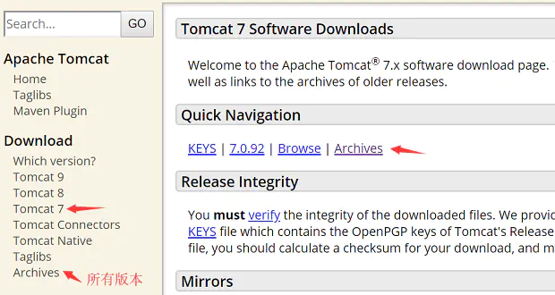
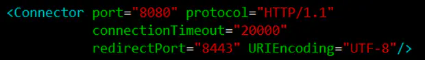
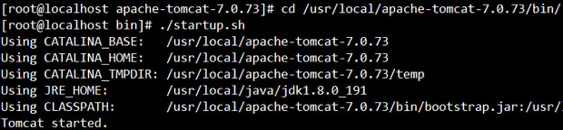
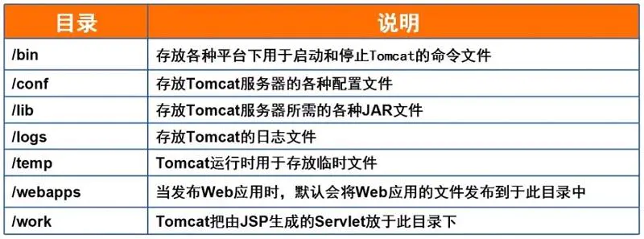
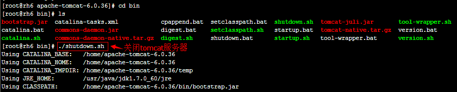
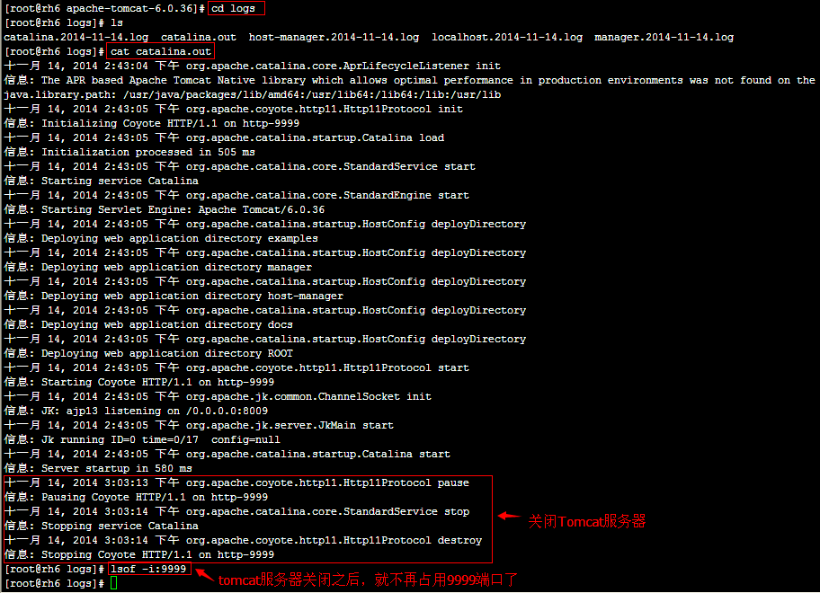
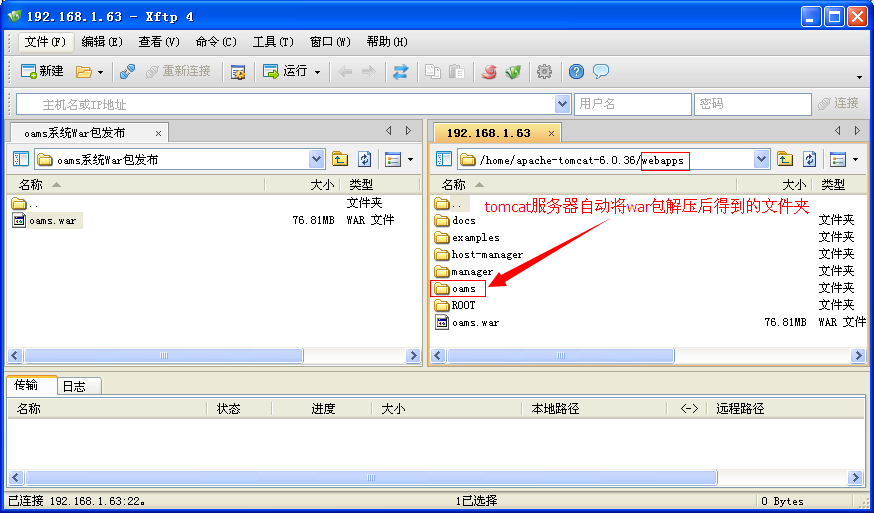
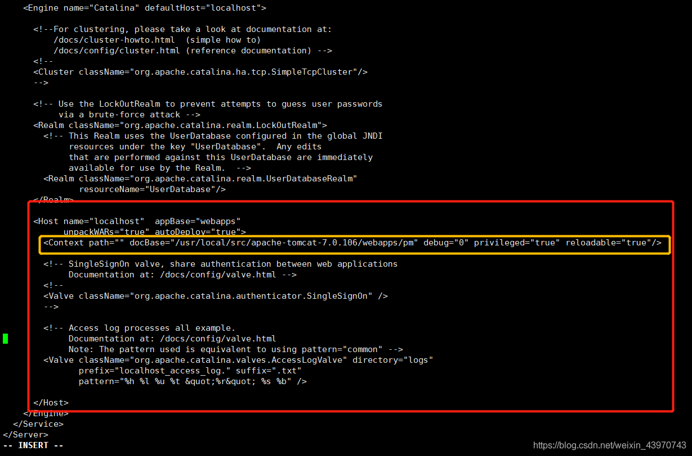

# Linux下使用Tomcat部署war包

Linux下安装Tomcat

`Apache JaKarta`的核心开源项目。
 Tomcat是一个免费的Web应用服务器，也是`JSP/Servlet`容器，可以运行JavaEE程序。
 官网：http://tomcat.apache.org/


三条腿的小猫人人爱

## tomcat安装

### tomcat下载

进入官网，在左侧`download`中选择对应tomcat主版本，然后点击右侧的`Archives`，找到对应的具体版本后进入到bin目录下载tar.gz包，点击`Which version`查看Tomcat版本对应的JDK版本要求。
 这里我们下载的版本是7.0.73



### 安装步骤

1. 首先确保已经安装好了jdk，并且jdk版本能够满足当前Tomcat的版本要求。
2. 解压缩：`tar -zxvf apache-tomcat-7.0.73.tar.gz`
3. 将tomcat移到安装软件位置：`mv apache-tomcat-7.0.73 /usr/local/`

### 环境变量配置

编辑环境变量配置文件：`vim /etc/profile`
 在文件末尾位置添加如下内容(`CATALINA_HOME`为安装tomcat的路径)
 `export CATALINA_HOME=/usr/local/apache-tomcat-7.0.73`
 通过vim的 `":wq"` 命令进行保存退出
 使配置生效：`source /etc/profile`

### 启动端口、字符集配置

进入tomcat安装目录的conf目录，编辑`server.xml`文件
 `cd /usr/local/apache-tomcat-7.0.73/`
 `vim server.xml`
 找到配置8080端口的位置，在节点末尾添加`URIEncoding="UTF-8"`



### tomcat验证

进入tomcat安装目录的bin目录，执行`./startup.sh`，看到如图提示代表启动成功。



可以通过主机的ip地址+8080端口访问tomcat主页，比如：http://192.168.0.110:8080/
 需要注意检查防火墙是否关闭，如果未关闭需要配置iptables规则开放8080端口。
 关闭iptables规则：`iptables -F & iptables -t nat -F`

### Tomcat启动与关闭

Tomcat启动：`${CATALINA_HOME}/bin/startup.sh`
 Tomcat关闭：`${CATALINA_HOME}/bin/shutdown.sh`
 `${CATALINA_HOME}`代表tomcat的安装路径

### Tomcat的目录结构

### 

## war包部署

### 停止运行Tomcat



　查看tomcat服务器的Log信息，看看tomcat服务器是否已经正常关闭，进入tomcat服务器下的logs目录，打开catalina.out文件进行查看，如下图所示：



### 部署

1、下载或者生成war包（从maven上下载war包，并改名字为turbine.war）

2、将turbine.war拷贝到$TOMCAT_HOME/webapps中

3、添加如下语句到$TOMCAT_HOME/conf/server.xml


Tomcat服务器自动解压缩war包



检查一下tomcat服务器是否自动在conf目录下创建了Catalina/localhost目录，在看看localhost目录下是否有tomcat服务器自动创建的oams.xml文件

.png)

### 修改访问路径为根路径

修改 ：tomcat/conf/server.xml，在Host配置段中添加类似于如下内容：如下图

docBase 路径配置成：webapps全路径 + war包名

```xml
<Context path="" docBase="/usr/local/src/apache-tomcat-7.0.106/webapps/pm" debug="0" privileged="true" reloadable="true"/>
```

