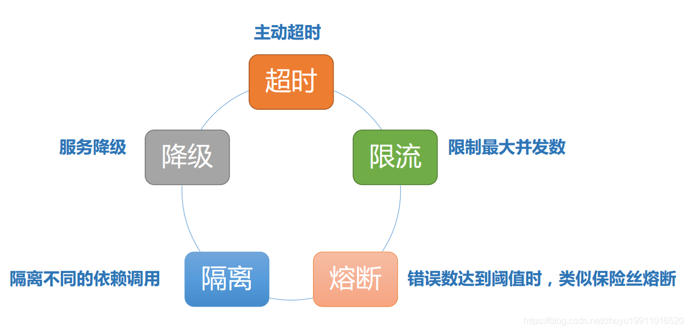
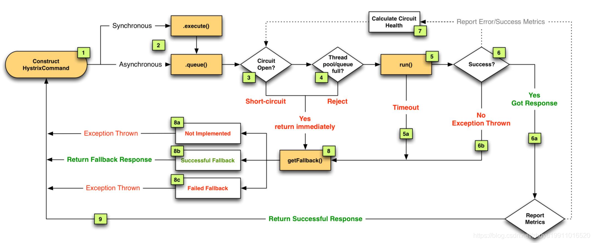
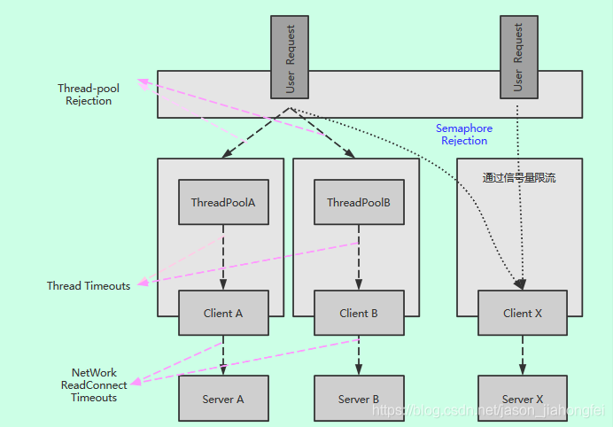
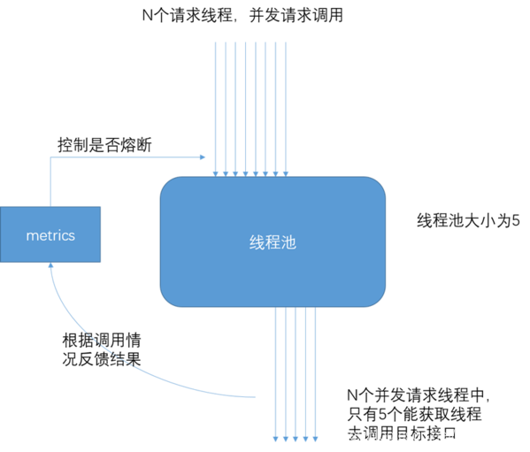
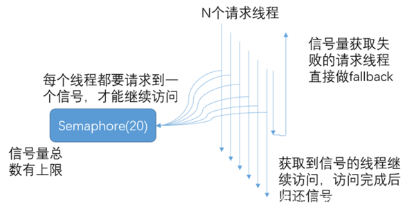
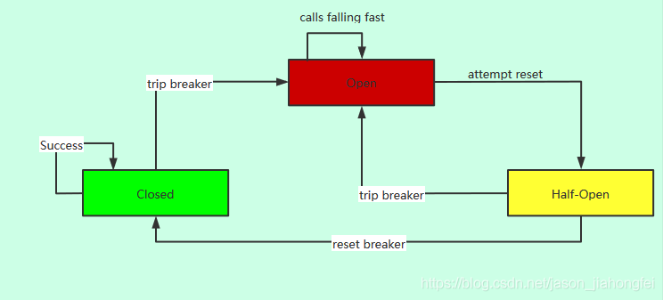

# Hystrix

## 容错理念

- 凡是依赖都可能会失败
- 凡是资源都有限制（CPU、内存、线程池）
- 网络并不靠谱
- 延迟是应用稳定性最大杀手（可能由于延迟最终拖垮整个微服务，给服务设置一个超时时间来解决延迟引起的问题）

**为什么服务要进行隔离、熔断、降级？当服务出现异常时可以和其他服务隔离开来，不影响其他服务**

隔离：将请求封装在HystrixCommand中，然后这些请求在一个独立的线程中执行，每个依赖服务维护一个小的线程池（或信号量），在调用失败或超时的情况下可以断开依赖调用或者返回指定逻辑
熔断：当HystrixCommand请求后端服务失败数量超过一定比例(默认50%), 断路器会切换到开路状态(Open). 这时所有请求会直接失败而不会发送到后端服务，断路器保持在开路状态一段时间后(默认5秒)，自动切换到半开路状态(HALF-OPEN)，这时会判断下一次请求的返回情况， 如果请求成功, 断路器切回闭路状态(CLOSED)，否则重新切换到开路状态(OPEN)
降级：服务降级是指当请求后端服务出现异常的时候, 可以使用fallback方法返回的值

## 基本的容错模式

1.主动超时：Http请求主动设置一个超时时间，超时就直接返回，不会造成服务堆积
2.限流：限制最大并发数
3.熔断：当错误数超过阈值时快速失败，不调用后端服务，同时隔一定时间放几个请求去重试后端服务是否能正常调用，如果成功则关闭熔断状态，失败则继续快速失败，直接返回。（此处有个重试，重试就是弹性恢复的能力）
4.隔离：把每个依赖或调用的服务都隔离开来，防止级联失败引起整体服务不可用
5.降级：服务失败或异常后，返回指定的默认信息



## Hystrix 容错流程



上面有 9 个步骤，下面分别讲解每一步骤：

1.每个请求都会封装到 HystrixCommand 中
2.请求会以同步或异步的方式进行调用
3.判断熔断器是否打开，如果打开，它会直接跳转到 8 ，进行降级
4.判断线程池/队列/信号量是否跑满，如果跑满进入降级步骤8
5.如果前面没有错误，就调用 run 方法，运行依赖逻辑
	运行方法可能会超时，超时后从 5a 到 8，进行降级
6.运行过程中如果发生异常，会从 6b 到 8，进行降级
	运行正常会进入 6a，正常返回回去，同时把错误或正常调用结果告诉 7 （Calculate Circuit Health）
7.Calculate Circuit Health它是 Hystrix 的大脑，是否进行熔断是它通过错误和成功调用次数计算出来的
8.降级方法（8a没有实现降级、8b实现降级且成功运行、8c实现降级方法，但是出现异常）
	8a.没有实现降级方法，直接返回异常信息回去
	8b.实现降级方法，且降级方法运行成功，则返回降级后的默认信息回去
	8c.实现降级方法，但是降级也可能出现异常，则返回异常信息回去

### 线程隔离

#### 线程池原理

谈到线程池就会想到池化技术，其中最核心的思想就是把宝贵的资源放到一个池子中；每次使用都从里面获取，用完之后又放回池子供其他人使用，有点吃大锅饭的意思。

那在 Java 中又是如何实现的呢？

在 JDK 1.5 之后推出了相关的 api，常见的创建线程池方式有以下几种：

- `Executors.newCachedThreadPool()`：无限线程池。

- `Executors.newFixedThreadPool(nThreads)`：创建固定大小的线程池。

- `Executors.newSingleThreadExecutor()`：创建单个线程的线程池。

- 其实看这三种方式创建的源码就会发现：

  ```Java
      public static ExecutorService newCachedThreadPool() {
          return new ThreadPoolExecutor(0, Integer.MAX_VALUE,
                                        60L, TimeUnit.SECONDS,
                                        new SynchronousQueue<Runnable>());
      }
  ```

  实际上还是利用 `ThreadPoolExecutor` 类实现的。

  所以我们重点来看下 `ThreadPoolExecutor` 是怎么玩的。

  首先是创建线程的 api：

  ```
  ThreadPoolExecutor(int corePoolSize, int maximumPoolSize, long keepAliveTime, TimeUnit unit, BlockingQueue<Runnable> workQueue, RejectedExecutionHandler handler) 
  ```

  这几个核心参数的作用：

  - `corePoolSize` 为线程池的基本大小。
  - `maximumPoolSize` 为线程池最大线程大小。
  - `keepAliveTime` 和 `unit` 则是线程空闲后的存活时间。
  - `workQueue` 用于存放任务的阻塞队列。
  - `handler` 当队列和最大线程池都满了之后的饱和策略。

  了解了这几个参数再来看看实际的运用。

  通常我们都是使用:

  ```
  threadPool.execute(new Job());
  ```

  这样的方式来提交一个任务到线程池中，所以核心的逻辑就是 `execute()` 函数了。

  在具体分析之前先了解下线程池中所定义的状态，这些状态都和线程的执行密切相关：

  - `RUNNING` 自然是运行状态，指可以接受任务执行队列里的任务
  - `SHUTDOWN` 指调用了 `shutdown()` 方法，不再接受新任务了，但是队列里的任务得执行完毕。
  - `STOP` 指调用了 `shutdownNow()` 方法，不再接受新任务，同时抛弃阻塞队列里的所有任务并中断所有正在执行任务。
  - `TIDYING` 所有任务都执行完毕，在调用 `shutdown()/shutdownNow()` 中都会尝试更新为这个状态。
  - `TERMINATED` 终止状态，当执行 `terminated()` 后会更新为这个状态。

  然后看看 `execute()` 方法是如何处理的：

  1. 获取当前线程池的状态。
  2. 当前线程数量小于 coreSize 时创建一个新的线程运行。
  3. 如果当前线程处于运行状态，并且写入阻塞队列成功。
  4. 双重检查，再次获取线程池状态；如果线程池状态变了（非运行状态）就需要从阻塞队列移除任务，并尝试判断线程是否全部执行完毕。同时执行拒绝策略。
  5. 如果当前线程池为空就新创建一个线程并执行。
  6. 如果在第三步的判断为非运行状态，尝试新建线程，如果失败则执行拒绝策略。

  ##### 如何配置线程

  流程聊完了再来看看上文提到了几个核心参数应该如何配置呢？

  有一点是肯定的，线程池肯定是不是越大越好。

  通常我们是需要根据这批任务执行的性质来确定的。

  - IO 密集型任务：由于线程并不是一直在运行，所以可以尽可能的多配置线程，比如 CPU 个数 * 2
  - CPU 密集型任务（大量复杂的运算）应当分配较少的线程，比如 CPU 个数相当的大小。

  当然这些都是经验值，最好的方式还是根据实际情况测试得出最佳配置。

  ##### 优雅的关闭线程池

  有运行任务自然也有关闭任务，从上文提到的 5 个状态就能看出如何来关闭线程池。

  其实无非就是两个方法 `shutdown()/shutdownNow()`。

  但他们有着重要的区别：

  - `shutdown()` 执行后停止接受新任务，会把队列的任务执行完毕。
  - `shutdownNow()` 也是停止接受新任务，但会中断所有的任务，将线程池状态变为 stop。

  > 两个方法都会中断线程，用户可自行判断是否需要响应中断。

  `shutdownNow()` 要更简单粗暴，可以根据实际场景选择不同的方法。

  我通常是按照以下方式关闭线程池的：

  ```
          long start = System.currentTimeMillis();
          for (int i = 0; i <= 5; i++) {
              pool.execute(new Job());
          }
  
          pool.shutdown();
  
          while (!pool.awaitTermination(1, TimeUnit.SECONDS)) {
              LOGGER.info("线程还在执行。。。");
          }
          long end = System.currentTimeMillis();
          LOGGER.info("一共处理了【{}】", (end - start));
  ```

  `pool.awaitTermination(1, TimeUnit.SECONDS)` 会每隔一秒钟检查一次是否执行完毕（状态为 `TERMINATED`），当从 while 循环退出时就表明线程池已经完全终止了。

  ##### SpringBoot 使用线程池

  2018 年了，SpringBoot 盛行；来看看在 SpringBoot 中应当怎么配置和使用线程池。

  既然用了 SpringBoot ，那自然得发挥 Spring 的特性，所以需要 Spring 来帮我们管理线程池：

  ```
  @Configuration
  public class TreadPoolConfig {
  
  
      /**
       * 消费队列线程
       * @return
       */
      @Bean(value = "consumerQueueThreadPool")
      public ExecutorService buildConsumerQueueThreadPool(){
          ThreadFactory namedThreadFactory = new ThreadFactoryBuilder()
                  .setNameFormat("consumer-queue-thread-%d").build();
  
          ExecutorService pool = new ThreadPoolExecutor(5, 5, 0L, TimeUnit.MILLISECONDS,
                  new ArrayBlockingQueue<Runnable>(5),namedThreadFactory,new ThreadPoolExecutor.AbortPolicy());
  
          return pool ;
      }
  
  
  
  }
  ```

  使用时：

  ```
      @Resource(name = "consumerQueueThreadPool")
      private ExecutorService consumerQueueThreadPool;
  
  
      @Override
      public void execute() {
  
          //消费队列
          for (int i = 0; i < 5; i++) {
              consumerQueueThreadPool.execute(new ConsumerQueueThread());
          }
  
      }
  ```

  其实也挺简单，就是创建了一个线程池的 bean，在使用时直接从 Spring 中取出即可。

#### 资源隔离

Hystrix支持线程池隔离和信号量隔离两种，默认为线程池隔离



##### 线程池隔离



如果我们很多业务都依赖于同一个线程池,当其中一个业务因为各种不可控的原因消耗了所有的线程，导致线程池全部占满。

这样其他的业务也就不能正常运转了，这对系统的打击是巨大的。

比如我们 Tomcat 接受请求的线程池，假设其中一些响应特别慢，线程资源得不到回收释放；线程池慢慢被占满，最坏的情况就是整个应用都不能提供服务。

所以我们需要将线程池**进行隔离**。

通常的做法是按照业务进行划分：

> 比如下单的任务用一个线程池，获取数据的任务用另一个线程池。这样即使其中一个出现问题把线程池耗尽，那也不会影响其他的任务运行。

这样的需求 [Hystrix](https://github.com/Netflix/Hystrix) 已经帮我们实现了。

> Hystrix 是一款开源的容错插件，具有依赖隔离、系统容错降级等功能。

下面来看看 `Hystrix` 简单的应用：

首先需要定义两个线程池，分别用于执行订单、处理用户。

```Java
/**
 * Function:订单服务
 *
 * @author crossoverJie
 *         Date: 2018/7/28 16:43
 * @since JDK 1.8
 */
public class CommandOrder extends HystrixCommand<String> {

    private final static Logger LOGGER = LoggerFactory.getLogger(CommandOrder.class);

    private String orderName;

    public CommandOrder(String orderName) {


        super(Setter.withGroupKey(
                //服务分组
                HystrixCommandGroupKey.Factory.asKey("OrderGroup"))
                //线程分组
                .andThreadPoolKey(HystrixThreadPoolKey.Factory.asKey("OrderPool"))

                //线程池配置
                .andThreadPoolPropertiesDefaults(HystrixThreadPoolProperties.Setter()
                        .withCoreSize(10)
                        .withKeepAliveTimeMinutes(5)
                        .withMaxQueueSize(10)
                        .withQueueSizeRejectionThreshold(10000))

                .andCommandPropertiesDefaults(
                        HystrixCommandProperties.Setter()
                                .withExecutionIsolationStrategy(HystrixCommandProperties.ExecutionIsolationStrategy.THREAD))
        )
        ;
        this.orderName = orderName;
    }


    @Override
    public String run() throws Exception {

        LOGGER.info("orderName=[{}]", orderName);

        TimeUnit.MILLISECONDS.sleep(100);
        return "OrderName=" + orderName;
    }


}


/**
 * Function:用户服务
 *
 * @author crossoverJie
 *         Date: 2018/7/28 16:43
 * @since JDK 1.8
 */
public class CommandUser extends HystrixCommand<String> {

    private final static Logger LOGGER = LoggerFactory.getLogger(CommandUser.class);

    private String userName;

    public CommandUser(String userName) {


        super(Setter.withGroupKey(
                //服务分组
                HystrixCommandGroupKey.Factory.asKey("UserGroup"))
                //线程分组
                .andThreadPoolKey(HystrixThreadPoolKey.Factory.asKey("UserPool"))

                //线程池配置
                .andThreadPoolPropertiesDefaults(HystrixThreadPoolProperties.Setter()
                        .withCoreSize(10)
                        .withKeepAliveTimeMinutes(5)
                        .withMaxQueueSize(10)
                        .withQueueSizeRejectionThreshold(10000))

                //线程池隔离
                .andCommandPropertiesDefaults(
                        HystrixCommandProperties.Setter()
                                .withExecutionIsolationStrategy(HystrixCommandProperties.ExecutionIsolationStrategy.THREAD))
        )
        ;
        this.userName = userName;
    }


    @Override
    public String run() throws Exception {

        LOGGER.info("userName=[{}]", userName);

        TimeUnit.MILLISECONDS.sleep(100);
        return "userName=" + userName;
    }


}
```

------

`api` 特别简洁易懂，具体详情请查看官方文档。

然后模拟运行：

```Java
    public static void main(String[] args) throws Exception {
        CommandOrder commandPhone = new CommandOrder("手机");
        CommandOrder command = new CommandOrder("电视");


        //阻塞方式执行
        String execute = commandPhone.execute();
        LOGGER.info("execute=[{}]", execute);

        //异步非阻塞方式
        Future<String> queue = command.queue();
        String value = queue.get(200, TimeUnit.MILLISECONDS);
        LOGGER.info("value=[{}]", value);


        CommandUser commandUser = new CommandUser("张三");
        String name = commandUser.execute();
        LOGGER.info("name=[{}]", name);
    }
```

------

运行结果：

可以看到两个任务分成了两个线程池运行，他们之间互不干扰。

获取任务任务结果支持同步阻塞和异步非阻塞方式，可自行选择。

它的实现原理其实容易猜到：

> 利用一个 Map 来存放不同业务对应的线程池。

构造函数中也能证明：

还要注意的一点是：

> 自定义的 Command 并不是一个单例，每次执行需要 new 一个实例，不然会报 `This instance can only be executed once. Please instantiate a new instance.` 异常。

##### 信号量隔离

信号量的隔离：
it executes on the calling thread and concurrent requests are limited by the semaphore count.

每次调用线程，当前请求通过计数信号量进行限制，当信号大于了最大请求数（maxConcurrentRequests）时，进行限制，调用fallback接口快速返回。



最重要的是，信号量的调用是同步的，也就是说，每次调用都得阻塞调用方的线程，直到结果返回。这样就导致了无法对访问做超时（只能依靠调用协议超时，无法主动释放）

官网对信号量隔离的描述建议

Generally the only time you should use semaphore isolation for HystrixCommands is when the call is so high volume (hundreds per second, per instance) that the overhead of separate threads is too high; this typically only applies to non-network calls.

隔离的细粒度太高，数百个实例需要隔离，此时用线程池做隔离开销过大通常这种都是非网络调用的情况下线程池隔离:
it executes on a separate thread and concurrent requests are limited by the number of threads in the thread-pool
通过每次都开启一个单独线程运行。它的隔离是通过线程池，即每个隔离粒度都是个线程池，互相不干扰

### 熔断

当HystrixCommand请求后端服务失败数量超过一定比例(默认50%), 断路器会切换到开路状态(Open). 这时所有请求会直接失败而不会发送到后端服务，断路器保持在开路状态一段时间后(默认5秒)，自动切换到半开路状态(HALF-OPEN)，这时会判断下一次请求的返回情况， 如果请求成功, 断路器切回闭路状态(CLOSED)，否则重新切换到开路状态(OPEN)



```Java
@HystrixCommand(
        commandProperties = {
                //打开熔断开关
                @HystrixProperty(name="circuitBreaker.enabled",value="true"),
                //最小的请求次数
                @HystrixProperty(name="circuitBreaker.requestVolumeThreshold",value="5"),
                //熔断时间
                @HystrixProperty(name="circuitBreaker.sleepWindowInMilliseconds",value="5000"),
                //失败百分比
                @HystrixProperty(name="circuitBreaker.errorThresholdPercentage",value="50")
        },
        fallbackMethod = "fallback")
```

请求超时触发熔断降级（默认1000毫秒）

### 降级

在注解处通过Spring的AOP拦截，不走之前的业务逻辑，而走专门写好的降级方法