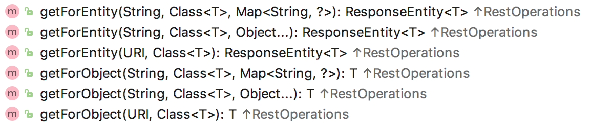
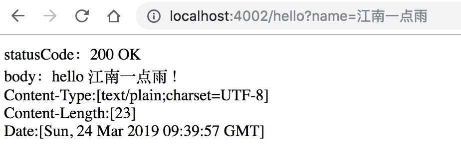
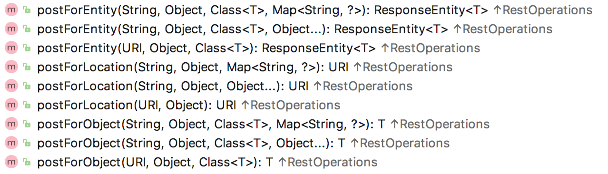

# RestTemplate

RestTemplate 是由 Spring 提供的一个 HTTP 请求工具。在上文的案例中，开发者也可以不使用 RestTemplate ，使用 Java 自带的 HttpUrlConnection 或者经典的网络访问框架 HttpClient 也可以完成上文的案例，只是在 Spring 项目中，使用 RestTemplate 显然更方便一些。

RestTemplate 是从 Spring3.0 开始支持的一个 HTTP 请求工具，它提供了常见的REST请求方案的模版，例如 GET 请求、POST 请求、PUT 请求、DELETE 请求以及一些通用的请求执行方法 exchange 以及 execute。RestTemplate 继承自 InterceptingHttpAccessor 并且实现了 RestOperations 接口，其中 RestOperations 接口定义了基本的 RESTful 操作，这些操作在 RestTemplate 中都得到了实现。接下来我们就来看看这些操作方法的使用。

## GET 请求

在 RestTemplate 中，和 GET 请求相关的方法有如下几个：



这里的方法一共有两类，getForEntity（获得实体） 和 getForObject（获得对象），每一类有三个重载方法，下面我们分别予以介绍。

### getForEntity

既然 RestTemplate 发送的是 HTTP 请求，那么在响应的数据中必然也有响应头，如果开发者需要获取响应头的话，那么就需要使用 getForEntity 来发送 HTTP 请求，此时返回的对象是一个 ResponseEntity 的实例。这个实例中包含了响应数据以及响应头。

```Java
@RestController
public class UseHelloController {
    @Autowired
    DiscoveryClient discoveryClient;
    @Autowired
    RestTemplate restTemplate;

    @GetMapping("/hello")
    public String hello(String name) {
        List<ServiceInstance> list = discoveryClient.getInstances("provider");
        ServiceInstance instance = list.get(0);
        String host = instance.getHost();
        int port = instance.getPort();
        String url = "http://" + host + ":" + port + "/hello?name={1}";
        ResponseEntity<String> responseEntity = restTemplate.getForEntity(url, String.class, name);
        StringBuffer sb = new StringBuffer();
        HttpStatus statusCode = responseEntity.getStatusCode();
        String body = responseEntity.getBody();
        sb.append("statusCode：")
                .append(statusCode)
                .append("</br>")
                .append("body：")
                .append(body)
                .append("</br>");
        HttpHeaders headers = responseEntity.getHeaders();
        Set<String> keySet = headers.keySet();
        for (String s : keySet) {
            sb.append(s)
                    .append(":")
                    .append(headers.get(s))
                    .append("</br>");
        }
        return sb.toString();
    }
}
```

来看 getForEntity 方法。第一个参数是 url ，url 中有一个占位符 {1} ,如果有多个占位符分别用 {2} 、 {3} … 去表示，第二个参数是接口返回的数据类型，最后是一个可变长度的参数，用来给占位符填值。在返回的 ResponseEntity 中，可以获取响应头中的信息，其中 getStatusCode 方法用来获取响应状态码， getBody 方法用来获取响应数据， getHeaders 方法用来获取响应头，在浏览器中访问该接口，结果如下：



当然，这里参数的传递除了这一种方式之外，还有另外两种方式，也就是 getForEntity 方法的另外两个重载方法。

第一个是占位符不使用数字，而是使用参数的 key，同时将参数放入到一个 map 中。map 中的 key 和占位符的 key 相对应，map 中的 value 就是参数的具体值，例如还是上面的请求，利用 map 来传递参数，请求方式如下：

```Java
Map<String, Object> map = new HashMap<>();
String url = "http://" + host + ":" + port + "/hello?name={name}";
map.put("name", name);
ResponseEntity<String> responseEntity = restTemplate.getForEntity(url, String.class, map);
```

第二个是使用 Uri 对象，使用 Uri 对象时，参数可以直接拼接在地址中，例如下面这样：

```Java
String url = "http://" + host + ":" + port + "/hello?name="+ URLEncoder.encode(name,"UTF-8");
URI uri = URI.create(url);
ResponseEntity<String> responseEntity = restTemplate.getForEntity(uri, String.class);
```

但需要注意的是，这种传参方式，参数如果是中文的话，需要对参数进行编码，使用 `URLEncoder.encode` 方法来实现。

### getForObject

```Java
String url = "http://" + host + ":" + port + "/hello?name=" + URLEncoder.encode(name, "UTF-8");
URI uri = URI.create(url);
String s = restTemplate.getForObject(uri, String.class);
```

这里返回的 s 就是 provider 的返回值，如果开发者只关心 provider 的返回值，并不关系 HTTP 请求的响应头，那么可以使用该方法。

总之，GET请求就是把参数拼到URL路径里，至于怎么拼出来那就随便了

## POST 请求



POST请求只比GET请求多一个postForLocation方法

### postForLocation

postForLocation 方法的返回值是一个 Uri 对象，因为 POST 请求一般用来添加数据，有的时候需要将刚刚添加成功的数据的 URL 返回来，此时就可以使用这个方法，一个常见的使用场景如用户注册功能，用户注册成功之后，可能就自动跳转到登录页面了，此时就可以使用该方法。例如在 provider 中提供一个用户注册接口，再提供一个用户登录接口，注册之后直接跳转登录接口如下：

```Java
@GetMapping("/hello8")
public String hello8() {
    List<ServiceInstance> list = discoveryClient.getInstances("provider");
    ServiceInstance instance = list.get(0);
    String host = instance.getHost();
    int port = instance.getPort();
    String url = "http://" + host + ":" + port + "/register";
    MultiValueMap map = new LinkedMultiValueMap();
    map.add("username", "牧码小子");
    map.add("address", "深圳");
    #注册
    URI uri = restTemplate.postForLocation(url, map);
    #跳转登录
    String s = restTemplate.getForObject(uri, String.class);
    return s;
}
```

没啥卵用

PUT请求、DELETE请求用到了自己看