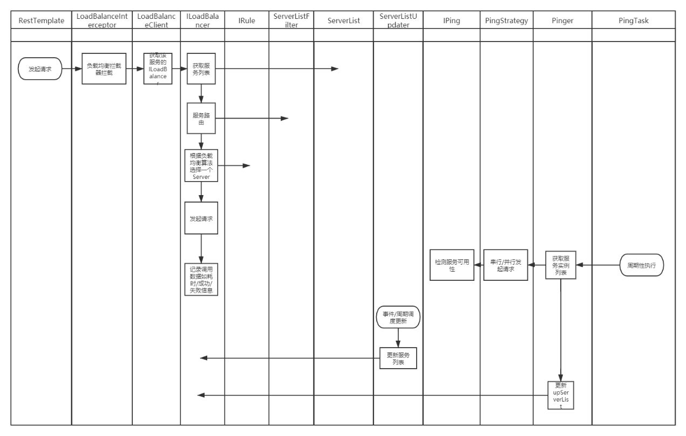

# 负载均衡Ribbon

## 工作流程

服务消费者在与Eureka通信后，本地会有服务列表缓存，在restTemplate调用时会自动将服务名替换为真实的IP地址+端口号

```java
#不使用负载均衡的写法
restTemplate.getForObject("http://192.168.1.100:9091/test/test1?id=1", void.class); 
#使用负载均衡的写法
restTemplate.getForObject("http://provider-springcloud/test/test1?id=1", void.class);
```

示例中的provider-springcloud就是服务名。

Ribbo会通过aop，在restTemplate真正开始前

获取我们具体要使用的服务信息集合

```java
public interface ILoadBalancer {
    void addServers(List<Server> var1);
    //从列表中获取具体某个服务
    Server chooseServer(Object var1);
 
    void markServerDown(Server var1);
 
    /** @deprecated */
    @Deprecated
    List<Server> getServerList(boolean var1);
 
    List<Server> getReachableServers();
    //获取服务列表
    List<Server> getAllServers();
}
```

然后通过我们选定的负载均衡算法（默认是轮询），提供一个我们具体要访问的服务。将该服务的ip地址+端口号拼成字符串，替换原本restTemplate要访问的服务。这样就实现了负载均衡



### @LoadBalanced原理

在Ribbon示例中可以看到，Ribbon通过一个@LoadBalanced注解就实现了RestTemplate请求的负载均衡，那么他的原理是什么呢？

RestTemplate在发送请求的时候会被ClientHttpRequestInterceptor拦截，LoadBalancerInterceptor是ClientHttpRequestInterceptor的实现类，它的作用就是用于RestTemplate的负载均衡，LoadBalancerInterceptor将负载均衡的核心逻辑交给了loadBalancer，核心代码如下所示

```Java
public ClientHttpResponse intercept(final HttpRequest request, final byte[] body,
		final ClientHttpRequestExecution execution) throws IOException {
	final URI originalUri = request.getURI();
	String serviceName = originalUri.getHost();
	Assert.state(serviceName != null, "Request URI does not contain a valid hostname: " + originalUri);
	return this.loadBalancer.execute(serviceName, requestFactory.createRequest(request, body, execution));
}
```

### 获取服务实例列表的两种方式

#### 从配置文件

总之就是很low

#### 从注册中心

服务消费者会有一级注册信息列表缓存，直接从里面获取

### 动态更新服务实例列表

#### 定时拉取

每30秒访问一次注册中心，拉取最新服务

#### 通过事件监听

当有服务提供者注册进注册中心后，服务消费者会通过监听注册操作来触发事件

#### 对服务进行主动心跳检测

服务列表中的服务实例未必一直都处于可用的状态，Ribbon会对服务实例进行检测，PingerStrategy接口抽象检测的策略，Ribbon默认采用了串行的方式进行检测，如果有必要，我们可以通过该接口实现并行的检测方式。Pinger会定时通过PingerStrategy获取更新的服务实例，并调用监听者。

## 负载均衡调度器ILoadBalancer

ILoadBalancer需要使用某个策略从集合中选择一个服务实例， 而策略的抽象接口为IRule

```java
public interface IRule{
    //省略一些不重要的方法
    public Server choose(Object key);

}
```

| 名称                      | 解释                                                         |
| ------------------------- | ------------------------------------------------------------ |
| RoundRobinRule            | 轮询策略（默认）                                             |
| RandomRule                | 随机策略                                                     |
| BestAvailableRule         | 过滤出故障服务器后，选择一个并发量最小的                     |
| WeightedResponseTimeRule  | 针对响应时间加权轮询                                         |
| AvailabilityFilteringRule | 可用过滤策略，先过滤出故障的或并发请求大于阈值的一部分服务实例，然后再以线性轮询的方式从过滤后的实例清单中选出一个; |
| ZoneAvoidanceRule         | 从最佳区域实例集合中选择一个最优性能的服务实例               |
| RetryRule                 | 选择一个Server，如果失败，重新选择一个Server重试             |