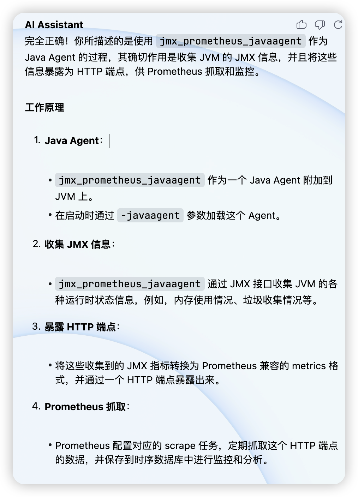
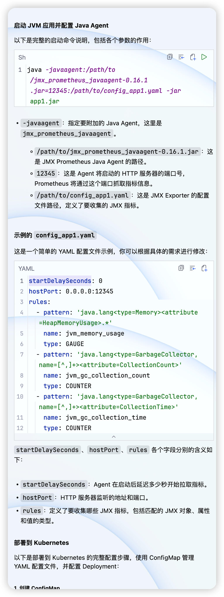

# prometheus

## 操作场景

Prometheus 社区开发了 JMX Exporter 用于导出 JVM 的监控指标，以便使用 Prometheus 来采集监控数据。当您的 Java 业务容器化至 Kubernetes 后，可通过本文了解如何使用 Prometheus 与 JMX Exporter 来监控 Java 应用。


## JMX Exporter 简介

Java Management Extensions，JMX 是管理 Java 的一种扩展框架，JMX Exporter 基于此框架读取 JVM 的运行时状态。JMX Exporter 利用 Java 的 JMX 机制来读取 JVM 运行时的监控数据，然后将其转换为 Prometheus 可辨识的 metrics 格式，以便让 Prometheus 对其进行监控采集。

JMX Exporter 提供**启动独立进程**及 **JVM 进程内启动（in-process）**两种方式暴露 JVM 监控指标：

1\. **启动独立进程 JVM 启动时指定参数，暴露 JMX 的 RMI 接口。JMX Exporter 调用 RMI 获取 JVM 运行时状态数据，转换为 Prometheus metrics 格式，并暴露端口让 Prometheus 采集。**

2\. **JVM 进程内启动（in-process）** <span style="background-color:#ff9900;">JVM 启动时指定参数，通过 javaagent 的形式运行 JMX Exporter 的 jar 包，进程内读取 JVM 运行时状态数据</span>，转换为 Prometheus metrics 格式，并暴露端口让 Prometheus 采集。

> **说明：**
>
> 官方不建议使用**启动独立进程**方式，该方式配置复杂且需单独的进程，进程本身的监控又引发了新的问题。本文以 **<span style="background-color:#a2e043;">JVM 进程内启动（in-process）</span>
>
> **方式为例，在 Kubernetes 环境下使用 JMX Exporter 暴露 JVM 监控指标。

这里使用第二种用法，启动 JVM 时需要指定 JMX Exporter 的 jar 包文件和配置文件。 <span style="background-color:#ffd900;">jar 包是二进制文件，不好通过 configmap 挂载</span>，配置文件我们几乎不需要修改， 所以建议是<span style="background-color:#ff9900;">直接将 JMX Exporter 的 jar 包和配置文件都打包到业务容器镜像中。</span>

其中，第二种方式我们可以选择将<span style="background-color:#a2e043;"> JMX Exporter 的 jar 文件放在业务应用镜像中</span>， 也可以选择在部署的时候挂载进去。这里分别对两种方式做一个介绍：

## 方式一：将 JMX Exporter JAR 文件构建至业务镜像中 

prometheus-jmx-config.yaml 内容如下：

```yaml
ssl: false
lowercaseOutputName: false
lowercaseOutputLabelNames: false
rules:
- pattern: ".*"
```

然后准备 jar 包文件，可以在 [jmx\_exporter](<https://github.com/prometheus/jmx_exporter> "jmx_exporter") 的 Github 页面找到最新的 jar 包下载地址并参考如下 Dockerfile:

```shell
FROM openjdk:11.0.15-jre
WORKDIR /app/
COPY target/my-app.jar ./
COPY prometheus-jmx-config.yaml ./
RUN set -ex; \
    curl -L -O https://repo1.maven.org/maven2/io/prometheus/jmx/jmx_prometheus_javaagent/0.17.2/jmx_prometheus_javaagent-0.17.2.jar;
ENV JAVA_TOOL_OPTIONS=-javaagent:/app/jmx_prometheus_javaagent-0.17.2.jar=8088:/app/prometheus-jmx-config.yaml
EXPOSE 8081 8999 8080 8888
ENTRYPOINT java $JAVA_OPTS -jar my-app.jar
```

注意：

- 启动参数格式：-javaagent:=:
- 这里使用了 8088 端口暴露 JVM 的监控指标，如果和 Java 应用冲突，可自行更改

下面是自己编写的Dockerfile

```shell
[root@jenkins dockerfile]# cat Dockerfile
FROM openjdk:8-jdk-alpine 
LABEL maintainer lucas
 
ENV TZ=Asia/Shanghai
ENV JAVA_OPTS="-Xmx512m -Xms512m"
ENV JAVA_TOOL_OPTIONS="-javaagent:/jmx_prometheus_javaagent-1.0.1.jar=8888:/jmx-config.yaml"
 
COPY demo.jar  / 
COPY jmx_prometheus_javaagent-1.0.1.jar /
COPY jmx-config.yaml /
WORKDIR /
 
EXPOSE 8000 8888
 
ENTRYPOINT ["/bin/sh"]
CMD ["-c","java $JAVA_OPTS -jar /demo.jar"]
```

## 方式二： 通过 init container 容器挂载

我们需要先将 JMX exporter 做成 Docker 镜像, 以下 Dockerfile 仅供参考：

```shell
FROM alpine/curl:3.14
WORKDIR /app/
# 将前面创建的 config 文件拷贝至镜像
COPY prometheus-jmx-config.yaml ./
# 在线下载 jmx prometheus javaagent jar
RUN set -ex; \
    curl -L -O https://repo1.maven.org/maven2/io/prometheus/jmx/jmx_prometheus_javaagent/0.17.2/jmx_prometheus_javaagent-0.17.2.jar;
```

根据上面 Dockerfile 构建镜像：`docker build -t my-jmx-exporter .`

在 Java 应用部署 Yaml 中加入如下 init container：

```yaml
apiVersion: apps/v1
kind: Deployment
metadata:
  name: my-demo-app
  labels:
    app: my-demo-app
spec:
  selector:
    matchLabels:
      app: my-demo-app
  template:
    metadata:
      labels:
        app: my-demo-app
    spec:
      imagePullSecrets:
      - name: registry-pull
      initContainers:
      - name: jmx-sidecar
        image: my-jmx-exporter
        command: ["cp", "-r", "/app/jmx_prometheus_javaagent-0.17.2.jar", "/target/jmx_prometheus_javaagent-0.17.2.jar"]  ➊
        volumeMounts:
        - name: sidecar
          mountPath: /target
      containers:
      - image: my-demo-app-image
        name: my-demo-app
        resources:
          requests:
            memory: "1000Mi"
            cpu: "500m"
          limits:
            memory: "1000Mi"
            cpu: "500m"
        ports:
        - containerPort: 18083
        env:
        - name: JAVA_TOOL_OPTIONS
          value: "-javaagent:/app/jmx_prometheus_javaagent-0.17.2.jar=8088:/app/prometheus-jmx-config.yaml" ➋
        volumeMounts:
        - name: host-time
          mountPath: /etc/localtime
          readOnly: true
        - name: sidecar
          mountPath: /sidecar
      volumes:
      - name: host-time
        hostPath:
          path: /etc/localtime
      - name: sidecar  #共享 agent 文件夹
        emptyDir: {}
      restartPolicy: Always
```

经过如上的改造之后，示例应用 my-demo-app 具备了暴露 JVM 指标的能力。 运行服务之后，我们可以通过 `http://lcoalhost:8088` 访问服务暴露出来的 prometheus 格式的指标。

## 使用 JMX Exporter 暴露 JVM 监控指标

### 打包镜像

使用 JVM 进程内启动（in-process）方式，<span style="background-color:#a2e043;">启动 JVM 需指定 JMX Exporter 的 jar 包文件和配置文件。jar 包为二进制文件，不便通过 configmap 挂载，建议直接将 JMX Exporter 的 jar 包和配置文件都打包到业务容器镜像中</span>

。步骤如下：

(1) 准备一个制作镜像的目录，放入 JMX Exporter 配置文件 `prometheus-jmx-config.yaml`。

```yaml
ssl: false
lowercaseOutputName: false
lowercaseOutputLabelNames: false 
 
#注意:更多配置项请参考 Prometheus 官方文档。
```

(2) 准备 jar 包文件，可前往 [jmx\_exporter](<https://github.com/prometheus/jmx_exporter> "jmx_exporter") 的 Github 页面获取最新的 jar 包下载地址。执行以下命令，下载到当前目录。 

http://github.com/prometheus/jmx_exporter

<https://github.com/prometheus/jmx_exporter> "https://github.com/prometheus/jmx_exporter

(3) 准备 Dockerfile 文件，本文以 Tomcat 为例。

```shell
FROM tomcat:jdk8-openjdk-slim
ADD prometheus-jmx-config.yaml /prometheus-jmx-config.yaml
ADD jmx_prometheus_javaagent-0.13.0.jar /jmx_prometheus_javaagent-0.13.0.jar
```

(4) 执行以下命令，编译镜像。

```shell
docker build . -t ccr.ccs.tencentyun.com/imroc/tomcat:jdk8
```

至此已完成镜像打包，您还可利用 docker 多阶段构建，省略手动下载 jar 包的步骤。Dockerfile 示例如下：

```shell
FROM ubuntu:16.04 as jar
WORKDIR /
RUN apt-get update -y
RUN DEBIAN_FRONTEND=noninteractive apt-get install -y wget
RUN wget https://repo1.maven.org/maven2/io/prometheus/jmx/jmx_prometheus_javaagent/0.13.0/jmx_prometheus_javaagent-0.13.0.jar
FROM tomcat:jdk8-openjdk-slim
ADD prometheus-jmx-config.yaml /prometheus-jmx-config.yaml
COPY --from=jar /jmx_prometheus_javaagent-0.13.0.jar /jmx_prometheus_javaagent-0.13.0.jar
```

### 部署 Java 应用

部署应用至 Kubernetes 时，需修改 JVM 启动参数以便启动时加载 JMX Exporter。JVM 启动时会读取 `JAVA_OPTS` 环境变量，作为额外的启动参数，部署时可为应用增加该环境变量。示例如下：

```yaml
apiVersion: apps/v1
kind: Deployment
metadata:
  name: tomcat
spec:
  replicas: 1
  selector:
    matchLabels:
      app: tomcat
  template:
    metadata:
      labels:
        app: tomcat
    spec:
      containers:
      - name: tomcat
        image: ccr.ccs.tencentyun.com/imroc/tomcat:jdk8
        env:
        - name: JAVA_OPTS
          value: "-javaagent:/jmx_prometheus_javaagent-0.13.0.jar=8088:/prometheus-jmx-config.yaml"
 
---
 
apiVersion: v1
kind: Service
metadata:
  name: tomcat
  labels:
    app: tomcat
spec:
  type: ClusterIP
  ports:
  - port: 8080
    protocol: TCP
    name: http
  - port: 8088
    protocol: TCP
    name: jmx-metrics
  selector:
    app: tomcat
```

- 启动参数格式： `-javaagent:&lt;jar&gt;=&lt;port&gt;:&lt;config&gt;`
- 该示例使用8088端口暴露 JVM 的监控指标，您可按需自行更改。

> 为 JAVA 服务组件添加环境变量 ：
>
> `JAVA_OPTS = -javaagent:/tmp/agent/jmx_prometheus_javaagent-0.16.1.jar=5556:/tmp/agent/prometheus-jmx-config.yaml`


> [root@jenkins dockerfile]# curl 192.168.254.110:12345/metrics

## 添加 Prometheus 监控配置

配置 Prometheus，使监控数据可被采集。示例如下：

```yaml
- job_name: tomcat
  scrape_interval: 5s
  kubernetes_sd_configs:
  - role: endpoints
    namespaces:
      names:
      - default
  relabel_configs:
  - action: keep
    source_labels:
    - __meta_kubernetes_service_label_app
    regex: tomcat
  - action: keep
    source_labels:
    - __meta_kubernetes_endpoint_port_name
    regex: jmx-metrics
```

若已安装 prometheus-operator，则可通过创建 ServiceMonitor 的 CRD 对象配置 Prometheus。示例如下：

```yaml
apiVersion: monitoring.coreos.com/v1
kind: ServiceMonitor
metadata:
  name: tomcat
  namespace: default
  labels:
    app: tomcat
spec:
  endpoints:
  - port: jmx-metrics
    interval: 5s
  namespaceSelector:
    matchNames:
    - default
  selector:
    matchLabels:
      app: tomcat
```

## 添加 Grafana 监控面板

采集数据后可进行数据展示。若熟悉 Prometheus 和 Grafana，则可自行根据指标设计所需面板。您也可直接使用社区提供面板，例如 [JVM dashboard](<https://grafana.com/grafana/dashboards/8563> "JVM dashboard")。可直接导入使用，面板效果图如下：


## 参考资料

[JMX Exporter 项目地址](<https://github.com/prometheus/jmx_exporter> "JMX Exporter 项目地址")

[JVM 监控面板](<https://grafana.com/grafana/dashboards/8563> "JVM 监控面板")

最后附上自己的环境，各位可以参考一下

注意：这里只需要定义 JAVA\_TOOL\_OPTIONS变量即可，不需要定义在java -jar当中，这个环境变量会读取，否则会报错。

```shell
[root@jenkins dockerfile]# docker exec -it 1d81c3726f3c  sh
/ # env
JAVA_ALPINE_VERSION=8.212.04-r0
JAVA_TOOL_OPTIONS=-javaagent:/jmx_prometheus_javaagent-1.0.1.jar=8888:/jmx-config.yaml
HOSTNAME=1d81c3726f3c
SHLVL=1
HOME=/root
JAVA_VERSION=8u212
TERM=xterm
PATH=/usr/local/sbin:/usr/local/bin:/usr/sbin:/usr/bin:/sbin:/bin:/usr/lib/jvm/java-1.8-openjdk/jre/bin:/usr/lib/jvm/java-1.8-openjdk/bin
JAVA_OPTS=-Xmx512m -Xms512m
LANG=C.UTF-8
JAVA_HOME=/usr/lib/jvm/java-1.8-openjdk
PWD=/
TZ=Asia/Shanghai
```


```shell
[root@jenkins dockerfile]# ls
demo.jar  Dockerfile jmx-config.yaml  jmx_prometheus_javaagent-1.0.1.jar
 
 
[root@jenkins dockerfile]# cat Dockerfile
FROM openjdk:8-jdk-alpine 
LABEL maintainer lucas
 
ENV TZ=Asia/Shanghai
ENV JAVA_OPTS="-Xmx512m -Xms512m"
ENV JAVA_TOOL_OPTIONS="-javaagent:/jmx_prometheus_javaagent-1.0.1.jar=8888:/jmx-config.yaml"
 
COPY demo.jar  / 
COPY jmx_prometheus_javaagent-1.0.1.jar /
COPY jmx-config.yaml /
WORKDIR /
 
EXPOSE 8000 8888
 
ENTRYPOINT ["/bin/sh"]
CMD ["-c","java $JAVA_OPTS -jar /demo.jar"]
 
 
docker build -f Dockerfile -t java-demo-jxm .
docker run -itd --name=java-demo-jxm -p 8000:8000 -p 8888:8888 java-demo-jxm:latest 
 
 
 
[root@jenkins dockerfile]# docker ps -a
CONTAINER ID   IMAGE                  COMMAND                  CREATED       STATUS          PORTS                                                                                  NAMES
1d81c3726f3c   java-demo-jxm:latest   "/bin/sh -c 'java $J…"   3 weeks ago   Up 19 minutes   0.0.0.0:8000->8000/tcp, :::8000->8000/tcp, 0.0.0.0:8888->8888/tcp, :::8888->8888/tcp   java-demo-jxm
 
 
 
[root@jenkins dockerfile]# curl 127.0.0.1:8888/metrics | head -n 10
  % Total    % Received % Xferd  Average Speed   Time    Time     Time  Current
                                 Dload  Upload   Total   Spent    Left  Speed
100 47668  100 47668    0     0   409k      0 --:--:-- --:--:-- --:--:--  415k
# HELP java_lang_ClassLoading_LoadedClassCount java.lang:name=null,type=ClassLoading,attribute=LoadedClassCount
# TYPE java_lang_ClassLoading_LoadedClassCount untyped
java_lang_ClassLoading_LoadedClassCount 6173.0
# HELP java_lang_ClassLoading_TotalLoadedClassCount java.lang:name=null,type=ClassLoading,attribute=TotalLoadedClassCount
# TYPE java_lang_ClassLoading_TotalLoadedClassCount untyped
java_lang_ClassLoading_TotalLoadedClassCount 6173.0
# HELP java_lang_ClassLoading_UnloadedClassCount java.lang:name=null,type=ClassLoading,attribute=UnloadedClassCount
# TYPE java_lang_ClassLoading_UnloadedClassCount untyped
java_lang_ClassLoading_UnloadedClassCount 0.0
# HELP java_lang_ClassLoading_Verbose java.lang:name=null,type=ClassLoading,attribute=Verbose
```




