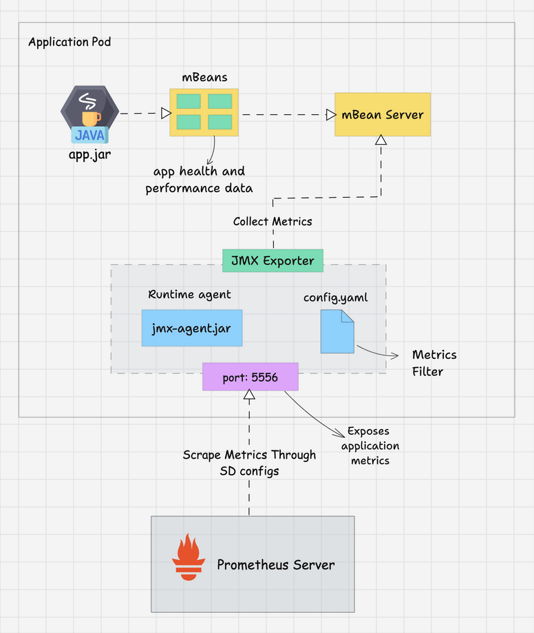
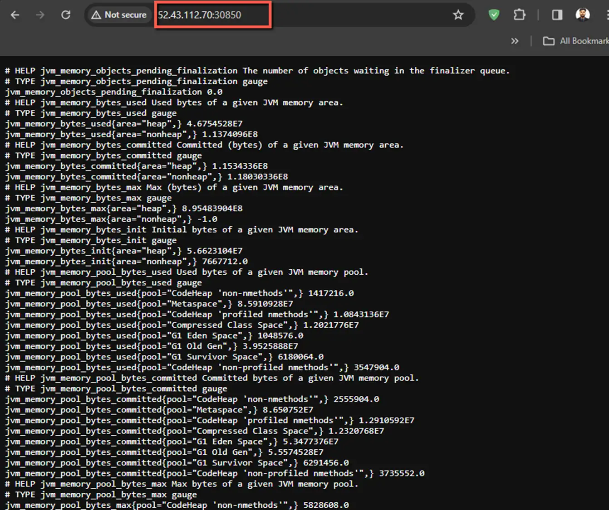

# 在 Kubernetes 里部署 JMX Exporter 监控 Java 应用

本文会通过一个 Java 应用，演示 Prometheus JMX Exporter 在 Kubernetes 里的部署和配置方式。为了更好地理解 JMX Exporter，我们将使用 Spring Boot Java 应用程序并将所有 JMX 指标导出给 Prometheus。在本指南结束时，您将学习：

- 使用 Java 应用镜像启动 JMX Exporter
- 将 JMX 指标导出给 Prometheus
- 使用 Prometheus SD 配置抓取应用程序的 JMX 指标
- 从 Prometheus 仪表板验证和查询 JMX 指标

## 先决条件

- 具有部署权限的 Kubernetes 集群
- 在 Kubernetes 上运行的 Prometheus

## JMX Exporter

首先，让我们了解一下 JMX Exporter 是如何工作的。下图显示了在 Kubernetes 上部署 JMX Exporter 时的工作流。



MBean（Managed Bean）Server 位于 Java 应用程序的 Java 虚拟机 （JVM） 中，充当与应用程序的运行状况和性能相关的数据存储库。MBean 组件公开应用程序指标，例如状态、动作和操作信息。

javaagent 可以访问 Mbean Server 并获取运行状况和性能数据。Prometheus JMX Exporter 也是一个 javaagent，它能够访问 MBean Server 的数据并将该数据转换为 Prometheus 指标格式。然后，Prometheus 从 JMX Exporter 的默认指标路径（即 /metrics）中抓取指标。

## 在 Kubernetes 中部署 JMX Exporter

### 步骤 1：使用 JMX agent 构建应用程序 Docker 镜像

JMX Exporter 的 javaagent 要和应用程序一起运行（Java 程序通过 java -javaagent 参数指定 JMX Exporter 的 jar 包路径）。您可以从此处下载 JMX exporter agent jar 文件 -> [JMX Exporter Download](<https://link.zhihu.com/?target=https%3A//github.com/prometheus/jmx_exporter/releases>)。构建 Java 程序镜像时，将 JMX Exporter jar 文件一并添加到镜像中。

```shell
FROM techiescamp/jre-17:1.0.0

ENV APP_NAME=jmx-java-app
ENV JMX_PORT=5556

WORKDIR /app

COPY /java-agent/*.jar /app/jmx-agent.jar
COPY /java-app/*.jar /app/java.jar
COPY config.yaml /app/

CMD java -javaagent:jmx-agent.jar=${JMX_PORT}:config.yaml -jar java.jar
```

我已经构建了 docker 镜像并将其推送到 Dockerhub。如果您正在学习测试 JMX，则可以直接使用下面的镜像。

```shell
techiescamp/jmx-pet-clinic-app:latest
```

### 步骤 2：为 JMX Exporter 创建 ConfigMap

我们需要为 JMX 配置创建一个名为 jmx-exporter-configmap.yaml 的 ConfigMap 对象。在此文件中，我们将提供信息以从 MBean Server 中过滤所需的指标。此配置避免了不必要的指标收集，将其限制为仅我们需要的指标。

创建 jmx-exporter-configmap.yaml

```yaml
apiVersion: v1
kind: ConfigMap
metadata:
  name: jmx-exporter-config
  namespace: monitoring
data:
  config.yaml: |-
    lowercaseOutputName: true
    lowercaseOutputLabelNames: true
    whitelistObjectNames: ["java.lang:type=Memory", "java.lang:type=GarbageCollector,*"]    
```

在这里，您可以看到我已经提到命名空间值是 monitoring，这是因为我的所有监控组件都位于该特定命名空间中。如果要使用相同的配置，请在开始配置之前创建具有相同名称的命名空间。

在数据部分，我们可以定义 JMX Exporter 必须从 MBean Server 收集的指标类型。在此配置中，我给出了一个小示例来过滤应用程序的内存相关指标。要了解有关配置的更多信息，请访问[官方文档](<https://link.zhihu.com/?target=https%3A//github.com/prometheus/jmx_exporter>)。

要在 Kubernetes 中部署此配置，请使用以下命令。

```shell
kubectl apply -f jmx-exporter-configmap.yaml
```

查看 `monitoring` 命名空间中的 ConfigMap。

```text
kubectl get configmaps -n monitoring
```

### 步骤 3：为应用程序创建部署清单

创建部署 YAML 文件 app-deployment.yaml。

```yaml
apiVersion: apps/v1
kind: Deployment
metadata:
  name: jmx-java-app
  namespace: monitoring
spec:
  replicas: 2
  selector:
    matchLabels:
      app: jmx-java-app
  template:
    metadata:
      labels:
        app: jmx-java-app
    spec:
      containers:
        - name: jmx-java-app-container
          image: techiescamp/jmx-pet-clinic-app:latest
          ports:
            - containerPort: 8080
            - containerPort: 5556
          volumeMounts:
            - name: jmx-exporter-config-volume
              mountPath: /app/config.yaml
              subPath: config.yaml
      volumes:
        - name: jmx-exporter-config-volume
          configMap:
            name: jmx-exporter-config
```

在这里，您可以看到我在容器外部公开端口 8080 和 5556。这里很重要的一点是 volumeMounts 部分。mountPath 使用 configmap 作为卷。它覆盖容器默认的 /app/config.yaml。现在我们 apply 一下：

```text
kubectl apply -f app-deployment.yaml
```

查看 monitoring 命名空间中的 Deployment。

```text
kubectl get deployments -n monitoring
```

查看 monitoring 命名空间中的 Pod。

```text
kubectl get pods -n monitoring -o wide
```

出于测试目的，我提供了两个副本，因此我们可以看到两个 Java 应用程序 Pod 在 monitoring namespace 中运行。

### 步骤 4：为应用程序创建服务

为应用程序创建服务清单：app-service.yaml

```yaml
apiVersion: v1
kind: Service
metadata:
  name: jmx-java-app-nodeport
  namespace: monitoring
spec:
  selector:
    app: jmx-java-app
  ports:
  - name: http
    protocol: TCP
    port: 8080
    targetPort: 8080
    nodePort: 30750  
  - name: jmx
    protocol: TCP
    port: 5556
    targetPort: 5556
    nodePort: 30850  
  type: NodePort
```

我想通过网络访问应用程序和指标，因此我使用 `spec.type: NodePort`，并定义 nodePort 端口号，例如应用程序的 30750 和指标的 30850。

下面 apply 一下：

```text
kubectl apply -f app-service.yaml
```

在 monitoring namespace 中查看服务列表。

```text
kubectl get svc -n monitoring
```

现在，让我们尝试通过网络访问应用程序和指标，为此，您需要任意一个 Node 的 IP 和端口号。

应用程序的输出：


指标的输出：



### 步骤 5：在 Prometheus 中添加 Scrape 配置

> 注意：此配置必须在 Prometheus Server 上完成。

JMX Exporter 已成功公开 Java 应用程序的度量指标。现在我们在 Prometheus 服务器配置文件中添加一个作业来抓取这些指标，然后只有我们可以将它们存储在 TSDB 中或进行查询。

找到 Prometheus ConfigMap，在我的设置中，文件名是 config-map.yaml。使用文本编辑器打开它。

```text
vim config-map.yaml
```

> 如果想查看 monitoring 命名空间中的 ConfigMap，请使用以下命令：`kubectl get configmaps -n monitoring`

在 Prometheus 的配置文件的 scrape\_configs 部分添加以下配置。

```yaml
scrape_configs:
- job_name: 'jmx-java-app'
  kubernetes_sd_configs:
  - role: pod
    namespaces:
      names:
        - monitoring
  relabel_configs:
  - source_labels: [__meta_kubernetes_pod_label_app]
    action: keep
    regex: 'jmx-java-app'
  - source_labels: [__meta_kubernetes_namespace]
    target_label: namespace
  - source_labels: [__meta_kubernetes_pod_name]
    target_label: pod_name
  - target_label: __address__
    replacement: "jmx-java-app-nodeport:5556"
```

在此 Promtheus 配置中，我使用的是 kubernetes\_sd\_configs 服务发现方法，该方法使用 jmx-java-app 标签自动识别属于 jmx-java-app 部署的 pod。即 relabel 的 keep 部分起到了这个过滤效果：

```yaml
- source_labels: [__meta_kubernetes_pod_label_app]
  action: keep
  regex: 'jmx-java-app'
```

下面我们 apply 一下：

下面我们 apply 一下：

```text
kubectl apply -f config-map.yaml
```

在 Prometheus 仪表板中复制更改可能需要几分钟时间。如果看不到更改，请使用以下命令执行部署。将 prometheus-deployment 更改为实际的 Prometheus Deployment 名称。

```text
kubectl rollout restart deployment prometheus-deployment -n monitoring
```

### 步骤 6：从 Prometheus Dashboard 验证 JMX 指标

您可以从 Prometheus 仪表板验证 JMX 目标。在“目标”菜单下，我们可以看到 endpoint 详细信息、状态和其他信息，如下所示。


在 Graph 部分，我们可以进行查询并获得结果。例如，以下仪表板显示了应用中 jvm\_memory\_bytes\_used 指标。


### 步骤 7：Grafana 仪表板

我们可以根据自己的要求在 Grafana 仪表板中可视化 JMX 指标。如果您已设置 Grafana 并将 Prometheus 添加为数据源，则可以使用 [JMX 指标模板](<https://link.zhihu.com/?target=https%3A//grafana.com/grafana/dashboards/7727-jvm-overview/>) 创建仪表板。您可以在 Grafana 博客上查看可视化 Promtheus 指标以了解更多信息。

