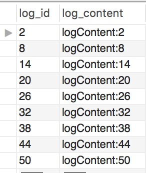

# 基于ShardingJDBC的分库分表详细整理

## 前言

传统应用项目设计通常都是采用单一数据库作为存储方案，但是随着互联网的迅猛发展以及应用数据量的增长，数据库会随着数据量的增长而渐渐成为整个应用框架的性能瓶颈。

首先是由于关系学数据库大多是采用B+Tree类型的索引，当数据量超过一定的阈值之后，会导致索引的深度增长，而索引的深度又直接影响了磁盘IO操作的次数，直接影响了数据库查询性能的优劣。

其次由于用户数量的提升，高并发的数据库请求也会越来越多，单节点数据库的连接数、TPS以及存储容量都存在上限的限制，并发数达到一定量或者数据量超过了单节点存储容量之后，数据库性能会成为整个系统的瓶颈

最后当数据量很大的时候，数据库的备份和迁移都会变得越来越难，时间成本和难度都会随着数据数量的增长而增大。

所以在单节点关系型数据库无法满足互联网的应用场景时，可以采用NoSQL数据库来分担一部分的压力，但是NoSQL并不能完全替代关系型数据库的特性，所以从本质上还是无法替代关系型数据库，所以必须从关系型数据库本身找到解决办法。

既然单点数据库无法解决，那么就可以考虑将单点改成多点，采用数据分片的方式将单节点数据按一定的规则拆分成多分数据分片存储到多个节点，就可以解决单点数据库的性能瓶颈，从而提升系统的可用性。

## 一、数据分片

数据分片的意思顾名思义就是将一块比较大的数据集分割成多个较小的数据集,按照某个唯独将存在单一数据库中的数据分散地存放到多个数据库、多个数据表、多个存储区域中以达到提升性能瓶颈的效果。

### 1.1、数据分片的方式

数据分片的方式通常有垂直拆分和水平拆分两种方式

垂直拆分是按照业务来进行拆分的方式，核心理念是专库专用。通常一个数据库中都会包含多个数据表，不同的数据表代表着不同的业务。根据业务将相同业务的表放到同一个数据库，不同业务存放到不同数据库，从业务上可以将数据库进行拆分成多个数据库，这样就达到了不同业务的数据库操作分散到了不同的数据库中。另外如果某个数据表的字段比较多，同样可以根据数据表的字段进行划分。如用户信息表包含了用户基本信息和详细的信息，那么可以按重要程度进行垂直拆分，拆分成基础用户信息表和详细用户信息表。这样可以根据数据的冷热程度进行拆分处理。

通常情况下垂直拆分需要对系统的架构设计进行调整，而且虽然提高了数据库的并发处理能力，但是并不能解决单表数据量大的问题。虽然将一个表拆分成了两个表，两个表中的字段虽然少了，但是数据量并没有减少，并不能解决查询效率低下的问题。

水平拆分是按照数据来进行横向切分，根据表中某个或某几个字段的某种规则，将数据分散到多个库或表中。比如按年月进行拆分，不同年月的数据存放到不同年月的数据表中，又或者根据数据主键通过取模算法来选择存储的数据表等。水平拆分通过不同的数据表存储不同的数据达到数据分散存储的效果，从而可以解决单表数据量过大的问题。

水平拆分通常是业务层无感知的，也不需要对系统架构设计进行调整，所以水平拆分的方式一般优先于垂直拆分，而垂直拆分往往是系统架构设计的初期就应该做好规划。

### 1.2、数据分片的实现

数据分片通常的方式有分区、分库、分表

#### 1.2.1、分区

分区

mysql数据库中的数据以文件存放在磁盘中，一张表会生成三个文件，.frm文件存放表结构,.myd文件存放表中数据,.myi文件存放表的索引。当表中存储的数据很大的时候，.myd文件和.myi文件就会变大。

就会导致查询数据时效率比较低。而mysql数据库本身就提供了数据分区的功能，可以将磁盘中的文件拆分成多个子文件，这样就可以在不修改表结构的情况下，将源数据分散存储的效果。分区之后在逻辑上还是一个表，只是在物理存储时已经分成了多个表。

分区可以垂直拆分将数据中的指定字段存放到指定区域，也可以水平拆分将不同数据存放到不同的区域。如下图示：

1、将user表的id和name字段进行垂直分区，id和name字段分区存储，单个存储文件中数据量不变，但是少了字段之后文件大小变得很小


2、将user表中的数据进行水平分区成三个分区， 不同区域存储不同的部分数据，单个数据文件变得很小


分区的特点：

1、可以动态增删分区来快速增删指定分区的数据

2、对于sum、count等聚合函数的查询，不同分区可以并行处理，提高聚合函数的查询效率

3、多个磁盘文件可以分散数据查询，可以提高吞吐量

4、分区之后单个数据文件比较小，查询效率提升比较大

5、单表分区上限为1024个区

6、分区字段中要么不包含主键或者索引列，要么就必须包含全部的主键和索引列

7、分区表无法使用外键约束

8、分区使用于表中的所有数据和索引，也就是全部数据和索引都必须分区，不能只对数据或只对索引或只对部分进行分区

#### 1.2.2、分库

将一个数据库拆分成多个相互独立的数据库，各个数据库直接互相独立且各自独享各自的存储空间，垂直拆分可以将业务在数据库层面进行解耦，水平拆分可以将数据分散存储。都可以达到提升数据库并发处理能力，以及解决单数据库的性能问题。如下图示：

1、将单库中的多个表垂直拆分成不同库存放不同的表


2、将单库中数据量非常大的表垂直拆分到不同的库中存放相同的表


#### 1.2.3、分表

将一个数据库表拆分成多个相互独立表。垂直拆分实际就是将一个父表拆分成多个子表；水平拆分就是将一个数据量大的表拆分成多个数据量小的表。可以解决单表数据量大导致的查询效率低的问题，同时也可以提高数据表的并发处理能力。如下图示：

1、在业务层面将一个字段多的父表垂直拆分成两个相互业务独立的子表，两个字表之间的读写操作相互独立。


2、在数据层面将一个数据量很大的表水平拆分成多个数据量很小的表，多个小表之间数据结构完全一样，和分区有点类似。分区是物理层面拆分逻辑层面不拆分；而分表是逻辑层面和物理层面都进行了拆分，只是在业务层面需要当作是一个表进行操作。


 

## 二、分库分表的方案

分区功能是mysql数据库高版本本身就自带的功能，通过数据库提高的API就可以很方便的对表中的数据进行动态分区。且数据分区对于业务层完全透明化，对于用户而言是无感知的。

而分库分表的实现是无法通过数据库本身来实现，只能通过用户自己思考解决方案。而解决方案无疑就是使用中间件，而中间件可以分成组件形式和代理服务两个形式存在。组件形式需要集成到应用程序中，相当于增强了应用程序JDBC的功能。而代理服务的方式是在应用程序和数据库之间添加一层代理服务，应用程序将SQL操作交给代理服务，代理服务再访问多个数据节点进行操作，最后将结果返回给应用程序，但是需要独立部署服务，两种方案架构如下图示

方案一：集成组件方式


方案二：代理服务方式


两种方式各有优缺点：

1、组件方式需要集成到应用程序中，和应用程序耦合；代理方式和应用程序解耦

2、组件方式无需独立部署服务，代理方式需要独立部署服务，并且服务需要集群来实现高可用性，成本较大

3、组件方式无法实现缓存功能或仅能实现单节点应用的缓存功能，但是需要消耗应用程序的内存；代理方式可以在代理服务中实现缓存功能

## 三、ShardingJDBC的使用

ShardingJDBC采用的是组件的方式集成到应用程序中，定位是轻量级的组件工具，在Java应用程序的JDBC层提高了增强功能。可以使应用程序直连数据库，不需要额外的部署和依赖，相当于增强版的JDBC。ShardingJDBC的架构图和组件方式的架构如出一辙，架构图如下：


### 3.1、ShardingJDBC的核心概念

**逻辑表：**通过水平拆分的库/表拥有相同的的表结构和逻辑,如user表水平拆分成user_01和user_02等分表,但是在逻辑上都统称为user表

**真实表：**真实存储数据的物理表,如user表水平拆分成user_01和user_02表,那么user_01和user_02就是真实表

**数据节点：**数据分片的最小单元,由数据源和数据表组成,如db0.user_01表、db1.user_02表

**绑定表：**分片规则一致的主表和子表,如order表和order_detail表,都按照orderId进行分片,两种表互为绑定表关系,配置绑定关系之后,主表和字表关联查询就不存在笛卡尔积关联

**广播表：**所有的分片中都存在表结构和数据都完全一致的表,一般用于存储数据字典或每个库都需要用到的公用数据,通常数据量都不大但是使用频繁的

**分片键：**用于分片的数据库字段,如水平拆分时将user表中的userId进行取模算法分配,根据userId%10的余数判断数据在那个节点

**分片算法：**分片算法用于将分片键根据具体的算法进行分片,算法主要分如下几种:

 1.精确分片算法（PreciseShardingAlgorithm）：用于处理使用单一键作为分片键的=和IN的场景,需要配合StandardShardingStrategy使用

 2.范围分片算法（RangeShardingAlgorithm）：用于处理使用单一键作为分片键的between、and、>、<、>=、<=等分片场景,需要配合StandardShardingStrategy使用

 3.复合分片算法（ComplexKeysShardingAlgorithm）：用于处理使用多键作为分片键进行分片的场景，包含多个分片键的逻辑比较复杂，需要配合ComplexShardingStrategy使用

 4.Hint分片算法（HintShardingAlgorithm）：用于处理Hint行分片的场景，需要配合HintShardingStrategy使用

**分片策略：**分片键和分片算法配合起来就是一种分片策略,主要分片策略如下:

 1.标准分片策略：对应StandardShardingStrategy,提高对SQL语句中的=,>,<,>=,<=,IN,AND,BETWEEN等分片操作的支持.StandardShardingStrategy只支持单键分片,提供PreciseShardingAlgorithm和RangeShardingAlgorithm两个分片算法。PreciseShardingAlgorithm是必选的，用于处理=和IN的分片。RangeShardingAlgorithm是可选的，用于处理BETWEEN AND, >, <, >=, <=分片，如果不配置RangeShardingAlgorithm，SQL中的BETWEEN AND将按照全库路由处理

 2.复合分片策略：对应ComplexShardingStrategy。复合分片策略。提供对SQL语句中的=, >, <, >=, <=, IN和BETWEEN AND的分片操作支持。ComplexShardingStrategy支持多分片键，由于多分片键之间的关系复杂，因此并未进行过多的封装，而是直接将分片键值组合以及分片操作符透传至分片算法，完全由应用开发者实现，提供最大的灵活度

 3.行表达式分片策略：对应InlineShardingStrategy。使用Groovy的表达式，提供对SQL语句中的=和IN的分片操作支持，只支持单分片键。对于简单的分片算法，可以通过简单的配置使用，从而避免繁琐的Java代码开发，如: t_user_$->{u_id % 8} 表示t_user表根据u_id模8，而分成8张表，表名称为t_user_0到t_user_7。

 4.Hint分片策略：对应HintShardingStrategy,通过Hint指定分片值而非从SQL中提取分片值的方式进行分片的策略

 5.不分片策略：对应NoneShardingStrategy,不分片的策略

### 3.2、ShardingJDBC的配置

下面以Springboot集成ShardingJDBC的方式进行ShardingJDBC的配置说明

数据源配置：配置ShardingJDBC需要访问的真实数据源列表，配置方式如下：

```properties
sharding.jdbc.datasource.names= #数据源名称，多数据源以逗号分隔

sharding.jdbc.datasource.<data-source-name>.type= #数据库连接池类名称
sharding.jdbc.datasource.<data-source-name>.driver-class-name= #数据库驱动类名
sharding.jdbc.datasource.<data-source-name>.url= #数据库url连接
sharding.jdbc.datasource.<data-source-name>.username= #数据库用户名
sharding.jdbc.datasource.<data-source-name>.password= #数据库密码
sharding.jdbc.datasource.<data-source-name>.xxx= #数据库连接池的其它属性

sharding.jdbc.config.sharding.tables.<logic-table-name>.actual-data-nodes= #由数据源名 + 表名组成，以小数点分隔。多个表以逗号分隔，支持inline表达式。缺省表示使用已知数据源与逻辑表名称生成数据节点。用于广播表（即每个库中都需要一个同样的表用于关联查询，多为字典表）或只分库不分表且所有库的表结构完全一致的情况

#分库策略，缺省表示使用默认分库策略，以下的分片策略只能选其一

#用于单分片键的标准分片场景
sharding.jdbc.config.sharding.tables.<logic-table-name>.database-strategy.standard.sharding-column= #分片列名称
sharding.jdbc.config.sharding.tables.<logic-table-name>.database-strategy.standard.precise-algorithm-class-name= #精确分片算法类名称，用于=和IN。该类需实现PreciseShardingAlgorithm接口并提供无参数的构造器
sharding.jdbc.config.sharding.tables.<logic-table-name>.database-strategy.standard.range-algorithm-class-name= #范围分片算法类名称，用于BETWEEN，可选。该类需实现RangeShardingAlgorithm接口并提供无参数的构造器

#用于多分片键的复合分片场景
sharding.jdbc.config.sharding.tables.<logic-table-name>.database-strategy.complex.sharding-columns= #分片列名称，多个列以逗号分隔
sharding.jdbc.config.sharding.tables.<logic-table-name>.database-strategy.complex.algorithm-class-name= #复合分片算法类名称。该类需实现ComplexKeysShardingAlgorithm接口并提供无参数的构造器

#行表达式分片策略
sharding.jdbc.config.sharding.tables.<logic-table-name>.database-strategy.inline.sharding-column= #分片列名称
sharding.jdbc.config.sharding.tables.<logic-table-name>.database-strategy.inline.algorithm-expression= #分片算法行表达式，需符合groovy语法

#Hint分片策略
sharding.jdbc.config.sharding.tables.<logic-table-name>.database-strategy.hint.algorithm-class-name= #Hint分片算法类名称。该类需实现HintShardingAlgorithm接口并提供无参数的构造器

#分表策略，同分库策略
sharding.jdbc.config.sharding.tables.<logic-table-name>.table-strategy.xxx= #省略

sharding.jdbc.config.sharding.tables.<logic-table-name>.key-generator-column-name= #自增列名称，缺省表示不使用自增主键生成器
sharding.jdbc.config.sharding.tables.<logic-table-name>.key-generator-class-name= #自增列值生成器类名称，缺省表示使用默认自增列值生成器。该类需提供无参数的构造器

sharding.jdbc.config.sharding.tables.<logic-table-name>.logic-index= #逻辑索引名称，对于分表的Oracle/PostgreSQL数据库中DROP INDEX XXX语句，需要通过配置逻辑索引名称定位所执行SQL的真实分表

sharding.jdbc.config.sharding.binding-tables[0]= #绑定表规则列表
sharding.jdbc.config.sharding.binding-tables[1]= #绑定表规则列表
sharding.jdbc.config.sharding.binding-tables[x]= #绑定表规则列表

sharding.jdbc.config.sharding.broadcast-tables[0]= #广播表规则列表
sharding.jdbc.config.sharding.broadcast-tables[1]= #广播表规则列表
sharding.jdbc.config.sharding.broadcast-tables[x]= #广播表规则列表

sharding.jdbc.config.sharding.default-data-source-name= #未配置分片规则的表将通过默认数据源定位
sharding.jdbc.config.sharding.default-database-strategy.xxx= #默认数据库分片策略，同分库策略
sharding.jdbc.config.sharding.default-table-strategy.xxx= #默认表分片策略，同分表策略
sharding.jdbc.config.sharding.default-key-generator-class-name= #默认自增列值生成器类名称，缺省使用io.shardingsphere.core.keygen.DefaultKeyGenerator。该类需实现KeyGenerator接口并提供无参数的构造器

sharding.jdbc.config.sharding.master-slave-rules.<master-slave-data-source-name>.master-data-source-name= #详见读写分离部分
sharding.jdbc.config.sharding.master-slave-rules.<master-slave-data-source-name>.slave-data-source-names[0]= #详见读写分离部分
sharding.jdbc.config.sharding.master-slave-rules.<master-slave-data-source-name>.slave-data-source-names[1]= #详见读写分离部分
sharding.jdbc.config.sharding.master-slave-rules.<master-slave-data-source-name>.slave-data-source-names[x]= #详见读写分离部分
sharding.jdbc.config.sharding.master-slave-rules.<master-slave-data-source-name>.load-balance-algorithm-class-name= #详见读写分离部分
sharding.jdbc.config.sharding.master-slave-rules.<master-slave-data-source-name>.load-balance-algorithm-type= #详见读写分离部分
sharding.jdbc.config.config.map.key1= #详见读写分离部分
sharding.jdbc.config.config.map.key2= #详见读写分离部分
sharding.jdbc.config.config.map.keyx= #详见读写分离部分

sharding.jdbc.config.props.sql.show= #是否开启SQL显示，默认值: false
sharding.jdbc.config.props.executor.size= #工作线程数量，默认值: CPU核数

sharding.jdbc.config.config.map.key1= #用户自定义配置
sharding.jdbc.config.config.map.key2= #用户自定义配置
sharding.jdbc.config.config.map.keyx= #用户自定义配置
读写分离
#省略数据源配置，与数据分片一致

sharding.jdbc.config.sharding.master-slave-rules.<master-slave-data-source-name>.master-data-source-name= #主库数据源名称
sharding.jdbc.config.sharding.master-slave-rules.<master-slave-data-source-name>.slave-data-source-names[0]= #从库数据源名称列表
sharding.jdbc.config.sharding.master-slave-rules.<master-slave-data-source-name>.slave-data-source-names[1]= #从库数据源名称列表
sharding.jdbc.config.sharding.master-slave-rules.<master-slave-data-source-name>.slave-data-source-names[x]= #从库数据源名称列表
sharding.jdbc.config.sharding.master-slave-rules.<master-slave-data-source-name>.load-balance-algorithm-class-name= #从库负载均衡算法类名称。该类需实现MasterSlaveLoadBalanceAlgorithm接口且提供无参数构造器
sharding.jdbc.config.sharding.master-slave-rules.<master-slave-data-source-name>.load-balance-algorithm-type= #从库负载均衡算法类型，可选值：ROUND_ROBIN，RANDOM。若`load-balance-algorithm-class-name`存在则忽略该配置

sharding.jdbc.config.config.map.key1= #用户自定义配置
sharding.jdbc.config.config.map.key2= #用户自定义配置
sharding.jdbc.config.config.map.keyx= #用户自定义配置

sharding.jdbc.config.props.sql.show= #是否开启SQL显示，默认值: false
sharding.jdbc.config.props.executor.size= #工作线程数量，默认值: CPU核数
sharding.jdbc.config.props.check.table.metadata.enabled= #是否在启动时检查分表元数据一致性，默认值: false
```

### 3.3、ShardingJDBC使用案例

1、maven依赖配置

```xml
<dependency>
     <groupId>io.shardingsphere</groupId>
     <artifactId>sharding-jdbc-spring-boot-starter</artifactId>
     <version>3.1.0</version>
</dependency>
```

2、新建测试库sharding_0和sharding_1,分别创建结构一模一样的测试表dcs_log0、dcs_log1、dcs_log2，每个表中只有log_id和log_content两个字段

3、Springboot的ShardingJDBC相关配置如下:

```yaml
## sharding-jdbc
sharding:
  jdbc:
    #数据源
    datasource:
      names: ds0,ds1
      ds0:
        type: com.alibaba.druid.pool.DruidDataSource
        driver-class-name: com.mysql.jdbc.Driver
        url: jdbc:mysql://127.0.0.1:3306/sharding_0
        username: alpha
        password: alpha
      ds1:
        type: com.alibaba.druid.pool.DruidDataSource
        driver-class-name: com.mysql.jdbc.Driver
        url: jdbc:mysql://127.0.0.1:3306/sharding_1
        username: alpha
        password: alpha
    #分片
    config:
      sharding:
      #库分片策略
        default-database-strategy:
          inline:
            sharding-column: log_id
            algorithm-expression: ds${log_id % 2}
      #表分片策略
        tables:
          dcs_log:
            actual-data-nodes: ds$->{0..1}.dcs_log${0..2}
            table-strategy:
              inline:
                sharding-column: log_id
                algorithm-expression: dcs_log${log_id % 3}
```

这里配置了两个数据源分别对应数据库sharding_0和sharding_1，另外分库的策略是根据log_id进行取模运算分片,分表同样是根据log_id进行取模算法分配数据表.

4、批量插入数据测试代码，从id为1开始到50，一共插入50条数据

```java
@Resource
private DcsLogMapper dcsLogMapper;

public void addLogTest(){
  for(long i=1;i <= 50; i++){
    dcsLogMapper.addLog(i, ("logContent:" + i));
  }
}
```

由于是根据logId作为分片键进行分库，所以可以得出结论为logId为奇数的会存入到数据库sharding_1中，logId为偶数的会存入到数据库sharding_0中，另外再根据logId进行分表操作，dcs_log0中存储的是3的整倍数，dcs_log1中存储3的整倍数+1；dcs_logs2中存储的是logId为3的整倍数+2的数据。

5、校验结果如下：

数据库sharding_0中的三个dcs_log数据分别为:

```sql
1 SELECT * FROM sharding_0.dcs_log0;
2 SELECT * FROM sharding_0.dcs_log1;
3 SELECT * FROM sharding_0.dcs_log2;
```

 



数据库sharding_1中的三个dcs_log数据分别为:


这样就实现了将50条数据分散到两个库中的6个表中，当然还可以增加多个库增加多个表来实现非常大的数据量分片的效果

 

### 3.4、分库分表的高级用法

从上一节以及了解了shardingJDBC对于数据库分库分表的基本操作，但是实际的业务场景的复杂程度远不止案例中的单表两个字段那么简单，还会存在以下诸多的问题需要解决。

#### 3.4.1、分库分表自增主键的实现

在单表的情况下，往往都是通过主键自增的方式来维护唯一的ID，但是在分库分表的情况下，很显然通过数据表的自增ID就会有问题，每个表都有自己的一套自增ID，很容易或者说必然会出现不同的表出现相同主键的情况，这显然是首先需要解决的大问题。ShardingJDBC既然提高了分库分表的方案，那么自然会考虑到这个问题，所以ShardingJDBC也提供了分布式主键生成的工具。

可以通过配置来自动生成唯一ID

```
1 sharding.jdbc.config.sharding.tables.<logic-table-name>.key-generator-column-name= #自增列名称，缺省表示不使用自增主键生成器
2 sharding.jdbc.config.sharding.tables.<logic-table-name>.key-generator-class-name= #自增列值生成器类名称，缺省表示使用默认自增列值生成器。该类需提供无参数的构造器
```

其中key-generator-column-name可以设置需要自动生成唯一ID的字段名称，key-generator-class-name表示表示需要使用的生成器类型，默认提供了UUID和雪花算法两种模式，分别为UUID/SNOWFLAKE，当然也可以自定义唯一ID生成器，自定义方式如下：

```java
public class MyGeneratorKey implements KeyGenerator {

    AtomicLong atomicLong = new AtomicLong();

    @Override
    public Number generateKey() {
        return atomicLong.incrementAndGet();
    }
}
```

自定义MyGenerator类实现KeyGenerator接口，重写generatorKey方法即可，则每次插入数据时都会执行该方法给配置的字段设置主键值。

#### 3.4.2、绑定表

当业务中涉及到主表和子表时就会涉及主表和子表的关联查询，采用分库分表之后很容易就出现主表和子表分散到了不同的数据节点上，那么就会导致主表和子表关联出现问题。比如电商系统中的订单order表和订单详情order_detail表.

分别在各个数据节点上创建order表和order_detail表.

通过配置将两个表绑定在一起，那么就可以order_detail表中的数据会和order表中相关联的数据保存在同一个节点上，配置如下:

```properties
sharding.jdbc.config.sharding.tables.dcs_order.actual-data-nodes=ds$->{0..1}.dcs_order{0..2}
sharding.jdbc.config.sharding.tables.dcs_order.table-strategy.inline.sharding-column=log_id
sharding.jdbc.config.sharding.tables.dcs_order.table-strategy.inline.algorithm-expression=dcs_order${order_id % 3}
sharding.jdbc.config.sharding.tables.order_detail.actual-data-nodes=ds$->{0..1}.order_detail${0..2}
sharding.jdbc.config.sharding.tables.order_detail.table-strategy.inline.sharding-column=order_id
sharding.jdbc.config.sharding.tables.order_detail.table-strategy.inline.algorithm-expression=order_detail${order_id % 3}
#将dcs_order和order_detail表绑定
sharding.jdbc.config.sharding.binding-tables[0]=dcs_order,order_detail
```

#### 3.4.3、广播表

当业务系统中涉及到一些数据字典，比如省市区信息、用户角色的公用的信息时，如果分库分表之后就需要让每个数据节点都拥有一份这样的数据，此时就需要在每个数据节点上都创建同一个表，而当数据发生更新时，还需要将所有数据节点上的数据同步更新下。

如果通过代码实现肯定比较麻烦，所以ShardingJDBC同样提供了广播表的配置方式来给用户解决这个问题，只需要在配置中配置即可，配置如下：

```properties
#配置广播表:用户角色表
sharding.jdbc.config.sharding.broadcast-tables[0]=dcs_role
```

配置之后更新dcs_role表中的数据会同步更新所有节点的数据

#### 3.4.4、分页查询

ShardingJDBC本身就支持MySQL、Oracle数据库的分页查询

#### 3.4.5、事务

ShardingJDBC支持分表和分库的事务，但是前提是SQL路由到的数据库必须是同一个，也就是说单库中的SQL执行肯定是可以保证事务的。

## 四、ShardingJDBC的实现

ShardingJDBC的核心流程主要分成六个步骤，分别是：**SQL解析->SQL优化->SQL路由->SQL改写->SQL执行->结果归并**，流程图如下:


### 4.1、SQL解析

分为词法解析和语法解析。 先通过词法解析器将SQL拆分为一个个不可再分的单词。再使用语法解析器对SQL进行理解，并最终提炼出解析上下文。 解析上下文包括表、选择项、排序项、分组项、聚合函数、分页信息、查询条件以及可能需要修改的占位符的标记。

SQL解析由ShardingJDBC的解析引擎负责处理

### 4.2、SQL优化

合并和优化分片条件，如OR等。

### 4.3、SQL路由（重要）

根据解析上下文匹配数据库和表的分片策略，并生成路由路径。 对于携带分片键的SQL，根据分片键的不同可以划分为单片路由(分片键的操作符是等号)、多片路由(分片键的操作符是IN)和范围路由(分片键的操作符是BETWEEN)。 不携带分片键的SQL则采用广播路由。

### 4.4、SQL改写

将SQL改写为在真实数据库中可以正确执行的语句。SQL改写分为正确性改写和优化改写。

SQL改写的主要场景有：

1、真实表名的改写：如查询逻辑表的SQL为：select * from user where user_id = 1000，需要改写成真实表的SQL：select * from user_0 where user_id = 1000

2、分页参数的改写：如两个真实表中分表存储数据为1、2、3、4；5、6、7、8；此时需要执行select * from user order by user_id limit 2,2 时，如果不改写的话，那么分别在两个真实表中取到的结果就是3、4和7、8，然后在合并结果之后得到的结果就是7和8，很显然数据是不对的，因为实际情况下取第二页的两条数据应该是3和4才对。所以需要将SQL改写成select * from user order by user_id limit 0,4。也就是说会取出前两页所有的数据，然后再内存中再进行排序取第二页的数据。（**limit偏移量值越大，效率越低**）

不过如果SQL仅仅路由到一个节点，那么此时就不需要进行分页参数的改写，避免从偏移量0开始扫描数据。

3、批量拆分：当进行批量操作时，比如IN操作，假设两个表根据user_id的奇偶数来分片，执行SQL为select * from user where user_id in (1,2,3,4).如果不进行拆分，就会让这个SQL再两个表中都执行，很显然筛选的数据就多了，性能就差了，虽然对于结果没有影响。

另外如果是批量插入操作时，就必须进行拆分，否则就会导致多个表中存在相同的数据了。

### 4.5、SQL执行

SQL执行通过执行引擎来处理，ShardingJDBC采用一套自动化的执行引擎，负责将路由和改写完成之后的真实SQL安全且高效发送到底层数据源执行。 它不是简单地将SQL通过JDBC直接发送至数据源执行；也并非直接将执行请求放入线程池去并发执行。它更关注平衡数据源连接创建以及内存占用所产生的消耗，以及最大限度地合理利用并发等问题。 执行引擎的目标是自动化的平衡资源控制与执行效率。

4.5.1、连接模式

首先从数据库连接上来分析，当一个SQL条件中包含了多个库多个表中的数据时，如果每个真实SQL都占用一个连接的话，很容易就导致数据库连接数不够用了，会严重影响其他SQL的执行。但是如果一个SQL解析了很多的真实SQL，如果都采用一个连接来处理的话，就无法达到并行的效果，比如一个SQL拆分成了10个真实SQL，一个连接串行处理的话就会导致一个线程串行执行10次数据库查询操作，很显然效率又会大大的降低。

所以ShardingJDBC提供了两种数据库连接模式供用户选择，分别是内存限制模式和连接数限制模式

内存限制模式是每个真实SQL都分配一个连接去执行实现SQL的并行执行，达到效率的最大化

连接数限制模式是每个库只会分配一个连接，分库的情况下会分配多个连接，分表的情况下只会分配一个连接串行执行

对于这两种模式ShardingJDBC还提供了自动化执行引擎来动态的选择使用哪种模式，根据不同的SQL特点选择最优的模式来执行。

不过用户可以通过配置maxConnectionSizePerQuery来设置一次查询操作最多可以分配多少个连接来限制连接数

### 4.6、结果归并

将从各个数据节点获取的多数据结果集，组合成为一个结果集并正确的返回至请求客户端，称为结果归并。

ShardingSphere支持的结果归并从功能上分为遍历、排序、分组、分页和聚合5种类型，它们是组合而非互斥的关系。 从结构划分，可分为流式归并、内存归并和装饰者归并。流式归并和内存归并是互斥的，装饰者归并可以在流式归并和内存归并之上做进一步的处理。

由于从数据库中返回的结果集是逐条返回的，并不需要将所有的数据一次性加载至内存中，因此，在进行结果归并时，沿用数据库返回结果集的方式进行归并，能够极大减少内存的消耗，是归并方式的优先选择。

流式归并是指每一次从结果集中获取到的数据，都能够通过逐条获取的方式返回正确的单条数据，它与数据库原生的返回结果集的方式最为契合。遍历、排序以及流式分组都属于流式归并的一种。

内存归并则是需要将结果集的所有数据都遍历并存储在内存中，再通过统一的分组、排序以及聚合等计算之后，再将其封装成为逐条访问的数据结果集返回。

装饰者归并是对所有的结果集归并进行统一的功能增强，目前装饰者归并有分页归并和聚合归并这2种类型。

ShardingSphere对于分页查询进行了2个方面的优化。

首先，采用流式处理 + 归并排序的方式来避免内存的过量占用。由于SQL改写不可避免的占用了额外的带宽，但并不会导致内存暴涨。 与直觉不同，大多数人认为ShardingSphere会将`1,000,010 * 2`记录全部加载至内存，进而占用大量内存而导致内存溢出。 但由于每个结果集的记录是有序的，因此ShardingSphere每次比较仅获取各个分片的当前结果集记录，驻留在内存中的记录仅为当前路由到的分片的结果集的当前游标指向而已。 对于本身即有序的待排序对象，归并排序的时间复杂度仅为`O(n)`，性能损耗很小。

其次，ShardingSphere对仅落至单分片的查询进行进一步优化。 落至单分片查询的请求并不需要改写SQL也可以保证记录的正确性，因此在此种情况下，ShardingSphere并未进行SQL改写，从而达到节省带宽的目的。

### 4.7、ShardingJDBC单库多表分页排序查询细节

Sharding-JDBC分页修正
        从多个数据库获取分页数据与单数据库的场景是不同的。 假设每10条数据为一页，取第2页数据。在分片环境下获取LIMIT 10, 10，归并之后再根据排序条件取出前10条数据是不正确的。 举例说明，若SQL为：
SELECT score FROM t_score ORDER BY score DESC LIMIT 1, 2;

下图展示了不进行SQL的改写的分页执行结果：


 通过图中所示，想要取得两个表中共同的按照分数排序的第2条和第3条数据，应该是95和90。 由于执行的SQL只能从每个表中获取第2条和第3条数据，即从t_score_0表中获取的是90和80；从t_score_0表中获取的是85和75。 因此进行结果归并时，只能从获取的90，80，85和75之中进行归并，那么结果归并无论怎么实现，都不可能获得正确的结果。

        正确的做法是将分页条件改写为LIMIT 0, 3，取出所有前两页数据，再结合排序条件计算出正确的数据。 下图展示了进行SQL改写之后的分页执行结果。


**性能瓶颈**
查询偏移量过大的分页会导致数据库获取数据性能低下，以MySQL为例：


这句SQL会使得MySQL在无法利用索引的情况下跳过1000000条记录后，再获取10条记录，其性能可想而知。 而在[分库分表](https://so.csdn.net/so/search?q=分库分表)的情况下（假设分为2个库），为了保证数据的正确性，SQL会改写为：


即将偏移量前的记录全部取出，并仅获取排序后的最后10条记录。这会在数据库本身就执行很慢的情况下，进一步加剧性能瓶颈。 因为原SQL仅需要传输10条记录至客户端，而改写之后的SQL则会传输1,000,010 * 2的记录至客户端。

**Sharding-JDBC的优化**
（1）采用流式处理 + 归并排序的方式来避免内存的过量占用。由于SQL改写不可避免的占用了额外的带宽，但并不会导致内存暴涨。 与直觉不同，大多数人认为Sharding-JDBC会将1,000,010 * 2记录全部加载至内存，进而占用大量内存而导致内存溢出。 但由于每个结果集的记录是有序的，因此Sharding-JDBC每次仅获取各个分片的当前结果集记录，驻留在内存中的记录仅为当前路由到的分片的结果集的当前游标指向而已。 对于本身即有序的待排序对象，归并排序的时间复杂度仅为O(n)，性能损耗很小。
（2）Sharding-JDBC对仅落至单分片的查询进行进一步优化。 落至单分片查询的请求并不需要改写SQL也可以保证记录的正确性，因此在此种情况下，Sharding-JDBC并未进行SQL改写，从而达到节省带宽的目的。