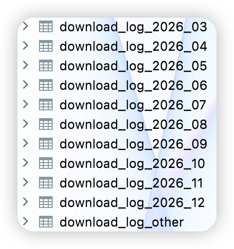

上篇文章中讲过了ShardingJDBC的原理与使用，因为ShardingJDBC版本比较陈旧，而最新版的ShardingJDBC更名为shardingsphere-jdbc，版本号为5.0，所以我们在shardingsphere-jdbc 5.0版本下实验分表配置与完全**自定义分片算法**

```xml
<!--   分库分表依赖     -->
<dependency>
	<groupId>org.apache.shardingsphere</groupId>
  <artifactId>shardingsphere-jdbc-core</artifactId>
  <version>5.0.0</version>
</dependency>
```


```java
import com.google.common.collect.Range;
import com.ikang.rtp.common.util.DateUtil;
import com.ikang.rtp.common.util.ShardingAlgorithmUtil;
import lombok.SneakyThrows;
import org.apache.shardingsphere.sharding.api.sharding.standard.PreciseShardingValue;
import org.apache.shardingsphere.sharding.api.sharding.standard.RangeShardingValue;
import org.apache.shardingsphere.sharding.api.sharding.standard.StandardShardingAlgorithm;
import org.springframework.stereotype.Component;

import java.util.*;

@Component
public class TableShardingAlgorithm implements StandardShardingAlgorithm<Date> {

    private Properties props;

    @Override
    public Properties getProps() {
        return props;
    }

    @Override
    public void setProps(Properties props) {
        this.props = props;
    }

    @Override
    public String getType() {
        return "SHLD_DBSHARD";
    }

    @Override
    public void init() {
        // 这里可以进行必要的初始化
    }

  	//insert、updata、delete时使用
    @Override
    public String doSharding(Collection<String> tableNames, PreciseShardingValue<Date> shardingValue) {
        // 精确分片策略
        for (String tableName : tableNames) {
            if (tableName.endsWith(DateUtil.format(shardingValue.getValue(), DateUtil.DATEFORMATYEARMONTH))) {
                return tableName;
            }
        }
        return "download_log_other";
    }

  	//select时使用
    @SneakyThrows
    @Override
    public Collection<String> doSharding(Collection<String> tableNames, RangeShardingValue<Date> shardingValue) {
        // 范围分片策略
        Range<Date> valueRange = shardingValue.getValueRange();
        LinkedList<String> targetTableNames = new LinkedList<>();
        for (String tableName : tableNames) {
            if (tableName.endsWith("other")) {
                targetTableNames.add(tableName);
            } else {
              	//处理date格式，与表名中使用的date格式一致
                Date tableDate = DateUtil.parse(tableName.substring(13), DateUtil.DATEFORMATYEARMONTH);
                if (tableDate == null) {
                    throw new RuntimeException("范围分片算法失败");
                }
                Date tableDateMonthLastDay = ShardingAlgorithmUtil.getLastDayOfMonth(tableDate);
                Range<Date> tableDateRange = Range.closed(tableDate, tableDateMonthLastDay);
                if (!valueRange.hasLowerBound()) {
                    //-∞
                    if (valueRange.upperEndpoint().compareTo(tableDateRange.upperEndpoint()) >= 0
                            || (valueRange.upperEndpoint().compareTo(tableDateRange.lowerEndpoint()) >= 0
                            && valueRange.upperEndpoint().compareTo(tableDateRange.upperEndpoint()) <= 0)) {
                        targetTableNames.add(tableName);
                    }
                } else if (!valueRange.hasUpperBound()) {
                    //+∞
                    if (valueRange.lowerEndpoint().compareTo(tableDateRange.lowerEndpoint()) <= 0
                            || (valueRange.lowerEndpoint().compareTo(tableDateRange.upperEndpoint()) <= 0
                            && valueRange.lowerEndpoint().compareTo(tableDateRange.lowerEndpoint()) >= 0)) {
                        targetTableNames.add(tableName);
                    }
                } else {
                    //判断两个Range是否重叠(满足max(A.start,B.start) <= min(A.end,B.end)，即重叠)
                    if (ShardingAlgorithmUtil.getTwoDateMax(tableDateRange.lowerEndpoint(), valueRange.lowerEndpoint())
                            .compareTo(ShardingAlgorithmUtil.getTwoDateMin(tableDateRange.upperEndpoint(), valueRange.upperEndpoint()))
                            <= 0) {
                        targetTableNames.add(tableName);
                    }
                }
            }
        }
        return targetTableNames;
    }
}
```
因为shardingsphere-jdbc 5.0并未与Spring boot融合，所以想要使刚才我们自定义的分片算法类TableShardingAlgorithm生效，我们需要在文件中写我们分片算法类的package


```
com.xxx.xxx.config.TableShardingAlgorithm
```

```java
import java.util.Calendar;
import java.util.Date;

//配套util
public class ShardingAlgorithmUtil {

    public static Date getTwoDateMax(Date date1, Date date2) {
        if (date1.compareTo(date2) > 0) {
            return date1;
        } else {
            return date2;
        }
    }

    public static Date getTwoDateMin(Date date1, Date date2) {
        if (date1.compareTo(date2) < 0) {
            return date1;
        } else {
            return date2;
        }
    }

    public static Date getLastDayOfMonth(Date date){
        Calendar calendar = Calendar.getInstance();
        calendar.setTime(date);
        int lastDay = calendar.getActualMaximum(Calendar.DATE);
        calendar.set(Calendar.DAY_OF_MONTH, lastDay);
        calendar.set(Calendar.HOUR_OF_DAY, 23);
        calendar.set(Calendar.MINUTE, 59);
        calendar.set(Calendar.SECOND, 59);
        calendar.set(Calendar.MILLISECOND, 999);
        return calendar.getTime();
    }
}
```

date相关util就不写出来了

表信息如图所示



数据源配置

```java
import com.zaxxer.hikari.HikariDataSource;
import org.apache.ibatis.session.SqlSessionFactory;
import org.apache.shardingsphere.driver.api.ShardingSphereDataSourceFactory;
import org.apache.shardingsphere.infra.config.algorithm.ShardingSphereAlgorithmConfiguration;
import org.apache.shardingsphere.sharding.api.config.ShardingRuleConfiguration;
import org.apache.shardingsphere.sharding.api.config.rule.ShardingTableRuleConfiguration;
import org.apache.shardingsphere.sharding.api.config.strategy.sharding.StandardShardingStrategyConfiguration;
import org.mybatis.spring.SqlSessionFactoryBean;
import org.mybatis.spring.SqlSessionTemplate;
import org.springframework.beans.factory.annotation.Qualifier;
import org.springframework.beans.factory.annotation.Value;
import org.springframework.boot.context.properties.ConfigurationProperties;
import org.springframework.boot.jdbc.DataSourceBuilder;
import org.springframework.context.annotation.Bean;
import org.springframework.context.annotation.Configuration;
import org.springframework.context.annotation.Primary;
import org.springframework.core.io.support.PathMatchingResourcePatternResolver;
import org.springframework.jdbc.datasource.DataSourceTransactionManager;
import tk.mybatis.spring.annotation.MapperScan;
import javax.sql.DataSource;
import java.sql.SQLException;
import java.util.Collections;
import java.util.HashMap;
import java.util.Map;
import java.util.Properties;


@Configuration
@MapperScan(basePackages = {"com.xxx.xxx.mapper.primary.**"}, sqlSessionFactoryRef = "sqlSessionFactoryPrimary")
public class DBPrimaryConfig {

    @Value("${shardingjdbc.tableNames}")
    private String tableNames;

    @Value("${shardingjdbc.deathDay}")
    private String deathDay;

    @Bean(name = "primaryDatasource")
    @Primary
    @ConfigurationProperties(prefix = "spring.datasource.primary")
    public DataSource primaryDataSource() {
        return DataSourceBuilder.create().type(HikariDataSource.class).build();
    }

    @Bean(name = "shardingDataSource")
    @Primary
    DataSource getShardingDataSource() throws SQLException {
        // 配置 download_log 逻辑表名和物理节点
        ShardingTableRuleConfiguration downloadLogTableRuleConfig = new ShardingTableRuleConfiguration("download_log", tableNames);

        // 配置分表策略
        downloadLogTableRuleConfig.setTableShardingStrategy(new StandardShardingStrategyConfiguration("create_time", TableShardingAlgorithm.class.getName()));

        // 配置分片规则（逻辑表名和物理节点）
        ShardingRuleConfiguration shardingRuleConfig = new ShardingRuleConfiguration();
        shardingRuleConfig.getTables().add(downloadLogTableRuleConfig);

        shardingRuleConfig.getShardingAlgorithms().put(TableShardingAlgorithm.class.getName(), new ShardingSphereAlgorithmConfiguration("SHLD_DBSHARD", new Properties()));

        DataSource dataSource = null;
        try {
            dataSource = ShardingSphereDataSourceFactory.createDataSource(createDataSourceMap(), Collections.singleton(shardingRuleConfig), new Properties());
        } catch (SQLException e) {
            e.printStackTrace();
        }
        return dataSource;
    }

    @Bean
    @Primary
    public SqlSessionFactory sqlSessionFactoryPrimary(@Qualifier("shardingDataSource") DataSource shardingDataSource) throws Exception {
        SqlSessionFactoryBean bean = new SqlSessionFactoryBean();
        bean.setDataSource(shardingDataSource);
        bean.setMapperLocations(new PathMatchingResourcePatternResolver().getResources("classpath:mapper/primary/*.xml"));
        return bean.getObject();
    }

    @Bean
    @Primary
    public SqlSessionTemplate testSqlSessionTemplate(@Qualifier("sqlSessionFactoryPrimary") SqlSessionFactory sqlSessionFactoryPrimary) {
        return new SqlSessionTemplate(sqlSessionFactoryPrimary);
    }

    private Map<String, DataSource> createDataSourceMap() {
        Map<String, DataSource> result = new HashMap<>();
        result.put("xxx-xxx", primaryDataSource());
        return result;
    }

}
```

