# 名词介绍

日活：日活跃用户数


SPU：苹果6（商品聚合信息的最小单位），如手机->苹果手机->苹果6，苹果6就是SPU。

SKU：土豪金 16G 苹果6 （商品的不可再分的最小单元）。

spu 属性(不会影响到库存和价格的属性, 又叫**关键属性**) >>

- 毛重: 420.00 g
- 产地: 中国大陆
  sku 属性(会影响到库存和价格的属性, 又叫**销售属性**) >>

- 容量: 16G, 64G, 128G

- 颜色: 银, 白, 玫瑰金

  

TPS：吞吐量

QPS: 每秒查询率

RT：响应时间

# 分库分表

本文内容预览：

1. 库表会在哪天到达瓶颈？
   `1.1 苏宁拼购百万级库表拆分之前`
   `1.2 京东配运平台库表拆分之前`
   `1.3 大众点评订单库拆分之前`
   `1.4 小结：啥情况需要考虑库表拆分`
2. 拆分库表的目的和方案
   `2.1 业务数据解耦--垂直拆分`
   `2.2 解决容量和性能压力--水平拆分`
   `2.3 分多少合适`
   `2.4 怎么分合适`
3. 拆分带来新的问题
   `分区键/唯一ID/数据迁移/分布式事务等`
4. 大厂案例，知识回顾扩展
   `4.1 蚂蚁金服的库表路由规则`
   `4.2 大众点评分库分表的数据迁移`
   `4.3 淘宝万亿级交易订单的存储引擎`

## 1库表会在哪天到达瓶颈？

### 1.1苏宁拼购百万级库表拆分之前[1]

苏宁拼购，苏宁易购旗下的电商App，18年7月累计用户突破3000万。

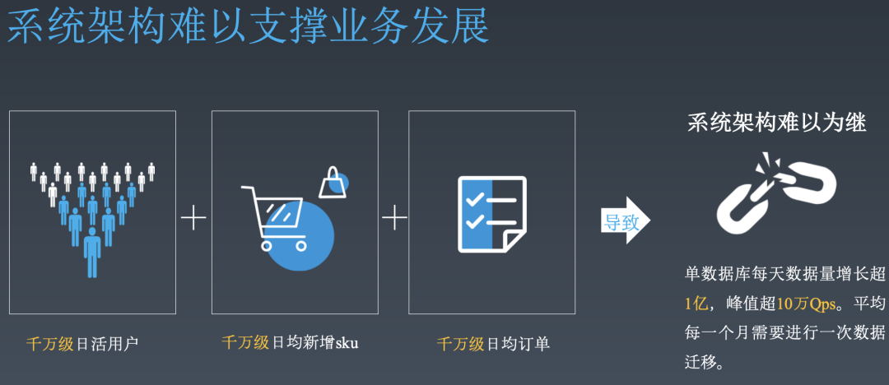

面对千万级日活 + 千万级日新增SKU + 千万级日均订单，拼购的单库每天增长数据超1亿，峰值10万QPS并发，每个月要搞一次数据迁移。

庞大的数据量，对数据库压力和数据运维成本造成了很大的困扰，并且，一旦有一条未命中缓存的SQL，对于整个应用都是灾难级的。

所以，不得不考虑系统的稳定性和长远的业务支撑。

### 1.2京东配运平台库表拆分之前[2]

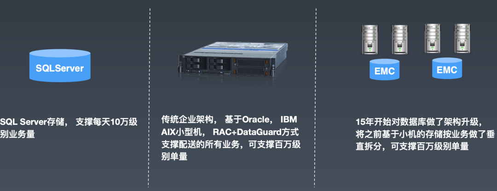

起初，用SQL Server存储，⽀支撑每天10万级别业务量。

扛不住后，采购了企业级Oracle/IBM AIX⼩型机，用 RAC + DataGuard方式，支撑配送所有业务，到百万级别单量。但是这种传统的企业架构，对于复杂多变的业务、昂贵的硬件成本、服务的部署和维护成本等痛点，变得越来越突出。

15年开始，京东配运平台开始按业务对数据库做垂直拆分，将存储容器化，实现了方便的水平扩容、更精细的成本控制、更复杂的业务形态支持.

### 1.3大众点评订单库拆分之前[3]

16年前，点评的订单库已经超200G容量，面对的越来越复杂的查询维度，为实现平稳查询，优化了索引并增加两个从库来分散数据库压力，但仍有很多效率不理想的数据库请求出现。

而随后而来的价格战、大量抢购的活动开展，订单数据库很快难以支撑，只能用限流、消息队列削峰填谷对其进行保护，才能勉强维持日常数据读写需求。

而随着业务模式的增加，原订单模型已经不能满足，如果经常用DDL去建表，建索引对于如此庞大的库表是非常吃力的，发生锁库锁表会直接影响线上服务。

所以，点评团队以未来十年不再担心订单容量为目的，开始进行库表切分。

### 1.4小结：啥情况需要考虑库表拆分

实际上，是没有一个非常量化的指标来判定库表瓶颈的，因为每个系统的业务场景，查询复杂度都有不同。

但力有穷尽时，我们虽然可以尽量的从加从库读写分离、优化sql、优化索引、复用连接等等方面进行优化，但总会有到达极限的时候的时候，量变引发质变。甚至，在真实生产环境，要更加未雨绸缪，不能等到崩了才去考虑。那么，应该怎么去判断已经到了库表拆分的时机呢：

- *硬件性能瓶颈*，如果是读操作多，其实可以加多个从库分担主库读压力；但如果是写操作多，会因为主库磁盘IO增大，拖慢处理速度；另外，如果单表数据量过大，导致索引层级增多，扫描行增多，CPU效率降低，影响sql执行效率，拖慢处理速度。而处理速度慢最终会导致连接数增加直至无连接可用。
- *日常运维投入*，就如苏宁拼购的情况，如果一个月就要搞一次数据迁移，这个人力的投入产出比，应该是完全不匹配的，那就不如一次性搞定它。
- *业务发展可支持程度、难度和风险*，当数据增长到一定程度，虽然没有达到极限，还能凑活，但是遇到活动型流量脉冲，无法完全支持业务需求；而业务需要进行迭代增加模式时，修改数据表带来的风险又比较大。就可以考虑重构数据模型，拆分库表了。

## 2拆分库表的目的和方案

### 2.1业务数据解耦--垂直拆分

把不同的业务数据拆分到各自的数据库中独立维护，那么最底层的原因是什么呢？

是微服务下的上层服务拆分。为了满足快速迭代、安全发布、链路降级、主次业务解耦等问题，去解决代码大量冲突、小功能排队等待大版本发布等等问题，将业务按照一定逻辑进行拆解，形成一个个功能完备，独立运行的服务。[4]

然而，如果数据库层面不配合，就无法解决根本问题。当上层服务实例拆分后可以被大量横向扩展，以应对高并发的流量冲击，会导致底层数据库的承载压力和连接数急剧增加。

所以，通过垂直拆分将业务数据解耦，各管一事，以满足微服务的效能最大化。

### 2.2解决容量和性能压力--水平拆分

对某一业务库，当数据增量达到了库瓶颈，或者表瓶颈，就要进行库表的水平拆分了。

我之前遇到的很多情况，总是先分表，解决单表的容量和读写性能问题，随着业务发展，单库也遇到瓶颈了再考虑分库。

为啥不一步到位？

就像之前在阿里，新应用上来搞个百库百表？一来是因为一些用户规模和一些路由规则的问题；更重要的，不是所有公司其实不是所有的公司都和阿里一样有钱，有限的资源要用在更重要的生存问题上。

如果你作为一个初创公司的架构，给出了一套可能撑10年的存储方案，感觉会被同事在心里怼，公司能活3年么就这么浪费？

但肯定没有人说这话，因为我们还是希望所有公司都能蓬勃发展，蒸蒸日上的☺。

所以，拆分方法就很有讲究了，怎么分能让后续迭代发展的代价最小呢？

### 2.3分多少合适

表主要看容量，很多经验表明 上千万后性能会有显著下降，因此，我们可以把表容量定在一半多一点，600w。

库主要看的是连接数，我们以阿里对外售卖的云存储来大致估计，单库的连接数定在4000左右。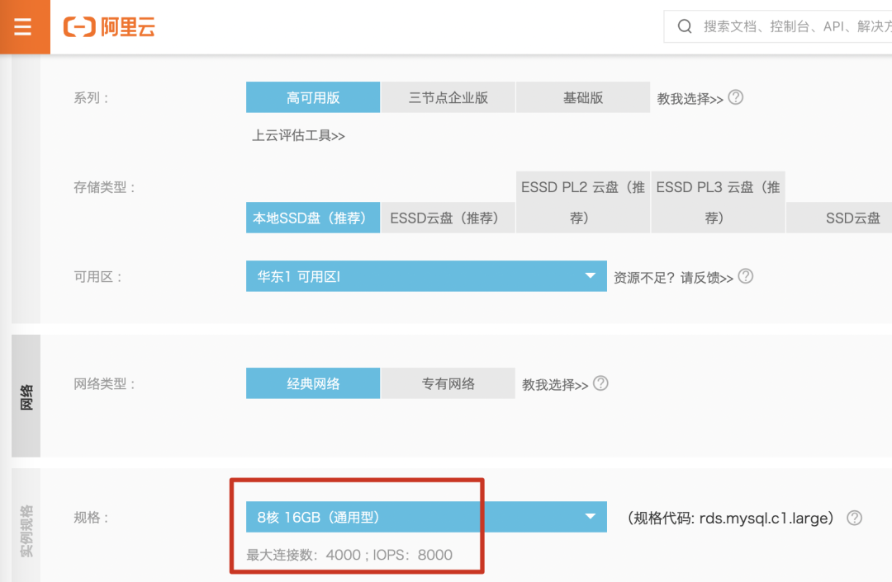

抽象一个实际的评估案例来看：假如目前平台每天产生10w订单，峰值并发数8000QPS，然后考虑业务扩展和增长的速率：

比如，业务是和银行合作扩展业务，将大小银行量级平均一下，估计每合作一家可以带来多大的增长量，这里假设是5000单/天/家，如果业务计划是每年度合作10家，那就是5w，5年以后每天的单量，理论上可能会到25w/天。加上现有的10w, 峰值35w。

如果我们计划系统的容量需要支撑3年，或者说，3年之后的该业务扩展会趋于平缓，那么我们可以大致的估计为：

```
表：（3年 * 365天 * 35w=3.8亿 ）/600w = 63 约 64张表.
库：10000并发 / 4000 = 2.5 ,可按4个库来处理
```

当然，如果是BAT这种，不缺用户，不缺钱，又有一些既定路由规则的情况，还是可以一步到位的。比如，我之前做过的项目就是按百库百表来做。关于阿里的玩法后面再详细介绍一下。

*发现上述评估有问题的话，欢迎留言讨论~*

### 2.4怎么分合适

#### Hash取模

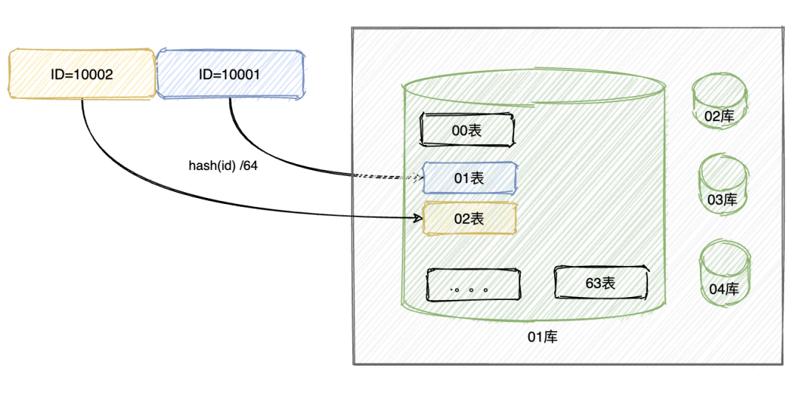

**优点**：经过hash取模之后，分到库和分到表中的数据，都是均衡的，所以，不会出现资源倾斜的问题。

**缺点**：如果后续遇到业务暴增，没有在我们预估范围内，则要涉及到数据迁移，那就需要重新hash , 迁移数据，修改路由等等。

#### range划分

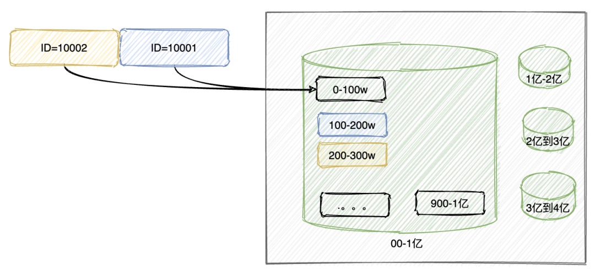简单说，就是把数据划分范围，挨个存储，存满一个再存另一个。

**优点**：不需要数据迁移，后续数据即时增长很多也没问题。

**缺点**：数据倾斜严重，比如上图，很长一段时间，都会只用到1个库，几个表。

#### 一致性hash

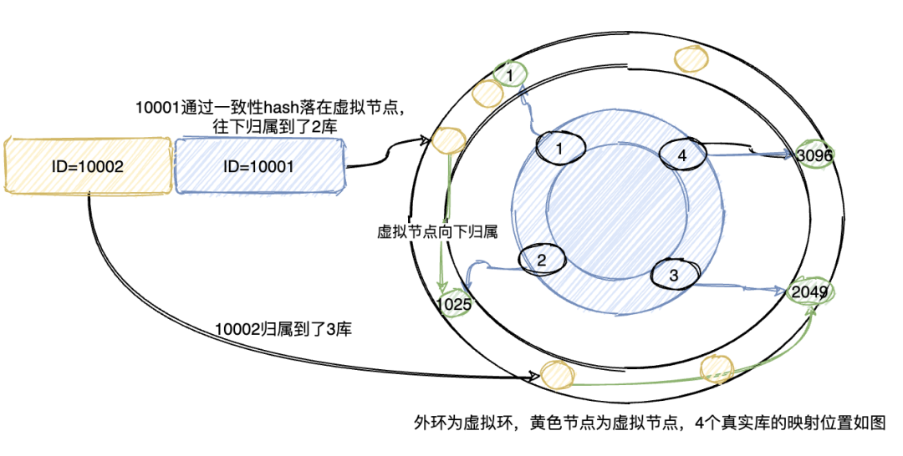一致性hash环的节点一般按2^32-1来算，但是一般如果业务ID足够均衡，则可以降一些节点，如4096等等，4个库的话，则均衡的分布在图上的位置，而数据通过hash计算，对应到外环的虚拟节点，然后归属于真实的库，对于表也可以同样处理。或者，直接把表节点部署在外环上，直接将数据归属于表。

**优点**：更加均匀，并且在需要扩容时，数据迁移的量级更小，只需要迁移1/N的数据即可。

**缺点**：路由算法要复杂，但是对于能得到的好处，这点复杂度就可以忽略了

#### 小结

那么,看起来，一致性hash的方法，是比较靠谱的了。但是只是这样就会对程序员很友好么？

我不知道其他公司，呆过的某一家公司，的数据查询后台是纯天然的，不带任何修饰的，想要check下数据，得拿业务ID手动计算库表的位置。没经历过的不知道，真的是要烦死了。

在技术设施方面，还是不得不佩服大公司的投入，阿里给工程师提供的数据查询后台，其实是一个逻辑库，你可以用查询单表的方式去查询分库分表，后台会调用数据库配置平台的配置，自动计算库表路由，人性化的很。就算不去计算路由，直接打包查询多个库也是很好的，毕竟界面查询，能有多大并发呢。

还是那句话，*没有银弹*，其实除了这几种方式，还见过不少变种，但都是结合本公司，本业务的特性进行的改良。

## 3拆分带来新的问题

### 分区键选取

分区键要足够的均匀，比如，用户表用UID，订单表可以用UID，也可以用订单ID，商户表用商户ID，问题表用会话ID 等等，总之，一定可以找到业务上的唯一ID。当然还有一些特殊的分区，比如，日表，月表，则要按时间来分，等等。

### 全局唯一主键ID

实际我理解这个就是分布式ID的生成问题，之前写的一篇[分布式ID生成算法](https://mp.weixin.qq.com/s?__biz=MzA4ODUzMDg5NQ==&mid=2650000700&idx=1&sn=4c6ff37313affd5ef9bb2d4cb863ef70&scene=21#wechat_redirect)，有兴趣可以浏览下。

### 数据平滑迁移

**停机发布**：好处是简单，风险小；缺点是业务有损。那就看这个损能不能接受了

**平滑迁移**：平滑迁移就像是高速上换轮胎，要非常小心谨慎，也更复杂。思路可以类比快手kafka集群的扩容：

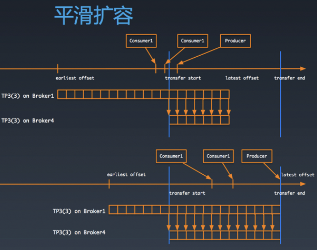

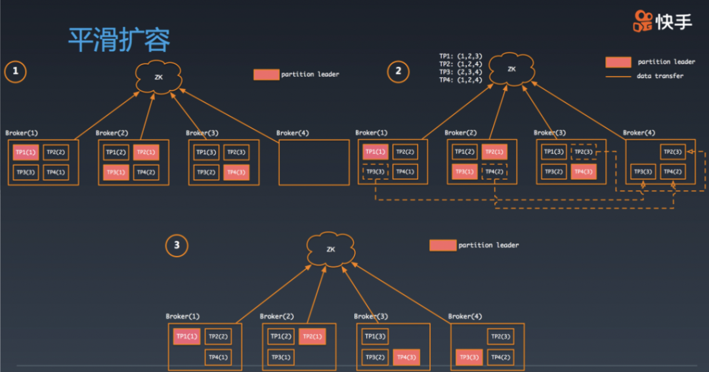

虽然场景不一样，但是思路使一致的。从某一点开始设置checkpoint , 然后执行数据双写，最后修改路由，删除旧数据，完成扩容。

### 事务问题

之前由于数据都在一个库中，所以，只要保证一个本地事务就可以办到。现在数据被分到了多个库，那么事务怎么保证：

**（1）分布式事务**。分布式事务的方式很多，TCC、本地事务表+事务消息、最大努力通知，saga等等，之前有篇写我们[自研的saga长事务引擎](https://mp.weixin.qq.com/s?__biz=MzA4ODUzMDg5NQ==&mid=2650000675&idx=1&sn=f411dcfdf6135409b94963cbb45b4b0c&scene=21#wechat_redirect)的文章，有兴趣的可以看下。

**（2）程序+业务逻辑**。用业务逻辑+程序控制的方式，比如，之前文章中提到的[微信红包的系统设计](https://mp.weixin.qq.com/s?__biz=MzA4ODUzMDg5NQ==&mid=2650000991&idx=1&sn=4cd73cc5aa4ccb97d9823db82737d14b&scene=21#wechat_redirect)，用set化将一个红包的所有操作都落到同一个库上，避免了数据库锁竞争和分布式事务。**而**蚂蚁的支付业务涉及了业务订单库、计收费库、支付库、积分库等等，没有办法从业务逻辑层面进行完全串联，并且由于金融属性的强一致要求，采用了非常重的侵入式TCC来保证全局支付事务的一致。

### 查询问题

之前一个库就能搞定的join，count等各种联合查询，将不复存在，老老实实调接口在代码层面实现吧。

## 4大厂案例，知识回顾扩展

### 4.1蚂蚁金服的库表路由规则

上文也提到过，蚂蚁的分库分表其实是独树一帜的。因为，在蚂蚁体系下，需要遵守LDC单元化部署，单元化的路由有用户ID的倒数2，3位来决定。加上蚂蚁的用户规模，基本上大部分的应用都采用了百库百表类的方式进行(遇到定时任务的超大规模数据，还会千库千表的存在)。用户请求发起后的路由规则和数据库的路由执行链路简化如下：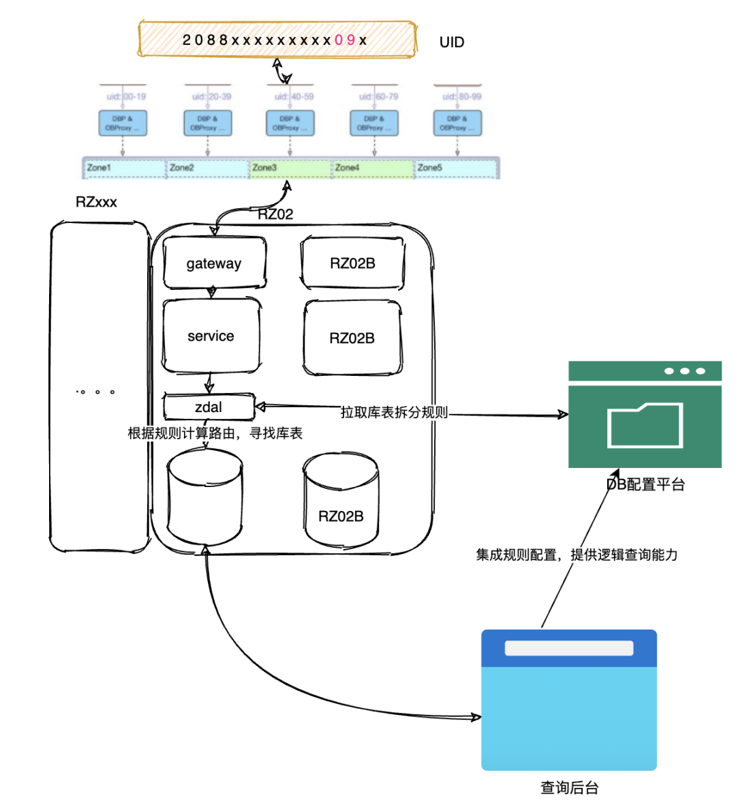而一条订单的入库路由规则可以参考下面的示意图：[5]

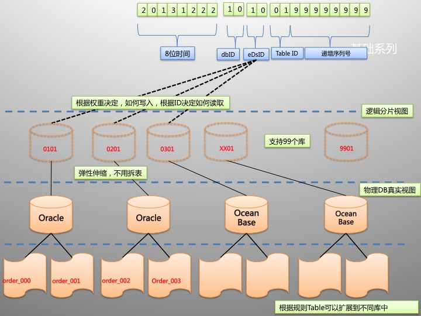

这样的机制保证生成的 ID 支持 10 万亿次获取不重复。

有人可能会问，这个大的订单量，一个库也撑不了多久啊？

是的，比如之前搞的一个应用，其实是百库百表+定时数据迁移来实现的。业务数据每固定时间进行历史表迁移。而查询的时候的库表路由，都由中间件ZDAL从配置平台拉取配置来决定，是走历史库还是走当前库。

### 4.2大众点评分库分表的数据迁移

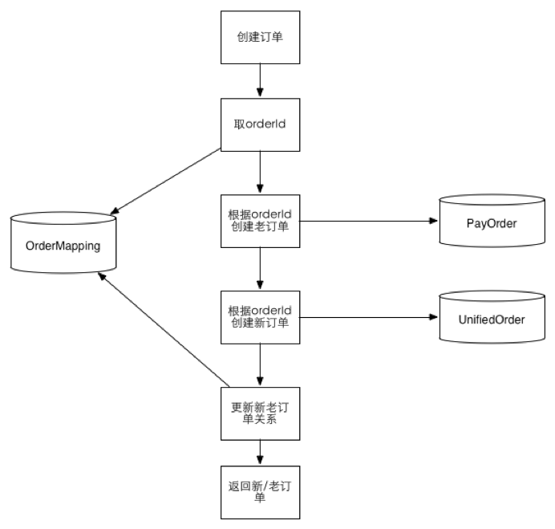


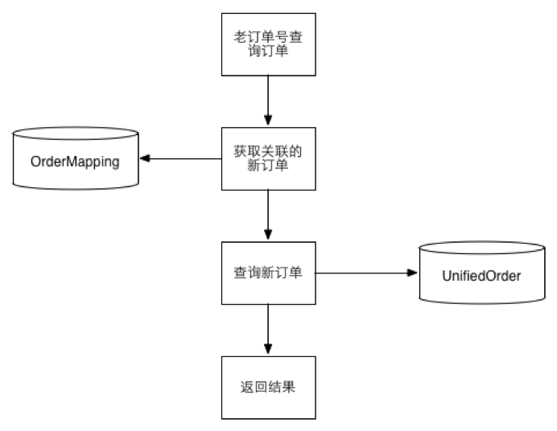

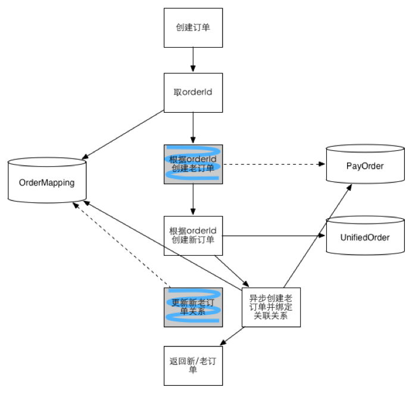

- 阶段一：数据双写，以老数据为准。通过对账补平差异
- 阶段二：导入历史数据，继续双写，读切到新数据。
- 阶段三：停掉双写，删除老数据完成迁移

### 4.3淘宝万亿级交易订单的存储引擎[6]

淘宝超级量级下的交易单是怎么解决存储性能等问题的：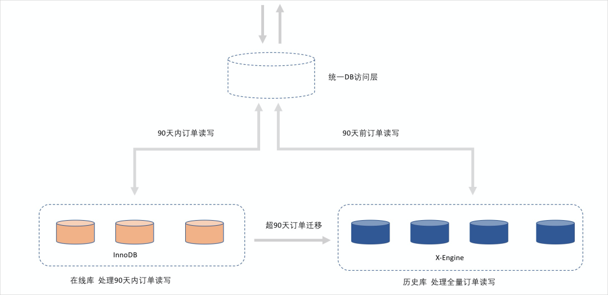可以看到，该方式和上面说过的历史订单迁移的方式是如初一辙的。

## 5总结

一篇文章不可能穷尽所有知识点，如有遗漏和错误，欢迎补充和指正，原创不易，欢迎转发，留言讨论~

> 高并发系列历史文章目录
>
> 1. 垂直性能提升
>    1.1. [架构优化：集群部署，负载均衡](https://mp.weixin.qq.com/s?__biz=MzA4ODUzMDg5NQ==&mid=2650000954&idx=1&sn=a9ee98310e583b1712e1e64988d2a796&scene=21#wechat_redirect)
>    1.2. [万亿流量下负载均衡的实现](https://mp.weixin.qq.com/s?__biz=MzA4ODUzMDg5NQ==&mid=2650000991&idx=1&sn=4cd73cc5aa4ccb97d9823db82737d14b&scene=21#wechat_redirect)
>    1.3. [架构优化：消息中间件的妙用](https://mp.weixin.qq.com/s?__biz=MzA4ODUzMDg5NQ==&mid=2650001031&idx=1&sn=75b0eea86788b7b59c61875745b38c4c&scene=21#wechat_redirect)
>    1.4. [存储优化：mysql的索引原理和优化](https://mp.weixin.qq.com/s?__biz=MzA4ODUzMDg5NQ==&mid=2650001071&idx=1&sn=fe00cfd25ae6c8595bcc2aef84ed102f&scene=21#wechat_redirect)
>    1.5. 本文:存储优化：详解分库分表