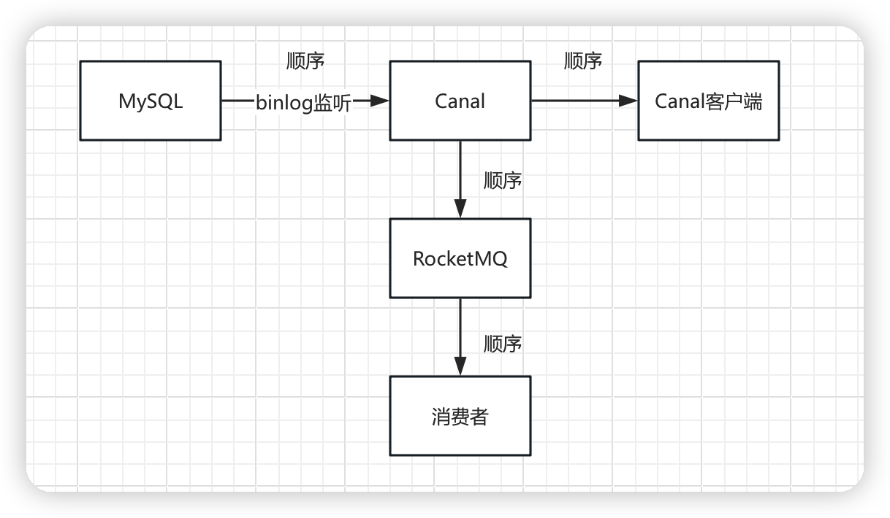

# Canal监听Binlog实现数据修改时同步至宽表

通过canal 监听dev库的user表，这个表里有一个字段id和name，如果某个id对应的name发生变化的话，就修改dev库order表中userId = user表id的userName的值

```xml
<dependency>
    <groupId>com.alibaba.otter</groupId>
    <artifactId>canal.client</artifactId>
    <version>1.1.4</version>
</dependency>
```

```java
import com.alibaba.otter.canal.client.CanalConnector;
import com.alibaba.otter.canal.client.CanalConnectors;
import com.alibaba.otter.canal.protocol.CanalEntry;
import com.alibaba.otter.canal.protocol.Message;

import java.net.InetSocketAddress;
import java.sql.Connection;
import java.sql.DriverManager;
import java.sql.PreparedStatement;
import java.sql.SQLException;
import java.util.List;

public class SimpleCanalClientExample {

    public static void main(String[] args) {
        // 创建Canal连接器，连接到指定Canal server
        CanalConnector connector = CanalConnectors.newSingleConnector(
                new InetSocketAddress("127.0.0.1", 11111),
                "example", "", "");

        int batchSize = 1000;

        try {
            // 连接Canal server
            connector.connect();
            // 订阅指定数据库和表，这里订阅 dev 数据库的 user 表
            connector.subscribe("dev.user");
            // 回滚上次的位置信息，获取最新的数据
            connector.rollback();

            while (true) {
                // 获取数据
                Message message = connector.getWithoutAck(batchSize);
                long batchId = message.getId();
                int size = message.getEntries().size();
                if (batchId == -1 || size == 0) {
                    try {
                        Thread.sleep(1000);
                    } catch (InterruptedException e) {
                    }   
                } else {
                    printEntry(message.getEntries());
                }
                // 提交确认，说明已经处理完毕
                connector.ack(batchId);
            }
        } finally {
            connector.disconnect();
        }
    }
    // 注意：在printEntry中添加了对数据库名和表名的判断
    private static void printEntry(List<CanalEntry.Entry> entrys) {
        for (CanalEntry.Entry entry : entrys) {
            CanalEntry.Header header = entry.getHeader();
            String database = header.getSchemaName();
            String table = header.getTableName();

            // 只处理dev库的user表
            if (!"dev".equals(database) || !"user".equals(table)) {
                continue;
            }

            if (entry.getEntryType() == CanalEntry.EntryType.TRANSACTIONBEGIN || entry.getEntryType() == CanalEntry.EntryType.TRANSACTIONEND) {
                continue;
            }

            // ... 其他代码保持不变
            CanalEntry.RowChange rowChage;
            try {
                rowChage = CanalEntry.RowChange.parseFrom(entry.getStoreValue());
            } catch (Exception e) {
                throw new RuntimeException("parser of event has an error, data:" + entry.toString(), e);
            }

            CanalEntry.EventType eventType = rowChage.getEventType();

            if (eventType != CanalEntry.EventType.UPDATE) {
                // 只处理UPDATE操作
                continue;
            }

            for (CanalEntry.RowData rowData : rowChage.getRowDatasList()) {
                //rowChage.getRowDatasList()表示这个实践中发生的所有行变更

                // 获取变更前的列
                List<CanalEntry.Column> beforeColumns = rowData.getBeforeColumnsList();

                // 获取变更后的列
                List<CanalEntry.Column> afterColumns = rowData.getAfterColumnsList();

                // 获取变更前后的name和id
                String beforeName = getColumnValue(beforeColumns, "name");
                String afterName = getColumnValue(afterColumns, "name");
                String id = getColumnValue(afterColumns, "id");

                // 如果name发生了变化，更新dev库的order表
                if (beforeName != null && !beforeName.equals(afterName)) {
                    updateOrderTable(id, afterName);
                }

            }
        }
    }

    // 封装获取某列值的方法
    private static String getColumnValue(List<CanalEntry.Column> columns, String columnName) {
        for (CanalEntry.Column column : columns) {
            if (column.getName().equals(columnName)) {
                return column.getValue();
            }
        }
        return null;
    }

    // 示意代码，实际项目中应考虑安全性，避免SQL注入，并妥善处理数据库连接和异常
    private static void updateOrderTable(String userId, String userName) {
        String sql = "UPDATE `order` SET `userName` = ? WHERE `userId` = ?";
        try (Connection conn = DriverManager.getConnection("jdbc:mysql://localhost:3306/dev", "username", "password");
             PreparedStatement pstmt = conn.prepareStatement(sql)) {
            pstmt.setString(1, userName);
            pstmt.setString(2, userId);
            pstmt.executeUpdate();
        } catch (SQLException e) {
            e.printStackTrace();
        }
    }
}
```

在此，printEntry方法进行判断，若不是dev库的user表，则继续处理下一个事件。如果是UPDATE操作，它将获取变更前后的name和id。如果name发生了变化，它将调用函数updateOrderTable更新order表的相应记录。
注意：这段代码只是演示性质的。在实际代码中，你需要考虑连接池和异常处理等多种因素。注入的问题，应使用PreparedStatement而不是简单的拼接SQL字符串。




由于监听某张表的binlog必须要求后续流程顺序执行，所以RocketMQ中对应的topic的消费者对列只能有一个

消费者项目使用类似主备、领导者选举高可用模式搭建，通过分布式锁实现多个实例中一次只会有一个实例来执行具体的消费业务逻辑，通过细化分布式锁粒度，目标表相同的使用同一个锁，来实现多个实例压力的平均分配。


项目设计搭建完善流程

1、canal作为整个流程中最重要的一环，canal本身是最重要的，但是由于canal 阿里官方缺少技术文档，最重要的性能指标不知道，所以首要任务是对canal进行压测，得到性能指标。根据真实业务场景的流量，最终测得canal监听到binlog到发送给RocketMQ再到消费者接受到消息平均耗时90ms（单台canal），所以canal这一环完全不用担心。

2、实现canal高可用，Canal集群的运行模式是选举机制，通过ZooKeeper实现的。在所有的Canal Server实例中，会选举出一个运行在主模式，其他的运行在备模式。处于主模式的Canal Server负责接收MySQL的binlog数据，并将数据写入到ZooKeeper。处于备模式的Canal Server则不接收数据，但会定期检查主Server的状态，如果主Server宕机，那么会从备模式的Server中选举一个新的主Server。这部分由运维验证与搭建，搭建canal admin

3、canal读取到数据后的分发逻辑。特定的库表事件要发送到特定的mq的topic中。

4、消费者集群搭建

