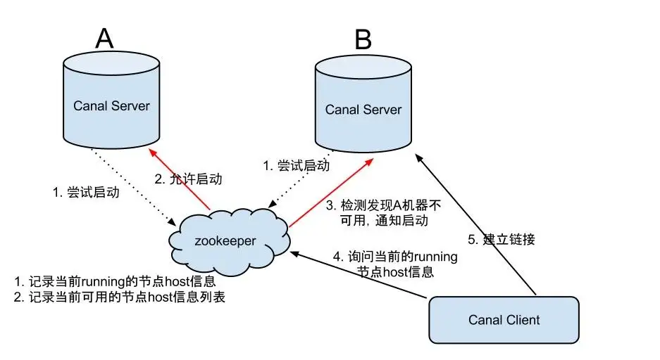
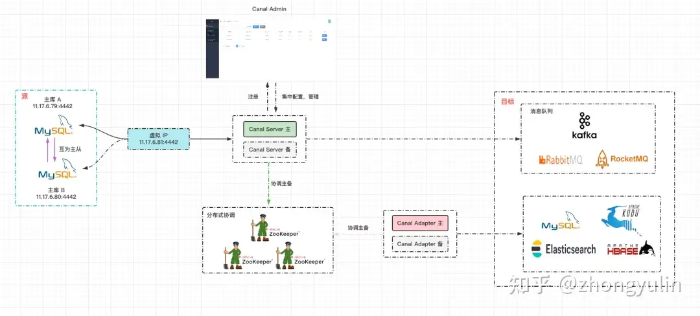
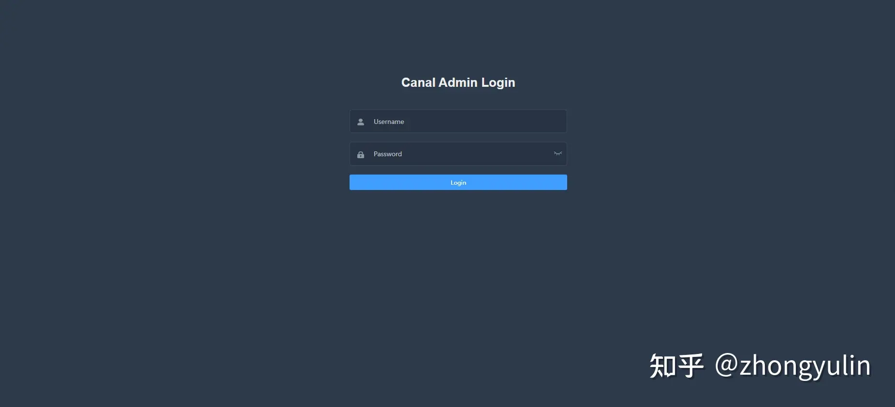
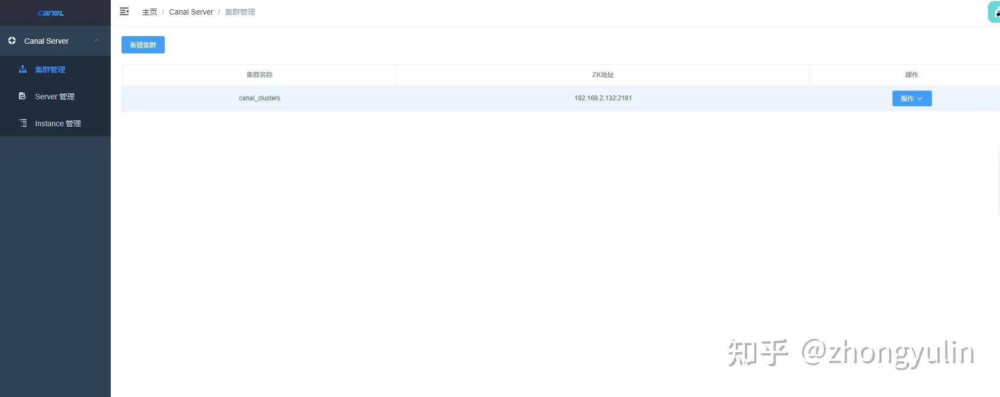
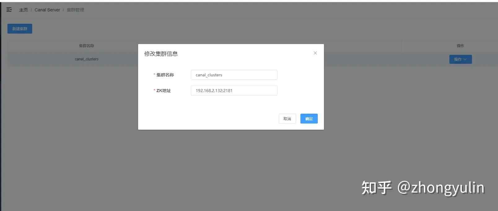
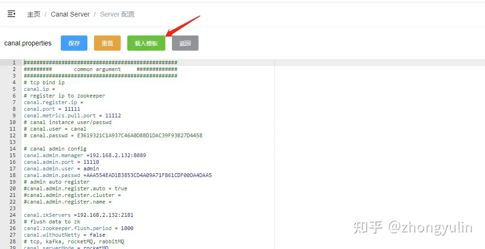
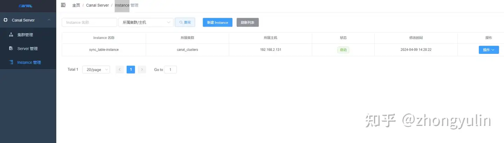
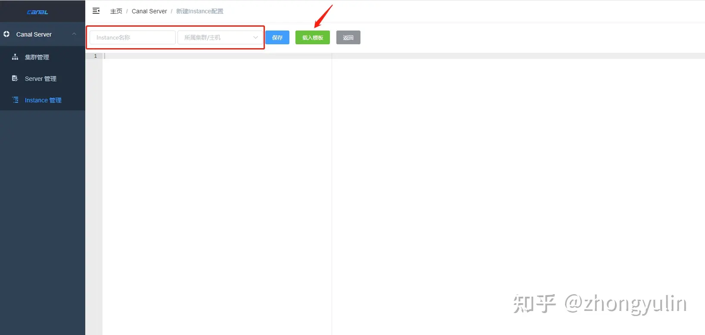

# Canal Admin 高可用集群

## **Canal Admin 架构**



Canal 1.1.4 版本引入了 Canal Admin，提供了统一管理 Canal Server 的 WebUI 界面。Canal Admin 的核心概念主要有：

- **Instance**：对应 Canal Server 里的 Instance，一个最小的订阅 MySQL 的队列。
- **Server**：对应 Canal Server，一个 Server 里可以包含多个 Instance，Canal Server 负责订阅 MySQL 的 binlog 数据，可以将数据输出到消息队列或者为 Canal Adapter 提供消息消费。原本 Canal Server 运行所需要的 canal.properties 和 instance.properties 配置文件可以在 Canal Admin WebUI 上进行统一运维，每个 Canal Server 只需要以最基本的配置启动。 (例如 Canal Admin 的地址，以及访问配置的账号、密码即可)
- **集群**：对应一组 Canal Server，通过 Zookeeper 协调主备实现 Canal Server HA 的高可用。

1. instance因为是最原始的业务订阅诉求，它会和 server/集群 这两个面向资源服务属性的进行关联，比如instance A绑定到server A上或者集群 A上，
2. 有了任务和资源的绑定关系后，对应的资源服务就会接收到这个任务配置，在对应的资源上动态加载instance，并提供服务
   - 动态加载的过程，有点类似于之前的autoScan机制，只不过基于canal-admin之后可就以变为远程的web操作，而不需要在机器上运维配置文件
3. 将server抽象成资源之后，原本canal-server运行所需要的canal.properties/instance.properties配置文件就需要在web ui上进行统一运维，每个server只需要以最基本的启动配置 (比如知道一下canal-admin的manager地址，以及访问配置的账号、密码即可)




## MySQL准备工作

**源库开启 binlog，创建同步用户**

```sql
CREATE USER canal IDENTIFIED BY 'canal';
GRANT SELECT, REPLICATION SLAVE, REPLICATION CLIENT ON *.* TO 'canal'@'%';
FLUSH PRIVILEGES;
```

开启 binlog，设置 binlog 模式为 row。

```text
[mysqld]

log-bin=mysql-bin
binlog-format=ROW
```

## 部署**Canal Admin**

**安装 Java**

```text
yum install -y java
```

**前置条件**

需要提前部署好Zookeeper集群，Canal Server 依赖 Zookeeper 实现 HA 高可用

**部署 Canal Admin**

```text
wget https://github.com/alibaba/canal/releases/download/canal-1.1.5/canal.admin-1.1.5.tar.gz
mkdir -p /soft/canal/canal-admin
tar -xzvf canal.admin-1.1.5.tar.gz -C /soft/canal/canal-admin
```

**初始化 Canal Admin 元数据库**

初始化 SQL 脚本里会默认创建名为 canal_manager 的数据库，canal_manager.sql 脚本存放在解压后的 conf 目录下。

**canal_manager.sql**

```sql
CREATE DATABASE /*!32312 IF NOT EXISTS*/ `canal_manager` /*!40100 DEFAULT CHARACTER SET utf8 COLLATE utf8_bin */;

USE `canal_manager`;

SET NAMES utf8;
SET FOREIGN_KEY_CHECKS = 0;

-- ----------------------------
-- Table structure for canal_adapter_config
-- ----------------------------
DROP TABLE IF EXISTS `canal_adapter_config`;
CREATE TABLE `canal_adapter_config` (
  `id` bigint(20) NOT NULL AUTO_INCREMENT,
  `category` varchar(45) NOT NULL,
  `name` varchar(45) NOT NULL,
  `status` varchar(45) DEFAULT NULL,
  `content` text NOT NULL,
  `modified_time` timestamp NOT NULL DEFAULT CURRENT_TIMESTAMP ON UPDATE CURRENT_TIMESTAMP,
  PRIMARY KEY (`id`)
) ENGINE=InnoDB DEFAULT CHARSET=utf8;

-- ----------------------------
-- Table structure for canal_cluster
-- ----------------------------
DROP TABLE IF EXISTS `canal_cluster`;
CREATE TABLE `canal_cluster` (
  `id` bigint(20) NOT NULL AUTO_INCREMENT,
  `name` varchar(63) NOT NULL,
  `zk_hosts` varchar(255) NOT NULL,
  `modified_time` timestamp NOT NULL DEFAULT CURRENT_TIMESTAMP ON UPDATE CURRENT_TIMESTAMP,
  PRIMARY KEY (`id`)
) ENGINE=InnoDB DEFAULT CHARSET=utf8;

-- ----------------------------
-- Table structure for canal_config
-- ----------------------------
DROP TABLE IF EXISTS `canal_config`;
CREATE TABLE `canal_config` (
  `id` bigint(20) NOT NULL AUTO_INCREMENT,
  `cluster_id` bigint(20) DEFAULT NULL,
  `server_id` bigint(20) DEFAULT NULL,
  `name` varchar(45) NOT NULL,
  `status` varchar(45) DEFAULT NULL,
  `content` text NOT NULL,
  `content_md5` varchar(128) NOT NULL,
  `modified_time` timestamp NOT NULL DEFAULT CURRENT_TIMESTAMP ON UPDATE CURRENT_TIMESTAMP,
  PRIMARY KEY (`id`),
  UNIQUE KEY `sid_UNIQUE` (`server_id`)
) ENGINE=InnoDB DEFAULT CHARSET=utf8;

-- ----------------------------
-- Table structure for canal_instance_config
-- ----------------------------
DROP TABLE IF EXISTS `canal_instance_config`;
CREATE TABLE `canal_instance_config` (
  `id` bigint(20) NOT NULL AUTO_INCREMENT,
  `cluster_id` bigint(20) DEFAULT NULL,
  `server_id` bigint(20) DEFAULT NULL,
  `name` varchar(45) NOT NULL,
  `status` varchar(45) DEFAULT NULL,
  `content` text NOT NULL,
  `content_md5` varchar(128) DEFAULT NULL,
  `modified_time` timestamp NOT NULL DEFAULT CURRENT_TIMESTAMP ON UPDATE CURRENT_TIMESTAMP,
  PRIMARY KEY (`id`),
  UNIQUE KEY `name_UNIQUE` (`name`)
) ENGINE=InnoDB DEFAULT CHARSET=utf8;

-- ----------------------------
-- Table structure for canal_node_server
-- ----------------------------
DROP TABLE IF EXISTS `canal_node_server`;
CREATE TABLE `canal_node_server` (
  `id` bigint(20) NOT NULL AUTO_INCREMENT,
  `cluster_id` bigint(20) DEFAULT NULL,
  `name` varchar(63) NOT NULL,
  `ip` varchar(63) NOT NULL,
  `admin_port` int(11) DEFAULT NULL,
  `tcp_port` int(11) DEFAULT NULL,
  `metric_port` int(11) DEFAULT NULL,
  `status` varchar(45) DEFAULT NULL,
  `modified_time` timestamp NOT NULL DEFAULT CURRENT_TIMESTAMP ON UPDATE CURRENT_TIMESTAMP,
  PRIMARY KEY (`id`)
) ENGINE=InnoDB DEFAULT CHARSET=utf8;

-- ----------------------------
-- Table structure for canal_user
-- ----------------------------
DROP TABLE IF EXISTS `canal_user`;
CREATE TABLE `canal_user` (
  `id` bigint(20) NOT NULL AUTO_INCREMENT,
  `username` varchar(31) NOT NULL,
  `password` varchar(128) NOT NULL,
  `name` varchar(31) NOT NULL,
  `roles` varchar(31) NOT NULL,
  `introduction` varchar(255) DEFAULT NULL,
  `avatar` varchar(255) DEFAULT NULL,
  `creation_date` timestamp NOT NULL DEFAULT CURRENT_TIMESTAMP ON UPDATE CURRENT_TIMESTAMP,
  PRIMARY KEY (`id`)
) ENGINE=InnoDB DEFAULT CHARSET=utf8;

SET FOREIGN_KEY_CHECKS = 1;

-- ----------------------------
-- Records of canal_user
-- ----------------------------
BEGIN;
INSERT INTO `canal_user` VALUES (1, 'admin', '6BB4837EB74329105EE4568DDA7DC67ED2CA2AD9', 'Canal Manager', 'admin', NULL, NULL, '2019-07-14 00:05:28');
COMMIT;

SET FOREIGN_KEY_CHECKS = 1;
```

**Canal Admin 配置文件**

修改配置文件 vim /soft/canal/canal-admin/conf/application.yml：

```yaml
server:
  port: 8089
spring:
  jackson:
    date-format: yyyy-MM-dd HH:mm:ss
    time-zone: GMT+8

spring.datasource:
  address: 192.168.2.59:3306
  database: canal_manager
  username: root
  password: 123456
  driver-class-name: com.mysql.cj.jdbc.Driver
  url: jdbc:mysql://${spring.datasource.address}/${spring.datasource.database}?useUnicode=true&characterEncoding=UTF-8&useSSL=false
  hikari:
    maximum-pool-size: 30
    minimum-idle: 1

#Canal Server 加入 Canal Admin 使用的密码
canal:
  adminUser: admin
  adminPasswd: enjlink@com
```

mysql8.0替换jar包

/soft/canal/canal-admin/lib 目录下替换


**启动 Canal Admin**

```text
sh /soft/canal/canal-admin/bin/startup.sh
```

浏览器输入 [http://192.168.2.132:8089/](https://link.zhihu.com/?target=http%3A//192.168.2.132%3A8089/) 访问 Canal Admin 管理界面，默认用户名 admin，密码 123456。




**集群配置**




新建集群,点击集群管理-》新建集群-》配置集群名称、ZK地址(**已经创建好了就不做演示了**)




**配置集群主配置**

通过点击载入模块导入配置。这里修改成采用rocketMQ 数据传输




canal.properties 配置文件

```properties
#################################################
#########       common argument     #############
#################################################
# tcp bind ip
canal.ip =
# register ip to zookeeper
canal.register.ip =
canal.port = 11111
canal.metrics.pull.port = 11112
# canal instance user/passwd
# canal.user = canal
# canal.passwd = E3619321C1A937C46A0D8BD1DAC39F93B27D4458

# canal admin config
canal.admin.manager =192.168.2.132:8089
canal.admin.port = 11110
canal.admin.user = admin
## 获取密码: 
# mysql5.0
##   select password('xxx')
# mysql8.0
##   select upper(sha1(unhex(sha1('xxx'))))
canal.admin.passwd =AAA554EAD1B3853CD4A09A71F861CDF00DA4DAA5
# admin auto register
#canal.admin.register.auto = true
#canal.admin.register.cluster =
#canal.admin.register.name =

canal.zkServers =192.168.2.132:2181
# flush data to zk
canal.zookeeper.flush.period = 1000
canal.withoutNetty = false
# tcp, kafka, rocketMQ, rabbitMQ
canal.serverMode = rocketMQ
# flush meta cursor/parse position to file
canal.file.data.dir = ${canal.conf.dir}
canal.file.flush.period = 1000
## memory store RingBuffer size, should be Math.pow(2,n)
canal.instance.memory.buffer.size = 16384
## memory store RingBuffer used memory unit size , default 1kb
canal.instance.memory.buffer.memunit = 1024 
## meory store gets mode used MEMSIZE or ITEMSIZE
canal.instance.memory.batch.mode = MEMSIZE
canal.instance.memory.rawEntry = true

## detecing config
canal.instance.detecting.enable = false
#canal.instance.detecting.sql = insert into retl.xdual values(1,now()) on duplicate key update x=now()
canal.instance.detecting.sql = select 1
canal.instance.detecting.interval.time = 3
canal.instance.detecting.retry.threshold = 3
canal.instance.detecting.heartbeatHaEnable = false

# support maximum transaction size, more than the size of the transaction will be cut into multiple transactions delivery
canal.instance.transaction.size =  1024
# mysql fallback connected to new master should fallback times
canal.instance.fallbackIntervalInSeconds = 60

# network config
canal.instance.network.receiveBufferSize = 16384
canal.instance.network.sendBufferSize = 16384
canal.instance.network.soTimeout = 30

# binlog filter config
canal.instance.filter.druid.ddl = true
canal.instance.filter.query.dcl = false
canal.instance.filter.query.dml = false
canal.instance.filter.query.ddl = false
canal.instance.filter.table.error = false
canal.instance.filter.rows = false
canal.instance.filter.transaction.entry = false
canal.instance.filter.dml.insert = false
canal.instance.filter.dml.update = false
canal.instance.filter.dml.delete = false

# binlog format/image check
canal.instance.binlog.format = ROW,STATEMENT,MIXED 
canal.instance.binlog.image = FULL,MINIMAL,NOBLOB

# binlog ddl isolation
canal.instance.get.ddl.isolation = false

# parallel parser config
canal.instance.parser.parallel = true
## concurrent thread number, default 60% available processors, suggest not to exceed Runtime.getRuntime().availableProcessors()
#canal.instance.parser.parallelThreadSize = 16
## disruptor ringbuffer size, must be power of 2
canal.instance.parser.parallelBufferSize = 256

# table meta tsdb info
canal.instance.tsdb.enable = true
canal.instance.tsdb.dir = ${canal.file.data.dir:../conf}/${canal.instance.destination:}
canal.instance.tsdb.url =jdbc:mysql://192.168.2.59:3306/canal_tsdb
canal.instance.tsdb.dbUsername =root
canal.instance.tsdb.dbPassword =123456
# dump snapshot interval, default 24 hour
canal.instance.tsdb.snapshot.interval = 24
# purge snapshot expire , default 360 hour(15 days)
canal.instance.tsdb.snapshot.expire = 360

#################################################
#########       destinations        #############
#################################################
canal.destinations = 
# conf root dir
canal.conf.dir = ../conf
# auto scan instance dir add/remove and start/stop instance
canal.auto.scan = true
canal.auto.scan.interval = 5
# set this value to 'true' means that when binlog pos not found, skip to latest.
# WARN: pls keep 'false' in production env, or if you know what you want.
canal.auto.reset.latest.pos.mode = false

#canal.instance.tsdb.spring.xml = classpath:spring/tsdb/h2-tsdb.xml
canal.instance.tsdb.spring.xml = classpath:spring/tsdb/mysql-tsdb.xml

canal.instance.global.mode = manager
canal.instance.global.lazy = false
canal.instance.global.manager.address = ${canal.admin.manager}
#canal.instance.global.spring.xml = classpath:spring/memory-instance.xml
#canal.instance.global.spring.xml = classpath:spring/file-instance.xml
canal.instance.global.spring.xml = classpath:spring/default-instance.xml

##################################################
#########         MQ Properties      #############
##################################################
# aliyun ak/sk , support rds/mq
canal.aliyun.accessKey =
canal.aliyun.secretKey =
canal.aliyun.uid=

canal.mq.flatMessage = true
canal.mq.canalBatchSize = 50
canal.mq.canalGetTimeout = 100
# Set this value to "cloud", if you want open message trace feature in aliyun.
canal.mq.accessChannel = local

canal.mq.database.hash = true
canal.mq.send.thread.size = 30
canal.mq.build.thread.size = 8

##################################################
#########            Kafka           #############
##################################################
kafka.bootstrap.servers = 127.0.0.1:6667
kafka.acks = all
kafka.compression.type = none
kafka.batch.size = 16384
kafka.linger.ms = 1
kafka.max.request.size = 1048576
kafka.buffer.memory = 33554432
kafka.max.in.flight.requests.per.connection = 1
kafka.retries = 0

kafka.kerberos.enable = false
kafka.kerberos.krb5.file = "../conf/kerberos/krb5.conf"
kafka.kerberos.jaas.file = "../conf/kerberos/jaas.conf"

##################################################
#########           RocketMQ         #############
##################################################
rocketmq.producer.group = mysql_data_elasti_group
rocketmq.enable.message.trace = false
rocketmq.customized.trace.topic =mysql_data_elasti_topic
rocketmq.namespace =
rocketmq.namesrv.addr = 192.168.2.59:9876
rocketmq.retry.times.when.send.failed = 0
rocketmq.vip.channel.enabled = false
rocketmq.tag =canal_mysql_data_elasti_tag 

##################################################
#########           RabbitMQ         #############
##################################################
rabbitmq.host =
rabbitmq.virtual.host =
rabbitmq.exchange =
rabbitmq.username =
rabbitmq.password =
rabbitmq.deliveryMode =
```

**配置Instance**




点击新建Instance，填写Instance名称、选择所属集群/主机,载入模板




配置文件：sync_table-instance/instance.propertios 

```properties
#################################################
## mysql serverId , v1.0.26+ will autoGen
# canal.instance.mysql.slaveId=0

# enable gtid use true/false
canal.instance.gtidon=false

# position info
canal.instance.master.address=192.168.2.130:3306
##配置 binlog文件  : mysql获取命令: show master status;
canal.instance.master.journal.name=
canal.instance.master.position=
canal.instance.master.timestamp=
canal.instance.master.gtid=

# rds oss binlog
canal.instance.rds.accesskey=
canal.instance.rds.secretkey=
canal.instance.rds.instanceId=

# table meta tsdb info
canal.instance.tsdb.enable=true
canal.instance.tsdb.url=jdbc:mysql://192.168.2.59:3306/canal_tsdb
canal.instance.tsdb.dbUsername=root
canal.instance.tsdb.dbPassword=123456

#canal.instance.standby.address =
#canal.instance.standby.journal.name =
#canal.instance.standby.position =
#canal.instance.standby.timestamp =
#canal.instance.standby.gtid=

# username/password
canal.instance.dbUsername=canalSlave
canal.instance.dbPassword=enjlink.com
canal.instance.connectionCharset =GBK
canal.instance.defaultDatabaseName =inchargeloan
# enable druid Decrypt database password
canal.instance.enableDruid=false
#canal.instance.pwdPublicKey=MFwwDQYJKoZIhvcNAQEBBQADSwAwSAJBALK4BUxdDltRRE5/zXpVEVPUgunvscYFtEip3pmLlhrWpacX7y7GCMo2/JM6LeHmiiNdH1FWgGCpUfircSwlWKUCAwEAAQ==

# table regex
canal.instance.filter.regex=inchargeloan.*
# table black regex
canal.instance.filter.black.regex=mysql\\.slave_.*
# table field filter(format: schema1.tableName1:field1/field2,schema2.tableName2:field1/field2)
#canal.instance.filter.field=test1.t_product:id/subject/keywords,test2.t_company:id/name/contact/ch
# table field black filter(format: schema1.tableName1:field1/field2,schema2.tableName2:field1/field2)
#canal.instance.filter.black.field=test1.t_product:subject/product_image,test2.t_company:id/name/contact/ch

# mq config
canal.mq.topic=mysql_data_elasti_topic
# dynamic topic route by schema or table regex
#canal.mq.dynamicTopic=mytest1.user,mytest2\\..*,.*\\..*
canal.mq.partition=0
# hash partition config
#canal.mq.partitionsNum=3
#canal.mq.partitionHash=test.table:id^name,.*\\..*
#################################################
```

**注意载入集群配置必须在 Canal Server 添加进集群之前做，否则 Canal Server 会无法加入集群**

## **部署 Canal Server 节点**

**下载并解压压缩包**

```text
wget https://github.com/alibaba/canal/releases/download/canal-1.1.5/canal.deployer-1.1.5.tar.gz
mkdir -p /soft/canal/canal-server
tar -xzvf canal.deployer-1.1.5.tar.gz -C /soft/canal/canal-server
```

**Canal Server 配置文件**

因为这里使用 Canal Admin 部署集群，所以 Canal Server 节点只需要配置 Canal Admin 的连接信息即可，真正的配置文件统一通过 Canal Admin 界面来管理。编辑 vim /soft/canal/canal-server/conf/canal_local.properties 文件：

```text
# register ip
canal.register.ip =192.168.2.131

# canal admin config
canal.admin.manager =192.168.2.132:8089
canal.admin.port = 11110
canal.admin.user = admin
#mysql5 类型 MD5 加密结果 -- admin
canal.admin.passwd =AAA554EAD1B3853CD4A09A71F861CDF00DA4DAA5
# admin auto register
#自动注册
canal.admin.register.auto = true
#集群名
canal.admin.register.cluster =canal_clusters
#Canal Server 名字
canal.admin.register.name =192.168.2.131
```

相关配置: 关于消息队列中 Topic 和源库表的映射关系可以参考 [Canal Kafka RocketMQ QuickStart] ([https://github.com/alibaba/canal/wiki/Canal-Kafka-RocketMQ-QuickStart](https://link.zhihu.com/?target=https%3A//github.com/alibaba/canal/wiki/Canal-Kafka-RocketMQ-QuickStart))。

## **高可用测试**

- 1.Canal Server 故障：通过 Zookeeper 协调，备 Canal Server 转为 running 状态提供服务。
- 2.Canal Admin 故障：管理节点故障并影响正在运行的任务