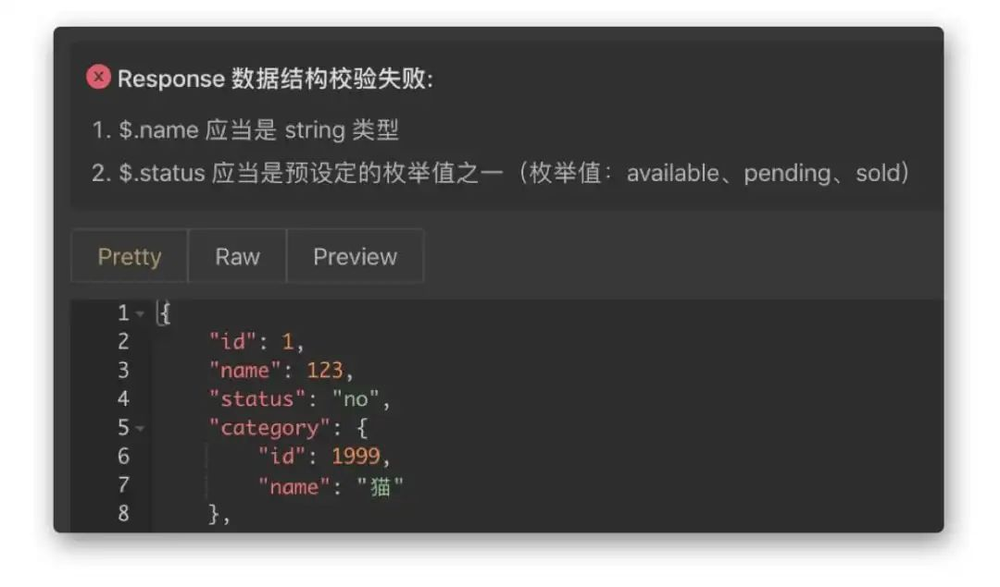
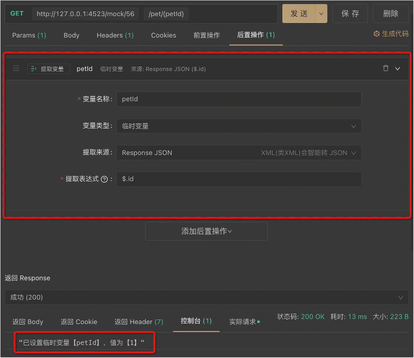
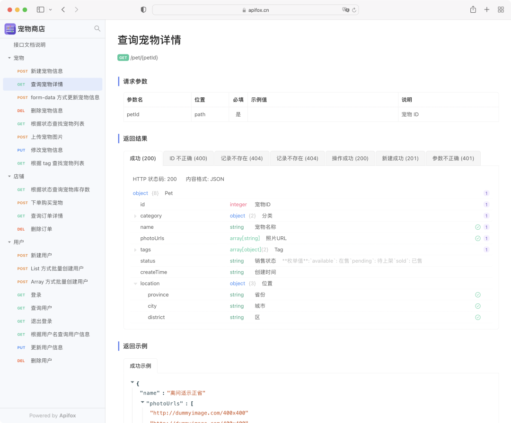

# Apifox使用指南

程序员最讨厌的两件事：`1. 写文档，2. 别人不写文档`。大多数开发人员不愿意写 API 文档的原因是`写文档短期收益远低于付出的成本`，然而并不是所有人都能够坚持做有`长期收益`的事情的。

其实大家都知道 API 文档先行的重要性，但是在实践过程中往往会遇到很多困难。

作为一个前后端分离模式开发的团队，我们经常会看到这样的场景：前端开发和后端开发在一起热烈的讨论“你这接口参数怎么又变了？”，“接口怎么又不通了？”，“稍等，我调试下”，“你再试试..."。

那能不能写好 API 文档，大家都按文档来开发？很难，因为写文档、维护文档比较麻烦，而且费时，还会经常出现 API 更新了，但文档还是旧的，各种同步不一致的情况，从而耽搁彼此的时间。

## 如何做？

方法其实很简单，如果能做到让写文档/维护文档这件事情的`短期收益`就能远高于`付出的成本`，那么所有问题都能迎刃而解，开发人员就会非常乐意去写接口文档。

#### 团队原来的工作模式

1. **API 设计人员**使用 Swagger 写 API 文档
2. **前端开发** 使用 mock.js mock 假的 API 数据
3. **后端开发** 使用 Postman 调试 API
4. **测试人员** 使用 JMeter 测试 API

#### 我们遇到的问题

1. 我们团队是前后端同步进入开发的，不能等后端开发完了才出接口文档，前端再进入开发，所以使用后端代码注释自动生成 Swagger 不适合我们。
2. 写 Swagger 文档效率很低，并且有学习门槛，让团队所有人都熟练手写 Swagger 文档是不现实的，更何况团队不停有新人进来。
3. 开发人员在 Swagger 定义好文档后，接口调试的时候还需要去 Postman 再定义一遍。
4. 前端开发 Mock 数据的时候又要去 mock 工具里定义一遍，手动设置好 Mock 规则。
5. 测试人员需要去 JMeter 定义一遍。
6. 前端根据 mock 工具出来的数据开发完，后端根据 Swagger 定义的接口文档开发完，各自测试测试通过了，本以为可以马上上线，结果一对接发现各种问题：原来开发过程中接口变更，只修改了 Swagger，但是没有及时同步修改 mock。
7. 同样，测试在 JMeter 写好的测试用例，真正运行的时候也会发现各种不一致。
8. 开发过程，经常会有发现开始定义的接口文档有不合理的地方，需要临时调整，经常出现接口改了，但是文档没有更新。
9. 时间久了，各种不一致会越来越严重。

### 如何解决

要做到写文档和及时维护文档的`短期收益`就能远高于`付出的成本`，无非两个方向：

1. 降低写文档的成本
2. 增加写文档后的收益

鉴于此，我们设想如果有一款工具做到以下这些是不是就非常爽了？

1. 以`完全可视化`的界面来编写文档，并且是零学习成本，**新人** 一来就能上手。
2. 可以通过接口文档定义的数据结构`自动 mock`出数据，而无需 **前端开发** 再写`mock`规则，直接开工。
3. **后端开发** 在接口文档基础上调试接口，而无需在去`Postman`上调试；接口如有变化，调试的时候就自动更新了文档，零成本的保障了接口维护的及时性；自动根据文档校验数据结构，无需肉眼校验，无需手动写断言。
4. **后端开发** 每次调试完一个功能就保存为一个`接口用例`。
5. **测试人员** 直接使用`接口用例`测试接口。
6. **测试人员** 更加接口文档自动生成测试用例，然后像`JMeter`一样在直接在上面测试。
7. 根据接口文档定义的数据结构，自动生成前后端的`数据模型`代码。

总结下来，我们需要的就是这么一款工具：

> 通过一套系统、一份数据，解决多个系统之间的数据同步问题。只要定义好接口文档，接口调试、数据 Mock、接口测试就可以直接使用，无需再次定义；接口文档和接口开发调试使用同一个工具，接口调试完成后即可保证和接口文档定义完全一致。高效、及时、准确！

为此，我们几乎尝遍了市面上所有相关的工具，但是很遗憾，没有找到合适的。

#### 怎么办？自己干！

于是，我们自己实现了一个`Postman + Swagger + Mock + JMeter`

这个工具就是 `Apifox`，经常很长一段时间不断更新迭代后，我们基本上完全实现了最初的设想，几乎完美解决了最开始遇到的所有问题，在公司内部大受欢迎。并且也形成了我们自己的最佳实践。

## 最佳实践

1. **前端**（或**后端**）在 **Apifox** 上定好`接口文档`初稿。
2. **前后端** 一起评审、完善`接口文档`，定好`接口用例`。
3. **前端** 使用 **Apifox** 自动生成的 `Mock 数据`进入开发，而无需手写`mock`规则，直接开工。
4. **后端** 使用`接口用例` 调试开发中接口，系统根据接口文档的定义`自动校验`返回的数据是否正确，只要所有接口用例调试通过，接口就开发完成了。
5. **后端** 开发完成后，**测试人员**（也可以是**后端**）使用`集合测试`功能进行多接口集成测试，完整测试整个接口调用流程。
6. **前后端** 都开发完，前端从`Mock 数据`切换到`正式数据`，联调通常都会非常顺利，因为前后端双方都完全遵守了接口定义的规范。

## Apifox 解决方案

### 一、如何解决这些问题

#### 1、Apifox 定位

```
Apifox = Postman + Swagger + Mock + JMeter
```

Apifox 是 API 文档、API 调试、API Mock、API 自动化测试一体化协作平台。

通过一套系统、一份数据，解决多个系统之间的数据同步问题。只要定义好接口文档，接口调试、数据 Mock、接口测试就可以直接使用，无需再次定义；接口文档和接口开发调试使用同一个工具，接口调试完成后即可保证和接口文档定义完全一致。高效、及时、准确！

#### 2、Apifox 宗旨

节省研发团队的每一分钟！

#### 3、Apifox 功能

1. **接口设计**：Apifox 接口文档遵循 OpenApi 3.0 (原 Swagger)、JSON Schema 规范的同时，提供了非常好用的`可视化`文档管理功能，零学习成本，非常高效。并且支持在线分享接口文档。
2. **数据模型**：可复用的数据结构，定义接口`返回数据结构`及`请求参数数据结构`（仅 JSON 和 XML 模式）时可直接引用。支持模型直接嵌套引用，直接 JSON/XML 智能导入，支持 oneOf、allOf 等高级组合模式。
3. **接口调试**：Postman 有的功能，比如环境变量、前置/后置脚本、Cookie/Session 全局共享 等功能，Apifox 都有，并且比 Postman 更高效好用。接口运行完之后点击`保存为用例`按钮，即可生成`接口用例`，后续可直接运行接口用例，无需再输入参数，非常方便。自定义脚本 100% 兼容 Postman 语法，并且支持运行javascript、java、python、php、js、BeanShell、go、shell、ruby、lua等各种语言代码。
4. **接口用例**：通常一个接口会有多种情况用例，比如`参数正确`用例、`参数错误`用例、`数据为空`用例、`不同数据状态`用例等等。运行接口用例时会自动校验数据正确性，用接口用例来调试接口非常高效。
5. **接口数据 Mock**：内置 Mock.js 规则引擎，非常方便 mock 出各种数据，并且可以在定义数据结构的同时写好 mock 规则。支持添加“期望”，根据请求参数返回不同 mock 数据。最重要的是 Apifox `零配置` 即可 Mock 出非常人性化的数据，具体在本文后面介绍。
6. **数据库操作**：支持读取数据库数据，作为接口请求参数使用。支持读取数据库数据，用来校验(断言)接口请求是否成功。
7. **接口自动化测试**：提供接口集合测试，可以通过选择接口（或接口用例）快速创建测试集。目前接口自动化测试更多功能还在开发中，敬请期待！目标是：JMeter 有的功能基本都会有，并且要更好用。
8. **快捷调试**：类似 Postman 的接口调试方式，主要用途为临时调试一些`无需文档化`的接口，无需提前定义接口即可快速调试。
9. **代码生成**：根据接口及数据数据模型定义，系统自动生成`接口请求代码`、`前端业务代码`及`后端业务代码`。
10. **团队协作**：Apifox 天生就是为团队协作而生的，接口云端实时同步更新，成熟的`团队/项目/成员权限`管理，满足各类企业的需求。

### 二、Apifox 做的不仅仅是数据打通

如果你认为 Apifox 只做了数据打通，来提升研发团队的效率，那就错了。Apifox 还做了非常多的创新，来提升开发人员的效率。

#### 1、接口支持“用例管理”

通常一个接口会有多种情况用例，比如 `正确用例` `参数错误用例` `数据为空用例` `不同数据状态用例`。定义接口的时候定义好这些不同状态的用例，接口调试的时候直接运行，非常高效。

#### 2、“数据模型”定义、引用

可以独立定义数据模型，接口定义时可以直接引用数据模型，数据模型之间也可以相互引用。同样的数据结构，只需要定义一次即可多处使用；修改的时候只需要修改一处，多处实时更新，避免不一致。

#### 3、调试时“自动校验”数据结构

使用 Apifox 调试接口的时候，系统会根据接口文档里的定义，自动校验返回的数据结构是否正确，无需通过肉眼识别，也无需手动写断言脚本检测，非常高效！

Apifox 自动校验数据结构

#### 4、“可视化”设置断言

设置断言：

Apifox 设置断言

运行后，查看断言结果：


#### 5、“可视化”设置提取变量



#### 6、支持数据库操作


#### 7、“零配置”Mock 出非常人性化的数据

先放一张图对比下 Apifox 和其他同类工具 `零配置` mock 出来的数据效果：

Apifox Mock 数据结果对比同类工具

可以看出 Apifox `零配置` Mock 出来的数据和真实情况是非常接近的，前端开发可以直接使用，而无需再手动写 mock 规则。

**Apifox 如何做到`高效率`、`零配置`生成非常人性化的 mock 数据**

1. Apifox 根据接口定义里的数据结构、数据类型，自动生成 mock 规则。
2. Apifox 内置智能 mock 规则库，根据字段名、字段数据类型，智能优化自动生成的 mock 规则。如：名称包含字符串`image`的`string`类型字段，自动 mock 出一个图片地址 URL；包含字符串`time`的`string`类型字段，自动 mock 出一个时间字符串；包含字符串`city`的`string`类型字段，自动 mock 出一个城市名。
3. Apifox 根据内置规则，可自动识别出图片、头像、用户名、手机号、网址、日期、时间、时间戳、邮箱、省份、城市、地址、IP 等字段，从而 Mock 出非常人性化的数据。
4. 除了内置 mock 规则，用户还可以自定义规则库，满足各种个性化需求。支持使用 `正则表达式`、`通配符` 来匹配字段名自定义 mock 规则。

#### 8、生成在线接口文档

Apifox 项目可“在线分享” API 文档，分享出去的 API 文档可设置为公开或需要密码访问，非常方便与外部团队协作。

体验地址：https://www.apipark.cn/s/ce387612-cfdb-478a-b604-b96d1dbc511b/http/5041285



#### 9、代码自动生成

根据接口模型定义，自动生成各种语言/框架（如 TypeScript、Java、Go、Swift、ObjectiveC、Kotlin、Dart、C++、C#、Rust 等）的业务代码（如 Model、Controller、单元测试代码等）和接口请求代码。目前 Apifox 支持 130 种语言及框架的代码自动生成。

更重要的是：你可以通过`自定义代码模板`来生成符合自己团队的架构规范的代码，满足各种个性化的需求。

#### 10、导入、导出

1. 支持导出 `OpenApi (Swagger)`、`Markdown`、`Html` 等数据格式，因为可以导出`OpenApi`格式数据，所以你可以利用 OpenApi (Swagger) 丰富的生态工具完成各种接口相关的事情。
2. 支持导入 `OpenApi (Swagger)`、`Postman`、`HAR`、`RAML`、`RAP2`、`YApi`、`Eolinker`、`NEI`、`DOClever`、`ApiPost` 、`Apizza` 、`ShowDoc`、`API Blueprint`、`I/O Docs`、`WADL`、`Google Discovery`等数据格式，方便旧项目迁移。

### 三、后续功能规划

1. 发布 Apifox WEB 版，支持在浏览器端使用 Apifox。
2. 接口性能测试支持（类似 JMeter）。
3. 支持插件市场，可以自己开发插件。
4. 开放 Apifox API，允许开发者通过 API 调用 Apifox 的功能。
5. 支持更多接口协议，如`GraphQL`、`gRPC`、`websocket`等。
6. 支持离线使用，项目可选择在线同步（团队协作）还是仅本地存储（单机离线使用）。

### 四、更多 Apifox 功能截图

接口设计

接口调试

自定义mock规则

智能mock

接口自动化

项目导入

项目导出

