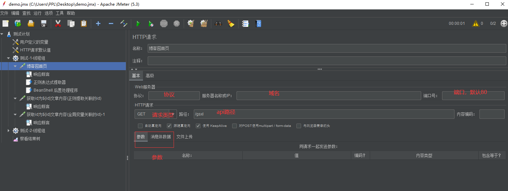
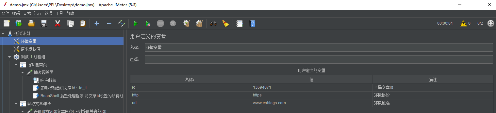
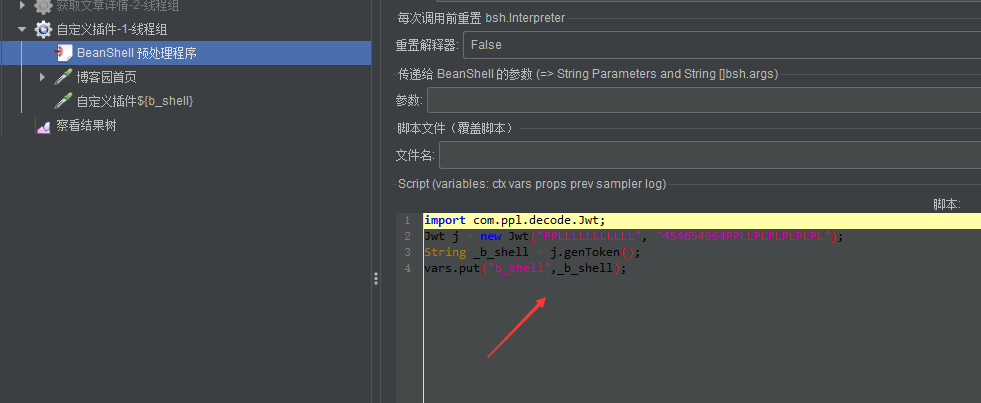
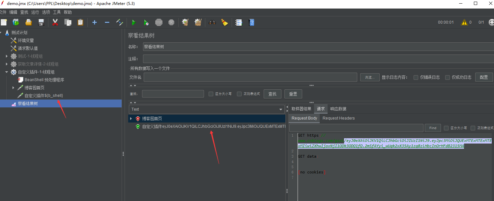

# Jmeter

## 一、Jmeter简介：

**1、简介**

Jmeter 是一款基于Java程序开发的可视化客户端 (类似postman客户端)、具有开源、高可扩展性、高移植性、多线程框架等特点。

简单来说它就是：界面友好，能够快速上手，在任何操作系统java环境便可运行，基于java程序开发可自定义编写插件。

Jmeter业界使用最多的场景：

1. 服务端的性能测试 (压力测试、并发测试)
2. 接口测试、接口自动化测试 (Http、FTP、RPC、WebSocket等协议)

**2、jmeter 安装**

①由于是一个java程序，所以必备JDK，jdk1.8以上。jdk安装教程详细参考：

- win：https://www.cnblogs.com/gsxl/p/11674981.html
- linux：https://www.cnblogs.com/gsxl/p/12128768.html

②验证，cmd命令输入：java --version  及 javac


③jmeter下载，所有版本：https://archive.apache.org/dist/jmeter/binaries/ 

注意Windows后缀为.zip，如下载：apache-jmeter-5.3.zip，下载链接：https://archive.apache.org/dist/jmeter/binaries/apache-jmeter-5.3.zip

**下载后直接解压。**

**运行：**打开bin目录下的jar包，如我的解压路径(可创建快捷方式/超链接到桌面)：G:\apache-jmeter-5.3\bin\ApacheJMeter.jar


**可视化主界面：非常友好**


## **二、Jmeter常用元器件**

- 前置处理器      (比如：JDBC/Beam Shell预处理程序，用于数据准备，输入)
- 取样器        （比如：Http请求信息）
- 后置 处理器     (比如 正则、json提取、JDBC/Beam Shell后置处理器)
- 配置元件       (用户自定义变量、CSV参数化、请求头管理器、请求默认值)
- 监听器         (查看请求的信息与结果，比如：查看结果树、聚合报告、汇总报告)

在Jmeter中元器件作用域是遵循上面的顺序，还有从上到下执行，如果多个层级存在同样的变量时，优先使用同级的(先找同层级，没有找到，再往上层找)

举例：


## **三、编写接口脚本**

**1、接口测试这里分为两种场景：**

1. 接口测试             既功能未提测前，基于接口文档编写脚本，进行的接口测试，同时考虑接口安全性的测试。
2. 接口自动化回归测试    既对我们主要流程的冒烟测试，亦可细化覆盖场景(但成本比较高)

**2、编写前我们需要认识 http 请求与响应的基本结构**

①、接口**请求**关键参数:

1. method       请求类型：常用 GET、POST
2. url           接口的地址 
3. headers       请求头
4. body         请求参数

②、接口响应，通常关注：响应code、响应body、耗时。

**3、我们可以参考 开发人员的接口文档 进行编写**

①接口来源：

1. 接口文档
2. 抓包 抓取接口的请求来进行编写脚本，最好还是两者结合。(有可能会存在不一致)

**4、获取接口请求与响应信息**

①打开接口文档，

②抓包(web F12、抓包工具fiddler/Charles)：

例子：域名，www.cnblogs.com

1. 博客园首页，获取任意一篇文章的id，api：/gsxl
2. 获取拿到的文章id进入详情，api：/gsxl/p/${id}.html

**5、编写脚本例子**

①添加-线程组


线程属性：接口测试以下属性，通常为1即可

1. 线程数                一个线程相当于一个虚拟用户
2. Ramp-Up时间（秒）     多少时间启动完成所有线程数，比如线程数10，Ramp-Up时间为20，则20秒内启动完10线程，平均就是2s启动1个线程。
3. 循环次数              执行测试用例的次数

②添加-取样器-http，接口信息写上，博客园首页接口信息



③添加-后置处理器，token  (常用：①正则 ②Json提取)


如遇到Json提取器获取返回值的多个id则使用如下：

勾选 Compute concatenation var（suffix_ALL）


 

④添加-响应断言

可以响应断言code、文本包含、完全匹配。常用响应断言、json提取断言。

支持正则匹配：响应文本。包含或匹配模式    （字符串模式是不支持正则）

添加查看结果树，试跑正常：


⑤添加-获取文章详情，取样器

接口地址：/gsxl/p/${id}.html


⑥添加-获取门店列表下的请求头、断言。

引用变量：${变量名}

⑦监听器-添加，查看结果树


6、脚本优化：如全局变量、提搞可阅读性等




## **四、个人心得分享**

**1、jmeter接口测试经验分享：**

- 编写规范分模块功能备注，适当多使用参数化/动态引用变量，如全局的域名、动态参数化关联断言。断言，多结合接口响应以及数据库主要字段校验 (实时落库)。
- 前置处理器：测试数据准备，如文章id，我们可以通过SQL增删改查到此文章的详细信息，拿此文章id传入-获取文章详情接口进行查询，拿前置的信息与接口响应的主要字段进行断言。
- 后置处理器：对前面新增的测试数据进行 还原或删除。
- 数据初始化：比如需要用到的账号数据，有一套专属进行初始化的脚本，这样方便多环境切换时快速创建所需要的数据。
- 接口自动化测试：快速带来的效益，适用于场景化关联性，如业务主流程的冒烟测试及回归测试。

**2、请求头必填项 (在不知道的情况下)**

**可利用抓包工具，去除某些请求头参数，发现body与原来正常不一致时则为必填。**


**3、数据库连接及跨线程demo**

①MySQL数据库连接，得先找到连接驱动，放在jmeter的lib/etx目录下 (其它Oracle、MongoDB也是一样)

如MySQL：mysql-connector-java-5.1.31.jar

jmeter操作，配置元件-添加 JDBC Connection Configuration 用于连接到对应数据库

取样区-添加 JDBC Request   用于SQL语句执行，如下图

- Variable Name：        自定义参数，在JDBC Request中会用到；
- Database URL：        jdbc:mysql:// 数据库IP地址:数据库端口/数据库名称；
- JDBC Driver Class：     com.mysql.jdbc.Driver，连接时需要的驱动；
- Username：            数据库用户名；
- Password：            数据库密码；


 

②跨线程变量引用：

使用 BeanShell 将变量跨线程


 

**4、常用函数**

- __Random：随机数    ${__Random(1,10,)}
- __time：   当前时间   ${__time(yyyy-MM-dd HH:mm:ss,)}
- 等等...根据实际需求使用
- 这里还有很多：https://www.icode9.com/content-4-168327.html

**5、CSV参数化**

可以用例ddt数据驱动接口测试，将测试接口等数据填写子文件里面，让CSV读取后参数化引用变量进行循环请求。


 


**6、Jmeter自定义插件-请求参数加签加密**

1. 如果公司后端是java很好办，找开发的代码把代码复制过来。
2. 如果公司后端不是java，那就要了解它的加密规则，自己写一个java程序。
3. 拿到代码在自己本地调试，最终打包成jar包，放置lib/ext目录下即可，BeanShell引用，如下列子。

①拿到代码，创建maven项目，粘贴到你的class类，pom导入依赖，调试成功后打jar包，放置lib/ext目录下即可


 

 

 

**7、持续集成-流程图**


jenkins+jmeter+ant 详细可以参考博文：https://www.cnblogs.com/gsxl/p/13694071.html

**附上上述所用到的jmx脚本：**

**CSV：**

```
id,exp
14671963,啊这...2-get/post请求区别，来给你看看post请求url中传参
14993497,jmeter-5-从入门到放弃【基础篇】
13950531,python-51-MySQLdb查询返回dict格式
```

**jmx：**

```xml
<?xml version="1.0" encoding="UTF-8"?>
<jmeterTestPlan version="1.2" properties="5.0" jmeter="5.3">
  <hashTree>
    <TestPlan guiclass="TestPlanGui" testclass="TestPlan" testname="测试计划" enabled="true">
      <stringProp name="TestPlan.comments"></stringProp>
      <boolProp name="TestPlan.functional_mode">false</boolProp>
      <boolProp name="TestPlan.tearDown_on_shutdown">true</boolProp>
      <boolProp name="TestPlan.serialize_threadgroups">true</boolProp>
      <elementProp name="TestPlan.user_defined_variables" elementType="Arguments" guiclass="ArgumentsPanel" testclass="Arguments" testname="用户定义的变量" enabled="true">
        <collectionProp name="Arguments.arguments"/>
      </elementProp>
      <stringProp name="TestPlan.user_define_classpath">C:\Users\PPL\Desktop\ppl.jar</stringProp>
    </TestPlan>
    <hashTree>
      <Arguments guiclass="ArgumentsPanel" testclass="Arguments" testname="环境变量" enabled="true">
        <collectionProp name="Arguments.arguments">
          <elementProp name="id" elementType="Argument">
            <stringProp name="Argument.name">id</stringProp>
            <stringProp name="Argument.value">13694071</stringProp>
            <stringProp name="Argument.desc">全局文章id</stringProp>
            <stringProp name="Argument.metadata">=</stringProp>
          </elementProp>
          <elementProp name="http" elementType="Argument">
            <stringProp name="Argument.name">http</stringProp>
            <stringProp name="Argument.value">https</stringProp>
            <stringProp name="Argument.desc">环境协议</stringProp>
            <stringProp name="Argument.metadata">=</stringProp>
          </elementProp>
          <elementProp name="url" elementType="Argument">
            <stringProp name="Argument.name">url</stringProp>
            <stringProp name="Argument.value">www.cnblogs.com</stringProp>
            <stringProp name="Argument.metadata">=</stringProp>
            <stringProp name="Argument.desc">环境域名</stringProp>
          </elementProp>
        </collectionProp>
      </Arguments>
      <hashTree/>
      <ConfigTestElement guiclass="HttpDefaultsGui" testclass="ConfigTestElement" testname="请求默认值" enabled="true">
        <elementProp name="HTTPsampler.Arguments" elementType="Arguments" guiclass="HTTPArgumentsPanel" testclass="Arguments" testname="用户定义的变量" enabled="true">
          <collectionProp name="Arguments.arguments"/>
        </elementProp>
        <stringProp name="HTTPSampler.domain">${url}</stringProp>
        <stringProp name="HTTPSampler.port"></stringProp>
        <stringProp name="HTTPSampler.protocol">${http}</stringProp>
        <stringProp name="HTTPSampler.contentEncoding"></stringProp>
        <stringProp name="HTTPSampler.path"></stringProp>
        <stringProp name="HTTPSampler.concurrentPool">6</stringProp>
        <stringProp name="HTTPSampler.connect_timeout"></stringProp>
        <stringProp name="HTTPSampler.response_timeout"></stringProp>
      </ConfigTestElement>
      <hashTree/>
      <ThreadGroup guiclass="ThreadGroupGui" testclass="ThreadGroup" testname="测试-1-线程组" enabled="false">
        <stringProp name="ThreadGroup.on_sample_error">continue</stringProp>
        <elementProp name="ThreadGroup.main_controller" elementType="LoopController" guiclass="LoopControlPanel" testclass="LoopController" testname="循环控制器" enabled="true">
          <boolProp name="LoopController.continue_forever">false</boolProp>
          <stringProp name="LoopController.loops">1</stringProp>
        </elementProp>
        <stringProp name="ThreadGroup.num_threads">1</stringProp>
        <stringProp name="ThreadGroup.ramp_time">1</stringProp>
        <boolProp name="ThreadGroup.scheduler">false</boolProp>
        <stringProp name="ThreadGroup.duration"></stringProp>
        <stringProp name="ThreadGroup.delay"></stringProp>
        <boolProp name="ThreadGroup.same_user_on_next_iteration">true</boolProp>
      </ThreadGroup>
      <hashTree>
        <GenericController guiclass="LogicControllerGui" testclass="GenericController" testname="博客园首页" enabled="true"/>
        <hashTree>
          <HTTPSamplerProxy guiclass="HttpTestSampleGui" testclass="HTTPSamplerProxy" testname="博客园首页" enabled="true">
            <elementProp name="HTTPsampler.Arguments" elementType="Arguments" guiclass="HTTPArgumentsPanel" testclass="Arguments" testname="用户定义的变量" enabled="true">
              <collectionProp name="Arguments.arguments"/>
            </elementProp>
            <stringProp name="HTTPSampler.domain"></stringProp>
            <stringProp name="HTTPSampler.port"></stringProp>
            <stringProp name="HTTPSampler.protocol"></stringProp>
            <stringProp name="HTTPSampler.contentEncoding"></stringProp>
            <stringProp name="HTTPSampler.path">/gsxl</stringProp>
            <stringProp name="HTTPSampler.method">GET</stringProp>
            <boolProp name="HTTPSampler.follow_redirects">true</boolProp>
            <boolProp name="HTTPSampler.auto_redirects">false</boolProp>
            <boolProp name="HTTPSampler.use_keepalive">true</boolProp>
            <boolProp name="HTTPSampler.DO_MULTIPART_POST">false</boolProp>
            <stringProp name="HTTPSampler.embedded_url_re"></stringProp>
            <stringProp name="HTTPSampler.connect_timeout"></stringProp>
            <stringProp name="HTTPSampler.response_timeout"></stringProp>
          </HTTPSamplerProxy>
          <hashTree>
            <ResponseAssertion guiclass="AssertionGui" testclass="ResponseAssertion" testname="响应断言" enabled="true">
              <collectionProp name="Asserion.test_strings">
                <stringProp name="1705342405">广深-小龙</stringProp>
              </collectionProp>
              <stringProp name="Assertion.custom_message"></stringProp>
              <stringProp name="Assertion.test_field">Assertion.response_data</stringProp>
              <boolProp name="Assertion.assume_success">false</boolProp>
              <intProp name="Assertion.test_type">2</intProp>
            </ResponseAssertion>
            <hashTree/>
            <RegexExtractor guiclass="RegexExtractorGui" testclass="RegexExtractor" testname="正则提取首页文章id：id_1" enabled="true">
              <stringProp name="RegexExtractor.useHeaders">false</stringProp>
              <stringProp name="RegexExtractor.refname">id_1</stringProp>
              <stringProp name="RegexExtractor.regex">p/(.+?).html</stringProp>
              <stringProp name="RegexExtractor.template">$1$</stringProp>
              <stringProp name="RegexExtractor.default">id_1 Error</stringProp>
              <stringProp name="RegexExtractor.match_number">1</stringProp>
            </RegexExtractor>
            <hashTree/>
            <BeanShellPostProcessor guiclass="TestBeanGUI" testclass="BeanShellPostProcessor" testname="BeanShell 后置处理程序-将文章id设置为所有线程组共享" enabled="true">
              <stringProp name="filename"></stringProp>
              <stringProp name="parameters"></stringProp>
              <boolProp name="resetInterpreter">false</boolProp>
              <stringProp name="script">String id = vars.get(&quot;id_1&quot;);
props.put(&quot;id_1&quot;, id);</stringProp>
            </BeanShellPostProcessor>
            <hashTree/>
          </hashTree>
        </hashTree>
        <GenericController guiclass="LogicControllerGui" testclass="GenericController" testname="获取文章详情" enabled="true"/>
        <hashTree>
          <HTTPSamplerProxy guiclass="HttpTestSampleGui" testclass="HTTPSamplerProxy" testname="获取id为${id}文章内容(正则提取关联的id)" enabled="true">
            <elementProp name="HTTPsampler.Arguments" elementType="Arguments" guiclass="HTTPArgumentsPanel" testclass="Arguments" testname="用户定义的变量" enabled="true">
              <collectionProp name="Arguments.arguments"/>
            </elementProp>
            <stringProp name="HTTPSampler.domain"></stringProp>
            <stringProp name="HTTPSampler.port"></stringProp>
            <stringProp name="HTTPSampler.protocol"></stringProp>
            <stringProp name="HTTPSampler.contentEncoding"></stringProp>
            <stringProp name="HTTPSampler.path">/gsxl/p/${id_1}.html</stringProp>
            <stringProp name="HTTPSampler.method">GET</stringProp>
            <boolProp name="HTTPSampler.follow_redirects">true</boolProp>
            <boolProp name="HTTPSampler.auto_redirects">false</boolProp>
            <boolProp name="HTTPSampler.use_keepalive">true</boolProp>
            <boolProp name="HTTPSampler.DO_MULTIPART_POST">false</boolProp>
            <stringProp name="HTTPSampler.embedded_url_re"></stringProp>
            <stringProp name="HTTPSampler.connect_timeout"></stringProp>
            <stringProp name="HTTPSampler.response_timeout"></stringProp>
          </HTTPSamplerProxy>
          <hashTree>
            <ResponseAssertion guiclass="AssertionGui" testclass="ResponseAssertion" testname="响应断言" enabled="true">
              <collectionProp name="Asserion.test_strings">
                <stringProp name="-1601435010">啊这...2-get/post请求区别，来给你看看post请求url中传参 - 广深-小龙 - 博客园</stringProp>
                <stringProp name="0"></stringProp>
              </collectionProp>
              <stringProp name="Assertion.custom_message"></stringProp>
              <stringProp name="Assertion.test_field">Assertion.response_data</stringProp>
              <boolProp name="Assertion.assume_success">false</boolProp>
              <intProp name="Assertion.test_type">2</intProp>
            </ResponseAssertion>
            <hashTree/>
          </hashTree>
          <HTTPSamplerProxy guiclass="HttpTestSampleGui" testclass="HTTPSamplerProxy" testname="获取id为${id}文章内容(全局变量关联的id)-1" enabled="true">
            <elementProp name="HTTPsampler.Arguments" elementType="Arguments" guiclass="HTTPArgumentsPanel" testclass="Arguments" testname="用户定义的变量" enabled="true">
              <collectionProp name="Arguments.arguments"/>
            </elementProp>
            <stringProp name="HTTPSampler.domain"></stringProp>
            <stringProp name="HTTPSampler.port"></stringProp>
            <stringProp name="HTTPSampler.protocol"></stringProp>
            <stringProp name="HTTPSampler.contentEncoding"></stringProp>
            <stringProp name="HTTPSampler.path">/gsxl/p/${id}.html</stringProp>
            <stringProp name="HTTPSampler.method">GET</stringProp>
            <boolProp name="HTTPSampler.follow_redirects">true</boolProp>
            <boolProp name="HTTPSampler.auto_redirects">false</boolProp>
            <boolProp name="HTTPSampler.use_keepalive">true</boolProp>
            <boolProp name="HTTPSampler.DO_MULTIPART_POST">false</boolProp>
            <stringProp name="HTTPSampler.embedded_url_re"></stringProp>
            <stringProp name="HTTPSampler.connect_timeout"></stringProp>
            <stringProp name="HTTPSampler.response_timeout"></stringProp>
          </HTTPSamplerProxy>
          <hashTree>
            <ResponseAssertion guiclass="AssertionGui" testclass="ResponseAssertion" testname="响应断言" enabled="true">
              <collectionProp name="Asserion.test_strings">
                <stringProp name="-333710551">title: &apos;jmeter-4-linux下环境搭建 jmeter&amp;#x2B;ant&amp;#x2B;docker-jenkins,持续集成测试完成</stringProp>
              </collectionProp>
              <stringProp name="Assertion.custom_message"></stringProp>
              <stringProp name="Assertion.test_field">Assertion.response_data</stringProp>
              <boolProp name="Assertion.assume_success">false</boolProp>
              <intProp name="Assertion.test_type">2</intProp>
            </ResponseAssertion>
            <hashTree/>
          </hashTree>
        </hashTree>
      </hashTree>
      <ThreadGroup guiclass="ThreadGroupGui" testclass="ThreadGroup" testname="获取文章详情-2-线程组" enabled="false">
        <stringProp name="ThreadGroup.on_sample_error">continue</stringProp>
        <elementProp name="ThreadGroup.main_controller" elementType="LoopController" guiclass="LoopControlPanel" testclass="LoopController" testname="循环控制器" enabled="true">
          <boolProp name="LoopController.continue_forever">false</boolProp>
          <stringProp name="LoopController.loops">1</stringProp>
        </elementProp>
        <stringProp name="ThreadGroup.num_threads">1</stringProp>
        <stringProp name="ThreadGroup.ramp_time">1</stringProp>
        <boolProp name="ThreadGroup.scheduler">false</boolProp>
        <stringProp name="ThreadGroup.duration"></stringProp>
        <stringProp name="ThreadGroup.delay"></stringProp>
        <boolProp name="ThreadGroup.same_user_on_next_iteration">true</boolProp>
      </ThreadGroup>
      <hashTree>
        <GenericController guiclass="LogicControllerGui" testclass="GenericController" testname="获取文章详情" enabled="true"/>
        <hashTree>
          <HTTPSamplerProxy guiclass="HttpTestSampleGui" testclass="HTTPSamplerProxy" testname="获取id为${id}文章内容(全局变量关联的id)-2" enabled="true">
            <elementProp name="HTTPsampler.Arguments" elementType="Arguments" guiclass="HTTPArgumentsPanel" testclass="Arguments" testname="用户定义的变量" enabled="true">
              <collectionProp name="Arguments.arguments"/>
            </elementProp>
            <stringProp name="HTTPSampler.domain"></stringProp>
            <stringProp name="HTTPSampler.port"></stringProp>
            <stringProp name="HTTPSampler.protocol"></stringProp>
            <stringProp name="HTTPSampler.contentEncoding"></stringProp>
            <stringProp name="HTTPSampler.path">/gsxl/p/${id}.html</stringProp>
            <stringProp name="HTTPSampler.method">GET</stringProp>
            <boolProp name="HTTPSampler.follow_redirects">true</boolProp>
            <boolProp name="HTTPSampler.auto_redirects">false</boolProp>
            <boolProp name="HTTPSampler.use_keepalive">true</boolProp>
            <boolProp name="HTTPSampler.DO_MULTIPART_POST">false</boolProp>
            <stringProp name="HTTPSampler.embedded_url_re"></stringProp>
            <stringProp name="HTTPSampler.connect_timeout"></stringProp>
            <stringProp name="HTTPSampler.response_timeout"></stringProp>
          </HTTPSamplerProxy>
          <hashTree>
            <ResponseAssertion guiclass="AssertionGui" testclass="ResponseAssertion" testname="响应断言" enabled="true">
              <collectionProp name="Asserion.test_strings">
                <stringProp name="-333710551">title: &apos;jmeter-4-linux下环境搭建 jmeter&amp;#x2B;ant&amp;#x2B;docker-jenkins,持续集成测试完成</stringProp>
              </collectionProp>
              <stringProp name="Assertion.custom_message"></stringProp>
              <stringProp name="Assertion.test_field">Assertion.response_data</stringProp>
              <boolProp name="Assertion.assume_success">false</boolProp>
              <intProp name="Assertion.test_type">2</intProp>
            </ResponseAssertion>
            <hashTree/>
          </hashTree>
          <HTTPSamplerProxy guiclass="HttpTestSampleGui" testclass="HTTPSamplerProxy" testname="获取id为${id}文章内容(正则提取的id)--失败的" enabled="true">
            <elementProp name="HTTPsampler.Arguments" elementType="Arguments" guiclass="HTTPArgumentsPanel" testclass="Arguments" testname="用户定义的变量" enabled="true">
              <collectionProp name="Arguments.arguments"/>
            </elementProp>
            <stringProp name="HTTPSampler.domain"></stringProp>
            <stringProp name="HTTPSampler.port"></stringProp>
            <stringProp name="HTTPSampler.protocol"></stringProp>
            <stringProp name="HTTPSampler.contentEncoding"></stringProp>
            <stringProp name="HTTPSampler.path">/gsxl/p/${id_1}.html</stringProp>
            <stringProp name="HTTPSampler.method">GET</stringProp>
            <boolProp name="HTTPSampler.follow_redirects">true</boolProp>
            <boolProp name="HTTPSampler.auto_redirects">false</boolProp>
            <boolProp name="HTTPSampler.use_keepalive">true</boolProp>
            <boolProp name="HTTPSampler.DO_MULTIPART_POST">false</boolProp>
            <stringProp name="HTTPSampler.embedded_url_re"></stringProp>
            <stringProp name="HTTPSampler.connect_timeout"></stringProp>
            <stringProp name="HTTPSampler.response_timeout"></stringProp>
          </HTTPSamplerProxy>
          <hashTree>
            <ResponseAssertion guiclass="AssertionGui" testclass="ResponseAssertion" testname="响应断言" enabled="true">
              <collectionProp name="Asserion.test_strings">
                <stringProp name="-1601435010">啊这...2-get/post请求区别，来给你看看post请求url中传参 - 广深-小龙 - 博客园</stringProp>
              </collectionProp>
              <stringProp name="Assertion.custom_message"></stringProp>
              <stringProp name="Assertion.test_field">Assertion.response_data</stringProp>
              <boolProp name="Assertion.assume_success">false</boolProp>
              <intProp name="Assertion.test_type">2</intProp>
            </ResponseAssertion>
            <hashTree/>
          </hashTree>
          <HTTPSamplerProxy guiclass="HttpTestSampleGui" testclass="HTTPSamplerProxy" testname="获取id为${id}文章内容(正则提取+BeanShell全局变量关联的id)" enabled="true">
            <elementProp name="HTTPsampler.Arguments" elementType="Arguments" guiclass="HTTPArgumentsPanel" testclass="Arguments" testname="用户定义的变量" enabled="true">
              <collectionProp name="Arguments.arguments"/>
            </elementProp>
            <stringProp name="HTTPSampler.domain"></stringProp>
            <stringProp name="HTTPSampler.port"></stringProp>
            <stringProp name="HTTPSampler.protocol"></stringProp>
            <stringProp name="HTTPSampler.contentEncoding"></stringProp>
            <stringProp name="HTTPSampler.path">/gsxl/p/${id_1}.html</stringProp>
            <stringProp name="HTTPSampler.method">GET</stringProp>
            <boolProp name="HTTPSampler.follow_redirects">true</boolProp>
            <boolProp name="HTTPSampler.auto_redirects">false</boolProp>
            <boolProp name="HTTPSampler.use_keepalive">true</boolProp>
            <boolProp name="HTTPSampler.DO_MULTIPART_POST">false</boolProp>
            <stringProp name="HTTPSampler.embedded_url_re"></stringProp>
            <stringProp name="HTTPSampler.connect_timeout"></stringProp>
            <stringProp name="HTTPSampler.response_timeout"></stringProp>
          </HTTPSamplerProxy>
          <hashTree>
            <ResponseAssertion guiclass="AssertionGui" testclass="ResponseAssertion" testname="响应断言" enabled="true">
              <collectionProp name="Asserion.test_strings">
                <stringProp name="-1601435010">啊这...2-get/post请求区别，来给你看看post请求url中传参 - 广深-小龙 - 博客园</stringProp>
              </collectionProp>
              <stringProp name="Assertion.custom_message"></stringProp>
              <stringProp name="Assertion.test_field">Assertion.response_data</stringProp>
              <boolProp name="Assertion.assume_success">false</boolProp>
              <intProp name="Assertion.test_type">2</intProp>
            </ResponseAssertion>
            <hashTree/>
            <BeanShellPreProcessor guiclass="TestBeanGUI" testclass="BeanShellPreProcessor" testname="BeanShell 预处理程序-拿线程组所有共享资源：文章id" enabled="true">
              <stringProp name="filename"></stringProp>
              <stringProp name="parameters"></stringProp>
              <boolProp name="resetInterpreter">false</boolProp>
              <stringProp name="script">String id_ = props.get(&quot;id_1&quot;);
log.info(&quot;===============&quot;+id_);
vars.put(&quot;id_1&quot;,id_)</stringProp>
            </BeanShellPreProcessor>
            <hashTree/>
          </hashTree>
        </hashTree>
      </hashTree>
      <ThreadGroup guiclass="ThreadGroupGui" testclass="ThreadGroup" testname="CSV-1-线程组" enabled="true">
        <stringProp name="ThreadGroup.on_sample_error">continue</stringProp>
        <elementProp name="ThreadGroup.main_controller" elementType="LoopController" guiclass="LoopControlPanel" testclass="LoopController" testname="循环控制器" enabled="true">
          <boolProp name="LoopController.continue_forever">false</boolProp>
          <stringProp name="LoopController.loops">3</stringProp>
        </elementProp>
        <stringProp name="ThreadGroup.num_threads">1</stringProp>
        <stringProp name="ThreadGroup.ramp_time">1</stringProp>
        <boolProp name="ThreadGroup.scheduler">false</boolProp>
        <stringProp name="ThreadGroup.duration"></stringProp>
        <stringProp name="ThreadGroup.delay"></stringProp>
        <boolProp name="ThreadGroup.same_user_on_next_iteration">true</boolProp>
      </ThreadGroup>
      <hashTree>
        <CSVDataSet guiclass="TestBeanGUI" testclass="CSVDataSet" testname="CSV 数据文件设置" enabled="true">
          <stringProp name="filename">C:/Users/PPL/Desktop/jmeter_demo/id.txt</stringProp>
          <stringProp name="fileEncoding">UTF-8</stringProp>
          <stringProp name="variableNames">id,exp</stringProp>
          <boolProp name="ignoreFirstLine">true</boolProp>
          <stringProp name="delimiter">,</stringProp>
          <boolProp name="quotedData">false</boolProp>
          <boolProp name="recycle">true</boolProp>
          <boolProp name="stopThread">false</boolProp>
          <stringProp name="shareMode">shareMode.all</stringProp>
        </CSVDataSet>
        <hashTree/>
        <HTTPSamplerProxy guiclass="HttpTestSampleGui" testclass="HTTPSamplerProxy" testname="获取文章详情-CSV" enabled="true">
          <elementProp name="HTTPsampler.Arguments" elementType="Arguments" guiclass="HTTPArgumentsPanel" testclass="Arguments" testname="用户定义的变量" enabled="true">
            <collectionProp name="Arguments.arguments"/>
          </elementProp>
          <stringProp name="HTTPSampler.domain"></stringProp>
          <stringProp name="HTTPSampler.port"></stringProp>
          <stringProp name="HTTPSampler.protocol"></stringProp>
          <stringProp name="HTTPSampler.contentEncoding"></stringProp>
          <stringProp name="HTTPSampler.path">/gsxl/p/${id}.html</stringProp>
          <stringProp name="HTTPSampler.method">GET</stringProp>
          <boolProp name="HTTPSampler.follow_redirects">true</boolProp>
          <boolProp name="HTTPSampler.auto_redirects">false</boolProp>
          <boolProp name="HTTPSampler.use_keepalive">true</boolProp>
          <boolProp name="HTTPSampler.DO_MULTIPART_POST">false</boolProp>
          <stringProp name="HTTPSampler.embedded_url_re"></stringProp>
          <stringProp name="HTTPSampler.connect_timeout"></stringProp>
          <stringProp name="HTTPSampler.response_timeout"></stringProp>
        </HTTPSamplerProxy>
        <hashTree>
          <ResponseAssertion guiclass="AssertionGui" testclass="ResponseAssertion" testname="响应断言" enabled="true">
            <collectionProp name="Asserion.test_strings">
              <stringProp name="1147370327">${exp}</stringProp>
            </collectionProp>
            <stringProp name="Assertion.custom_message"></stringProp>
            <stringProp name="Assertion.test_field">Assertion.response_data</stringProp>
            <boolProp name="Assertion.assume_success">false</boolProp>
            <intProp name="Assertion.test_type">2</intProp>
          </ResponseAssertion>
          <hashTree/>
        </hashTree>
      </hashTree>
      <ThreadGroup guiclass="ThreadGroupGui" testclass="ThreadGroup" testname="自定义插件-1-线程组" enabled="false">
        <stringProp name="ThreadGroup.on_sample_error">continue</stringProp>
        <elementProp name="ThreadGroup.main_controller" elementType="LoopController" guiclass="LoopControlPanel" testclass="LoopController" testname="循环控制器" enabled="true">
          <boolProp name="LoopController.continue_forever">false</boolProp>
          <stringProp name="LoopController.loops">1</stringProp>
        </elementProp>
        <stringProp name="ThreadGroup.num_threads">1</stringProp>
        <stringProp name="ThreadGroup.ramp_time">1</stringProp>
        <boolProp name="ThreadGroup.scheduler">false</boolProp>
        <stringProp name="ThreadGroup.duration"></stringProp>
        <stringProp name="ThreadGroup.delay"></stringProp>
        <boolProp name="ThreadGroup.same_user_on_next_iteration">true</boolProp>
      </ThreadGroup>
      <hashTree>
        <BeanShellPreProcessor guiclass="TestBeanGUI" testclass="BeanShellPreProcessor" testname="BeanShell 预处理程序" enabled="true">
          <boolProp name="resetInterpreter">false</boolProp>
          <stringProp name="parameters"></stringProp>
          <stringProp name="filename"></stringProp>
          <stringProp name="script">import com.ppl.decode.Jwt;
Jwt j = new Jwt(&quot;PPLLLLLLLLLLL&quot;, &quot;454654564PPLLPLPLPLPLPL&quot;);
String _b_shell = j.genToken();
vars.put(&quot;b_shell&quot;,_b_shell);</stringProp>
        </BeanShellPreProcessor>
        <hashTree/>
        <HTTPSamplerProxy guiclass="HttpTestSampleGui" testclass="HTTPSamplerProxy" testname="博客园首页" enabled="true">
          <elementProp name="HTTPsampler.Arguments" elementType="Arguments" guiclass="HTTPArgumentsPanel" testclass="Arguments" testname="用户定义的变量" enabled="true">
            <collectionProp name="Arguments.arguments"/>
          </elementProp>
          <stringProp name="HTTPSampler.domain"></stringProp>
          <stringProp name="HTTPSampler.port"></stringProp>
          <stringProp name="HTTPSampler.protocol"></stringProp>
          <stringProp name="HTTPSampler.contentEncoding"></stringProp>
          <stringProp name="HTTPSampler.path">/gsxl/${b_shell}</stringProp>
          <stringProp name="HTTPSampler.method">GET</stringProp>
          <boolProp name="HTTPSampler.follow_redirects">true</boolProp>
          <boolProp name="HTTPSampler.auto_redirects">false</boolProp>
          <boolProp name="HTTPSampler.use_keepalive">true</boolProp>
          <boolProp name="HTTPSampler.DO_MULTIPART_POST">false</boolProp>
          <stringProp name="HTTPSampler.embedded_url_re"></stringProp>
          <stringProp name="HTTPSampler.connect_timeout"></stringProp>
          <stringProp name="HTTPSampler.response_timeout"></stringProp>
        </HTTPSamplerProxy>
        <hashTree>
          <ResponseAssertion guiclass="AssertionGui" testclass="ResponseAssertion" testname="响应断言" enabled="true">
            <collectionProp name="Asserion.test_strings">
              <stringProp name="1705342405">广深-小龙</stringProp>
            </collectionProp>
            <stringProp name="Assertion.custom_message"></stringProp>
            <stringProp name="Assertion.test_field">Assertion.response_data</stringProp>
            <boolProp name="Assertion.assume_success">false</boolProp>
            <intProp name="Assertion.test_type">2</intProp>
          </ResponseAssertion>
          <hashTree/>
          <RegexExtractor guiclass="RegexExtractorGui" testclass="RegexExtractor" testname="正则提取首页文章id：id_1" enabled="true">
            <stringProp name="RegexExtractor.useHeaders">false</stringProp>
            <stringProp name="RegexExtractor.refname">id_1</stringProp>
            <stringProp name="RegexExtractor.regex">p/(.+?).html</stringProp>
            <stringProp name="RegexExtractor.template">$1$</stringProp>
            <stringProp name="RegexExtractor.default">id_1 Error</stringProp>
            <stringProp name="RegexExtractor.match_number">1</stringProp>
          </RegexExtractor>
          <hashTree/>
          <BeanShellPostProcessor guiclass="TestBeanGUI" testclass="BeanShellPostProcessor" testname="BeanShell 后置处理程序-将文章id设置为所有线程组共享" enabled="true">
            <stringProp name="filename"></stringProp>
            <stringProp name="parameters"></stringProp>
            <boolProp name="resetInterpreter">false</boolProp>
            <stringProp name="script">String id = vars.get(&quot;id_1&quot;);
props.put(&quot;id_1&quot;, id);</stringProp>
          </BeanShellPostProcessor>
          <hashTree/>
        </hashTree>
        <DebugSampler guiclass="TestBeanGUI" testclass="DebugSampler" testname="自定义插件${b_shell}" enabled="true">
          <boolProp name="displayJMeterProperties">false</boolProp>
          <boolProp name="displayJMeterVariables">true</boolProp>
          <boolProp name="displaySystemProperties">false</boolProp>
        </DebugSampler>
        <hashTree/>
      </hashTree>
      <ResultCollector guiclass="ViewResultsFullVisualizer" testclass="ResultCollector" testname="察看结果树" enabled="true">
        <boolProp name="ResultCollector.error_logging">false</boolProp>
        <objProp>
          <name>saveConfig</name>
          <value class="SampleSaveConfiguration">
            <time>true</time>
            <latency>true</latency>
            <timestamp>true</timestamp>
            <success>true</success>
            <label>true</label>
            <code>true</code>
            <message>true</message>
            <threadName>true</threadName>
            <dataType>true</dataType>
            <encoding>true</encoding>
            <assertions>true</assertions>
            <subresults>true</subresults>
            <responseData>true</responseData>
            <samplerData>true</samplerData>
            <xml>false</xml>
            <fieldNames>true</fieldNames>
            <responseHeaders>true</responseHeaders>
            <requestHeaders>true</requestHeaders>
            <responseDataOnError>true</responseDataOnError>
            <saveAssertionResultsFailureMessage>true</saveAssertionResultsFailureMessage>
            <assertionsResultsToSave>0</assertionsResultsToSave>
            <bytes>true</bytes>
            <sentBytes>true</sentBytes>
            <url>true</url>
            <fileName>true</fileName>
            <hostname>true</hostname>
            <threadCounts>true</threadCounts>
            <sampleCount>true</sampleCount>
            <idleTime>true</idleTime>
            <connectTime>true</connectTime>
          </value>
        </objProp>
        <stringProp name="filename"></stringProp>
      </ResultCollector>
      <hashTree/>
    </hashTree>
  </hashTree>
</jmeterTestPlan>
```

 