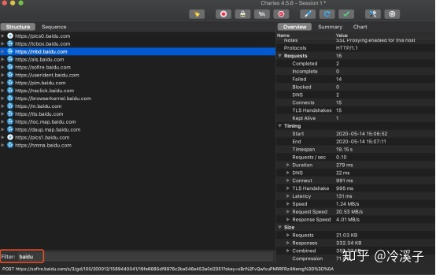
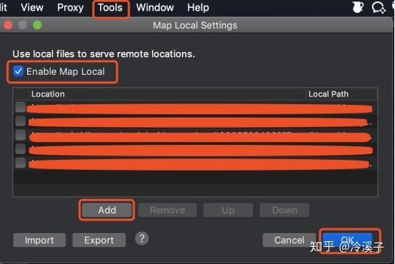

# charles使用说明

## 安装

1、官网：[https://www.charlesproxy.com/download/](https://link.zhihu.com/?target=https%3A//www.charlesproxy.com/download/)

从官网下载对应系统的 Charles 最新版本，双击下载的安装包，一路默认安装，安装完成会在桌面生成类似花瓶的图标。

2、注册：

- Charles 是个收费软件，可以免费试用一个月。
- Charles -> Help -> Register Charles
- Registered name：XXX
- License key：XXX

## 配置

*** 本文以Mac 系统为例进行讲解 ***

- **配置手机代理：**

手机和 Mac 连接到同一个 WiFi 网络

1.1 Android 系统：「以华为 P20 手机为例」

- 设置 -> 无线和网络 -> WLAN 
- 长按当前 WiFi -> 修改网络
- 勾选显示高级选项
- 代理 -> 手动
- 服务器主机名 -> 填写 Mac 的IP 地址「Mac IP 获取方法：Charles -> Help -> Local IP Address 」

- 服务器端口 -> 8888
- 保存

1.2 IOS 系统：「以 iPhone Xs Max 手机为例」

- 设置 -> 无线局域网
- 点击当前连接的 WiFi
- 最底部 HTTP 代理 -> 配置代理 -> 勾选手动
- 服务器 -> 填写 Mac 的IP 地址「Mac IP 获取方法：Charles -> Help -> Local IP Address 」

- 端口 -> 8888
- 存储

## 核心功能

**一、** **抓包「以 iPhone** **Xs** **Max** **为例」**

1. Charles 设置

- Proxy -> Proxy Settings -> Port -> 8888 
- 勾选 Support HTTP/2
- 勾选 Enable transparent HTTP proxying
- OK

2. 手机设置代理如上「配置手机代理」步骤
3. 打开手机上任意联网的应用，Charles 会弹出请求连接的确认菜单，点击“Allow“即可完成设置

**二、** **过滤网络请求**

1. 左侧底部 Filter 栏 -> 过滤关键字

2. 在 Charles 的菜单栏选择

Proxy -> Recording Settings -> Include -> add「依次填入协议+主机名+端口号，即可只抓取目标网站的包」

3. 切换到 Sequence，在想过滤的网络请求上右击，选择“Focus“，在 Filter 栏勾选上 Focused

**三、** **分析 HTTPS** **包**

1. Mac 安装证书：

Help -> SSL Proxying -> Install Charles Root Certificate -> 输入系统的帐号密码，即可在钥匙串中看到添加好的证书

***如果遇到证书不被信任的问题，解决办法：***

Mac本顶栏 前往 -> 实用工具 -> 打开钥匙串访问 -> 找到该证书 -> 双击或右键「显示简介」-> 点开「信任」-> 选择「始终信任」

2. Charles 设置请求允许 SSL proxying
3. Charles 默认并不抓取 HTTPS 网络通讯的数据，若想拦截所有 HTTPS 网络请求，需要进行设置：在请求上右击选择 Enable SSL proxying

2. Charles -> Proxy -> SSL Proxying Settings -> SSL Proxying「添加对应的域名和端口号，为方便也可端口号直接添加通配符*」
3. 移动端安装证书

a. Charles 选择 Help -> SSL Proxying -> Install Charles Root Certificate on a Mobile Device or Remote Browser

b. 确保手机连上代理的情况下，在手机浏览器栏输入：chls.pro/ssl，下载证书，完成安装。

c. **Android tips**：

1.1. 小米机型请注意，如果是 MIUI 9 以上的版本，请不要用自带浏览器下载证书，自带浏览器下载的证书文件格式不对，无法安装，uc 浏览器下载没有问题。

1.2. 若不能直接安装，需要下载下来，到手机设置 -> 安全 -> 从设备存储空间安装 -> 找到下载的证书 .pem 结尾的 -> 点击安装即可

d. **IOS tips**：

IOS 需要设置手机信任证书，详见 [官方文档](https://link.zhihu.com/?target=https%3A//www.charlesproxy.com/documentation/using-charles/ssl-certificates/)。若不能直接安装，需在手机「设置」-> 通用 -> 描述文件与设备管理安装下载的证书，完成安装后 -> 找到关于本机 -> 证书信任设置，打开刚安装的证书的开关。

***抓包内容遇到乱码，解决如下：***

- Proxy -> SSL Proxy Settings -> Add
- Host：*「代表所有网站都拦截」
- Port：443
- 保存后，在抓包数据就会显示正常

**四、** **模拟弱网**

1. 选择 Proxy -> Throttle Settings -> 勾选 Enable Throttling -> 选择 Throttle Preset 类型

**五、** **Mock** **数据**

1. 以 map local 为例，修改返回值

选择目标请求，右键选择 Save All保存请求的 response 内容到本地文件

2. 配置 Charles Map Local，Tool -> Map Local -> 勾选 Enable Map Local -> Add 「添加目标请求及需要替换的response 文件地址」-> OK

3. 用文本编辑器打开保存的 json 文件，修改内容，进行替换。打开客户端应用重新请求该接口，返回的数据就是本地的文件数据。