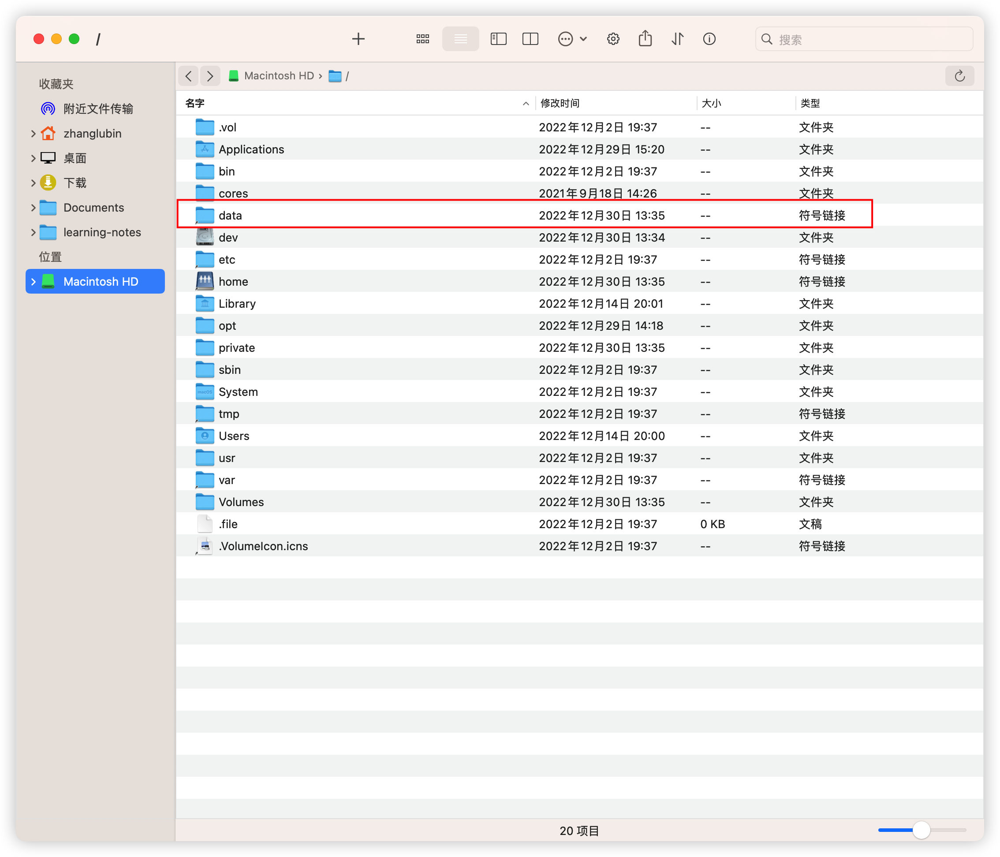
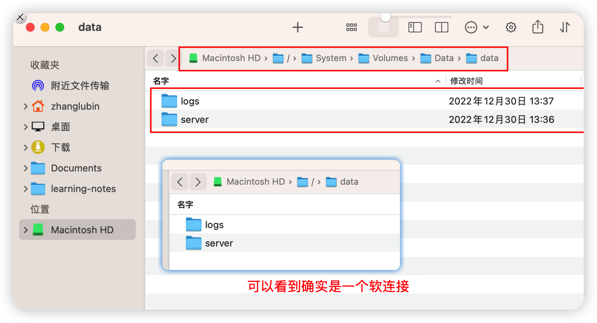

# mac系统无法在根目录下新建文件夹解决办法

mac启动springboot项目报错ERROR-java.lang.IllegalStateException: Logback [configuration](https://so.csdn.net/so/search?q=configuration&spm=1001.2101.3001.7020) error detected：
下面展示一些 `内联代码片`。

```log
2022-10-08 14:01:16,680 127.0.0.1:8080 base-core main ERROR org.springframework.boot.SpringApplication:826 ### ---  Application run failed
java.lang.IllegalStateException: Logback configuration error detected:
ERROR in ch.qos.logback.core.rolling.RollingFileAppender[file-out] - Failed to create parent directories for [/data/app/logs/yms.log]
ERROR in ch.qos.logback.core.rolling.RollingFileAppender[file-out] - openFile(null,true) call failed. java.io.FileNotFoundException: /data/app/logs/yms.log (No such file or directory)
	at org.springframework.boot.logging.logback.LogbackLoggingSystem.loadConfiguration(LogbackLoggingSystem.java:169)
```

解决方法：
1、进入/System/Volumes/Data并创建data文件夹

```shell
cd /System/Volumes/Data
sudo mkdir data
sudo chmod -R 777 data
```

2、打开synthetic.conf并写入以下内容，注意data和/System/Volumes/Data/data之间是tab不是空格

```shell
sudo vim /etc/synthetic.conf
data  /System/Volumes/Data/data
```

3、重启电脑，根目录下会出现data，操作data目录即可

实际上就是建立了一个软连接，mac系统中叫符号链接

成效



