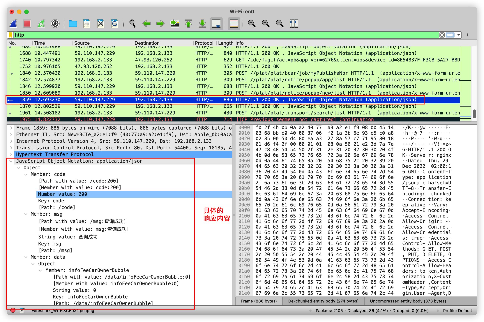

# wireshark抓包使用说明

wireshark macos系统下无法进行抓包的解决办法

```shell
cd /dev
sudo chown zhanglubin:admin bp*
ls -la | grep bp
```


本地接口请求的抓包在本地回环网卡下。

以本地回环为例，抓包本地接口调用


可以根据最左侧的箭头看出，上面这条是请求，下面这条是响应

以POST请求为例，我们来看请求体和响应体

**请求：**


**响应：**

