# RabbitMQ

## RabbitMQ如何工作的？

我们来简单看看RabbitMQ是如何工作的。

首先来看看RabbitMQ里的几个重要概念：

- 生产者（Producer）：发送消息的应用。
- 消费者（Consumer）：接收消息的应用。
- 队列（Queue）：存储消息的缓存。
- 消息（Message）：由生产者通过RabbitMQ发送给消费者的信息。
- 连接（Connection）：连接RabbitMQ和应用服务器的TCP连接。
- 通道（Channel）：连接里的一个虚拟通道。当你通过消息队列发送或者接收消息时，这个操作都是通过通道进行的。
- 交换机（Exchange）：交换机负责从生产者那里接收消息，并根据交换类型分发到对应的消息列队里。要实现消息的接收，一个队列必须到绑定一个交换机。
- 绑定（Binding）：绑定是队列和交换机的一个关联连接。
- 路由键（Routing Key）：路由键是供交换机查看并根据键来决定如何分发消息到列队的一个键。路由键可以说是消息的目的地址。
- AMQP：AMQP（高级消息队列协议Advanced Message Queuing Protocol）是RabbitMQ使用的消息协议。
- 用户（Users）：在RabbitMQ里，是可以通过指定的用户名和密码来进行连接的。每个用户可以分配不同的权限，例如读权限，写权限以及在实例里进行配置的权限。

**生产者（Producer）**发送/发布消息到代理->**消费者（Consumer）**从代理那里接收消息。哪怕生产者和消费者运行在不同的机器上，**RabbitMQ**也能扮演代理中间件的角色。

当生产者发送消息时，它并不是直接把消息发送到队列里的，而是使用交换机（Exchange）来发送。下面的设计图简单展示了这三个主要的组件之间是如何连接起来的。

交换机代理（exchange agent）负责把消息分发到不同的队列里。这样的话，消息就能够从生产者发送到交换机，然后被分发到消息队列里。这就是常见的“发布”方法。

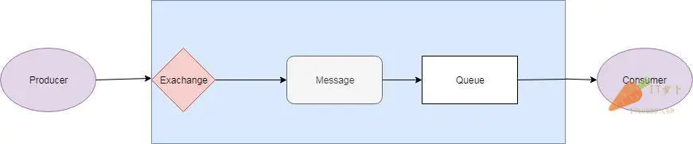

### 往多个队列里发送消息

对一个复杂的应用而言，往往会有多个消息队列，所以消息也会被发往多个队列。

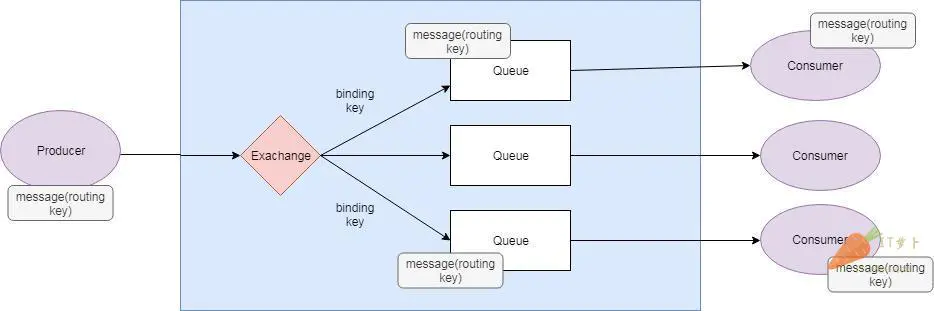

给带有多个队列的交换机发送的消息是通过绑定和路由键来进行分发的。绑定是你设置的用来连接一个队列和交换机的连接。路由键是消息的一个属性。交换机会根据路由键来决定消息分发到那个队列里（取决于交换机的类型）。

### 交换机（Exchange）

消息并不是直接发布到队里里的，而是被生产者发送到一个交换机上。交换机负责把消息发布到不同的队列里。交换机从生产者应用上接收消息，然后根据绑定和路由键将消息发送到对应的队列里。绑定是交换机和队列之间的一个关系连接。

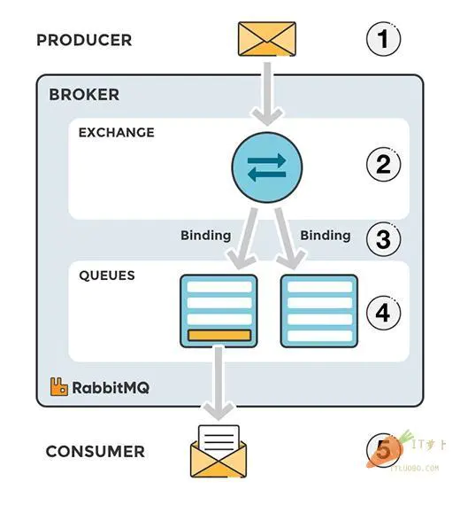

### RabbitMQ里的消息流程

- *生产者（producer）*把消息发送给交换机。当你创建交换机的时候，你需要指定类型。交换机的类型接下来会讲到。
- *交换机（exchange）*接收消息并且负责对消息进行路由。根据交换机的类型，消息的多个属性会被使用，例如路由键。
- *绑定（binding）*需要从交换机到队列的这种方式来进行创建。在这个例子里，我们可以看到交换机有到两个不同队列的绑定。交换机根据消息的属性来把消息分发到不同的队列上。
- *消息（message）*消息会一直留在队列里直到被消费。
- *消费者（consumer）*处理消息。

### 交换机类型

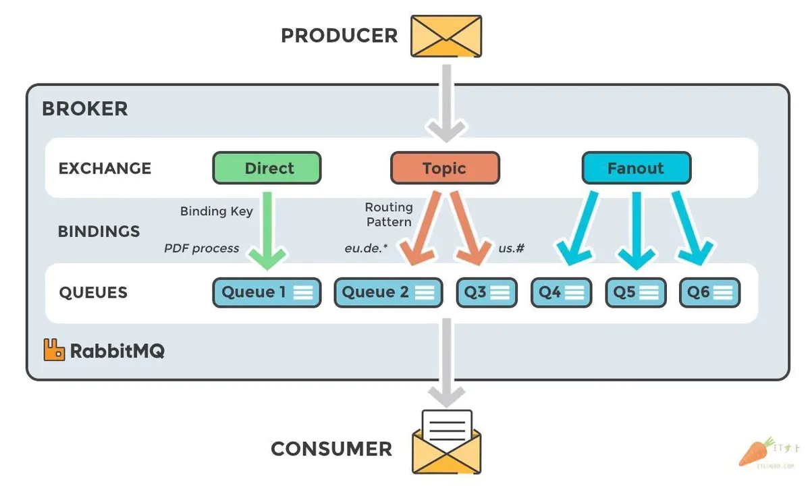

**直接（Direct）**：直接交换机通过消息上的路由键直接对消息进行分发。

**扇出（Fanout）**：一个扇出交换机会将消息发送到所有和它进行绑定的队列上。

**主题（Topic）**：这个交换机会将路由键和绑定上的模式进行通配符匹配。

**消息头（Headers）**：消息头交换机使用消息头的属性进行消息路由。

## RabbitMQ实际实用


### 直连交换机

#### 消息生产者

```xml
<!--rabbitmq-->
<dependency>
	<groupId>org.springframework.boot</groupId>
	<artifactId>spring-boot-starter-amqp</artifactId>
</dependency>
<dependency>
	<groupId>org.springframework.boot</groupId>
	<artifactId>spring-boot-starter-web</artifactId>
</dependency>
```

然后application.yml：

ps：里面的虚拟host配置项不是必须的，我自己在rabbitmq服务上创建了自己的虚拟host，所以我配置了；你们不创建，就不用加这个配置项。

```yml
server:
  port: 8021
spring:
  #给项目来个名字
  application:
    name: rabbitmq-provider
  #配置rabbitMq 服务器
  rabbitmq:
    host: 127.0.0.1
    port: 5672
    username: root
    password: root
    #虚拟host 可以不设置,使用server默认host
    virtual-host: JCcccHost
```

接着我们先使用下direct exchange(直连型交换机),创建DirectRabbitConfig.java（对于队列和交换机持久化以及连接使用设置，在注释里有说明，后面的不同交换机的配置就不做同样说明了）：

```java
import org.springframework.amqp.core.Binding;
import org.springframework.amqp.core.BindingBuilder;
import org.springframework.amqp.core.DirectExchange;
import org.springframework.amqp.core.Queue;
import org.springframework.context.annotation.Bean;
import org.springframework.context.annotation.Configuration;
 
/**
 * @Author : JCccc
 * @CreateTime : 2019/9/3
 * @Description :
 **/
@Configuration
public class DirectRabbitConfig {
 
    //队列 起名：TestDirectQueue
    @Bean
    public Queue TestDirectQueue() {
        // durable:是否持久化,默认是false,持久化队列：会被存储在磁盘上，当消息代理重启时仍然存在，暂存队列：当前连接有效
        // exclusive:默认也是false，只能被当前创建的连接使用，而且当连接关闭后队列即被删除。此参考优先级高于durable
        // autoDelete:是否自动删除，当没有生产者或者消费者使用此队列，该队列会自动删除。
        //   return new Queue("TestDirectQueue",true,true,false);
 
        //一般设置一下队列的持久化就好,其余两个就是默认false
        return new Queue("TestDirectQueue",true);
    }
 
    //Direct交换机 起名：TestDirectExchange
    @Bean
    DirectExchange TestDirectExchange() {
      //  return new DirectExchange("TestDirectExchange",true,true);
        return new DirectExchange("TestDirectExchange",true,false);
    }
 
    //绑定  将队列和交换机绑定, 并设置用于匹配键：TestDirectRouting
    @Bean
    Binding bindingDirect() {
        return BindingBuilder.bind(TestDirectQueue()).to(TestDirectExchange()).with("TestDirectRouting");
    }
 
 
 
    @Bean
    DirectExchange lonelyDirectExchange() {
        return new DirectExchange("lonelyDirectExchange");
    }
 
 
 
}
```

然后写个简单的接口进行消息推送（根据需求也可以改为定时任务等等，具体看需求），SendMessageController.java：

```java

import org.springframework.amqp.rabbit.core.RabbitTemplate;
import org.springframework.beans.factory.annotation.Autowired;
import org.springframework.web.bind.annotation.GetMapping;
import org.springframework.web.bind.annotation.RestController;
import java.time.LocalDateTime;
import java.time.format.DateTimeFormatter;
import java.util.HashMap;
import java.util.Map;
import java.util.UUID;
 
/**
 * @Author : JCccc
 * @CreateTime : 2019/9/3
 * @Description :
 **/
@RestController
public class SendMessageController {
 
    @Autowired
    RabbitTemplate rabbitTemplate;  //使用RabbitTemplate,这提供了接收/发送等等方法
 
    @GetMapping("/sendDirectMessage")
    public String sendDirectMessage() {
        String messageId = String.valueOf(UUID.randomUUID());
        String messageData = "test message, hello!";
        String createTime = LocalDateTime.now().format(DateTimeFormatter.ofPattern("yyyy-MM-dd HH:mm:ss"));
        Map<String,Object> map=new HashMap<>();
        map.put("messageId",messageId);
        map.put("messageData",messageData);
        map.put("createTime",createTime);
        //将消息携带绑定键值：TestDirectRouting 发送到交换机TestDirectExchange
        rabbitTemplate.convertAndSend("TestDirectExchange", "TestDirectRouting", map);
        return "ok";
    }
 
 
}
```

调用下接口

因为我们目前还没弄消费者 rabbitmq-consumer，消息没有被消费的，我们去rabbitMq管理页面看看，是否推送成功：

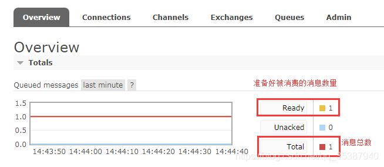

再看看队列（界面上的各个英文项代表什么意思，可以自己查查哈，对理解还是有帮助的）：

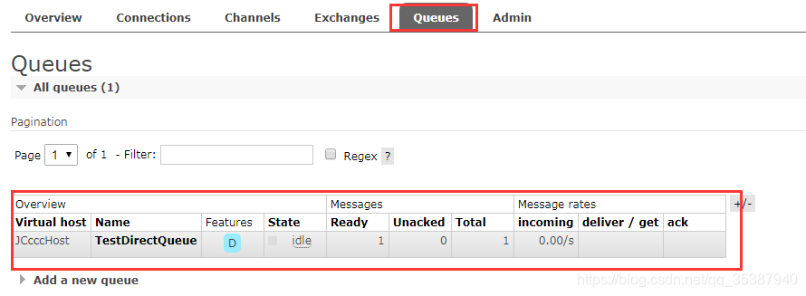

#### 消息消费者

```xml
<!--rabbitmq-->
<dependency>
	<groupId>org.springframework.boot</groupId>
	<artifactId>spring-boot-starter-amqp</artifactId>
</dependency>
<dependency>
	<groupId>org.springframework.boot</groupId>
	<artifactId>spring-boot-starter</artifactId>
</dependency>
```

```yml

server:
  port: 8022
spring:
  #给项目来个名字
  application:
    name: rabbitmq-consumer
  #配置rabbitMq 服务器
  rabbitmq:
    host: 127.0.0.1
    port: 5672
    username: root
    password: root
    #虚拟host 可以不设置,使用server默认host
    virtual-host: JCcccHost
```

然后一样，创建DirectRabbitConfig.java（**消费者单纯的使用，其实可以不用添加这个配置，直接建后面的监听就好，使用注解来让监听器监听对应的队列即可。配置上了的话，其实消费者也是生成者的身份，也能推送该消息。**）：

```java
import org.springframework.amqp.core.Binding;
import org.springframework.amqp.core.BindingBuilder;
import org.springframework.amqp.core.DirectExchange;
import org.springframework.amqp.core.Queue;
import org.springframework.context.annotation.Bean;
import org.springframework.context.annotation.Configuration;
 
/**
 * @Author : JCccc
 * @CreateTime : 2019/9/3
 * @Description :
 **/
@Configuration
public class DirectRabbitConfig {
 
    //队列 起名：TestDirectQueue
    @Bean
    public Queue TestDirectQueue() {
        return new Queue("TestDirectQueue",true);
    }
 
    //Direct交换机 起名：TestDirectExchange
    @Bean
    DirectExchange TestDirectExchange() {
        return new DirectExchange("TestDirectExchange");
    }
 
    //绑定  将队列和交换机绑定, 并设置用于匹配键：TestDirectRouting
    @Bean
    Binding bindingDirect() {
        return BindingBuilder.bind(TestDirectQueue()).to(TestDirectExchange()).with("TestDirectRouting");
    }
}
```

然后是创建消息接收监听类，DirectReceiver.java：

```java

@Component
@RabbitListener(queues = "TestDirectQueue")//监听的队列名称 TestDirectQueue
public class DirectReceiver {
 
    @RabbitHandler
    public void process(Map testMessage) {
        System.out.println("DirectReceiver消费者收到消息  : " + testMessage.toString());
    }
 
}
```

然后将rabbitmq-consumer项目运行起来，可以看到把之前推送的那条消息消费下来了：

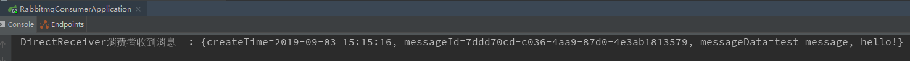

然后可以再继续调用rabbitmq-provider项目的推送消息接口，可以看到消费者即时消费消息：

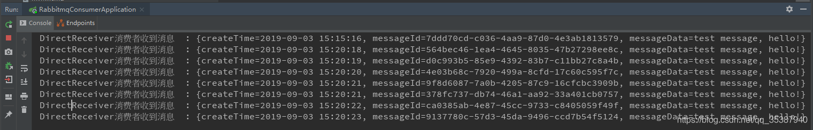

 那么直连交换机既然是一对一，那如果咱们配置多台监听绑定到同一个直连交互的同一个队列，会怎么样？

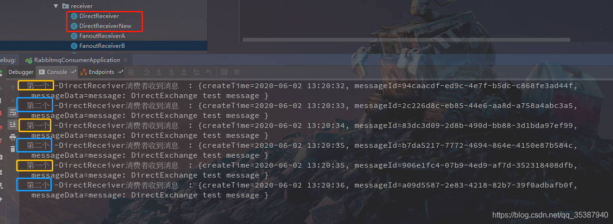

可以看到是实现了轮询的方式对消息进行消费，而且不存在重复消费。

###  主题交换机

接着，我们使用Topic Exchange 主题交换机。

在rabbitmq-provider项目里面创建TopicRabbitConfig.java：

```java

import org.springframework.amqp.core.Binding;
import org.springframework.amqp.core.BindingBuilder;
import org.springframework.amqp.core.Queue;
import org.springframework.amqp.core.TopicExchange;
import org.springframework.context.annotation.Bean;
import org.springframework.context.annotation.Configuration;
 
/**
 * @Author : JCccc
 * @CreateTime : 2019/9/3
 * @Description :
 **/
 
@Configuration
public class TopicRabbitConfig {
    //绑定键
    public final static String man = "topic.man";
    public final static String woman = "topic.woman";
 
    @Bean
    public Queue firstQueue() {
        return new Queue(TopicRabbitConfig.man);
    }
 
    @Bean
    public Queue secondQueue() {
        return new Queue(TopicRabbitConfig.woman);
    }
 
    @Bean
    TopicExchange exchange() {
        return new TopicExchange("topicExchange");
    }
 
 
    //将firstQueue和topicExchange绑定,而且绑定的键值为topic.man
    //这样只要是消息携带的路由键是topic.man,才会分发到该队列
    @Bean
    Binding bindingExchangeMessage() {
        return BindingBuilder.bind(firstQueue()).to(exchange()).with(man);
    }
 
    //将secondQueue和topicExchange绑定,而且绑定的键值为用上通配路由键规则topic.#
    // 这样只要是消息携带的路由键是以topic.开头,都会分发到该队列
    @Bean
    Binding bindingExchangeMessage2() {
        return BindingBuilder.bind(secondQueue()).to(exchange()).with("topic.#");
    }
 
}
```

然后添加多2个接口，用于推送消息到主题交换机：

```java
@GetMapping("/sendTopicMessage1")
public String sendTopicMessage1() {
    String messageId = String.valueOf(UUID.randomUUID());
    String messageData = "message: M A N ";
    String createTime = LocalDateTime.now().format(DateTimeFormatter.ofPattern("yyyy-MM-dd HH:mm:ss"));
    Map<String, Object> manMap = new HashMap<>();
    manMap.put("messageId", messageId);
    manMap.put("messageData", messageData);
    manMap.put("createTime", createTime);
    rabbitTemplate.convertAndSend("topicExchange", "topic.man", manMap);
    return "ok";
}

@GetMapping("/sendTopicMessage2")
public String sendTopicMessage2() {
    String messageId = String.valueOf(UUID.randomUUID());
    String messageData = "message: woman is all ";
    String createTime = LocalDateTime.now().format(DateTimeFormatter.ofPattern("yyyy-MM-dd HH:mm:ss"));
    Map<String, Object> womanMap = new HashMap<>();
    womanMap.put("messageId", messageId);
    womanMap.put("messageData", messageData);
    womanMap.put("createTime", createTime);
    rabbitTemplate.convertAndSend("topicExchange", "topic.woman", womanMap);
    return "ok";
}
```

生产者这边已经完事，先不急着运行，在rabbitmq-consumer项目上，创建TopicManReceiver.java：

```java

import org.springframework.amqp.rabbit.annotation.RabbitHandler;
import org.springframework.amqp.rabbit.annotation.RabbitListener;
import org.springframework.stereotype.Component;
import java.util.Map;
 
/**
 * @Author : JCccc
 * @CreateTime : 2019/9/3
 * @Description :
 **/
@Component
@RabbitListener(queues = "topic.man")
public class TopicManReceiver {
 
    @RabbitHandler
    public void process(Map testMessage) {
        System.out.println("TopicManReceiver消费者收到消息  : " + testMessage.toString());
    }
}
```

再创建一个TopicTotalReceiver.java：

```java
package com.elegant.rabbitmqconsumer.receiver;
 
import org.springframework.amqp.rabbit.annotation.RabbitHandler;
import org.springframework.amqp.rabbit.annotation.RabbitListener;
import org.springframework.stereotype.Component;
import java.util.Map;
 
/**
 * @Author : JCccc
 * @CreateTime : 2019/9/3
 * @Description :
 **/
 
@Component
@RabbitListener(queues = "topic.woman")
public class TopicTotalReceiver {
 
    @RabbitHandler
    public void process(Map testMessage) {
        System.out.println("TopicTotalReceiver消费者收到消息  : " + testMessage.toString());
    }
}
```

同样，加主题交换机的相关配置，TopicRabbitConfig.java（消费者一定要加这个配置吗？ 不需要的其实，理由在前面已经说过了。）：

```java
import org.springframework.amqp.core.Binding;
import org.springframework.amqp.core.BindingBuilder;
import org.springframework.amqp.core.Queue;
import org.springframework.amqp.core.TopicExchange;
import org.springframework.context.annotation.Bean;
import org.springframework.context.annotation.Configuration;
 
/**
 * @Author : JCccc
 * @CreateTime : 2019/9/3
 * @Description :
 **/
 
@Configuration
public class TopicRabbitConfig {
    //绑定键
    public final static String man = "topic.man";
    public final static String woman = "topic.woman";
 
    @Bean
    public Queue firstQueue() {
        return new Queue(TopicRabbitConfig.man);
    }
 
    @Bean
    public Queue secondQueue() {
        return new Queue(TopicRabbitConfig.woman);
    }
 
    @Bean
    TopicExchange exchange() {
        return new TopicExchange("topicExchange");
    }
 
 
    //将firstQueue和topicExchange绑定,而且绑定的键值为topic.man
    //这样只要是消息携带的路由键是topic.man,才会分发到该队列
    @Bean
    Binding bindingExchangeMessage() {
        return BindingBuilder.bind(firstQueue()).to(exchange()).with(man);
    }
 
    //将secondQueue和topicExchange绑定,而且绑定的键值为用上通配路由键规则topic.#
    // 这样只要是消息携带的路由键是以topic.开头,都会分发到该队列
    @Bean
    Binding bindingExchangeMessage2() {
        return BindingBuilder.bind(secondQueue()).to(exchange()).with("topic.#");
    }
 
}
```

然后把rabbitmq-provider，rabbitmq-consumer两个项目都跑起来，先调用/sendTopicMessage1 接口：

然后看消费者rabbitmq-consumer的控制台输出情况：
TopicManReceiver监听队列1，绑定键为：topic.man
TopicTotalReceiver监听队列2，绑定键为：topic.#
而当前推送的消息，携带的路由键为：topic.man  

所以可以看到两个监听消费者receiver都成功消费到了消息，因为这两个recevier监听的队列的绑定键都能与这条消息携带的路由键匹配上。

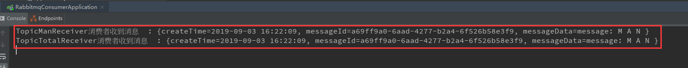

接下来调用接口/sendTopicMessage2:

然后看消费者rabbitmq-consumer的控制台输出情况：
TopicManReceiver监听队列1，绑定键为：topic.man
TopicTotalReceiver监听队列2，绑定键为：topic.#
而当前推送的消息，携带的路由键为：topic.woman

所以可以看到两个监听消费者只有TopicTotalReceiver成功消费到了消息。

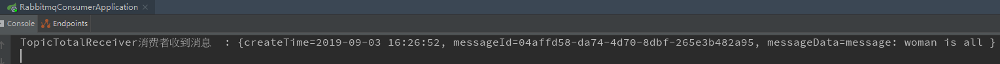

### 扇型交换机

接下来是使用Fanout Exchang 扇型交换机。

同样地，先在rabbitmq-provider项目上创建FanoutRabbitConfig.java：

```java
import org.springframework.amqp.core.Binding;
import org.springframework.amqp.core.BindingBuilder;
import org.springframework.amqp.core.FanoutExchange;
import org.springframework.amqp.core.Queue;
import org.springframework.context.annotation.Bean;
import org.springframework.context.annotation.Configuration;
/**
 * @Author : JCccc
 * @CreateTime : 2019/9/3
 * @Description :
 **/
 
@Configuration
public class FanoutRabbitConfig {
 
    /**
     *  创建三个队列 ：fanout.A   fanout.B  fanout.C
     *  将三个队列都绑定在交换机 fanoutExchange 上
     *  因为是扇型交换机, 路由键无需配置,配置也不起作用
     */
 
 
    @Bean
    public Queue queueA() {
        return new Queue("fanout.A");
    }
 
    @Bean
    public Queue queueB() {
        return new Queue("fanout.B");
    }
 
    @Bean
    public Queue queueC() {
        return new Queue("fanout.C");
    }
 
    @Bean
    FanoutExchange fanoutExchange() {
        return new FanoutExchange("fanoutExchange");
    }
 
    @Bean
    Binding bindingExchangeA() {
        return BindingBuilder.bind(queueA()).to(fanoutExchange());
    }
 
    @Bean
    Binding bindingExchangeB() {
        return BindingBuilder.bind(queueB()).to(fanoutExchange());
    }
 
    @Bean
    Binding bindingExchangeC() {
        return BindingBuilder.bind(queueC()).to(fanoutExchange());
    }
}
```

然后是写一个接口用于推送消息，

```java
 @GetMapping("/sendFanoutMessage")
 public String sendFanoutMessage() {
     String messageId = String.valueOf(UUID.randomUUID());
     String messageData = "message: testFanoutMessage ";
     String createTime = LocalDateTime.now().format(DateTimeFormatter.ofPattern("yyyy-MM-dd HH:mm:ss"));
     Map<String, Object> map = new HashMap<>();
     map.put("messageId", messageId);
     map.put("messageData", messageData);
     map.put("createTime", createTime);
     rabbitTemplate.convertAndSend("fanoutExchange", null, map);
     return "ok";
 }
```

接着在rabbitmq-consumer项目里加上消息消费类，

FanoutReceiverA.java：

```java
import org.springframework.amqp.rabbit.annotation.RabbitHandler;
import org.springframework.amqp.rabbit.annotation.RabbitListener;
import org.springframework.stereotype.Component;
import java.util.Map;
/**
 * @Author : JCccc
 * @CreateTime : 2019/9/3
 * @Description :
 **/
@Component
@RabbitListener(queues = "fanout.A")
public class FanoutReceiverA {
 
    @RabbitHandler
    public void process(Map testMessage) {
        System.out.println("FanoutReceiverA消费者收到消息  : " +testMessage.toString());
    }
 
}
```

FanoutReceiverB.java：

```java
import org.springframework.amqp.rabbit.annotation.RabbitHandler;
import org.springframework.amqp.rabbit.annotation.RabbitListener;
import org.springframework.stereotype.Component;
import java.util.Map;
/**
 * @Author : JCccc
 * @CreateTime : 2019/9/3
 * @Description :
 **/
@Component
@RabbitListener(queues = "fanout.B")
public class FanoutReceiverB {
 
    @RabbitHandler
    public void process(Map testMessage) {
        System.out.println("FanoutReceiverB消费者收到消息  : " +testMessage.toString());
    }
 
}
```

FanoutReceiverC.java：

```java

import org.springframework.amqp.rabbit.annotation.RabbitHandler;
import org.springframework.amqp.rabbit.annotation.RabbitListener;
import org.springframework.stereotype.Component;
import java.util.Map;
 
/**
 * @Author : JCccc
 * @CreateTime : 2019/9/3
 * @Description :
 **/
@Component
@RabbitListener(queues = "fanout.C")
public class FanoutReceiverC {
 
    @RabbitHandler
    public void process(Map testMessage) {
        System.out.println("FanoutReceiverC消费者收到消息  : " +testMessage.toString());
    }
 
}
```

最后将rabbitmq-provider和rabbitmq-consumer项目都跑起来，调用下接口/sendFanoutMessage ：

然后看看rabbitmq-consumer项目的控制台情况：

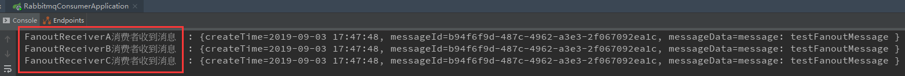

可以看到只要发送到 fanoutExchange 这个扇型交换机的消息， 三个队列都绑定这个交换机，所以三个消息接收类都监听到了这条消息。

到了这里其实三个常用的交换机的使用我们已经完毕了，那么接下来我们继续讲讲消息的回调，其实就是消息确认（生产者推送消息成功，消费者接收消息成功）。

### 回调函数


在rabbitmq-provider项目的application.yml文件上，加上消息确认的配置项后：

ps： 本篇文章使用springboot版本为 2.1.7.RELEASE ; 
如果你们在配置确认回调，测试发现无法触发回调函数，那么存在原因也许是因为版本导致的配置项不起效，
可以把publisher-confirms: true 替换为  publisher-confirm-type: correlated

```yml
server:
  port: 8021
spring:
  #给项目来个名字
  application:
    name: rabbitmq-provider
  #配置rabbitMq 服务器
  rabbitmq:
    host: 127.0.0.1
    port: 5672
    username: root
    password: root
    #虚拟host 可以不设置,使用server默认host
    virtual-host: JCcccHost
    #消息确认配置项
 
    #确认消息已发送到交换机(Exchange)
    publisher-confirms: true
    #确认消息已发送到队列(Queue)
    publisher-returns: true
```

然后是配置相关的消息确认回调函数，RabbitConfig.java：

```java
import org.springframework.amqp.core.Message;
import org.springframework.amqp.rabbit.connection.ConnectionFactory;
import org.springframework.amqp.rabbit.connection.CorrelationData;
import org.springframework.amqp.rabbit.core.RabbitTemplate;
import org.springframework.context.annotation.Bean;
import org.springframework.context.annotation.Configuration;
 
 
/**
 * @Author : JCccc
 * @CreateTime : 2019/9/3
 * @Description :
 **/
@Configuration
public class RabbitConfig {
 
    @Bean
    public RabbitTemplate createRabbitTemplate(ConnectionFactory connectionFactory){
        RabbitTemplate rabbitTemplate = new RabbitTemplate();
        rabbitTemplate.setConnectionFactory(connectionFactory);
        //设置开启Mandatory,才能触发回调函数,无论消息推送结果怎么样都强制调用回调函数
        rabbitTemplate.setMandatory(true);
 
        rabbitTemplate.setConfirmCallback(new RabbitTemplate.ConfirmCallback() {
            @Override
            public void confirm(CorrelationData correlationData, boolean ack, String cause) {
                System.out.println("ConfirmCallback:     "+"相关数据："+correlationData);
                System.out.println("ConfirmCallback:     "+"确认情况："+ack);
                System.out.println("ConfirmCallback:     "+"原因："+cause);
            }
        });
 
        rabbitTemplate.setReturnCallback(new RabbitTemplate.ReturnCallback() {
            @Override
            public void returnedMessage(Message message, int replyCode, String replyText, String exchange, String routingKey) {
                System.out.println("ReturnCallback:     "+"消息："+message);
                System.out.println("ReturnCallback:     "+"回应码："+replyCode);
                System.out.println("ReturnCallback:     "+"回应信息："+replyText);
                System.out.println("ReturnCallback:     "+"交换机："+exchange);
                System.out.println("ReturnCallback:     "+"路由键："+routingKey);
            }
        });
 
        return rabbitTemplate;
    }
 
}
```

到这里，生产者推送消息的消息确认调用回调函数已经完毕。
可以看到上面写了两个回调函数，一个叫 ConfirmCallback ，一个叫 RetrunCallback；
那么以上这两种回调函数都是在什么情况会触发呢？

先从总体的情况分析，推送消息存在四种情况：

①消息推送到server，但是在server里找不到交换机
②消息推送到server，找到交换机了，但是没找到队列
③消息推送到sever，交换机和队列啥都没找到
④消息推送成功

那么我先写几个接口来分别测试和认证下以上4种情况，消息确认触发回调函数的情况：

①消息推送到server，但是在server里找不到交换机
写个测试接口，把消息推送到名为‘non-existent-exchange’的交换机上（这个交换机是没有创建并且没有配置的）：

```java
@GetMapping("/TestMessageAck")
public String TestMessageAck() {
    String messageId = String.valueOf(UUID.randomUUID());
    String messageData = "message: non-existent-exchange test message ";
    String createTime = LocalDateTime.now().format(DateTimeFormatter.ofPattern("yyyy-MM-dd HH:mm:ss"));
    Map<String, Object> map = new HashMap<>();
    map.put("messageId", messageId);
    map.put("messageData", messageData);
    map.put("createTime", createTime);
    rabbitTemplate.convertAndSend("non-existent-exchange", "TestDirectRouting", map);
    return "ok";
}
```

调用接口，查看rabbitmq-provuder项目的控制台输出情况（原因里面有说，没有找到交换机'non-existent-exchange'）：

``` log

2019-09-04 09:37:45.197 ERROR 8172 --- [ 127.0.0.1:5672] o.s.a.r.c.CachingConnectionFactory       : Channel shutdown: channel error; protocol method: #method<channel.close>(reply-code=404, reply-text=NOT_FOUND - no exchange 'non-existent-exchange' in vhost 'JCcccHost', class-id=60, method-id=40)

ConfirmCallback:     相关数据：null
ConfirmCallback:     确认情况：false
ConfirmCallback:     原因：channel error; protocol method: #method<channel.close>(reply-code=404, reply-text=NOT_FOUND - no exchange 'non-existent-exchange' in vhost 'JCcccHost', class-id=60, method-id=40)
```

 结论： ①这种情况触发的是 ConfirmCallback 回调函数。

**②消息推送到server，找到交换机了，但是没找到队列** 
这种情况就是需要新增一个交换机，但是不给这个交换机绑定队列，我来简单地在DirectRabitConfig里面新增一个直连交换机，名叫‘lonelyDirectExchange’，但没给它做任何绑定配置操作：

```java
@Bean
DirectExchange lonelyDirectExchange() {
	return new DirectExchange("lonelyDirectExchange");
}
```

然后写个测试接口，把消息推送到名为‘lonelyDirectExchange’的交换机上（这个交换机是没有任何队列配置的）：

```java
 @GetMapping("/TestMessageAck2")
 public String TestMessageAck2() {
     String messageId = String.valueOf(UUID.randomUUID());
     String messageData = "message: lonelyDirectExchange test message ";
     String createTime = LocalDateTime.now().format(DateTimeFormatter.ofPattern("yyyy-MM-dd HH:mm:ss"));
     Map<String, Object> map = new HashMap<>();
     map.put("messageId", messageId);
     map.put("messageData", messageData);
     map.put("createTime", createTime);
     rabbitTemplate.convertAndSend("lonelyDirectExchange", "TestDirectRouting", map);
     return "ok";
 }
```

调用接口，查看rabbitmq-provuder项目的控制台输出情况：

```
ReturnCallback:     消息：(Body:'{createTime=2019-09-04 09:48:01, messageId=563077d9-0a77-4c27-8794-ecfb183eac80, messageData=message: lonelyDirectExchange test message }' MessageProperties [headers={}, contentType=application/x-java-serialized-object, contentLength=0, receivedDeliveryMode=PERSISTENT, priority=0, deliveryTag=0])

ReturnCallback:     回应码：312
ReturnCallback:     回应信息：NO_ROUTE
ReturnCallback:     交换机：lonelyDirectExchange
ReturnCallback:     路由键：TestDirectRouting
```

```
ConfirmCallback:     相关数据：null
ConfirmCallback:     确认情况：true
ConfirmCallback:     原因：null
```

可以看到这种情况，两个函数都被调用了；
这种情况下，消息是推送成功到服务器了的，所以ConfirmCallback对消息确认情况是true；
而在RetrunCallback回调函数的打印参数里面可以看到，消息是推送到了交换机成功了，但是在路由分发给队列的时候，找不到队列，所以报了错误 NO_ROUTE 。
  结论：②这种情况触发的是 ConfirmCallback和RetrunCallback两个回调函数。

③消息推送到sever，交换机和队列啥都没找到 
这种情况其实一看就觉得跟①很像，没错 ，③和①情况回调是一致的，所以不做结果说明了。
  结论： ③这种情况触发的是 ConfirmCallback 回调函数。

 ④消息推送成功
那么测试下，按照正常调用之前消息推送的接口就行，就调用下 /sendFanoutMessage接口，可以看到控制台输出：

```
ConfirmCallback:     相关数据：null
ConfirmCallback:     确认情况：true
ConfirmCallback:     原因：null
```

结论： ④这种情况触发的是 ConfirmCallback 回调函数。


以上是生产者推送消息的消息确认 回调函数的使用介绍（可以在回调函数根据需求做对应的扩展或者业务数据处理）。

### 消息确认机制

接下来我们继续， 消费者接收到消息的消息确认机制。

和生产者的消息确认机制不同，因为消息接收本来就是在监听消息，符合条件的消息就会消费下来。
所以，消息接收的确认机制主要存在三种模式：

①自动确认， 这也是默认的消息确认情况。  AcknowledgeMode.NONE
RabbitMQ成功将消息发出（即将消息成功写入TCP Socket）中立即认为本次投递已经被正确处理，不管消费者端是否成功处理本次投递。
所以这种情况如果消费端消费逻辑抛出异常，也就是消费端没有处理成功这条消息，那么就相当于丢失了消息。
一般这种情况我们都是使用try catch捕捉异常后，打印日志用于追踪数据，这样找出对应数据再做后续处理。

② 根据情况确认， 这个不做介绍
③ 手动确认 ， 这个比较关键，也是我们配置接收消息确认机制时，多数选择的模式。
消费者收到消息后，手动调用basic.ack/basic.nack/basic.reject后，RabbitMQ收到这些消息后，才认为本次投递成功。
basic.ack用于肯定确认 
basic.nack用于否定确认（注意：这是AMQP 0-9-1的RabbitMQ扩展） 
basic.reject用于否定确认，但与basic.nack相比有一个限制:一次只能拒绝单条消息 

消费者端以上的3个方法都表示消息已经被正确投递，但是basic.ack表示消息已经被正确处理。
而basic.nack,basic.reject表示没有被正确处理：

着重讲下reject，因为有时候一些场景是需要重新入列的。

channel.basicReject(deliveryTag, true);  拒绝消费当前消息，如果第二参数传入true，就是将数据重新丢回队列里，那么下次还会消费这消息。设置false，就是告诉服务器，我已经知道这条消息数据了，因为一些原因拒绝它，而且服务器也把这个消息丢掉就行。 下次不想再消费这条消息了。

使用拒绝后重新入列这个确认模式要谨慎，因为一般都是出现异常的时候，catch异常再拒绝入列，选择是否重入列。

但是如果使用不当会导致一些每次都被你重入列的消息一直消费-入列-消费-入列这样循环，会导致消息积压。

 

顺便也简单讲讲 nack，这个也是相当于设置不消费某条消息。

channel.basicNack(deliveryTag, false, true);
第一个参数依然是当前消息到的数据的唯一id;
第二个参数是指是否针对多条消息；如果是true，也就是说一次性针对当前通道的消息的tagID小于当前这条消息的，都拒绝确认。
第三个参数是指是否重新入列，也就是指不确认的消息是否重新丢回到队列里面去。

同样使用不确认后重新入列这个确认模式要谨慎，因为这里也可能因为考虑不周出现消息一直被重新丢回去的情况，导致积压。

 


看了上面这么多介绍，接下来我们一起配置下，看看一般的消息接收 手动确认是怎么样的。

在消费者项目里，
新建MessageListenerConfig.java上添加代码相关的配置代码：

```java
 
import com.elegant.rabbitmqconsumer.receiver.MyAckReceiver;
import org.springframework.amqp.core.AcknowledgeMode;
import org.springframework.amqp.core.Queue;
import org.springframework.amqp.rabbit.connection.CachingConnectionFactory;
import org.springframework.amqp.rabbit.listener.SimpleMessageListenerContainer;
import org.springframework.beans.factory.annotation.Autowired;
import org.springframework.context.annotation.Bean;
import org.springframework.context.annotation.Configuration;
 
/**
 * @Author : JCccc
 * @CreateTime : 2019/9/4
 * @Description :
 **/
@Configuration
public class MessageListenerConfig {
 
    @Autowired
    private CachingConnectionFactory connectionFactory;
    @Autowired
    private MyAckReceiver myAckReceiver;//消息接收处理类
 
    @Bean
    public SimpleMessageListenerContainer simpleMessageListenerContainer() {
        SimpleMessageListenerContainer container = new SimpleMessageListenerContainer(connectionFactory);
        container.setConcurrentConsumers(1);
        container.setMaxConcurrentConsumers(1);
        container.setAcknowledgeMode(AcknowledgeMode.MANUAL); // RabbitMQ默认是自动确认，这里改为手动确认消息
        //设置一个队列
        container.setQueueNames("TestDirectQueue");
        //如果同时设置多个如下： 前提是队列都是必须已经创建存在的
        //  container.setQueueNames("TestDirectQueue","TestDirectQueue2","TestDirectQueue3");
 
 
        //另一种设置队列的方法,如果使用这种情况,那么要设置多个,就使用addQueues
        //container.setQueues(new Queue("TestDirectQueue",true));
        //container.addQueues(new Queue("TestDirectQueue2",true));
        //container.addQueues(new Queue("TestDirectQueue3",true));
        container.setMessageListener(myAckReceiver);
 
        return container;
    }
 
 
}
```

对应的手动确认消息监听类，MyAckReceiver.java（手动确认模式需要实现 ChannelAwareMessageListener）：
//之前的相关监听器可以先注释掉，以免造成多个同类型监听器都监听同一个队列。
//这里的获取消息转换，只作参考，如果报数组越界可以自己根据格式去调整。

```java
import com.rabbitmq.client.Channel;
import org.springframework.amqp.core.Message;
import org.springframework.amqp.rabbit.listener.api.ChannelAwareMessageListener;
import org.springframework.stereotype.Component;
import java.util.HashMap;
import java.util.Map;
 
@Component
 
public class MyAckReceiver implements ChannelAwareMessageListener {
 
    @Override
    public void onMessage(Message message, Channel channel) throws Exception {
        long deliveryTag = message.getMessageProperties().getDeliveryTag();
        try {
            //因为传递消息的时候用的map传递,所以将Map从Message内取出需要做些处理
            String msg = message.toString();
            String[] msgArray = msg.split("'");//可以点进Message里面看源码,单引号直接的数据就是我们的map消息数据
            Map<String, String> msgMap = mapStringToMap(msgArray[1].trim(),3);
            String messageId=msgMap.get("messageId");
            String messageData=msgMap.get("messageData");
            String createTime=msgMap.get("createTime");
            System.out.println("  MyAckReceiver  messageId:"+messageId+"  messageData:"+messageData+"  createTime:"+createTime);
            System.out.println("消费的主题消息来自："+message.getMessageProperties().getConsumerQueue());
            channel.basicAck(deliveryTag, true); //第二个参数，手动确认可以被批处理，当该参数为 true 时，则可以一次性确认 delivery_tag 小于等于传入值的所有消息
//			channel.basicReject(deliveryTag, true);//第二个参数，true会重新放回队列，所以需要自己根据业务逻辑判断什么时候使用拒绝
        } catch (Exception e) {
            channel.basicReject(deliveryTag, false);
            e.printStackTrace();
        }
    }
 
     //{key=value,key=value,key=value} 格式转换成map
    private Map<String, String> mapStringToMap(String str,int entryNum ) {
        str = str.substring(1, str.length() - 1);
        String[] strs = str.split(",",entryNum);
        Map<String, String> map = new HashMap<String, String>();
        for (String string : strs) {
            String key = string.split("=")[0].trim();
            String value = string.split("=")[1];
            map.put(key, value);
        }
        return map;
    }
}
```

这时，先调用接口/sendDirectMessage， 给直连交换机TestDirectExchange 的队列TestDirectQueue 推送一条消息，可以看到监听器正常消费了下来：

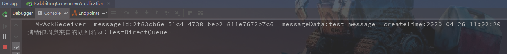

 到这里，我们其实已经掌握了怎么去使用消息消费的手动确认了。
但是这个场景往往不够！ 因为很多伙伴之前给我评论反应，他们需要这个消费者项目里面，监听的好几个队列都想变成手动确认模式，而且处理的消息业务逻辑不一样。

没有问题，接下来看代码

场景： 除了直连交换机的队列TestDirectQueue需要变成手动确认以外，我们还需要将一个其他的队列

或者多个队列也变成手动确认，而且不同队列实现不同的业务处理。

 

那么我们需要做的第一步，往SimpleMessageListenerContainer里添加多个队列：


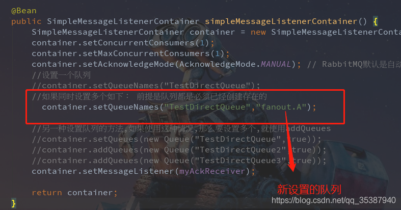

然后我们的手动确认消息监听类，MyAckReceiver.java 就可以同时将上面设置到的队列的消息都消费下来。

但是我们需要做不用的业务逻辑处理，那么只需要 根据消息来自的队列名进行区分处理即可，如：

```java
import com.rabbitmq.client.Channel;
import org.springframework.amqp.core.Message;
import org.springframework.amqp.rabbit.listener.api.ChannelAwareMessageListener;
import org.springframework.stereotype.Component;
import java.util.HashMap;
import java.util.Map;
 
@Component
public class MyAckReceiver implements ChannelAwareMessageListener {
 
    @Override
    public void onMessage(Message message, Channel channel) throws Exception {
        long deliveryTag = message.getMessageProperties().getDeliveryTag();
        try {
            //因为传递消息的时候用的map传递,所以将Map从Message内取出需要做些处理
            String msg = message.toString();
            String[] msgArray = msg.split("'");//可以点进Message里面看源码,单引号直接的数据就是我们的map消息数据
            Map<String, String> msgMap = mapStringToMap(msgArray[1].trim(),3);
            String messageId=msgMap.get("messageId");
            String messageData=msgMap.get("messageData");
            String createTime=msgMap.get("createTime");
            
            if ("TestDirectQueue".equals(message.getMessageProperties().getConsumerQueue())){
                System.out.println("消费的消息来自的队列名为："+message.getMessageProperties().getConsumerQueue());
                System.out.println("消息成功消费到  messageId:"+messageId+"  messageData:"+messageData+"  createTime:"+createTime);
                System.out.println("执行TestDirectQueue中的消息的业务处理流程......");
                
            }
 
            if ("fanout.A".equals(message.getMessageProperties().getConsumerQueue())){
                System.out.println("消费的消息来自的队列名为："+message.getMessageProperties().getConsumerQueue());
                System.out.println("消息成功消费到  messageId:"+messageId+"  messageData:"+messageData+"  createTime:"+createTime);
                System.out.println("执行fanout.A中的消息的业务处理流程......");
 
            }
            
            channel.basicAck(deliveryTag, true);
//			channel.basicReject(deliveryTag, true);//为true会重新放回队列
        } catch (Exception e) {
            channel.basicReject(deliveryTag, false);
            e.printStackTrace();
        }
    }
 
    //{key=value,key=value,key=value} 格式转换成map
    private Map<String, String> mapStringToMap(String str,int enNum) {
        str = str.substring(1, str.length() - 1);
        String[] strs = str.split(",",enNum);
        Map<String, String> map = new HashMap<String, String>();
        for (String string : strs) {
            String key = string.split("=")[0].trim();
            String value = string.split("=")[1];
            map.put(key, value);
        }
        return map;
    }
}
```

ok，这时候我们来分别往不同队列推送消息，看看效果：

调用接口/sendDirectMessage 和 /sendFanoutMessage ，

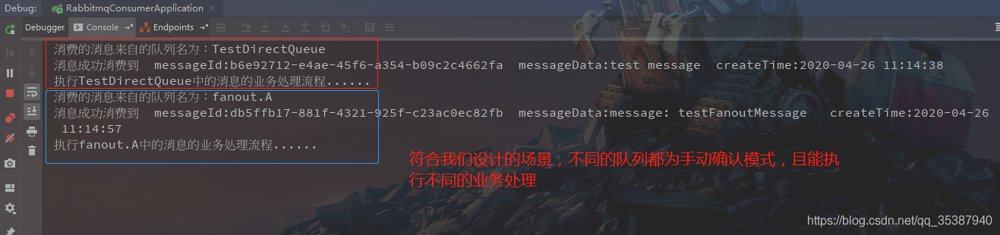

 

如果你还想新增其他的监听队列，也就是按照这种方式新增配置即可（或者完全可以分开多个消费者项目去监听处理）。 

 