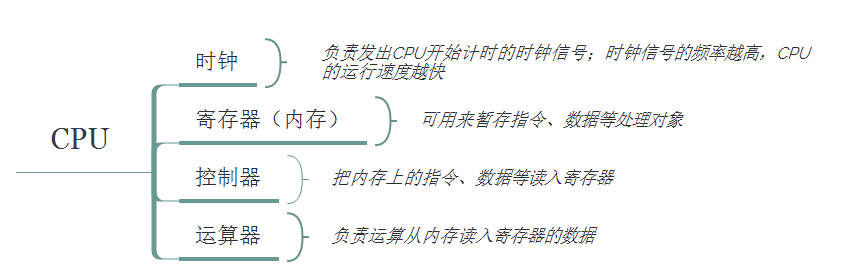
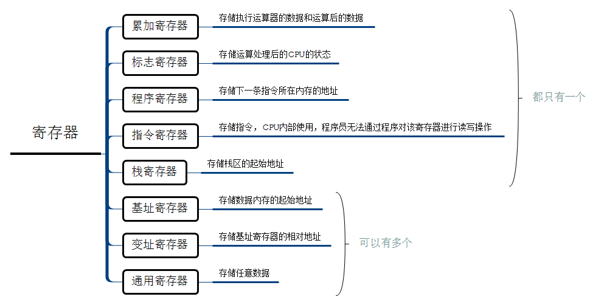
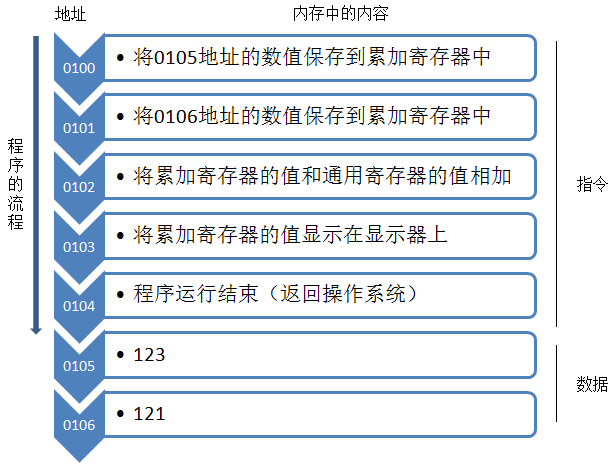
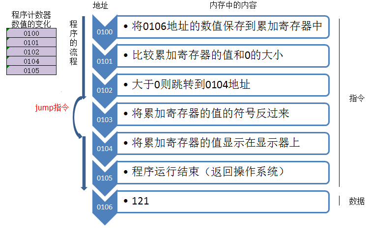
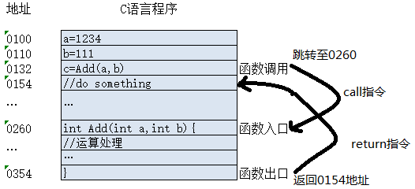

# 计算机必备知识

## 中央处理单元 CPU

中央处理单元 （CPU）
运算器、控制器等部件被集成在一起统称为中央处理单元，也就是我们常说的CPU 。CPU是硬件系统的核心，它负责获取程序指令、对指令进行译码并加以执行。用于数据的加工处理，能完成算数运算、逻辑运算及控制功能

### CPU的功能

- 程序控制：也就是指令控制，CPU按照程序的安排来执行指令，保证程序指令严格按照规定的顺序执行，通过执行程序控制计算机的行为。

- 操作控制：一条指令功能的实现需要若干操作信号来完成，CPU产生每条指令的操作信号并将操作信号送往不同的部件，控制相应的部件按指令的功能要求进行操作。
- 时间控制：CPU对每条指令的整个执行时间要进行严格的控制。同时，指令执行过程中操作信号的出现时间、持续时间及出现的时间顺序都需要进行严格控制。
- 数据处理：CPU通过对数据进行算数运算及逻辑运算等方式进行加工处理，数据加工处理的结果为人们所使用。所以，对数据的加工处理是CPU的最根本的任务。
- 中断（异常）响应

### CPU的组成

我们都知道CPU是一台电脑的核心部件，所有的程序都是通过它运行的，那么CPU是如何让一个程序跑起来的呢？我们今天就来一起简单的做个了解，首先看下CPU的基本结构

#### 运算器

> 主要功能：
>
> - 执行所有的算数运算，如加、减、乘、除等基本运算及附加运算。
> - 执行所有的逻辑运算并进行逻辑测试，如与、或、非、零值测试或两个值的比较等。
>
> 各部件的组成和功能：
>
> - 算术逻辑单元（ALU)：负责处理数据，实现对数据的算术运算和逻辑运算。
> - 累加寄存器（AC）: AC 通常称为累加器，它是一个通用寄存器。其功能是当作运算器的算术逻辑单元执行算术或逻辑运算时，为ALU提供一个工作区。例如，在执行一个减法运算前，先间被减数暂存在AC中，再从内存储器中取出减数，然后与AC的内容相减，所得结果送回AC中暂存。
> - 数据缓冲寄存器（DR）:作为CPU和内存、外部设备之间数据传输的中转站；作为CPU和内存、外围设备之间的操作速度上的缓冲；在单累加器结构的运算器中，数据缓冲寄存器还可兼作为操作数寄存器（存放操作数的寄存器 例如：a+b 其中a,b就是操作数）
> - 状态条件寄存器（PSW）:保存根据算术指令和逻辑指令运行或测试的结果建立各种条件码内容，分为状态标志和控制标志，如运算结果进位标志（C）等。标志通常由一位触发器保存，保存当前指令执行完成后的状态。通常，一个算术操作产生一个运算结果，而逻辑操作则产生一个判决（真或假）。

#### 控制器

控制器用于控制整个CPU的工作，它决定了计算机运行过程的自动化。它不仅要保证程序的正确执行，而且要能够处理异常事件。
控制器一般包括**指令控制逻辑**、**时序控制逻辑**、**总线控制逻辑**、**中断控制逻辑**等几部分。

> 指令控制逻辑：
>
> - 要完成取指令、分析指令和执行指令的操作。其过程分为：取指令、指令译码、按指令操作码执行、形成下一条指令地址等步骤。
>
> 控制器的组成部件：
>
> - 指令寄存器（IR）:存放指令，CPU执行指令先把它从内存储器取到数据缓冲寄存器中，再送入IR暂存。
> - 程序计数器（PC）寄存信息和计数。总保持将要执行下一条指令的地址或者程序第一条指令的地址。顺序执行地址加1（数组），转移执行地址加转移量（链表）。
> - 地址寄存器(AR):存放当前CPU访问的地址，直到内存的读/写操作完成，因为内存和CPU存在操作速度差异。
> - 指令译码器：操作码和地址码，分析指令

> 时序控制逻辑：为每条指令按照时间顺序提供应有的控制信号
>
> 总线逻辑：是为多个功能部件服务的信息通路的控制电路
>
> 中断控制逻辑：用于控制各种中断请求，并根据优先级的高低对中断请求进行排队，逐个交给CPU处理。
>
> 寄存器组：分为通用寄存器和专用寄存器。作用是固定的为专用寄存器（运算器和控制器中的寄存器）。用途广泛并可由程序员规定其用途的为通用寄存器。

## CPU 是如何执行代码

### **程序流程**

  假如现在我们有个两个数相加的程序，当你点击运行这个程序时，系统会将这个程序复制到内存中。程序中的这些数据和指令会被存储在一个一个小的“内存空间”，并给每个空间一个“门牌号”，也就是内存中的地址。

  系统将程序复制到内存中后，会将程序计数器设定到程序运行的开始位置（假设这个程序的开始位置是0100），然后开始运行；当CPU每执行一条指令，程序的累加器的值就自动加1，然后CPU的控制器就会参照程序计数器的数值从内存中读取命令并执行，那么我们用图表示这个流程的话大概是下图中的样子

在CPU进行运算时，标志寄存器的数值会根据运算结果自动设定。如果程序执行到跳转指令的时候，会根据地址中的内容跳转到对应的地址；条件分支在跳转指令之前会进行比较运算，然后CPU根据标志寄存器的数值进行判断是否要跳转

### **函数调用**

  对CPU的执行流程有了个大概的了解后，我们现在可以来看看咱们平时写的程序函数是怎么运行的了。在介绍之前我们先了解两个机器语言指令

> call指令，把函数要执行的指令地址存储在名为栈的主内存
>
> return指令，把保存在栈中的地址设定到程序计数器中

在上图中，函数执行到0132的时候，并不是通过跳转指令跳转到Add函数的入口，而是通过call指令；这个地方和我没前面讲到的条件分支跳转指令是不一样的，因为调用完函数，我们还要返回函数调用的地方继续下一条指令。

到此，我们可以对程序的运行过程有个大概的了解。