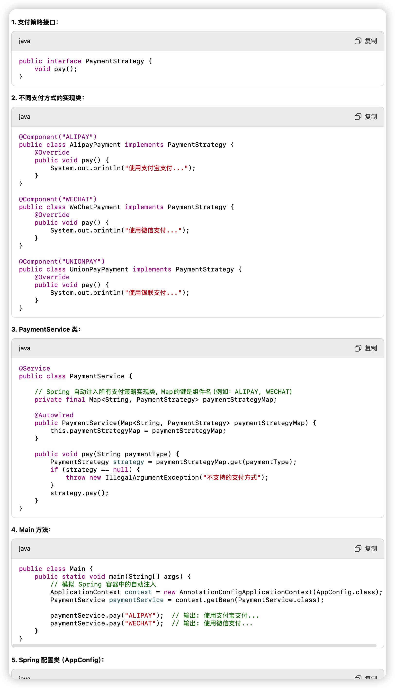

## 装饰器模式

应用于货源标签业务，判断货源是否符合该标签、打标、去掉标签，抽象装饰器里写通用逻辑，具体装饰器里写标签各自的逻辑

```java
// 1. 组件接口
interface Coffee {
    String getDescription();
    double cost();
}

// 2. 具体组件
class SimpleCoffee implements Coffee {
    public String getDescription() {
        return "Simple Coffee";
    }
    public double cost() {
        return 5.0;
    }
}

// 3. 抽象装饰器
abstract class CoffeeDecorator implements Coffee {
    protected Coffee decoratedCoffee;
    
    public CoffeeDecorator(Coffee coffee) {
        this.decoratedCoffee = coffee;
    }

    public String getDescription() {
        return decoratedCoffee.getDescription();
    }

    public double cost() {
        return decoratedCoffee.cost();
    }
}

// 4. 具体装饰器
class MilkDecorator extends CoffeeDecorator {
    public MilkDecorator(Coffee coffee) {
        super(coffee);
    }

    public String getDescription() {
        return super.getDescription() + ", Milk";
    }

    public double cost() {
        return super.cost() + 2.0;
    }
}

class SugarDecorator extends CoffeeDecorator {
    public SugarDecorator(Coffee coffee) {
        super(coffee);
    }

    public String getDescription() {
        return super.getDescription() + ", Sugar";
    }

    public double cost() {
        return super.cost() + 1.0;
    }
}

// 使用示例
public class DecoratorExample {
    public static void main(String[] args) {
        Coffee coffee = new SimpleCoffee();
        coffee = new MilkDecorator(coffee);
        coffee = new SugarDecorator(coffee);
        
        System.out.println(coffee.getDescription() + " costs $" + coffee.cost());
    }
}
```

## 适配器模式

BI接口数据转换

```java
// 目标接口
interface Target {
    void request();
}

// 被适配的类（不兼容的接口）
class Adaptee {
    public void specificRequest() {
        System.out.println("Adaptee: Specific request called");
    }
}

// 适配器
class Adapter implements Target {
    private Adaptee adaptee;

    public Adapter(Adaptee adaptee) {
        this.adaptee = adaptee;
    }

    public void request() {
        adaptee.specificRequest();
    }
}

// 使用示例
public class AdapterExample {
    public static void main(String[] args) {
        Target adapter = new Adapter(new Adaptee());
        adapter.request();
    }
}
```

## 责任链模式（不常用）

开票货源审批流超额货源需业务专员

应用于开票货源 校验-运费附加费计算-派单 流程，直接发布跳过校验、派单流程，新发布或者历史货源编辑发布流程全部执行、填价加价转一口价执行校验、运费附加费计算流程

```java
// 处理器接口
abstract class Handler {
    protected Handler nextHandler;

    public void setNextHandler(Handler nextHandler) {
        this.nextHandler = nextHandler;
    }

    public abstract void handleRequest(int level);
}

// 具体处理器
class LowLevelHandler extends Handler {
    public void handleRequest(int level) {
        if (level <= 1) {
            System.out.println("LowLevelHandler handled request");
        } else if (nextHandler != null) {
            nextHandler.handleRequest(level);
        }
    }
}

class MidLevelHandler extends Handler {
    public void handleRequest(int level) {
        if (level <= 2) {
            System.out.println("MidLevelHandler handled request");
        } else if (nextHandler != null) {
            nextHandler.handleRequest(level);
        }
    }
}

class HighLevelHandler extends Handler {
    public void handleRequest(int level) {
        if (level <= 3) {
            System.out.println("HighLevelHandler handled request");
        } else {
            System.out.println("No handler available for level " + level);
        }
    }
}

// 使用示例
public class ChainExample {
    public static void main(String[] args) {
        Handler low = new LowLevelHandler();
        Handler mid = new MidLevelHandler();
        Handler high = new HighLevelHandler();

        low.setNextHandler(mid);
        mid.setNextHandler(high);

        low.handleRequest(2);
        low.handleRequest(3);
        low.handleRequest(4);
    }
}
```

## 观察者模式（不常用，被MQ替代）

应用于当货源发布后记录多个货源生命周期相关的关键日志，例如是否满足了优车2.0货源、填价加价转一口价

```java
import java.util.ArrayList;
import java.util.List;

// 观察者接口
interface Observer {
    void update(String message);
}

// 具体观察者
class User implements Observer {
    private String name;

    public User(String name) {
        this.name = name;
    }

    public void update(String message) {
        System.out.println(name + " received: " + message);
    }
}

// 主题
class NewsAgency {
    private List<Observer> observers = new ArrayList<>();

    public void addObserver(Observer observer) {
        observers.add(observer);
    }

    public void notifyObservers(String message) {
        for (Observer observer : observers) {
            observer.update(message);
        }
    }
}

// 使用示例
public class ObserverExample {
    public static void main(String[] args) {
        NewsAgency agency = new NewsAgency();
        Observer user1 = new User("Alice");
        Observer user2 = new User("Bob");

        agency.addObserver(user1);
        agency.addObserver(user2);

        agency.notifyObservers("Breaking News!");
    }
}
```

## 策略模式

应用于不同种类的货源发布流程末尾采取不同的刷新、短信push站内信发送策略、不同的通知调度员策略

```java
// 1. 定义策略接口
interface PaymentStrategy {
    void pay(int amount);
}

// 2. 具体策略实现
class CreditCardPayment implements PaymentStrategy {
    public void pay(int amount) {
        System.out.println("Paid " + amount + " using Credit Card.");
    }
}

class PayPalPayment implements PaymentStrategy {
    public void pay(int amount) {
        System.out.println("Paid " + amount + " using PayPal.");
    }
}

// 3. 上下文类
class PaymentContext {
    private PaymentStrategy strategy;

    public PaymentContext(PaymentStrategy strategy) {
        this.strategy = strategy;
    }

    public void setStrategy(PaymentStrategy strategy) {
        this.strategy = strategy;
    }

    public void executePayment(int amount) {
        strategy.pay(amount);
    }
}

// 4. 客户端代码
public class StrategyPatternDemo {
    public static void main(String[] args) {
        PaymentContext context = new PaymentContext(new CreditCardPayment());
        context.executePayment(500);

        // 动态切换策略
        context.setStrategy(new PayPalPayment());
        context.executePayment(300);
    }
}
```


