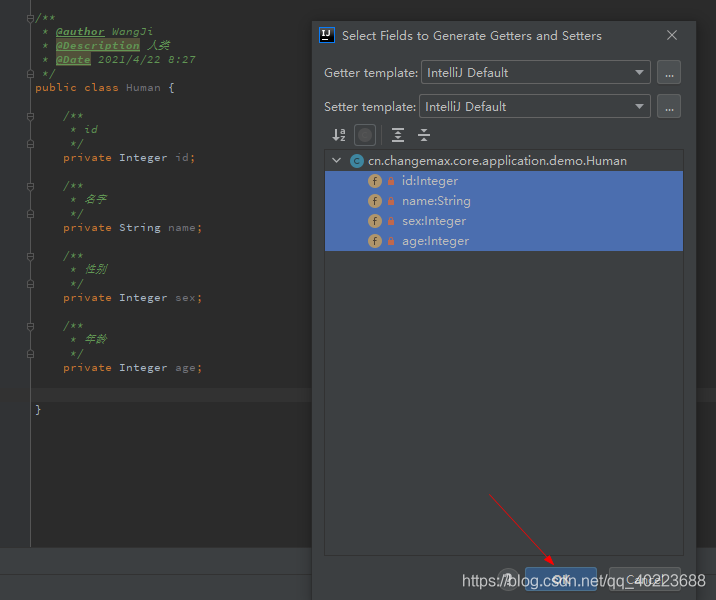
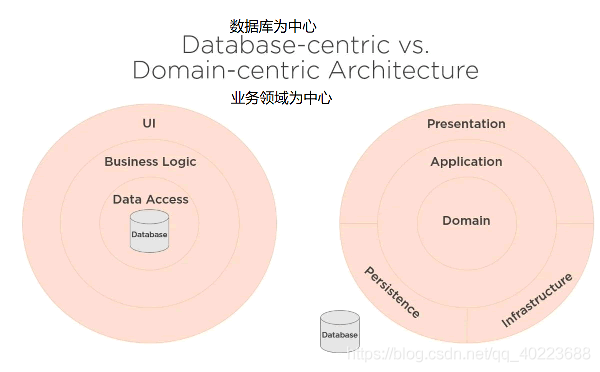

# 失血模型和充血模型

什么是失血模型和充血模型？

 

如题，那么什么是失血模型（贫血模型）呢？

我们在日常开发中，经常会需要用到各种model，定义各种 DTO/VO/BO/PO 等数据载体，

那么我们细想一下，对于这种实体，我们通常对它的定义是什么？我们对它的使用场景是哪些？

 

## 什么是失血模型

反正笔者之前，对于一个类的定义就是如下：

```java
/**
 * @Description 人类
 */
public class Human {

    /**
     * id
     */
    private Integer id;

    /**
     * 名字
     */
    private String name;

    /**
     * 性别
     */
    private Integer sex;

    /**
     * 年龄
     */
    private Integer age;
}
```

那么对于这个人类实体，我们通常会干什么？

是的，我们用的最多的就是就是 get/set，用于获取属性值，赋值，那么我们通常都是使用快捷键一键无脑生成 get/set方法



是的，那么带来的情况就是如下：

```java
/**
 * @Description 人类
 */
public class Human {

    /**
     * id
     */
    private Integer id;

    /**
     * 名字
     */
    private String name;

    /**
     * 性别
     */
    private Integer sex;

    /**
     * 年龄
     */
    private Integer age;

    public Integer getId() {
        return id;
    }

    public void setId(Integer id) {
        this.id = id;
    }

    public String getName() {
        return name;
    }

    public void setName(String name) {
        this.name = name;
    }

    public Integer getSex() {
        return sex;
    }

    public void setSex(Integer sex) {
        this.sex = sex;
    }

    public Integer getAge() {
        return age;
    }

    public void setAge(Integer age) {
        this.age = age;
    }
}
```

多了几个方法，那么我们平时对于这个human类使用，也就是 get/set了。这便是大多数人眼中的“封装”：隐藏内部实现，暴露接口；

试问各位程序员，这种所谓的封装，真的有价值，有意义吗？

如果我们一味的暴露get/set方法，那么为何不直接如下（岂不快哉）：

```java
/**
 * @Description 人类
 */
public class Human {

    /**
     * id
     */
    public Integer id;

    /**
     * 名字
     */
    public String name;

    /**
     * 性别
     */
    public Integer sex;

    /**
     * 年龄
     */
    public Integer age;
}
```

回归正题，上述便是“贫血模型”，我们更多的对于human的业务操作都将其暴露在外部，那么对于human实体来说，我们只用于存储数据。

那我们回想一下，面向对象又是什么？我们对面向对象的定义又是怎样的？

对象由属性、有行为；我们对于对象定义来说，我们关注的是对象有哪些行为，通过对象的这些行为，我们可以使得一个事件完整执行，这是我简单的对面向对象的定义；

那么试问，对于上述，我们对于human实体的操作来说，是真的面向对象思想吗？human的行为只有get/set吗？

我们平时的编码思维可以说，大部分都将对象的行为定义到service中去了，这不是面向对象，这更多的是偏向面向过程了。

举例来说：

```java
/**
 * @Description 人类业务
 */
public class HumanService {
    /**
     * 定义一个方法
     * 用于人类吃饭
     * 贫血模型
     */
    public void eat() {
        Human human = new Human(1, "wang", 1, 60);

        //1.先得有饭
        Object food = doCook();

        //2.人类吃饭
        System.out.printf("人类[%s]吃了饭[%s]%n", human.getName(), food);
        //体重+1
        human.setWeight(human.getWeight() + 1);


        //3.吃完散步
        System.out.printf("人类[%s]开始散步了%n", human.getName());
    }

    private Object doCook() {
        return new Object();
    }
}
```

上述就是一个简单的过程，我们将“人类吃饭”、“吃饭后散步”动作有外部实现，也就是说，这个过程，我们清晰看出来了。符合大多数人思维，我们关注一个对象，然后怎么对这个对象进行操作，进行什么操作；

但是这违背了我们的思想，破坏了对象的封装性；

## 什么是充血模型

很好理解，他的定义与贫血模型相反，也就是说，对于一个实体对象，会有属性和行为，对于行为中，我们可能会封装一些业务逻辑，那么这种业务逻辑恰恰就是这个类的一个行为；这也更加符合我们对于面向对象编程思想；

 

那么说到充血模型，就不得不说一下领域驱动设计模型了。

这种思想，专注于如何对业务系统之间进行解耦，如何对于业务模块的边界进行划分，对领域模型对象的行为、属性定义。

这种参考思想，结合具体的业务实际，我们会更好的设计出微服务架构；

对于领域驱动设计模型的定义，我想通过一张图片来表示：



两张抽象图表示，我们传统的数据为中心的图示，和以领域为中心的设计思想；

对于程序员而言，只考虑实现，不考虑设计，那么对于这个系统，就是一个个的打补丁；

那么对于DDD来说，解决了系统复杂性的设计问题，我们专注于领域对象，对于开发过程中，我们会自然而然的去思考这个类，这个对象属于什么领域，那么他有什么职责等等，这样对于系统的复杂度的控制，约束有一定的积极意义；

我个人认为，如果对于一个研发人员，如果有这样的思想，那么你所做的工作就不能说是CRUD了；


那么回归到human吃饭这个问题；对于吃饭中的设计，我们该如何设计代码结构呢？

首先，对于DDD而言，会存在一个基础设施层，那么该层的职责就是，面向其他三个层次的公共服务；

我们可以吧制作食物作为一个公共方法，然后对于人类吃饭，人类散步，本质上来说，是人类的两种行为。那么其应当封装到人类内部中；

如下：

```java
/**
 * @Description 人类业务
 */
public class HumanService {
    /**
     * 定义一个方法
     * 用于人类吃饭
     * 贫血模型
     */
    public void eat() {
        Human human = new Human(1, "wang", 1, 60);

        //1.先得有饭
        Object food = doCook();

        //2.人类吃饭
        human.eat(food);

        //3.吃完散步
        human.takeAWalk();
    }

    private Object doCook() {
        return new Object();
    }
}

/**
 * @Description 人类
 */
public class Human {

    /**
     * id
     */
    public Integer id;

    /**
     * 名字
     */
    public String name;

    /**
     * 性别
     */
    public Integer sex;

    /**
     * 年龄
     */
    public Integer weight;

    public Human() {
    }

    public Human(Integer id, String name, Integer sex, Integer weight) {
        this.id = id;
        this.name = name;
        this.sex = sex;
        this.weight = weight;
    }
    
    public void eat(Object food) {
        System.out.printf("人类[%s]吃了饭[%s]%n", this.name, food);
        //体重+1
        this.weight++;
    }

    public void takeAWalk() {
        System.out.printf("人类[%s]开始散步了%n", this.name);
    }
}
```

那么对于上述的重构，带来了什么好处呢？最直观的认识，就是对于业务类的臃肿降低，我们将大部分的业务实现都封装到了Human中；这便是充血模型的思想；

## 分析一下为什么我们更倾向于贫血模型

上面也说了一些贫血模型的特点，也就是一般更偏向面向过程思想去编程设计了。我们把实体对象更多的是当做数据载体来使用，以致于，我们有些场景，都直接使用List/Set/Map等工具类数据容器来传递，也本质上来说，是违背了OOP思想的。

那么为何我们写着代码，就偏向于这种设计风格了呢？我们都知道面向对象的思想是优于面向过程的，解决了很多数据安全的问题，但是我们编码规范，设计规范而言，却老是偏道而行。

1. 我相信大多数程序员，如果认为自己老是在做重复劳动，做一些CRUD的工作，我敢断言，那么他80%是面向数据进行系统开发的。很多情况下，我们都是专注于数据，思考着，如何将数据从数据库中取出，然后再到业务层，做一些简单的处理，然后再返回到web层，传递给前端人员；很多情况，在业务层，我们甚至只有一行代码，在大量的逻辑运算，判断，都在持久层做了。

   例如：我们现在广为使用的持久层框架Mybatis，这是一种非严格意义上的orm框架，更多的暴露了一些数据库层面的职责给程序员，带来的好处就是数据查询，执行更具有灵活性；但是弊端也存在，又增加面向sql编程的思维定式；更极端的情况下，我们会写一条sql，由于Mybatis的特性原因，我们可以在sql中写很多的逻辑判断，可以写递归sql，可以写foreach脚本等等；这些都是本人所经历过的真实情况；那么这种行为会带来一个很严重的后果，我们将一大部分的逻辑操作都下沉到数据库层面了，对于数据库而言，会做大量的运算操作，这是很不可取的一种设计。并且，对于sql灵活，我们可以在sql中写各种各样的表与表之间的连接查询，子查询，sql函数等等；那这种也是会带来不小的性能消耗的，并且极其考验程序的sql规范能力，如果稍有不慎，就是一个致命问题；

   那么问题这么多？为何，现在的项目都是ssm呢？个人认为，对于传统项目而言，单体项目而言，或者再退一步将，对于现有的微服务项目而言，我们系统的设计复杂度还是比较低的，那么很多项目的业务复杂度也是比较简单，一个简单的“上传博客文章”的操作，基本上业务很简单，对于系统过重的设计，也会带来一定成本问题，如果我们使用充血模型，那么充血模型中所定义的行为也是一些简单的行为，业务类中也不会有太多的逻辑处理；带来的坏处就是，对于现有的敏捷开发来说，我们更注重与项目的周期交付，业务的紧急迭代；对于上述描述分层设计，会加重程序员的开发任务，延长项目的开发周期；所以并不适合大多数的小型系统；

   

2. 那还有一定原因，就是在1中也涉及到一些，就是系统设计，带来的成本问题，要知道，为何，我们调侃工作就是CRUD简单，机械；本质问题就是贫血模型的设计相对而言更流畅，比如一个需求：完成一个”上传博客文章“的接口，那么我们可以考虑先定义接口， 也可以直接伪代码方式，直接考虑到这个博客文章的sql是怎么操作的，insert的sql怎么写好，我们对其从头到尾都有一定的清晰认识了，甚至技术方案都不用太多设计。这便是贫血模型带给我们的一定好处，设计相较充血模型较为简单；那么如果我们将其转为充血模型去设计，那么就会投入更多的思考，思考领域边界的划分的问题了。

   

3. 如果还说有什么原因，个人认为还是存在一定的思维定式问题。如果说一个研发，对于系统的设计实现而言，一直都是以数据为中心去设计实现的。那么如果要其转变思想，这无疑是很大的学习成本；

   

4. 还有一种就是个人认为的落地推动问题；上面说了很多原因，以及为何转变很难的一些。个人还觉得存在一定的落地瓶颈，因为DDD的本质是不应脱离具体业务的，一定要结合具体的业务逻辑再配合领域驱动思想才能落地；那么这也是我觉得，不能说，现在一个系统存在一定的业务拓展瓶颈，系统复杂度高，然后请一个领域专家，设计个2~3个月，然后就可以按照方案实现了。个人认为这是很不现实的，对于系统的设计，是有通用性的解决方案，但是对于不同项目中，具体的细节，都会有不同的具体问题；如果想对一个项目进行重构，个人认为至少是需要对这个系统有一定的认识和了解的，对于具体的模块的边界划分是没有任何定义的，这个完全取决于系统设计人的初衷，但是设计者的初衷如果没有正确传递到落地实现的开发者头脑中，或者说，开发者没有真正理解到设计者的初衷，那么这也是会偏移业务的设计架构的。

   那么如何解决呢？如果一个系统需要进行转型，如何推动呢？个人认为，首先，需要所有基层研发人员对整体系统有一个初步的了解；然后就是所有研发人员，包括测试、产品，都对领域驱动设计有一定认识，因为对于领域驱动设计模型而言，本质是一种思想，是可以跨栈位进行共享的，如果这样的话，那么在实际问题的沟通中，我们可以很方便的交流问题。在业务可行性分析中，避免了很多隔阂；然后就是各个研发人员的职业素养问题。再者就是实际的代码审查问题，我们需要对代码审核有一定的规范要求，约束程序编码的一些规范，这样，个人认为，会走向正轨。会渐渐转型。

   那如果再往上说，就是架构设计问题了。首先需要明确出整个系统的边界，以及各自包含的领域对象，然后再划分。可以按迭代方向划分，可以按系统模块划分，我觉得都有一定优势。 


## 充血模型的好处是什么？什么适合充血模型？

其实分析上面这些，我们也有一定的了解了，反之即可。

充血模型对系统复杂度要求较高的架构更适合（本身就是为了解决这个问题的）；

对于ddd而言，更注重面向对象设计，sql反而不会做很多复杂的逻辑操作，因为我们认为对于持久层而言，他是一个通用的接口方法，我们只是负责将各种方法调用，然后将各种数据进行领域上的处理。那么如果sql是通用的，那这就不能掺杂过多的业务逻辑进去，比如if判断。对于sql通用，好处就是对sql设计更为规范约束，减少索引失效等问题吧。

个人认为带来的好处还是不少的，而且随着现在技术的提升，各种业务复杂度的增加，需求也不断的增加，系统的设计规范极为重要，那么这都是我们需要考虑的问题。