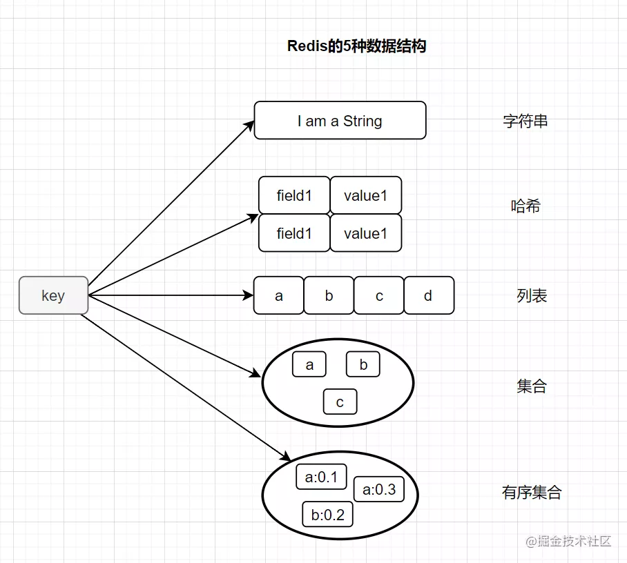
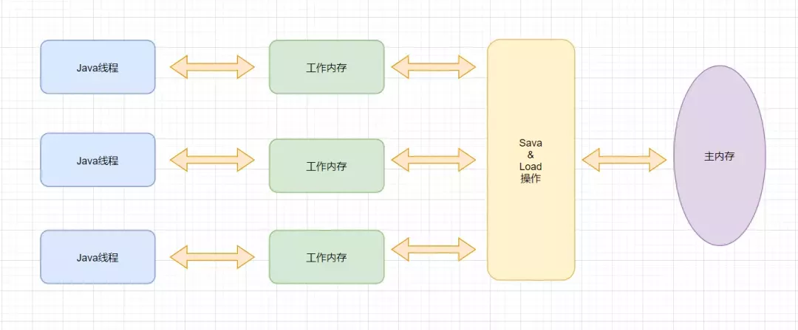
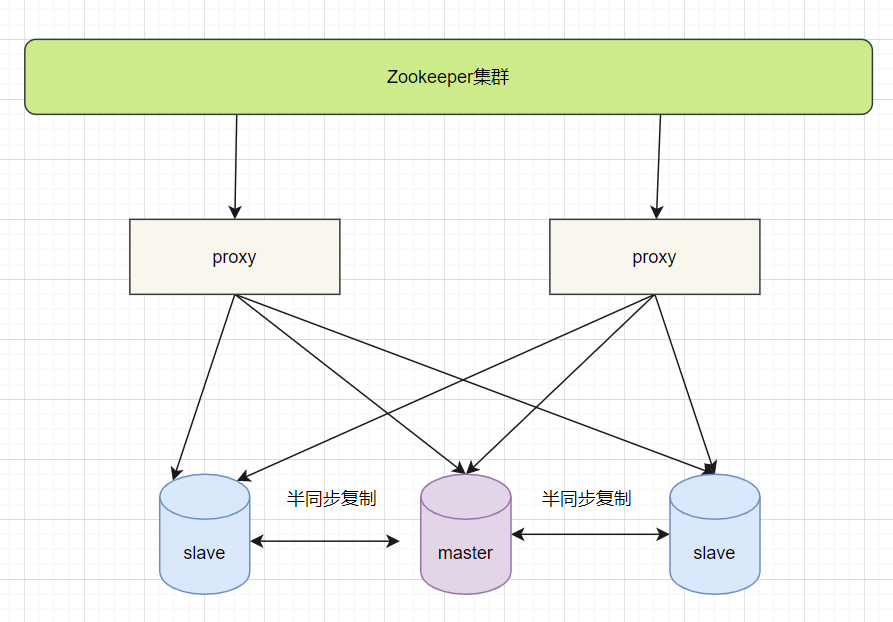
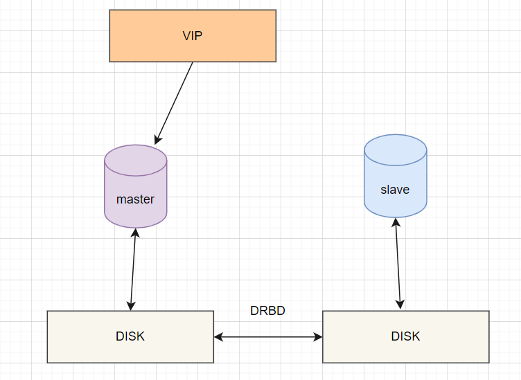
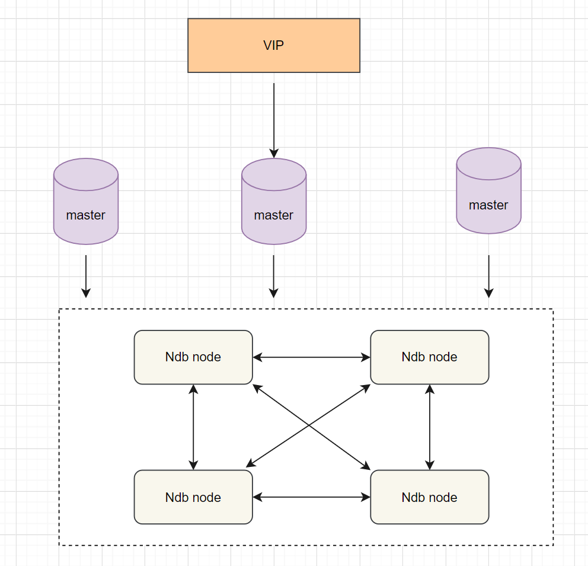
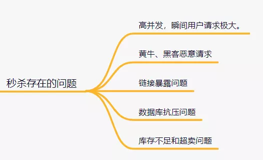
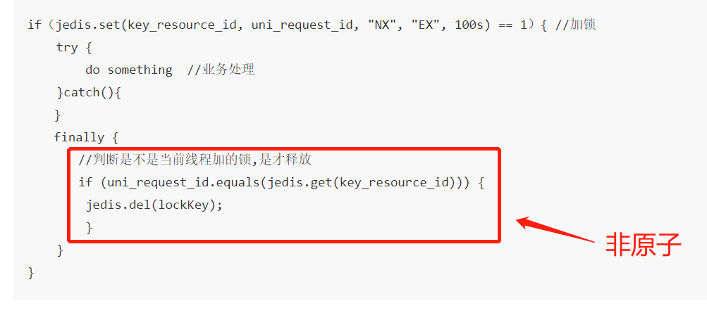
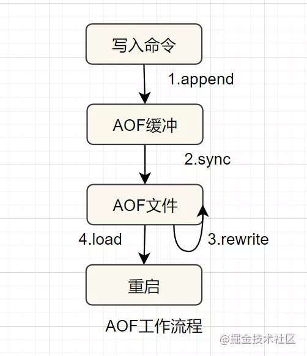
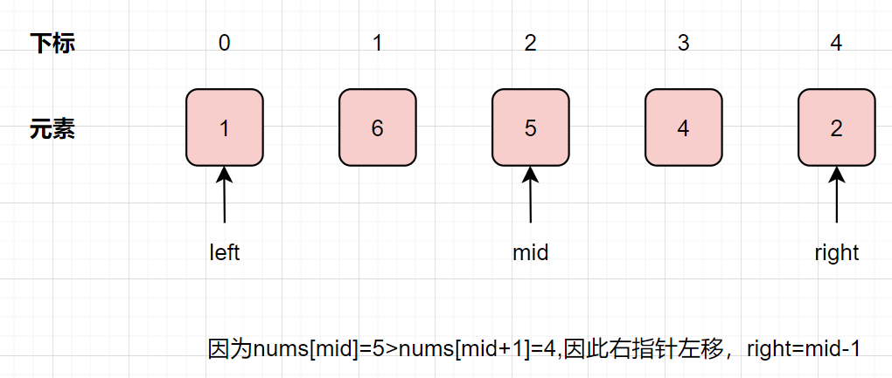
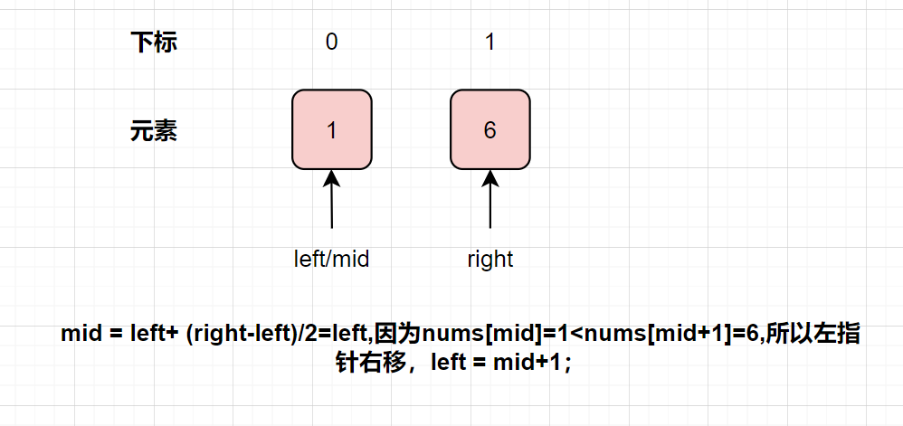

小伙伴们大家好，最近有位同学面试了字节（四年半工作经验），所以今天这篇文章给大家整理一下面试题，希望能给大家提供一个参考哈。

大家可以针对性地了解一下重点都在考察哪些知识点，篇幅比较长，也可以先收藏起来后续看。

1. 说说Redis为什么快
2. Redis有几种数据结构,底层分别是怎么存储的
3. Redis有几种持久化方式
4. 多线程情况下,如何保证线程安全？
5. 用过volatile吗？底层原理是？
6. MySQL的索引结构，聚簇索引和非聚簇索引的区别
7. MySQL有几种高可用方案，你们用的是哪一种
8. 说说你做过最有挑战性的项目
9. 秒杀采用什么方案
10. 聊聊分库分表，需要停服嘛
11. redis挂了怎么办？
12. 你怎么防止优惠券有人重复刷？
13. 抖音评论系统怎么设计
14. 怎么设计一个短链地址
15. 有一个数组，里面元素非重复，先升序再降序，找出里面最大的值

## 1.说说Redis为什么快


### 1.1 基于内存存储实现

内存读写是比在磁盘快很多的，Redis基于内存存储实现的数据库，相对于数据存在磁盘的MySQL数据库，省去磁盘I/O的消耗。

### 1.2 高效的数据结构

Mysql索引为了提高效率，选择了B+树的数据结构。其实合理的数据结构，就是可以让你的应用/程序更快。先看下Redis的数据结构&内部编码图：


#### 1.2.1 SDS简单动态字符串


- 字符串长度处理：Redis获取字符串长度，时间复杂度为O(1)，而C语言中，需要从头开始遍历，复杂度为O（n）;
- 空间预分配：字符串修改越频繁的话，内存分配越频繁，就会消耗性能，而SDS修改和空间扩充，会额外分配未使用的空间，减少性能损耗。
- 惰性空间释放：SDS 缩短时，不是回收多余的内存空间，而是free记录下多余的空间，后续有变更，直接使用free中记录的空间，减少分配。

#### 1.2.2 字典

Redis 作为 K-V 型内存数据库，所有的键值就是用字典来存储。字典就是哈希表，比如HashMap，通过key就可以直接获取到对应的value。而哈希表的特性，在O（1）时间复杂度就可以获得对应的值。

#### 1.2.3 跳跃表


- 跳跃表是Redis特有的数据结构，就是在链表的基础上，增加多级索引提升查找效率。
- 跳跃表支持平均 O（logN）,最坏 O（N）复杂度的节点查找，还可以通过顺序性操作批量处理节点。

### 1.3 合理的数据编码

Redis 支持多种数据类型，每种基本类型，可能对多种数据结构。什么时候,使用什么样数据结构，使用什么样编码，是redis设计者总结优化的结果。

- String：如果存储数字的话，是用int类型的编码;如果存储非数字，小于等于39字节的字符串，是embstr；大于39个字节，则是raw编码。
- List：如果列表的元素个数小于512个，列表每个元素的值都小于64字节（默认），使用ziplist编码，否则使用linkedlist编码
- Hash：哈希类型元素个数小于512个，所有值小于64字节的话，使用ziplist编码,否则使用hashtable编码。
- Set：如果集合中的元素都是整数且元素个数小于512个，使用intset编码，否则使用hashtable编码。
- Zset：当有序集合的元素个数小于128个，每个元素的值小于64字节时，使用ziplist编码，否则使用skiplist（跳跃表）编码

### 1.4 合理的线程模型

I/O 多路复用


多路I/O复用技术可以让单个线程高效的处理多个连接请求，而Redis使用用epoll作为I/O多路复用技术的实现。并且，Redis自身的事件处理模型将epoll中的连接、读写、关闭都转换为事件，不在网络I/O上浪费过多的时间。

## 2. Redis有几种数据结构，底层分别是怎么存储的

常用的，Redis有以下这五种基本类型：

- String（字符串）
- Hash（哈希）
- List（列表）
- Set（集合）
- zset（有序集合） 它还有三种特殊的数据结构类型
- Geospatial
- Hyperloglog
- Bitmap

### 2.1 Redis 的五种基本数据类型



**String（字符串）**

- 简介:String是Redis最基础的数据结构类型，它是二进制安全的，可以存储图片或者序列化的对象，值最大存储为512M
- 简单使用举例: set key value、get key等
- 应用场景：共享session、分布式锁，计数器、限流。
- 内部编码有3种，int（8字节长整型）/embstr（小于等于39字节字符串）/raw（大于39个字节字符串）

**Hash（哈希）**

- 简介：在Redis中，哈希类型是指v（值）本身又是一个键值对（k-v）结构
- 简单使用举例：hset key field value 、hget key field
- 内部编码：ziplist（压缩列表） 、hashtable（哈希表）
- 应用场景：缓存用户信息等。

**List（列表）**

- 简介：列表（list）类型是用来存储多个有序的字符串，一个列表最多可以存储2^32-1个元素。
- 简单实用举例：`lpush key value [value ...] 、lrange key start end`
- 内部编码：ziplist（压缩列表）、linkedlist（链表）
- 应用场景：消息队列，文章列表

**Set（集合）**

- 简介：集合（set）类型也是用来保存多个的字符串元素，但是不允许重复元素
- 简单使用举例：sadd key element [element ...]、smembers key
- 内部编码：intset（整数集合）、hashtable（哈希表）
- 应用场景：用户标签,生成随机数抽奖、社交需求。

**有序集合（zset）**

- 简介：已排序的字符串集合，同时元素不能重复
- 简单格式举例：`zadd key score member [score member ...]，zrank key member`
- 底层内部编码：ziplist（压缩列表）、skiplist（跳跃表）
- 应用场景：排行榜，社交需求（如用户点赞）。

### 2.2 Redis 的三种特殊数据类型

- Geo：Redis3.2推出的，地理位置定位，用于存储地理位置信息，并对存储的信息进行操作。
- HyperLogLog：用来做基数统计算法的数据结构，如统计网站的UV。
- Bitmaps ：用一个比特位来映射某个元素的状态，在Redis中，它的底层是基于字符串类型实现的，可以把bitmaps成作一个以比特位为单位的数组

## 3. Redis有几种持久化方式

Redis是基于内存的非关系型K-V数据库，既然它是基于内存的，如果Redis服务器挂了，数据就会丢失。为了避免数据丢失了，Redis提供了持久化，即把数据保存到磁盘。

Redis提供了RDB和AOF两种持久化机制，它持久化文件加载流程如下：


### 3.1 RDB

RDB，就是把内存数据以快照的形式保存到磁盘上。

> 什么是快照?可以这样理解，给当前时刻的数据，拍一张照片，然后保存下来。

RDB持久化，是指在指定的时间间隔内，执行指定次数的写操作，将内存中的数据集快照写入磁盘中，它是Redis默认的持久化方式。执行完操作后，在指定目录下会生成一个dump.rdb文件，Redis 重启的时候，通过加载dump.rdb文件来恢复数据。RDB触发机制主要有以下几种：


**RDB 的优点**

适合大规模的数据恢复场景，如备份，全量复制等

**RDB缺点**

- 没办法做到实时持久化/秒级持久化。
- 新老版本存在RDB格式兼容问题

### 3.2 AOF

AOF（append only file） 持久化，采用日志的形式来记录每个写操作，追加到文件中，重启时再重新执行AOF文件中的命令来恢复数据。它主要解决数据持久化的实时性问题。默认是不开启的。

AOF的工作流程如下：


**AOF的优点**

数据的一致性和完整性更高

**AOF的缺点**

AOF记录的内容越多，文件越大，数据恢复变慢。

## 4. 多线程情况下,如何保证线程安全？

加锁，比如悲观锁`select for update，sychronized`等，如，乐观锁，乐观锁如`CAS`等，还有`redis分布式锁`等等。

## 5. 用过volatile吗？它是如何保证可见性的，原理是什么

`volatile`关键字是Java虚拟机提供的的最轻量级的同步机制，它作为一个修饰符， 用来修饰变量。它保证变量对所有线程可见性，禁止指令重排，但是不保证原子性。

我们先来看下java内存模型（jmm）：

- Java虚拟机规范试图定义一种Java内存模型,来屏蔽掉各种硬件和操作系统的内存访问差异，以实现让Java程序在各种平台上都能达到一致的内存访问效果。
- Java内存模型规定所有的变量都是存在主内存当中，每个线程都有自己的工作内存。这里的变量包括实例变量和静态变量，但是不包括局部变量，因为局部变量是线程私有的。
- 线程的工作内存保存了被该线程使用的变量的主内存副本，线程对变量的所有操作都必须在工作内存中进行，而不能直接操作操作主内存。并且每个线程不能访问其他线程的工作内存。

volatile变量，保证新值能立即同步回主内存，以及每次使用前立即从主内存刷新，所以我们说volatile保证了多线程操作变量的可见性。

volatile保证可见性跟内存屏障有关。我们来看一段volatile使用的demo代码：

```java
public class Singleton {  
    private volatile static Singleton instance;  
    private Singleton (){}  
    public static Singleton getInstance() {  
    if (instance == null) {  
        synchronized (Singleton.class) {  
        if (instance == null) {  
            instance = new Singleton();  
        }  
        }  
    }  
    return instance;  
    }  
}  
```

编译后，对比有`volatile`关键字和没有`volatile`关键字时所生成的汇编代码，发现有`volatile`关键字修饰时，会多出一个`lock addl $0x0,(%esp)`，即多出一个lock前缀指令，lock指令相当于一个**内存屏障**

lock指令相当于一个内存屏障，它保证以下这几点：

1. 重排序时不能把后面的指令重排序到内存屏障之前的位置
2. 将本处理器的缓存写入内存
3. 如果是写入动作，会导致其他处理器中对应的缓存无效。

第2点和第3点就是保证volatile保证可见性的体现嘛

## 6. MySQL的索引结构，聚簇索引和非聚簇索引的区别

- 一个表中只能拥有一个聚集索引，而非聚集索引一个表可以存在多个。
- 索引是通过二叉树的数据结构来描述的，我们可以这么理解聚簇索引：索引的叶节点就是数据节点。而非聚簇索引的叶节点仍然是索引节点，只不过有一个指针指向对应的数据块。
- 聚集索引：物理存储按照索引排序；非聚集索引：物理存储不按照索引排序

## 7. MySQL有几种高可用方案，你们用的是哪一种

- 主从或主主半同步复制
- 半同步复制优化
- 高可用架构优化
- 共享存储
- 分布式协议

### 7.1 主从或主主半同步复制

用双节点数据库，搭建单向或者双向的半同步复制。架构如下：


通常会和proxy、keepalived等第三方软件同时使用，即可以用来监控数据库的健康，又可以执行一系列管理命令。如果主库发生故障，切换到备库后仍然可以继续使用数据库。

**这种方案优点**是架构、部署比较简单，主机宕机直接切换即可。**缺点**是完全依赖于半同步复制，半同步复制退化为异步复制，无法保证数据一致性；另外，还需要额外考虑**haproxy、keepalived**的高可用机制。

### 7.2 半同步复制优化

半同步复制机制是可靠的，可以保证数据一致性的。但是如果网络发生波动，半同步复制发生超时会切换为异步复制，异复制是无法保证数据的一致性的。因此，可以在半同复制的基础上优化一下，尽可能保证半同复制。如**双通道复制**方案


- 优点：这种方案架构、部署也比较简单，主机宕机也是直接切换即可。比方案1的半同步复制，更能保证数据的一致性。
- 缺点：需要修改内核源码或者使用mysql通信协议，没有从根本上解决数据一致性问题。

### 7.3 高可用架构优化

保证高可用，可以把主从双节点数据库扩展为数据库集群。Zookeeper可以作为集群管理，它使用分布式算法保证集群数据的一致性，可以较好的避免网络分区现象的产生。



- 优点：保证了整个系统的高可用性，扩展性也较好，可以扩展为大规模集群。
- 缺点：数据一致性**仍然依赖于原生的mysql半同步复制**；引入Zookeeper使系统逻辑更复杂。

### 7.4 共享存储

> 共享存储实现了数据库服务器和存储设备的解耦，不同数据库之间的数据同步不再依赖于MySQL的原生复制功能，而是通过磁盘数据同步的手段，来保证数据的一致性。

**DRBD磁盘复制**

DRBD是一个用软件实现的、无共享的、服务器之间镜像块设备内容的存储复制解决方案。主要用于对服务器之间的磁盘、分区、逻辑卷等进行数据镜像，当用户将数据写入本地磁盘时，还会将数据发送到网络中另一台主机的磁盘上，这样的本地主机(主节点)与远程主机(备节点)的数据就可以保证实时同步。常用架构如下：



当本地主机出现问题，远程主机上还保留着一份相同的数据，即可以继续使用，保证了数据的安全。

- 优点：部署简单，价格合适，保证数据的强一致性
- 缺点：对IO性能影响较大，从库不提供读操作

### 7.5 分布式协议

分布式协议可以很好解决数据一致性问题。常见的部署方案就是**MySQL cluster**，它是官方集群的部署方案，通过使用NDB存储引擎实时备份冗余数据，实现数据库的高可用性和数据一致性。如下：



- 优点：不依赖于第三方软件，可以实现数据的强一致性；
- 缺点：配置较复杂；需要使用NDB储存引擎；至少三节点；

## 8. 说说你做过最有挑战性的项目, 你负责那个模块,哪些最有挑战性，说说你做了哪些优化

项目这块的话，大家可以结合自己实际做的项目说哈。也可以加我微信，跟我一起交流哈，加油加油。

## 9.秒杀采用什么方案。

设计一个秒杀系统，需要考虑这些问题：



**如何解决这些问题呢？**

- 页面静态化
- 按钮至灰控制
- 服务单一职责
- 秒杀链接加盐
- 限流
- 分布式锁
- MQ异步处理
- 限流&降级&熔断

### 9.1 页面静态化

秒杀活动的页面，大多数内容都是固定不变的，如商品名称，商品图片等等，可以对活动页面做静态化处理，减少访问服务端的请求。秒杀用户会分布在全国各地，有的在上海，有的在深圳，地域相差很远，网速也各不相同。为了让用户最快访问到活动页面，可以使用CDN（Content Delivery Network，内容分发网络）。CDN可以让用户就近获取所需内容。

### 9.2 按钮至灰控制

秒杀活动开始前，按钮一般需要置灰的。只有时间到了，才能变得可以点击。这是防止，秒杀用户在时间快到的前几秒，疯狂请求服务器，然后秒杀时间点还没到，服务器就自己挂了。

### 9.3 服务单一职责

我们都知道微服务设计思想，也就是把各个功能模块拆分，功能那个类似的放一起，再用分布式的部署方式。

> 如用户登录相关的，就设计个用户服务，订单相关的就搞个订单服务，再到礼物相关的就搞个礼物服务等等。那么，秒杀相关的业务逻辑也可以放到一起，搞个秒杀服务，单独给它搞个秒杀数据库。” 服务单一职责有个好处：如果秒杀没抗住高并发的压力，秒杀库崩了，服务挂了，也不会影响到系统的其他服务。

### 9.4 秒杀链接加盐

链接如果明文暴露的话，会有人获取到请求Url，提前秒杀了。因此，需要给秒杀链接加盐。可以把URL动态化，如通过MD5加密算法加密随机的字符串去做url。

### 9.5 限流

一般有两种方式限流：nginx限流和redis限流。

- 为了防止某个用户请求过于频繁，我们可以对同一用户限流；
- 为了防止黄牛模拟几个用户请求，我们可以对某个IP进行限流；
- 为了防止有人使用代理，每次请求都更换IP请求，我们可以对接口进行限流。
- 为了防止瞬时过大的流量压垮系统，还可以使用阿里的Sentinel、Hystrix组件进行限流。

### 9.6 分布式锁

可以使用redis分布式锁解决超卖问题。

使用Redis的SET EX PX NX + 校验唯一随机值,再删除释放锁。

```java
if（jedis.set(key_resource_id, uni_request_id, "NX", "EX", 100s) == 1）{ //加锁
    try {
        do something  //业务处理
    }catch(){
  }
  finally {
       //判断是不是当前线程加的锁,是才释放
       if (uni_request_id.equals(jedis.get(key_resource_id))) {
        jedis.del(lockKey); //释放锁
        }
    }
}
```

在这里，判断是不是当前线程加的锁和释放锁不是一个原子操作。如果调用jedis.del()释放锁的时候，可能这把锁已经不属于当前客户端，会解除他人加的锁。



为了更严谨，一般也是用lua脚本代替。lua脚本如下：

```java
if redis.call('get',KEYS[1]) == ARGV[1] then 
   return redis.call('del',KEYS[1]) 
else
   return 0
end;
```

### 9.7 MQ异步处理

如果瞬间流量特别大，可以使用消息队列削峰，异步处理。用户请求过来的时候，先放到消息队列，再拿出来消费。

### 9.8 限流&降级&熔断

- 限流，就是限制请求，防止过大的请求压垮服务器；
- 降级，就是秒杀服务有问题了，就降级处理，不要影响别的服务；
- 熔断，服务有问题就熔断，一般熔断降级是一起出现。

## 10. 聊聊分库分表,分表为什么要停服这种操作，如果不停服可以怎么做

### 10.1 分库分表方案

- 水平分库：以字段为依据，按照一定策略（hash、range等），将一个库中的数据拆分到多个库中。
- 水平分表：以字段为依据，按照一定策略（hash、range等），将一个表中的数据拆分到多个表中。
- 垂直分库：以表为依据，按照业务归属不同，将不同的表拆分到不同的库中。
- 垂直分表：以字段为依据，按照字段的活跃性，将表中字段拆到不同的表（主表和扩展表）中。

### 10.2 常用的分库分表中间件：

- sharding-jdbc（当当）
- Mycat
- TDDL（淘宝）
- Oceanus(58同城数据库中间件)
- vitess（谷歌开发的数据库中间件）
- Atlas(Qihoo 360)

### 10.3 分库分表可能遇到的问题

- 事务问题：需要用分布式事务啦
- 跨节点Join的问题：解决这一问题可以分两次查询实现
- 跨节点的count,order by,group by以及聚合函数问题：分别在各个节点上得到结果后在应用程序端进行合并。
- 数据迁移，容量规划，扩容等问题
- ID问题：数据库被切分后，不能再依赖数据库自身的主键生成机制啦，最简单可以考虑UUID
- 跨分片的排序分页问题（后台加大pagesize处理？）

### 10.4 分表要停服嘛？不停服怎么做？

不用。不停服的时候，应该怎么做呢，分五个步骤：

1. 编写代理层，加个开关（控制访问新的DAO还是老的DAO，或者是都访问），灰度期间，还是访问老的DAO。
2. 发版全量后，开启双写，既在旧表新增和修改，也在新表新增和修改。日志或者临时表记下新表ID起始值，旧表中小于这个值的数据就是存量数据，这批数据就是要迁移的。
3. 通过脚本把旧表的存量数据写入新表。
4. 停读旧表改读新表，此时新表已经承载了所有读写业务，但是这时候不要立刻停写旧表，需要保持双写一段时间。
5. 当读写新表一段时间之后，如果没有业务问题，就可以停写旧表啦

## 11. redis挂了怎么办？

Redis是基于内存的非关系型K-V数据库，既然它是基于内存的，如果Redis服务器挂了，数据就会丢失。为了避免数据丢失了，Redis提供了持久化，即把数据保存到磁盘。

Redis提供了**RDB和AOF**两种持久化机制，它持久化文件加载流程如下：


### 11.1 RDB

RDB，就是把内存数据以快照的形式保存到磁盘上。

**什么是快照?** 可以这样理解，给当前时刻的数据，拍一张照片，然后保存下来。

**RDB持久化**，是指在指定的时间间隔内，执行指定次数的写操作，将内存中的数据集快照写入磁盘中，它是Redis默认的持久化方式。执行完操作后，在指定目录下会生成一个dump.rdb文件，Redis 重启的时候，通过加载dump.rdb文件来恢复数据。RDB触发机制主要有以下几种：


**RDB 的优点**

- 适合大规模的数据恢复场景，如备份，全量复制等

**RDB缺点**

- 没办法做到实时持久化/秒级持久化。
- 新老版本存在RDB格式兼容问题

### 11.2 AOF

AOF（append only file） 持久化，采用日志的形式来记录每个写操作，追加到文件中，重启时再重新执行AOF文件中的命令来恢复数据。它主要解决数据持久化的实时性问题。默认是不开启的。

AOF的工作流程如下：



**AOF的优点**

- 数据的一致性和完整性更高

**AOF的缺点**

- AOF记录的内容越多，文件越大，数据恢复变慢。

## 12.你怎么防止优惠券有人重复刷？

对于重复请求，要考虑**接口幂等**和**接口防重**。

防刷的话，可以限流以及加入黑名单处理。

- 为了防止某个用户请求优惠券过于频繁，我们可以对同一用户限流。
- 为了防止黄牛等模拟几个用户请求，我们可以对某个IP进行限流。
- 为了防止有人使用代理，每次请求都更换IP请求，我们可以对接口进行限流。

## 13. 抖音评论系统怎么设计，如果加入好友关系呢？

需要考虑性能，以及可扩展性。大家平时有没有做过评论、好友关注等项目需求呀，发挥你聪明的小脑袋瓜，怎么去回答好这道题吧。

## 14. 怎么设计一个短链地址，要考虑跨机房部署问题

### 14.1 为什么需要短连接？

为什么需要**短连接**呢？长链接不香吗？因为有些平台有**长度限制**，并且**链接太长容易被识别**为超链接等等。

### 14.2 短链接的原理

其实就是一个**302重定向**而已。


302状态码表示**临时重定向**。

### 14.3 短链接生成的方法

可以用哈希算法生成短链，但是会存在**哈希冲突**。怎么解决呢？可以用布隆过滤器。

有没有别的方案？自增序列算法，每次收到一个长链时，就分配一个ID，并转成62进制拼接到短域后面。因为高并发下，ID 自增生成器可能成为瓶颈。

一般有四种分布式ID生成方法：

1. uuid，它保证对在同一时空中的所有机器都是唯一的，但是这种方式生成的id比较长，并且是无序的，插入浪费空间。
2. Snowflake雪花算法，这种方案不错，但是如果某台机器的系统时钟回拨，有可能造成ID冲突重复，或者ID乱序（考虑跨机房部署问题）
3. Mysql 自增主键，在高并发下，db的写压力会很大
4. 用Redis做自增id生成器，性能高，但要考虑持久性的问题；或者改造雪花算法，通过改造workId解决时钟回拨的问题）

## 15.有一个整型数组，数组元素不重复，数组元素先升序后降序，找出最大值。

> 例如：1,3,5,7,9,8,6,4,2，请写一个函数找出数组最大的元素

这道题大家都会觉得很简单，因为用快速排序排一下，时间复杂是O(nlgn)，面试官可能不是很满意。其实可以用二分查找法，只要找到升序最后一个元素即可。

我们以`1,6,5,4,2`为例子，用二分法图解一下哈：


如何用二分法缩小空间呢？只要比较中间元素与其下一个元素大小即可

> 1. 如果中间元素大于其下一个元素大小，证明最大值在左侧，因此右指针左移
> 2. 如果中间元素小于其下一个元素大小，证明最大值在左侧，因此右指针左移

因为`nums[mid]=5>nums[mid+1]=4`,因此右指针左移，`right=mid-1=2-1=1`



`mid = left+ (right-left)/2=left=0`,因为`nums[mid]=1<nums[mid+1]=6`,所以左指针右移，`left = mid+1=1`；



最后得出最大值是`nums[left] =nums[1]=6`

实现代码如下：

```java
class Solution {

    public static void main(String[] args) {

        int[] nums = {1,3,5,7,9,8,6,4,2};
        System.out.println(getLargestNumInArray(nums));
    }

    private static int getLargestNumInArray(int[] nums) {
        if (nums == null || nums.length == 0) {
            return -1;
        }

        int left = 0, right = nums.length - 1;
        while (left <= right) {
            int mid = left + ((right - left) / 2);
            if (nums[mid] < nums[mid + 1]) {
                left = mid + 1;
            } else {
                right = mid - 1;
            }
        }

        return nums[left];
    }
}
```

以上，希望这篇文章大家有所收获，我们下篇见。