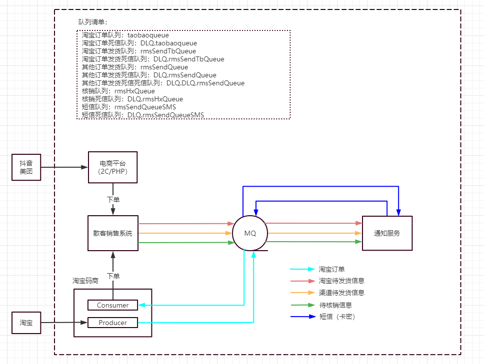
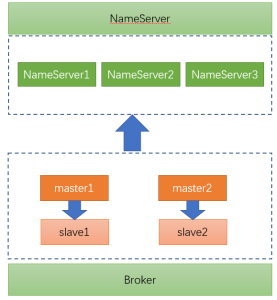

# 爱康MQ升级设计文档

# 问题描述

ActiveMQ集群内存溢出导致散客系统不可用

# 业务流程

# ActiveMQ架构

activeMQ服务器：192.168.2.40、192.168.2.41、192.168.2.42

版本：5.15.2

集群模式：一主两从

延迟消费：

   次数：6次

   时间间隔：20s、40s、60s、60s、60s、60s

客户端消费模式

  从服务器端向连接的客户端进行消息推送

消息持久化模式

 mysql数据库保存。本地内存缓存消息队列数据。 

# RocketMQ架构

RocketMQ服务器：

  nameServer：

   nameServer1：10.33.0.41

   nameServer2：10.33.0.42

   nameServer3：10.33.0.43

  broker：

   master1：10.33.0.44

   slave1：  10.33.0.45

   master2：10.33.0.46

   slave2：  10.33.0.47

版本：4.7.1

集群模式：2m-2s-sync

延迟消费：

  默认消费端拉取数据失败重试16次。对于RMS应用，可以设置 6次 ，保证应用数据消费的高可用。

  时间间隔：1s 5s 10s 30s 1m 2m

  延迟等级为3~18。(messageDelayLevel = "1s 5s 10s 30s 1m 2m 3m 4m 5m 6m 7m 8m 9m 10m 20m 30m 1h 2h")

客户端消费模式

  客户端从服务器拉取数据

消息持久化模式

 数据持久化在磁盘，内存中不存储大量的未消费的数据。 

# ActiveMQ缺点

1、ActiveMQ为消息推送模式，对服务器端压力较大。

2、ActiveMQ会丢失数据

3、目前社区不活跃，且对 5.x 维护较少； Activemq 不适合用于上千个队列的应用场景

# 选用RocketMQ原因

ActiveMQ 和 RocketMQ的实现机制不同。RocketMQ更适合大量并发操作消息存储。

ActiveMQ为消息推送模式，对服务器端压力较大。RocketMQ服务器端只是客户端连接和数据保存，不使用额外的数据库等存储方式，服务器压力小，适合高并发和大量数据保存。

ActiveMQ支持的重试队列、延迟队列、死信队列功能，在RocketMQ都包含，并且RocketMQ支持更多的功能，如分布式事务，消息追踪等。

RocketMQ源代码可以下载编译，出现问题时可以通过源码进行跟踪问题。

RocketMQ在体检云系统中以使用，从21年5月份到现在，线上没有发生事故，通过控制台监控RocketMQ系统资源占用不高。

研发代码从ActiveMQ更改为RocketMQ不需要更改业务，只需引入jar包，定义Producer和Consumer。

# 系统影响

RocketMQ同样支持ActiveMQ的重试队列、延迟队列、死信队列功能，因此更换不需要更改业务代码，仅修改配置即可。