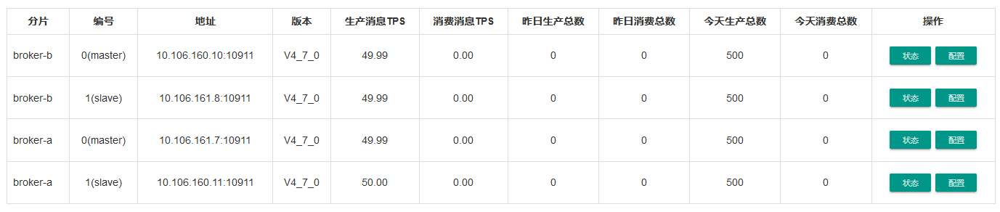

# RocketMQ容灾


目前最新版本号: 4.7.1

当前实验环境版本：4.7.0

# 简介

### 集群模式：

- 多Master模式
- 多Master多Slave模式-异步复制
- 多Master多Slave模式-同步双写
- dledger group 


### 各集群模式优缺点：

#### 多Master模式

一个集群无Slave，全是Master，例如2个Master或者3个Master，这种模式的优缺点如下：

- 优点：配置简单，单个Master宕机或重启维护对应用无影响，在磁盘配置为RAID10时，即使机器宕机不可恢复情况下，由于RAID10磁盘非常可靠，消息也不会丢（异步刷盘丢失少量消息，同步刷盘一条不丢），性能最高；
- 缺点：单台机器宕机期间，这台机器上未被消费的消息在机器恢复之前不可订阅，消息实时性会受到影响。


#### 多Master多Slave模式-异步复制

每个Master配置一个Slave，有多对Master-Slave，HA采用异步复制方式，主备有短暂消息延迟（毫秒级），这种模式的优缺点如下：

- 优点：即使磁盘损坏，消息丢失的非常少，且消息实时性不会受影响，同时Master宕机后，消费者仍然可以从Slave消费，而且此过程对应用透明，不需要人工干预，性能同多Master模式几乎一样；
- 缺点：Master宕机，磁盘损坏情况下会丢失少量消息。


#### 多Master多Slave模式-同步双写

每个Master配置一个Slave，有多对Master-Slave，HA采用同步双写方式，即只有主备都写成功，才向应用返回成功，这种模式的优缺点如下：

- 优点：数据与服务都无单点故障，Master宕机情况下，消息无延迟，服务可用性与数据可用性都非常高；
- 缺点：性能比异步复制模式略低（大约低10%左右），发送单个消息的RT会略高，且目前版本在主节点宕机后，备机不能自动切换为主机。


#### dledger group 

- 自动容灾切换，并保证数据一致
- 可以水平扩展的，也即可以部署任意多个 RocketMQ-on-DLedger Group 同时对外提供服务。


# 容灾环境

验证模式：双主双从同步双写

共有两种实施方式：

1. 两主Ａ，Ｂ在一机房(Data Center 1)，两从Ａ-s,B-s在一机房(Data Center 2)。
2. A主，Ｂ-s 在一机房(Data Center 1)，Ｂ主，Ａ-s 在一机房(Data Center 2)。

## 方案一 ：人工主备方案

如下图所示，

因为存在当Data Center 1 失败的情况下，业务全部切为只读（只能处理，不能生产）；但当Data Center 2 失败的情况下，业务无影响。

NameServers: 10.106.161.7, 10.106.161.8, 10.106.160.10, 10.106.160.11 

Master A: 10.106.161.7 （奇数ip)

Master A slave: 10.106.160.11（奇数ip)

Master B: 10.106.161.8（偶数ip)

Master B slave: 10.106.160.10（偶数ip)

rocketMQ console: [http://10.106.161.7:8080](http://10.106.161.7:8080/#/)


##### 1）启动NameServer

```
### 首先启动Name Server 四节点：10.106.161.7, 10.106.161.8, 10.106.160.10, 10.106.160.11 $ cd /opt/rocketmq
$ nohup sh bin/mqnamesrv > /dev/null 2>&1 &
 
### 验证Name Server 是否启动成功
$ tail -f ~/logs/rocketmqlogs/namesrv.log$ tail -f /root/logs/rocketmqlogs/namesrv.log
The Name Server boot success...
```

##### 2）启动Broker集群

```
### 在机器10.106.161.7，启动第一个Master，例如NameServer的IP为：10.106.161.7:9876;10.106.161.8:9876;10.106.160.10:9876;10.106.160.11:9876
$ nohup sh bin/mqbroker  -c $ROCKETMQ_HOME/conf/2m-2s-sync/broker-a.properties > /dev/null 2>&1 &### 在机器10.106.161.8，启动第二个Master，例如NameServer的IP为：10.106.161.7:9876;10.106.161.8:9876;10.106.160.10:9876;10.106.160.11:9876 $ nohup sh bin/mqbroker -c $ROCKETMQ_HOME/conf/2m-2s-sync/broker-b.properties > /dev/null 2>&1 &
 
### 在机器10.106.160.10，启动第二个Slave，例如NameServer的IP为：10.106.161.7:9876;10.106.161.8:9876;10.106.160.10:9876;10.106.160.11:9876
$ nohup sh bin/mqbroker  -c $ROCKETMQ_HOME/conf/2m-2s-sync/broker-b-s.properties > /dev/null 2>&1 &
 
### 在机器10.106.160.11，启动第一个Slave，例如NameServer的IP为：10.106.161.7:9876;10.106.161.8:9876;10.106.160.10:9876;10.106.160.11:9876
$ nohup sh bin/mqbroker  -c $ROCKETMQ_HOME/conf/2m-2s-sync/broker-a-s.properties > /dev/null 2>&1 &
 
```

监控视图


```

#Cluster Name     #Broker Name            #BID  #Addr                  #Version                #InTPS(LOAD)       #OutTPS(LOAD) #PCWait(ms) #Hour #SPACE
DefaultCluster    broker-a                0     10.106.161.7:10911     V4_7_0                   0.00(0,0ms)         0.00(0,0ms)          0 443864.77 0.1172
DefaultCluster    broker-a                1     10.106.160.11:10911    V4_7_0                   0.00(0,0ms)         0.00(0,0ms)          0 443864.77 0.0820
DefaultCluster    broker-b                0     10.106.161.8:10911     V4_7_0                   0.00(0,0ms)         0.00(0,0ms)          0 443864.77 0.0793
DefaultCluster    broker-b                1     10.106.160.10:10911    V4_7_0                   0.00(0,0ms)         0.00(0,0ms)          0 443864.77 0.0926
[root@vm1618 /opt/rocketmq/bin]$
```

### 容灾实验

### 0、验证console 配置

启动参数增加namesrvAddr 一侧中心冗机，另一侧存活的情况下，console 可以正常访问。

--rocketmq.config.namesrvAddr="10.106.161.7:9876;10.106.161.8:9876;10.106.160.10:9876;10.106.160.11:9876"

### 1､正常情况下的收发

### 2､ 数据中心2侧(从)失败,1侧（主）存活

结论：不影响业务，收发正常

### 3､ 数据中心1侧（1主）失败,2侧(从)存活

结论：不影响业务，收发正常

### 4､ 数据中心1侧（2主）失败,2侧(从)存活

验证过程：

1. 环境恢复正常，不收消息(停consumer), 发消息1000条, Ａ侧冗机，
2. 验是否能收消息，验是否能发消息。

操作：发消息1000条监控如下图：


注：发1000条消息，主Ａ500, 主Ｂ500；从ＡＢ各500备份。

操作：冗主节点


操作：启动消费者


注：消息被正常消费。

但生产者已经不能生产消息了。

```
[root@test-vm18 /opt/rocketmq]$sh bin/tools.sh org.apache.rocketmq.example.quickstart.Producer
17:24:37.750 [main] DEBUG i.n.u.i.l.InternalLoggerFactory - Using SLF4J as the default logging framework
RocketMQLog:WARN No appenders could be found for logger (io.netty.util.internal.PlatformDependent0).
RocketMQLog:WARN Please initialize the logger system properly.
17:24:38.041 [NettyClientSelector_1] INFO RocketmqRemoting - closeChannel: close the connection to remote address[] result: true
17:24:38.048 [NettyClientSelector_1] INFO RocketmqRemoting - closeChannel: close the connection to remote address[] result: true
org.apache.rocketmq.client.exception.MQClientException: No route info of this topic: TopicTest
See http://rocketmq.apache.org/docs/faq/ for further details.
at org.apache.rocketmq.client.impl.producer.DefaultMQProducerImpl.sendDefaultImpl(DefaultMQProducerImpl.java:685)
at org.apache.rocketmq.client.impl.producer.DefaultMQProducerImpl.send(DefaultMQProducerImpl.java:1343)
at org.apache.rocketmq.client.impl.producer.DefaultMQProducerImpl.send(DefaultMQProducerImpl.java:1289)
at org.apache.rocketmq.client.producer.DefaultMQProducer.send(DefaultMQProducer.java:325)
at org.apache.rocketmq.example.quickstart.Producer.main(Producer.java:67)
```

结论：只能收，不能发

### 5､ 验证恢复A侧（主）后，会不会重复消费

操作：启动Ａ侧主节点

结论：不会，主节点重启后，监控显示生产记录为0,已经被从节点消费了。


## 方案二：人工双活方案

如下图，此方案为交叉布署，任何机房失败，不影响业务


NameServers: 10.106.161.7, 10.106.161.8, 10.106.160.10, 10.106.160.11 

Master A: 10.106.161.7 （奇数ip)

Master A slave: 10.106.160.11（奇数ip)

Master B: 10.106.161.10（偶数ip)

Master B slave: 10.106.160.8（偶数ip)

rocketMQ console: [http://10.106.161.7:8080](http://10.106.161.7:8080/#/)


图示如下：


监控视图


##### 1）启动NameServer

```
### 首先启动Name Server 四节点：10.106.161.7, 10.106.161.8, 10.106.160.10, 10.106.160.11 $ cd /opt/rocketmq
$ nohup sh bin/mqnamesrv > /dev/null 2>&1 &
 
### 验证Name Server 是否启动成功
$ tail -f ~/logs/rocketmqlogs/namesrv.log$ tail -f /root/logs/rocketmqlogs/namesrv.log
The Name Server boot success...
```


##### 2）启动Broker集群

```
### 在机器10.106.161.7，启动第一个Master，例如NameServer的IP为：10.106.161.7:9876;10.106.161.8:9876;10.106.160.10:9876;10.106.160.11:9876
$ nohup sh bin/mqbroker  -c $ROCKETMQ_HOME/conf/2m-2s-sync/broker-a.properties > /dev/null 2>&1 &
 
### 在机器10.106.160.10，启动第二个Master，例如NameServer的IP为：10.106.161.7:9876;10.106.161.8:9876;10.106.160.10:9876;10.106.160.11:9876
$ nohup sh bin/mqbroker  -c $ROCKETMQ_HOME/conf/2m-2s-sync/broker-b.properties > /dev/null 2>&1 &
 
### 在机器10.106.160.11，启动第一个Slave，例如NameServer的IP为：10.106.161.7:9876;10.106.161.8:9876;10.106.160.10:9876;10.106.160.11:9876
$ nohup sh bin/mqbroker  -c $ROCKETMQ_HOME/conf/2m-2s-sync/broker-a-s.properties > /dev/null 2>&1 &
 
### 在机器10.106.161.8，启动第二个Slave，例如NameServer的IP为：10.106.161.7:9876;10.106.161.8:9876;10.106.160.10:9876;10.106.160.11:9876
$ nohup sh bin/mqbroker  -c $ROCKETMQ_HOME/conf/2m-2s-sync/broker-b-s.properties > /dev/null 2>&1 &
```

以上Broker与Slave配对是通过指定相同的BrokerName参数来配对，Master的BrokerId必须是0，Slave的BrokerId必须是大于0的数。另外一个Master下面可以挂载多个Slave，同一Master下的多个Slave通过指定不同的BrokerId来区分。$ROCKETMQ_HOME指的RocketMQ安装目录，需要用户自己设置此环境变量。

\# 查看启动日志

$ tail -f ~/logs/rocketmqlogs/broker.log

$ tail -f /root/logs/rocketmqlogs/broker.log

./mqadmin clusterList -n 10.106.161.8:9876

```
#Cluster Name     #Broker Name            #BID  #Addr                  #Version                #InTPS(LOAD)       #OutTPS(LOAD) #PCWait(ms) #Hour #SPACE
DefaultCluster    broker-a                0     10.106.161.7:10911     V4_7_0                   0.00(0,0ms)         0.00(0,0ms)          0 443528.34 0.0959
DefaultCluster    broker-a                1     10.106.160.11:10911    V4_7_0                   0.00(0,0ms)         0.00(0,0ms)          0 443528.34 0.0734
DefaultCluster    broker-b                0     10.106.160.10:10911    V4_7_0                   0.00(0,0ms)         0.00(0,0ms)          0 443528.34 0.0828
DefaultCluster    broker-b                1     10.106.161.8:10911     V4_7_0                   0.00(0,0ms)         0.00(0,0ms)          0 443528.34 0.0785

```


### 容灾实验

### 0、验证console 配置

启动参数增加namesrvAddr 一侧中心冗机，另一侧存活的情况下，console 可以正常访问。

--rocketmq.config.namesrvAddr="10.106.161.7:9876;10.106.161.8:9876;10.106.160.10:9876;10.106.160.11:9876"


### 1､正常情况下的收发

启动接收消息的消费者

sh bin/tools.sh org.apache.rocketmq.example.quickstart.Consumer

启动发送消息的生产者

sh bin/tools.sh org.apache.rocketmq.example.quickstart.Producer

### 2､ 双活数据中心A侧失败,B侧存活，收发正常

将10.106.161.7，10.106.161.8 上的name server , broker 全部kill 掉，看是否可以正常收发消息。

2.1 发送1000条消息过程中，A侧机房失败。


发1000条，收1000条，（其中的128条为在宕机之前已经接收完毕）

2.2 在A侧宕机情况下，再发1000条消息。


收发正常，注意，“1 ” slave 的接收消息，要注意数据 处理的幂等性处理。


10.18.18.18 做为客户端：

export NAMESRV_ADDR="10.106.161.7:9876;10.106.161.8:9876;10.106.160.10:9876;10.106.160.11:9876"

一个窗口启动消费，
sh bin/tools.sh org.apache.rocketmq.example.quickstart.Consumer

一个窗口启动生产，

sh bin/tools.sh org.apache.rocketmq.example.quickstart.Producer

### 3､ 恢复A侧所有节点,B侧存活，收发正常


将10.106.161.7，10.106.161.8 上的name server , broker 全部恢复，

10.18.18.18 做为客户端：

export NAMESRV_ADDR="10.106.161.7:9876;10.106.161.8:9876;10.106.160.10:9876;10.106.160.11:9876"

一个窗口启动消费，
sh bin/tools.sh org.apache.rocketmq.example.quickstart.Consumer

一个窗口启动生产，

sh bin/tools.sh org.apache.rocketmq.example.quickstart.Producer

### 4､双活数据中心Ｂ侧失败,Ａ侧存活，收发正常

将10.106.161.10，10.106.161.11 上的name server , broker 全部kill 掉，看是否可以正常收发消息。


10.18.18.18 做为客户端：

export NAMESRV_ADDR="10.106.161.7:9876;10.106.161.8:9876;10.106.160.10:9876;10.106.160.11:9876"

一个窗口启动消费，
sh bin/tools.sh org.apache.rocketmq.example.quickstart.Consumer

一个窗口启动生产，

sh bin/tools.sh org.apache.rocketmq.example.quickstart.Producer


同理，与A侧失败一样，收发正常。


### 4､ 恢复B侧所有节点


10.106.160.10;10.106.160.11

注意： 11 为从节点，会收到宕机之后的 324条失步数据。发1000条消息，看这部分数据 是否重启消费。

当发1000条消息时，报异常

```
org.apache.rocketmq.client.exception.MQClientException: No route info of this topic: TopicTest
See http://rocketmq.apache.org/docs/faq/ for further details.
at org.apache.rocketmq.client.impl.producer.DefaultMQProducerImpl.sendDefaultImpl(DefaultMQProducerImpl.java:685)
at org.apache.rocketmq.client.impl.producer.DefaultMQProducerImpl.send(DefaultMQProducerImpl.java:1343)
at org.apache.rocketmq.client.impl.producer.DefaultMQProducerImpl.send(DefaultMQProducerImpl.java:1289)
at org.apache.rocketmq.client.producer.DefaultMQProducer.send(DefaultMQProducer.java:325)
at org.apache.rocketmq.example.quickstart.Producer.main(Producer.java:67)
```

重新连接 ，可正常发送。

说明: 当数据 中心 宕机重启后，有造成应用不能发消息的情况，应用需要重启。

结果 ，收发正常，无消息丢失。无多余消费。


### 5､ 在集群所有节点正常情况下预发数据不消费，冗机Ａ侧或Ｂ侧，看是否能收到积压消息。

宕机之前：



宕机A侧之后，再收消息：


结果：能收到1000条消息，但有取不到消息情况，需要重新启动后才可以消费消息。


收消息过程中... 宕机A侧：

准备了2万条消息，未宕机分片显示收走1万，实际客户端显示，收到:21910条消息，要注意消息处理的幂等性处理。

### 6､ 在集群A侧冗机情况下预发数据1000条，不消费，恢复Ａ侧，然后再收消息看是否正常。

可以，因为可以从B侧主节点消费。


备忘：

双机房的网络带宽100M

每个机房对外的带宽多大？


## 方案三 ：自动主备方案


自动切换主备

namesrvAddr=10.106.161.7:9876;10.106.161.8:9876;10.106.160.10:9876;10.106.160.11:9876

dLegerPeers=n0-10.106.161.7:40911;n1-10.106.161.8:40912;n2-10.106.160.10:40913

10.106.161.7

nohup sh bin/mqbroker -c conf/dledger/broker-n0.conf &

10.106.161.8

nohup sh bin/mqbroker -c conf/dledger/broker-n1.conf &

10.106.160.10

nohup sh bin/mqbroker -c conf/dledger/broker-n2.conf &


正常收发


只发不收，down 7，接收


从 10 节点收。


## 方案四 ：自动双活方案


namesrvAddr=10.106.161.7:9876;10.106.161.8:9876;10.106.161.9:9876;10.106.160.10:9876;10.106.160.11:9876;10.106.160.12:9876;

dLegerPeers=n0-10.106.161.7:40911;n1-10.106.161.8:40912;n2-10.106.160.10:40913

10.106.161.7

nohup sh bin/mqbroker -c conf/dledger/broker-n0.conf &

10.106.161.8

nohup sh bin/mqbroker -c conf/dledger/broker-n1.conf &

10.106.160.10

nohup sh bin/mqbroker -c conf/dledger/broker-n2.conf &

dLegerPeers=n0-10.106.160.12:40911;n1-10.106.160.11:40912;n2-10.106.161.9:40913

10.106.160.12

nohup sh bin/mqbroker -c conf/dledger/broker-n0.conf &

10.106.160.11

nohup sh bin/mqbroker -c conf/dledger/broker-n1.conf &

10.106.161.9

nohup sh bin/mqbroker -c conf/dledger/broker-n2.conf &

验证发送过程中宕一台主节点


down 00 分片主节点


发送丢失 1000- 912- 88 = 0 条；

接收丢失 1000- 912 = 88 条；

多做了几次发均无丢数据 ，接收丢数据：195、220

结论：发无消息丢失；


验证发送过程中同时宕双中心两台主节点，

1，初始发1000. 两分片各500；


2， 发送1000条消息过程中，宕掉两台主节点， 161.8， 160.12；


发送丢失 1000- 488 - 488 = 24 条；

接收丢失 488 + 488 - 348 - 345 = 283 条；

结论：收发均有数据丢失。


# trouble shooting

**发送消息报提示信息**

SendResult [sendStatus=SLAVE_NOT_AVAILABLE, msgId=......

正常情况下应该为：SEND_OK

SendResult [sendStatus=SEND_OK, msgId=0A1212127EA14D7E18861D4CAAD503E4, offsetMsgId=0A6AA00A00002A9F00000000000C58BA, messageQueue=MessageQueue [topic=TopicTest, brokerName=broker-b, queueId=2], queueOffset=1124]

**解决**：

slave 节点启动命令，或 conf/2m-2s-sync/broker-a-s.properties 或broker-b-s.properties 没有指定 namesrvAddr

namesrvAddr=10.106.161.7:9876;10.106.161.8:9876;10.106.160.10:9876;10.106.160.11:9876


分析下图正常？从节点收发不平。


正常，以从节点数据为准，从节点的2500,是备份了主节点的2000. 500是之前消费的记录。

# 附录


rocketmq console 启动

nohup java -jar rocketmq-console-ng-1.0.0.jar --server.port=8080 --rocketmq.config.namesrvAddr="10.106.161.7:9876;10.106.161.8:9876;10.106.160.10:9876;10.106.160.11:9876" &


## 常用命令

- 启动 NameServer : nohup sh bin/mqnamesrv > /dev/null 2>&1 &
- 关闭 Broker: sh bin/mqshutdown broker
- 关闭 NameServer ：sh bin/mqshutdown namesrv
- 查看集群情况： `./mqadmin clusterList -n 10.106.161.8:9876`
- 查看 broker 状态： `./mqadmin brokerStatus -n 10.106.161.8:9876 -b 10.106.160.10:10911`
- 查看 topic 列表： `./mqadmin topicList -n 10.106.161.8:9876`
- 查看 topic 状态： `./mqadmin topicStatus -n 10.106.161.8:9876 -t BenchmarkTest` (换成想查询的 topic)
- 查看 topic 路由： `./mqadmin topicRoute -n 10.106.161.8:9876 -t BenchmarkTest`