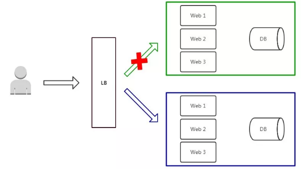
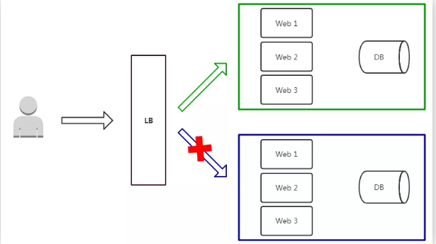
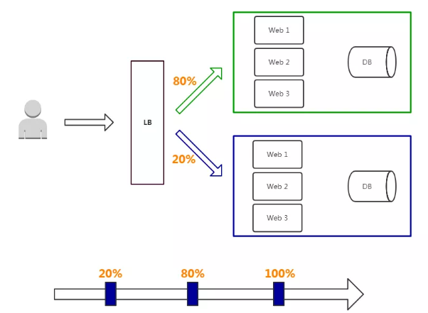
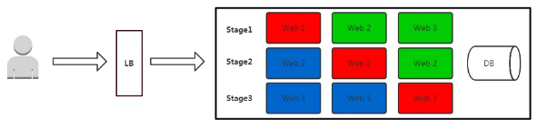

应用程序升级面临最大挑战是新旧业务切换，将软件从测试的最后阶段带到生产环境，同时要保证系统不间断提供服务。

长期以来，业务升级渐渐形成了几个发布策略：蓝绿发布、灰度发布和滚动发布，目的是尽可能避免因发布导致的流量丢失或服务不可用问题。

# 蓝绿发布

一、 蓝绿发布项目逻辑上分为AB组，在项目系统时，首先把A组从负载均衡中摘除，进行新版本的部署。B组仍然继续提供服务。

 

当A组升级完毕，负载均衡重新接入A组，再把B组从负载列表中摘除，进行新版本的部署。A组重新提供服务。

最后，B组也升级完成，负载均衡重新接入B组，此时，AB组版本都已经升级完成，并且都对外提供服务。

## 特点

- 如果出问题，影响范围较大；
- 发布策略简单；
- 用户无感知，平滑过渡；
- 升级/回滚速度快。

## 缺点

- 需要准备正常业务使用资源的两倍以上服务器，防止升级期间单组无法承载业务突发；
- 短时间内浪费一定资源成本；
- 基础设施无改动，增大升级稳定性。

# 灰度发布

灰度发布只升级部分服务，即让一部分用户继续用老版本，一部分用户开始用新版本，如果用户对新版本没什么意见，那么逐步扩大范围，把所有用户都迁移到新版本上面来。

## 特点

- 保证整体系统稳定性，在初始灰度的时候就可以发现、调整问题，影响范围可控；
- 新功能逐步评估性能，稳定性和健康状况，如果出问题影响范围很小，相对用户体验也少；
- 用户无感知，平滑过渡。

## 缺点

- 自动化要求高

## 部署过程

- 从LB摘掉灰度服务器，升级成功后再加入LB；
- 少量用户流量到新版本；
- 如果灰度服务器测试成功，升级剩余服务器。

# 滚动发布

滚动发布是指每次只升级一个或多个服务，升级完成后加入生产环境，不断执行这个过程，直到集群中的全部旧版本升级新版本。 

- 红色：正在更新的实例
- 蓝色：更新完成并加入集群的实例
- 绿色：正在运行的实例

## 特点

- 用户无感知，平滑过渡；
- 节约资源。

## 缺点

- 部署时间慢，取决于每阶段更新时间；
- 发布策略较复杂；
- 无法确定OK的环境，不易回滚。

## 部署过程

- 先升级1个副本，主要做部署验证；
- 每次升级副本，自动从LB上摘掉，升级成功后自动加入集群；
- 事先需要有自动更新策略，分为若干次，每次数量/百分比可配置；
- 回滚是发布的逆过程，先从LB摘掉新版本，再升级老版本，这个过程一般时间比较长；
- 自动化要求高。

# 小结

综上所述，三种方式均可以做到平滑式升级，在升级过程中服务仍然保持服务的连续性，升级对外界是无感知的。那生产上选择哪种部署方法最合适呢？这取决于哪种方法最适合你的业务和技术需求。如果你们运维自动化能力储备不够，肯定是越简单越好，建议蓝绿发布，如果业务对用户依赖很强，建议灰度发布。如果是K8S平台，滚动更新是现成的方案，建议先直接使用。

- 蓝绿发布：两套环境交替升级，旧版本保留一定时间便于回滚。
- 灰度发布：根据比例将老版本升级，例如80%用户访问是老版本，20%用户访问是新版本。
- 滚动发布：按批次停止老版本实例，启动新版本实例。