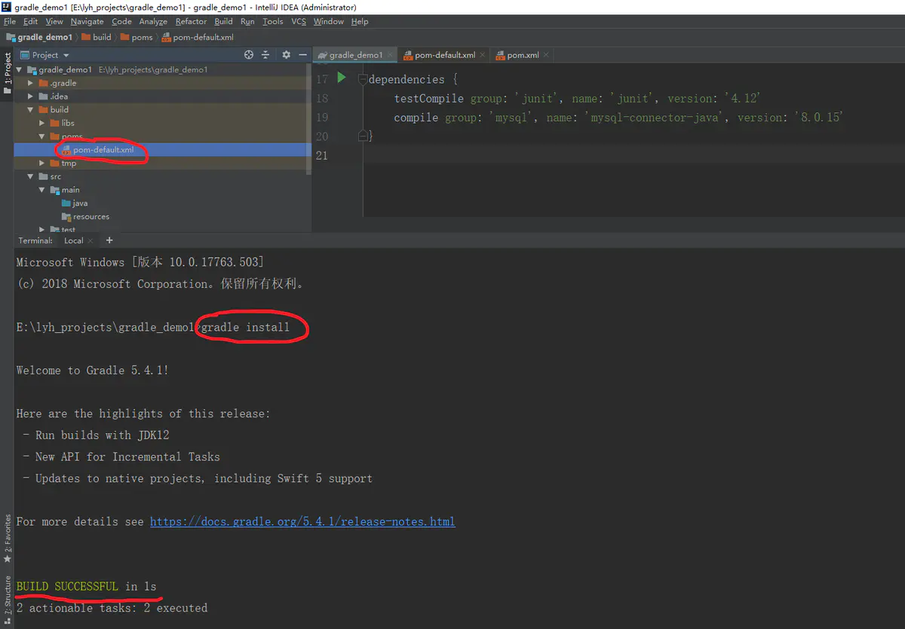

Gradle项目转Maven

在build.gradle中添加如下内容

```gradle
apply plugin: 'maven'
#如果引用了外置jar包，需要将jar引入项目中（idea不会自动识别，所以需要这步操作，eclipse不需要）
dependencies {
	compile fileTree(dir:'src/main/webapp/WEB-INF/lib',includes:['*jar'])
}
```

在Gradle项目根目录下执行 gradle install，我们会发现根目录的build文件夹下生成了一个poms文件夹里面有pom-default.xml文件。把它复制到根目录下，改名成pom.xml即可



