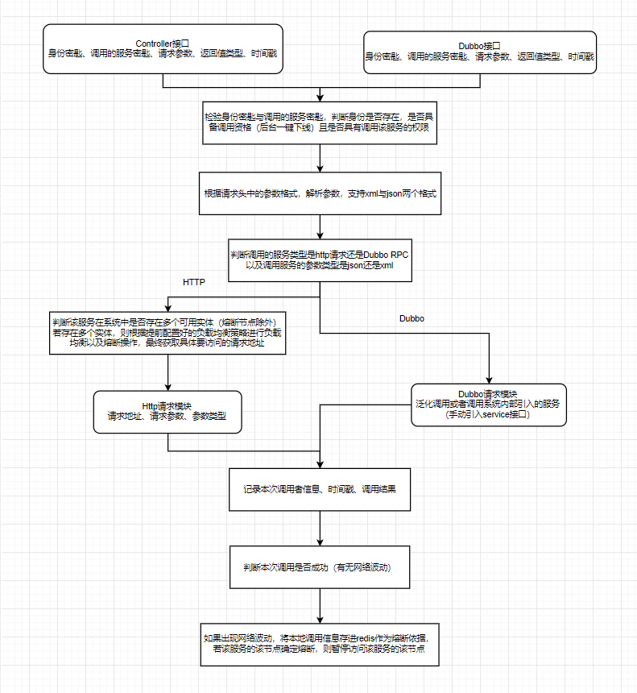
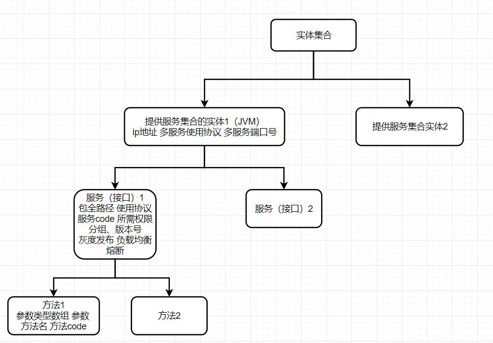

# 能力开放平台

能力平台接入第三方API并管理该API的访问路径、参数类型、访问权限等信息，供其他调用

## 能力开放平台工作流程

别人想要调用第三方API需要携带身份密匙、要访问的服务的密匙请求参数返回值类型以及当前时间戳访问能力平台

能力平台再帮他调用他想调用的服务，并将结果返回

## 三方API管理

通过银银三方登录认证

添加新的API

填写API相关信息

1. 服务访问类型（HTTP或Dubbo）
2. 参数类型（json或xml）
3. 返回值类型（json或xml）
4. 服务所属分类（层级关系）
5. 服务实体地址
6. 熔断策略
7. 如果统一服务分类下有多个实体，则认为这多个实体实现的是相同的功能，则才可以设置负载均衡策略（随机、轮询、权重）
8. API开放状态（默认为开放）

生成独属于该服务的密匙

对该用户开放该服务并在页面中展示密匙以及服务相关信息例如参数和返回值等（我方半人工完成）或将密匙告诉想要调用该服务的单位（我方全人工完成）

生成服务调用关系拓扑图

后台查看服务调用、熔断情况

请求时携带，服务code、服务分组、服务版本、方法code、参数、访问权限key

